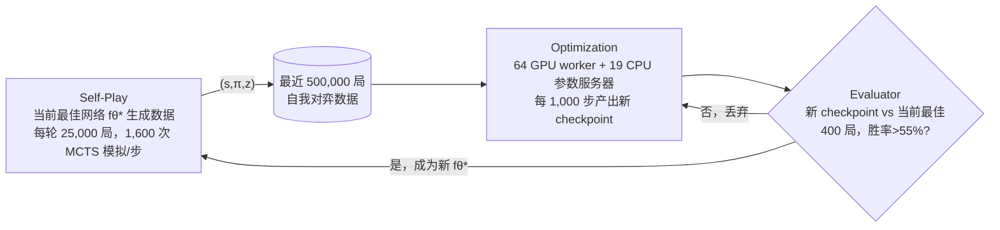

# Mastering the Game of Go without Human Knowledge（AlphaGo Zero）

> 不用任何人类棋谱，纯靠"神经网络 + MCTS 自我对弈"从随机落子开始训练，3 天后以 100-0 击败此前战胜李世石的 AlphaGo Lee——奖励完全来自棋类规则本身，环境就是一个零成本、确定性的模拟器。

本篇精读按阅读清单要求聚焦"奖励从哪来 + rollout 规模 + 训练基础设施"三件事（视频 02:42 引用点）；MCTS 搜索算法细节、神经网络架构消融、AlphaGo Zero"学会了哪些棋理"这几节只略读，不深挖。

## 元信息

- 机构：DeepMind
- 发表：2017-10-19，Nature 550, 354–359（本笔记读的是 unformatted 预印版 PDF，无 arXiv 版本）
- 链接：[PDF](https://discovery.ucl.ac.uk/id/eprint/10045895/1/agz_unformatted_nature.pdf)（无 Code，DeepMind 未开源 AlphaGo Zero 实现）
- 对比基线：AlphaGo Fan（2015 年战胜樊麾，176 GPU 分布式）、AlphaGo Lee（2016 年战胜李世石，48 TPU 分布式）、AlphaGo Master（2017 年 60-0 战胜人类顶尖职业棋手，架构与本文相同但用了人类数据初始化+人工特征）

## 要解决的问题

AlphaGo Lee 虽然战胜了李世石，但策略网络和价值网络都依赖人类专家棋谱做监督学习初始化，这意味着：①棋谱数据获取成本高、质量参差；②模型的能力天花板可能被人类下法的水平锁死。本文验证一个更激进的假设——如果奖励信号可以完全由游戏规则本身给出（赢/输是确定性可判定的），模型能否只从随机落子开始，完全靠自我对弈的强化学习就超越依赖人类数据训练出来的系统。

## 方法（精读：自我对弈强化学习循环 + 训练基础设施）

### 核心循环：策略迭代 + MCTS 作为策略提升算子

单个神经网络 $f_\theta(s) = (p, v)$ 同时输出落子概率分布 $p$ 和局面胜率估计 $v$（AlphaGo Lee 是策略网络+价值网络两个独立网络，这里合并成一个，见 [[self-play-policy-iteration]]）。每一步落子前跑一次 MCTS，用 $f_\theta$ 指导模拟：MCTS 的输出搜索概率 $\pi$ 几乎总是比网络原始输出 $p$ 更强——MCTS 相当于一个策略提升算子；用提升后的 $\pi$ 走完整局再拿最终胜负 $z$ 当价值标签，相当于一个策略评估算子。训练目标就是让网络的 $(p,v)$ 不断逼近 $(\pi, z)$：

$$l = (z-v)^2 - \pi^\top \log p + c\|\theta\|^2$$

每一轮迭代，新网络生成更强的自我对弈数据，更强的数据训练出更强的网络，循环往复——这是经典策略迭代在深度学习下的具体化，细节见 [[self-play-policy-iteration]]。

### 奖励从哪来：游戏规则本身，零人工标注、零学习出来的奖励模型

- 对局终止时按**既定规则**打分（Tromp-Taylor 规则做训练期间的中间计分，因为中国/日本/韩国规则在棋局未到终局边界确定时打分没有良定义；但最终的锦标赛和评测对局都按中国规则计分），胜负 $z \in \{-1, +1\}$ 直接作为该局每个时间步的价值标签。
- 除棋局规则（合法落子、终局判定、19×19 棋盘结构、旋转/翻转对称性）之外，**不使用任何人类棋谱、任何手工特征、任何 rollout 启发式**（甚至不排除"填自己的眼"这种所有前代程序都用的标准剪枝规则）。
- 这是"规则奖励"的最纯粹形式：规则引擎本身就是验证器，而且验证成本几乎为零（判断一步棋是否合法、一局棋谁赢，是棋类规则引擎的基本操作，不需要额外跑代码沙箱或人工打分）——这点和 [[rlvr]] 里"规则奖励=跑代码/匹配答案"不同，代码执行验证仍有不可忽略的沙箱开销，棋类规则验证几乎是免费的，详见下方"对我们的启发"。

### 训练基础设施：三个异步并行组件（Optimization / Evaluator / Self-Play）

- **Self-Play**：当前最佳网络 $f_{\theta^*}$（不是"最新训出来的"，是"评测通过的"）持续生成自我对弈数据，每轮 25,000 局，每步用 1,600 次 MCTS 模拟（约 0.4s/步）；前 30 步用温度 $\tau=1$ 按访问次数比例采样保证局面多样性，之后 $\tau\to0$ 确定性选择；根节点加 Dirichlet 噪声（$\epsilon=0.25$）做额外探索；明显劣势的对局会提前认输节省算力，认输阈值自动调节以保证"误判率"（本可以翻盘却认输）低于 5%（10% 的对局关闭认输功能用来测这个误判率）。
- **Optimization**：Google Cloud 上用 TensorFlow，64 个 GPU worker + 19 个 CPU 参数服务器，每个 worker batch size 32，合计 mini-batch 2,048；训练数据从最近 50 万局自我对弈里均匀采样；每 1,000 个训练步产出一个新 checkpoint。
- **Evaluator**：新 checkpoint 要先和当前最佳网络打 400 局（1,600 次模拟/步，$\tau\to0$ 确定性最强下法），胜率 > 55%（避免噪声导致的误选）才能转正成为新的 $f_{\theta^*}$，才会被用来生成下一批自我对弈数据、也成为之后比较的新基线。
- 三个组件全程异步并行执行——这个"生成-训练-门控晋升"三件套的调度形态，和今天 agentic RL 常见的"始终用最新策略生成 rollout"（容忍 policy lag，见 [[async-rl-training]]）是两种不同的设计取舍，详见下方启发与 [[self-play-policy-iteration]]。
- **两种规模的实测**：小规模跑（20 残差块）训练约 3 天，生成 490 万局自我对弈，70 万个 mini-batch 更新；大规模跑（40 残差块）训练约 40 天，生成 2,900 万局自我对弈，310 万个 mini-batch 更新。
- **推理侧硬件反差**：训练用 64 GPU + 19 CPU 参数服务器这套集群，但对弈/评测时 AlphaGo Zero 只用**单机 4 个 TPU**；对比 AlphaGo Lee 对弈时用 48 个 TPU 分布式、AlphaGo Fan 用 176 个 GPU 分布式。

## 实验与结果（了解即可）

- 小规模跑：72 小时后，单机 4 TPU 的 AlphaGo Zero 以 100-0 击败分布式 48 TPU 的 AlphaGo Lee（2 小时计时赛制，与李世石对局同款赛制）。
- 大规模跑（40 残差块，40 天）Elo 对照：原始网络（不搜索）3,055，AlphaGo Zero 5,185，AlphaGo Master 4,858，AlphaGo Lee 3,739，AlphaGo Fan 3,144；头对头 AlphaGo Zero 以 89-11 击败 AlphaGo Master（100 局，2 小时计时赛）。
- 对照监督学习：同架构下用 KGS 人类棋谱做监督学习，初期预测人类下法准确率更高（Figure 3b 60.4%），但自我对弈强化学习训出的棋力在 24 小时内就超过了监督学习模型——提示自我对弈学到的是和人类下法"质上不同"的策略，而不只是"更会模仿人类"。
- 架构消融（Figure 4）：残差网络相比卷积网络提升约 600 Elo；合并策略/价值为单网络相比分离双网络又提升约 600 Elo（代价是落子预测准确率略降，换来价值预测误差降低与整体棋力提升）。

## 局限与疑点

- 全文没有披露 Self-Play/Optimization/Evaluator 三个异步组件之间的调度延迟、数据新鲜度（staleness）指标——"当前最佳网络"门控晋升机制听起来稳健，但晋升判定本身的 400 局评测也要消耗和训练同量级的计算资源，论文未讨论这部分开销占总训练算力的比例。
- 结果高度依赖"规则可完美模拟、验证近乎零成本"这个前提，对不满足这个前提的领域（本文方法能否直接迁移，论文没有讨论，但这正是 [[rlvr]] 和 [[verifiable-reward-environment-generation]] 要面对的更难问题）。
- 认输阈值自动调节、Dirichlet 探索噪声系数等都是针对围棋这个具体领域调出来的超参数，论文明确承认这些是需要为每个新领域重新调的"领域知识"（Methods 的 Domain Knowledge 一节逐条列出）。

## 对我们的启发

1. **这是"验证近乎零成本"的生成器-验证器不对称性的极端样本**：围棋规则引擎判断一步棋合法、一局棋谁赢，计算开销可以忽略不计；对照 [[rlvr]] 里代码执行验证（要起沙箱跑测试用例，有真实的 CPU/隔离开销）、以及 [[verifiable-reward-environment-generation]] 里agentic 环境构造的高成本，AlphaGo Zero 提醒我们：我们平台要服务的"验证"需求分布很广，从几乎免费（规则匹配）到昂贵（容器化执行、多步质检）都有，沙箱投入的优先级应该按"验证本身占训练流水线墙钟时间的比例"来排序，而不是假设所有验证都需要重量级执行环境。
2. **"当前最佳网络生成数据 + 评测门控晋升"是一种与"始终用最新策略"不同的 rollout 生成策略**：现在主流 agentic RL 系统（如 [[grpo]]、DeepSeek-R1）更倾向于容忍一定的 policy lag（[[async-rl-training]] 讨论的 staleness 修正），用最新策略持续生成提高吞吐；AlphaGo Zero 反而选择"只有通过严格评测（400 局、胜率>55%）的网络才能晋升为数据生成源"，牺牲一部分吞吐换取数据质量的强保证。这是 rollout 调度设计空间里一个值得记录的历史对照点，值得在评估"要不要给 rollout 生成源加门控"时拿出来对比。
3. **训练集群和推理硬件规模可以严重不对称**：64 GPU + 19 CPU 参数服务器的训练集群，产出的模型推理时单机 4 TPU 就能打赢对手 48 TPU 分布式的系统——这不是直接的调度系统启示（更多是算法效率的胜利），但提醒我们在给客户评估"训练算力 vs 推理算力"配比需求时，不能简单假设两者成比例，模型质量本身可以大幅压缩推理侧的资源需求。

可以转成 issue 的 follow-up：
- 调研"评测门控晋升"（而非"始终用最新策略"）这种 rollout 生成策略在现代大规模 agentic RL 系统里是否还有人用、门控成本（例如多消耗多少比例算力）是否被系统性测量过。
- 整理"验证成本谱系"——从零成本的规则匹配（本文）、到轻量级代码执行（[[rlvr]]）、到重量级 agent 协作质检（[[verifiable-reward-environment-generation]] 里 DeepSeek-V4.1-Flash 的流水线）——作为我们判断沙箱投入优先级的一个决策框架草稿。

## 相关

- 相关概念：[[self-play-policy-iteration]]、[[rlvr]]、[[rollout-efficiency]]、[[async-rl-training]]、[[generator-verifier-asymmetry]]
- 相关笔记：[[2501.12948]]（DeepSeek-R1 Appendix G.2 明确提到尝试过 MCTS 但因 token 级搜索空间远大于棋类游戏、价值模型难以训练到能指导精细搜索而放弃——这是本文 MCTS 自我对弈方法在 LLM 推理场景下失效的直接反例，值得对照读）
- 母论文：无（parent 为空；本文是阅读清单由视频引出的起点论文之一，视频 02:42 处作为"RL 超越人类"的经典案例引用，围棋模拟器类比 agentic RL 里的沙箱/执行环境）
