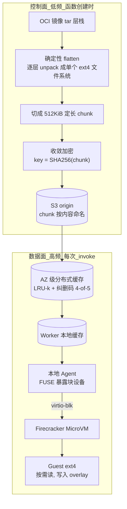

# On-demand Container Loading in AWS Lambda

> Lambda 把容器镜像"打平成一个 ext4 块设备"，用 FUSE 暴露给 Firecracker 的 virtio-blk 做块级按需加载，配合收敛加密去重、纠删码缓存把冷启动从"下载解压整个镜像"降到"只拉真正要用的块"。

## 元信息

- 机构：Amazon Web Services
- 发表：USENIX ATC 2023（2023-07-10，Boston, MA）
- 链接：[USENIX ATC'23 论文页 / PDF](https://www.usenix.org/system/files/atc23-brooker.pdf)
- 对比基线（Related Work §6）：Slacker（文件系统层懒加载）、Starlight（边缘优化的文件系统层方案）、eStargz（层级懒加载）、DADI（块级 + P2P，无去重）、FaaSNet（层级，无去重）、Cntr/Yolo（显式区分紧急/非紧急数据）、Wharf/CFS（分布式文件系统方案）

## 要解决的问题

2020 年 AWS Lambda 要支持最大 10GiB 的容器镜像部署（此前只支持 250MB 的 zip 包），但不能牺牲 Lambda 的核心指标：单客户每秒新建最多 15,000 个容器、百万级并发请求、冷启动低至 50ms。如果对每次新建容器都完整下载+解压 10GiB 镜像，需要 150Pb/s 网络带宽——纯粹不可行。作者利用三个可利用的性质来破局：**可缓存性**（尖峰流量集中在少数镜像上）、**共性**（大量镜像共享公共 base layer，如 Alpine/AWS base image）、**稀疏性**（Harter et al. 发现容器启动时平均只需要 6.4% 的镜像数据）。

## 方法

整体架构分三部分：镜像转换（控制面，低频）→ 分块缓存（存储面）→ 按需加载（数据面，高频，每次 invoke 都要过一遍）。

### 1. 块级按需加载，不做文件系统层懒加载

Slacker/Starlight 走的是文件系统层（overlay 多个 tar 层）的懒加载路线——这对容器是"自然"的选择，但作者认为文件系统本身的复杂度、加上多层 overlay 的复杂度，会不可接受地扩大 Lambda 共享组件的攻击面。于是选择保留 MicroVM guest 与 hypervisor 之间**纯粹的 virtio-blk 块接口**，所有文件系统操作都在 guest 内部完成，按需加载在**块**而非**文件**层面做。

### 2. 确定性 Flatten：把镜像变成一个可去重的块设备

在函数创建时（低频控制面操作），把 OCI 镜像的 tar 层栈按顺序 apply 到一个 ext4 文件系统上，生成单一的"打平"镜像。关键是这个 flatten 过程被设计成**完全确定性**（大多数文件系统实现为了并发性能会引入非确定性，如可变的 mtime；这里用了改造过的、串行执行且确定性选择这些参数的文件系统实现），这样共享同一 base layer 的不同镜像在 flatten 后会产生**逐块相同**的数据，为块级去重铺路。打平后按 512KiB 定长切块——块越小去重粒度越细（减少 false-sharing）也更适合随机访问，块越大则减少元数据体积、减少请求数（提升吞吐）、天然支持顺序预读；论文明确说这个尺寸是经验权衡，未来可能变。

### 3. 收敛加密（Convergent Encryption）：在不共享密钥的前提下去重

去重与加密天然冲突（相同明文加密后应该密文不同才安全，但去重恰恰需要识别相同内容）。方案沿用 Farsite 的思路：chunk 的 SHA256 摘要本身派生出加密密钥（AES-CTR + 全零 IV，因为 SHA256 抗碰撞保证了 key/IV 对只会用于一个明文块），chunk 按密文的哈希命名存入 S3；manifest（记录每个 chunk 的 offset/key/hash）里**只加密 key 表**，manifest 整体用客户专属的 KMS 密钥做 AES-GCM 认证——这样垃圾回收进程能看到 chunk 列表却拿不到解密密钥,而不同 worker 之间可以共享去重后的密文 chunk 而不需要共享密钥。为控制"热门 chunk 一旦故障影响面过大"（blast radius）的风险，密钥派生里混入随时间/热度/可用区变化的 salt，从而可以持续调节去重率与故障半径的权衡。

### 4. 三层缓存 + 纠删码：解决尾延迟而非只解决容量

Worker 本地缓存（L1）未命中 → AZ 级分布式缓存（L2，flash + 内存两级,LRU-k 防扫描污染）未命中 → S3 origin（L3）。L2 缓存不追求持久化（S3 保证持久性），但作者发现简单的"每个对象只存一个节点"方案在尾延迟、命中率抗故障、单节点带宽三方面都不够——于是选择**纠删码**（类似 EC-Cache）而非副本复制：向 L2 请求时多要几个 stripe、够数就重建，生产用 4-of-5 编码，25% 存储/请求开销换取显著更低的尾延迟，且在缓存节点故障/滚动发布时不掉命中率。这与简单的"重试掩盖尾延迟"路线相比，规避了重试容易引发的 metastable failure（级联性失稳故障）风险（作者称为 constant work 设计哲学）。

### 5. 缓存清空后的稳定性（Metastability）

端到端缓存命中率通常 >99.8%，一旦缓存清空（如断电、行为突变），下游 S3 流量可能暴涨到 500 倍——延迟升高会通过 Little's Law 推高客户端并发需求，进而推高对新 Lambda 实例的需求,形成自我强化的恶性循环（作者引用了 Denning 1968 年对分页系统类似效应的描述）。缓解手段是在更高层做**并发限速**：容器启动变慢、并发任务数超限时直接拒绝新启动请求直到在飞请求完成,并持续在最大并发下主动演练"从空缓存冷启动"的场景。

## 实验与结果

- **去重效果**：约 80% 新上传的 Lambda 函数产生零个唯一 chunk（纯粹是 CI/CD 触发的重复上传）；剩下 20% 里，平均唯一 chunk 占比 4.3%，中位数 2.5%（Figure 5，不含全零 chunk，全零 chunk 在创建时直接剔除）。去重最多减少 23x 存储，对那 80% 零唯一 chunk 的函数额外再省 5x 存储。
- **缓存命中率**（一周生产数据,某大 region）：中位数 67% 命中 worker 本地缓存（L1）、32% 命中 AZ 级缓存（L2）、剩余 0.06% 落到 S3 origin（L3）（Figure 7）。L1 中位命中率 67%（该周 10 分位低点 65%），L2 中位命中率高达 99.9%（10 分位低点 99.4%，Figure 8）。
- **延迟**：L2 缓存命中中位延迟 550µs、S3 origin 拉取中位 36ms（99.9 分位分别 3.7ms vs 175ms）;L2 服务端 GET 中位延迟 <50µs，端到端（含解密等）读延迟呈明显三模态：本地缓存命中 <100µs、L2 命中约 2.75ms、极少数 origin 拉取更慢（Figure 10、11）。
- **规模**：单客户最高 15,000 容器/秒创建速率;截至发表已处理"数百万亿次"（hundreds of trillions）Lambda invocation,服务超百万 AWS 客户。
- **没有披露**：冷启动端到端延迟的具体数字（只强调"低至 50ms"是产品目标,不是本系统单独的测得值）、纠删码相对副本方案的具体成本对比数字、迁移到 userfaultfd 后的性能提升数字（论文写作时仍在进行中）。

## 局限与疑点

- 作者自己承认（§7.1 Broader Lessons）：① 容器在 Lambda 场景下本质是被当成"大号静态链接"使用，但容器格式本身对这个用途效率不高,呼吁社区需要更轻量的依赖闭包机制,而不是号称本系统已经是终局方案；② 缓存的动态行为（metastability、多模态延迟）仍缺乏系统性的理解与应对模式,作者认为这是需要更多研究的开放问题,而非本文已经解决。
- FUSE 方案本身被作者承认是过渡方案：FUSE 暴露文件、又被当块设备用给 Firecracker 的 virtio-blk，导致一次 IO 要经过 guest kernel → Firecracker → host kernel FUSE 层 → local agent 四个线程调度,引入显著抖动,论文写作时已经在往 userfaultfd + mmap 迁移（去掉两层），但迁移后的实测数据未给出。
- 去重率、缓存命中率等关键数字只给了"一周""一个大 region"的快照,没有说明是否具有代表性、跨 region/跨时间是否稳定,也没有异常时段（如大规模镜像批量更新）下的表现数据。
- 论文完全没有量化"按需块级加载"相对"传统层级懒加载（Slacker/Starlight/eStargz）"在真实 Lambda 工作负载上的直接 A/B 对比数字,只在 Related Work 里做了定性比较（去重能力、是否需要更深的内容introspection），量化优势主要来自去重效果（23x/5x）而非加载策略本身。
- 安全模型假设 KMS 密钥管理体系本身可信,且假设每个 chunk 的 key 只授予真正需要访问它的客户/worker——密钥分发与撤销的具体运维复杂度未详细讨论。

## 对我们的启发

- **块级而非文件系统层懒加载,是在"降低攻击面"和"复用现有 hypervisor 接口"之间的权衡产物**：如果我们的 microVM 沙箱也用 Firecracker/virtio-blk 这类纯块接口，Lambda 这里的选择（保持 guest 内部做文件系统操作,host 侧只管块级加载）值得作为默认路线参考,而不必上马更复杂的 overlay 语义。DSec 自己在 §5.3 走的是不同路线——用 EROFS/OverlayBD 在 host 侧分离 metadata 与 data（见下「与母论文的关系」），说明"块级懒加载"不是唯一解,两条路线的攻击面、性能、复杂度权衡值得我们对照着评估。
- **确定性 flatten 是块级去重的前提**：如果我们后续想在镜像分发上做类似的去重优化,必须先保证镜像构建/转换过程是确定性的（相同输入产生逐位相同的输出块），否则共享 base layer 的镜像也不会在块级重合。这是一个容易被忽略的工程前提。
- **收敛加密 + salt 是"去重"与"多租户密钥隔离"两个目标的一个成熟解法**,如果我们的沙箱平台需要在多租户间共享镜像存储又要保证租户数据隔离，这套方案（chunk 内容派生密钥 + 加密 key 表 + 客户专属密钥保护 key 表 + salt 控制 blast radius）是一个可以直接借鉴的设计模板，比"共享密钥"或"每租户全量独立存储"更平衡。
- **纠删码用于缓存尾延迟优化,是我们做分布式缓存/镜像分发层时值得纳入基线对比的手段**——尤其是当我们担心"重试掩盖尾延迟"引发级联性失稳（metastable）故障时，4-of-5 纠删码用 25% 额外开销换尾延迟稳定性是一个具体可参考的数量级。
- **缓存清空后的并发限速自愈机制**是运维上必须提前设计的能力：论文提到的"容器启动变慢时主动拒绝新启动、并定期演练冷缓存场景"这套 playbook,如果我们自己的镜像/快照分发也依赖高命中率缓存（比如沙箱快照、agent-built environment 镜像),应该在上线前就设计好类似的降级路径,而不是等第一次缓存雪崩才补救。
- Follow-up 建议（可转 issue）：
  1. 对照阅读 DADI、FaaSNet、EROFS、Nydus（阅读清单 Key E）,系统梳理"块级按需加载"与"层级/文件系统级懒加载"两条路线在我们自己场景（agent 沙箱镜像,而非 Lambda 函数镜像）下的适用性差异；
  2. 评估我们现有镜像/快照存储是否具备"确定性构建"的前提,若不具备，块级去重收益会大幅打折；
  3. 待精读 [[2609.22978]]（DSec）§5.3 对应章节后（已读过原文文本,尚未写成独立笔记),系统性对照 DSec 的 EROFS/OverlayBD + 3FS 方案与本文块级 FUSE + 纠删码缓存方案在**去重范围**（DSec 靠 3FS 复用现有基础设施,本文靠专门的收敛加密去重层）、**安全边界**（本文强调"最小化对 host 的信任",DSec 场景下 agent 沙箱的可信边界是否类似）上的具体差异。

## 相关

- 相关概念：[[on-demand-image-loading]]
- 相关笔记：[[2021-balaji-fireplace]]（同属阅读清单 Key C「AWS Lambda 专题」,都是 Lambda 上 Firecracker 生产系统的公开细节,但解决的是放置调度而非镜像加载问题，两者在"预测无关/forecasting-free"的设计哲学上有隐含的相似之处：都是先在生产数据上验证某种朴素方案的局限,再设计绕开该局限的专用机制）
- 与母论文的关系：**核实结果与推断需要分开说明**。逐字检索 `.cache/papers/2609.22978.txt`（DSec 全文）确认：DSec 正文**完全没有出现"Lambda"或本文作者 Brooker 的名字**，§5.3「Scalable Image Distribution and On-Demand Loading」的技术对比对象是 Wang et al. 2021（FaaSNet,P2P 分发）和 Nydus/Dragonfly（EROFS 兼容格式的懒加载），Related Work §9 的"Container image and filesystem formats"段落点名的是 DADI、CoFS、FaaSNet、EROFS,同样不包含本文。也就是说**阅读清单把本文归入 Key C 并标注"对照 DSec §5.3"是一个建议性的类比阅读顺序，不是 DSec 论文本身的引用关系**——这一点在动手写这篇笔记前不确定，读完两篇原文后确认。抛开引用关系,两者在**问题结构**上高度可比：DSec §5.3 同样是"识别到沙箱只访问镜像的一小部分数据"（Sparsity，对应本文 Harter et al. 的 6.4% 发现）→ 用 EROFS 分离 metadata/data、metadata 本地化 + data 按需从 3FS 拉取（对应本文 FUSE 本地 agent + 分层缓存）。核心差异：本文自建专门的分块存储 + 收敛加密去重 + 纠删码缓存层（服务于多租户互不信任的公开云场景）,DSec 直接复用已有的 3FS 训练存储基础设施、不做去重加密（服务于单租户内部训练场景,信任边界不同）。DSec 是否借鉴了本文的具体机制（如块级 FUSE 加载、纠删码缓存）**无法从 DSec 原文确认**,只能确认两者面对相似的"镜像稀疏访问"问题给出了架构不同的答案。
