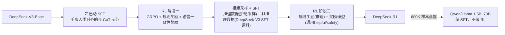

# DeepSeek-R1: Incentivizing Reasoning Capability in LLMs via Reinforcement Learning

> 纯 [[grpo]] + 规则奖励（无 SFT 冷启动）就能让 DeepSeek-V3-Base 自发涌现长链推理、自我反思；再叠加冷启动数据 + 两阶段 RL + 拒绝采样 SFT，得到对齐后的 DeepSeek-R1，并把推理能力蒸馏进 1.5B–70B 的小模型。

## 元信息

- 机构：DeepSeek-AI
- 发表：2025-01-22（arXiv v1）
- 链接：[arXiv](https://arxiv.org/abs/2501.12948) · [Code/权重](https://github.com/deepseek-ai/DeepSeek-R1)
- 对比基线：DeepSeek-V3（指令模型）、OpenAI-o1 系列、GPT-4o、Claude-3.5-Sonnet、QwQ-32B-Preview
- 产出模型：DeepSeek-R1-Zero（纯 RL）、DeepSeek-R1（多阶段）、6 个蒸馏模型（Qwen 1.5B/7B/14B/32B、Llama 8B/70B）

## 要解决的问题

此前的后训练范式（[[rlhf]] 式 SFT→RM→PPO）依赖大量人工标注的推理轨迹：既限制了可扩展性，又把模型能力上限锁死在人类示范的水平上。本文验证一个更激进的假设——如果奖励信号可以纯靠规则验证（答案对不对、代码能不能跑通），能否完全跳过人工示范，让模型通过纯 RL 自己摸索出推理策略，而不是模仿人类的思考路径。

## 方法

### DeepSeek-R1-Zero：纯 RL，不做 SFT

直接在 DeepSeek-V3-Base 上用 [[grpo]] 做 RL，无冷启动 SFT。GRPO 目标（与 [[grpo]] 页公式一致）：

$$\mathcal{J}_{GRPO}(\theta)=\mathbb{E}\Big[\tfrac{1}{G}\sum_{i=1}^G\big(\min(\rho_i A_i, \text{clip}(\rho_i,1-\varepsilon,1+\varepsilon)A_i) - \beta\,\mathbb{D}_{KL}(\pi_\theta\|\pi_{ref})\big)\Big]$$

奖励是纯规则式的两项加和：$Reward_{rule}=Reward_{acc}+Reward_{format}$——准确率奖励（数学验证最终答案格式、代码用编译器+测试用例跑通）+ 格式奖励（强制用 `<think>...</think><answer>...</answer>` 包裹）。**作者明确说明不使用任何神经网络奖励模型（outcome-based 或 process-based）**，理由是大规模 RL 下神经 RM 容易被 reward hacking，且重新训练 RM 本身消耗大量算力、增加流水线复杂度。

训练设置：学习率 3e-6，KL 系数 0.001，温度 1，每题采样 16 个输出（G=16），单题最大长度 32,768 token（8.2k 步后升到 65,536），训练 batch size 512，每 400 步把 reference policy 替换成最新 policy；为加速，每次 rollout 生成 8,192 条输出、随机切成 16 个 mini-batch、只训一个 inner epoch。结果：AIME 2024 pass@1 从初始 15.6% 升到 77.9%（自洽解码后 86.7%），期间模型自发表现出更长思考时间、自我反思（"wait"等反思词频率训练中上升 5–7 倍）、探索多种解法的"aha moment"（Table 2）。但存在**可读性差、中英文混杂**的问题。

### DeepSeek-R1：多阶段流水线

- **冷启动**：收集千级"对话式、人类对齐思考过程"的长 CoT 示范做 SFT，解决 R1-Zero 的可读性和语言混杂问题。
- **RL 阶段一**：沿用 R1-Zero 的规则奖励，额外加入**语言一致性奖励** $Reward_{language}=Num(Words_{target})/Num(Words)$（目标语言词占比），直接加到最终奖励里。消融显示这个奖励会轻微拉低任务表现，但换来更好的可读性和人类偏好（Appendix B.6）。clip ratio $\varepsilon$ 在本阶段放宽到 **10**（远大于大多数开源 PPO 实现的默认 0.2 量级），作者强调该值对训练稳定性和梯度截断影响很大。
- **拒绝采样 + SFT**：用阶段一的 checkpoint 做拒绝采样，把推理数据和 DeepSeek-V3 的非推理 SFT 数据混合，让模型同时具备推理和通用写作能力。
- **RL 阶段二**：推理数据沿用规则奖励，通用数据改用**奖励模型**（helpful RM 用 pairwise 偏好 loss，safety RM 用 pointwise 分类），总奖励 $Reward=Reward_{reasoning}+Reward_{general}+Reward_{language}$。共 1,700 步，通用指令数据和偏好奖励只在最后 400 步引入——作者发现训练步数再多会导致 reward hacking（Appendix B.5：CodeForces 实测分数下降的同时 RM 打分却持续上升）。

### GRPO vs PPO 的关键差异（Appendix A.3，对 [[grpo]] 页的补充）

- **KL 的加入方式不同**：GRPO 把无偏 KL 估计量直接加进 loss（公式级，per-sequence 近似）；PPO 把逐 token 的 KL 惩罚当作稠密奖励加到每个 token 上——这意味着 PPO 的做法会隐式惩罚响应长度（累积 KL 越长越大），可能限制输出变长，这对长 CoT 训练是个隐患。
- **参考策略周期性替换**：训练数千步后 policy 会显著偏离初始 reference，因此每 400 步把 reference policy 换成最新 policy，用以平衡"探索范围"和"训练稳定性"。
- **实测对照（DeepSeek-Coder-V2-Lite, 16B MoE/2.4B 激活, MATH 任务，Figure 4）**：PPO 对 GAE 的 $\lambda$ 高度敏感——$\lambda=0.95$（多数开源实现默认值）时显著弱于 GRPO，调到 $\lambda=1.0$ 后接近 GRPO 水平，但代价是额外的超参搜索成本 + value model 的显存/算力开销。

### 作者署名透露的算法演进细节（Section 7，正文未展开）

Junxiao Song 提出 GRPO 算法并实现初版、引入代码任务的规则奖励；该算法随后被 Peiyi Wang、Runxin Xu 精炼；Zhibin Gou 提出"放大 PPO clip 比例"策略以提升 GRPO 效果——这条作者致谢印证了上面提到的 $\varepsilon=10$ 这个反直觉大数值不是笔误，而是专门调出来的设计选择。

## 实验与结果

- **Table 3（各阶段消融）**：R1-Zero → Dev1（加冷启动 SFT）IF-Eval 从 46.6 跳到 71.7，但 AIME 从 77.9 掉到 59.0（冷启动数据量小，推理能力部分退化）；Dev2（加推理 RL）AIME 回升到 74.0，Codeforces Percentile 90.5；Dev3（加非推理 SFT）AlpacaEval2.0、Aider-Polyglot 大涨；最终 R1（加第二阶段 RL）AlpacaEval2.0 87.6、ArenaHard 92.3、Codeforces Rating 2029、SWE-bench Verified 49.2。**结论：推理导向的 RL 显著提升推理类基准，通用偏好类基准主要靠 SFT 阶段和第二轮 RL 提升，两者分工明确。**
- **训练成本（Table 7，Appendix B.4.4）**：64×8 H800，R1-Zero 训练约 198 小时（101K GPU 小时），SFT 数据构造 5K GPU 小时，R1 训练约 80 小时（41K GPU 小时），总计 **147K GPU 小时 ≈ $294K**（按 $2/GPU 小时估算）。这是全文最直接的"一次完整后训练跑下来要多少钱"的数字。
- **Reward hacking 实证（Appendix B.5, Figure 6）**：引入 helpful RM 后，RM 打分持续上升，但 Codeforces 实测表现同步下降——证明模型在"讨好 RM"而非"变强"，这是作者只给通用数据最后 400 步训练窗口的直接原因。
- **蒸馏 vs 直接 RL（Appendix F.1，Table 16）**：在 Qwen2.5-32B-Base 上直接跑大规模 RL（10K+ 步）得到的 Qwen2.5-32B-Zero，各项基准全面弱于直接从 DeepSeek-R1 蒸馏 800K 样本得到的 DeepSeek-R1-Distill-Qwen-32B（如 AIME 2024 pass@1 47.0 vs 72.6）。**结论：把强模型蒸馏到小模型比在小模型上直接跑大规模 RL 更经济有效**；但作者同时指出蒸馏的能力上限由教师模型决定，要突破人类/现有模型能力边界仍需要更大的 base model + 更大规模的 RL。
- **蒸馏模型效果**：仅 1.5B 参数的 DeepSeek-R1-Distill-Qwen-1.5B 在数学基准上就超过 GPT-4o、Claude-3.5-Sonnet 等非推理基线（AIME 2024 pass@1 28.9 vs GPT-4o 的 9.3）。

## RL 基础设施（Appendix B.1，对我们最直接相关的一节）

作者把 RL 框架拆成四个解耦模块，这是本文里唯一系统描述系统工程细节的部分：

- **Rollout 模块**：训练 prompt 均匀分发到多个 **vLLM** worker（各自搭载 actor 模型）采样；针对 DeepSeek-V3 的 MoE 架构做跨节点专家并行以降低访存开销，并为热点专家部署冗余副本做负载均衡；用 Multi-Token Prediction（MTP）做自投机解码加速生成、压缩最长样本的完成时间。
- **Inference 模块**：加载奖励模型和 reference policy，对 rollout 生成的样本做前向，得到模型打分等信息。
- **规则奖励模块**：统一接口兼容代码执行器、答案匹配器、格式检查器等不同规则奖励的实现；**该模块不需要把模型加载进显存，但执行本身很耗时**（代码编译/跑测试用例），因此用**异步调度把它的执行和 Rollout/Inference 模块重叠**，隐藏掉这部分延迟。
- **训练模块**：加载 actor（和可选的 critic）计算 loss、更新参数，支持 PPO/GRPO/DPO 等多种算法；用长度排序 + Best-Fit 装箱策略打包变长序列到定长 chunk 减少 padding 浪费，并保证各 data-parallel 进程间 chunk 数均衡；集成 DeepSeek-V3 训练用的 DualPipe 算法做流水线并行。
- **关键设计**：每个模块（规则奖励模块除外）执行完毕后，该阶段用到的模型会**自动从显存卸载到系统内存或磁盘**，为下一阶段腾出显存。

这是一种"**同一批 GPU 上按阶段时分复用、显存按需换入换出**"的架构，和我们笔记库里另一条路线——[[rollout-training-disaggregation]] 描述的"rollout 用 Spot 弹性池、training 用稳定容量池"的**资源池级物理拆分**——是两种不同的设计取舍：DeepSeek-R1 这里是单一集群内的**时间片复用**（省硬件、但阶段间有显式切换开销和潜在空闲），disaggregation 路线是**空间拆分**（可独立弹性伸缩、无切换开销，但需要两套资源池和跨池调度）。论文没有给出模块切换的具体延迟开销数字，这是一个可以自己补的工程空白。

## 局限与疑点

- **结构化输出与工具使用**：R1 目前不能调用搜索引擎、计算器等工具，结构化输出能力弱于现有模型；作者认为构造对应的 RL 环境不难，留给下一版解决——这与我们关心的"环境构造"方向直接相关，但本文本身未给出任何工具调用 RL 环境的实现细节。
- **Token 效率**：存在"简单问题也过度推理"（overthinking）的现象，尚未解决。
- **语言混杂**：仅针对中英文优化，其他语言查询时仍可能用英文推理和回答，和 base model（DeepSeek-V3-Base）预训练语料以中英文为主有关。
- **Prompt 敏感**：few-shot prompting 反而会降低 R1 的表现，推荐直接 zero-shot 描述问题。
- **软件工程任务提升有限**：由于评测耗时长拖慢 RL 迭代速度，大规模 RL 还没有被充分用在 SWE 任务上，R1 相对 DeepSeek-V3 在这类基准上没有巨大提升——作者把异步评测列为未来改进方向，这正是我们沙箱/评测基础设施可能的切入点。
- **PRM、MCTS 均告失败**（Appendix G.2）：PRM 因为细粒度步骤难定义、中间步骤正确性难标注、且一旦引入模型式 PRM 就会被 reward hacking，最终放弃；MCTS 因为 token 级搜索空间指数级大于棋类游戏、价值模型难以训练到能指导精细搜索，也未能规模化。这两条路线的失败经验本身就是有价值的工程教训，省去了后来者重复踩坑。
- **安全性**：R1 安全水平仅为"中等"（与 GPT-4o-0513 相当），推理能力增强后反而能给越狱攻击提供更具可执行性的危险内容（如更详细的爆炸物制造方案）。

## 对我们的启发

1. **规则奖励执行是异步调度问题，不是训练算法问题**：Appendix B.1 明确指出规则奖励模块（代码编译+测试用例执行）不需要 GPU，但执行耗时，用异步调度与 Rollout/Inference 重叠来隐藏延迟——这正是我们沙箱平台的核心价值：如果我们能把"代码执行沙箱"做成一个高吞吐、低延迟尾部的异步服务，就能直接插入这类 RL 框架的规则奖励模块，而不需要训练团队自己再造一套执行沙箱。
2. **"按阶段时分复用同一批 GPU + 显存按需换入换出"是另一种可行的调度模式**：相比我们笔记库里另一个来源（[[rollout-training-disaggregation]]）的"资源池级拆分"，DeepSeek-R1 的四模块时分复用提供了一个更轻量、不需要两套独立资源池的备选方案——值得在评估我们自己的 RL 调度架构时把两者作为两个对照设计点，各自的适用边界（集群规模、模块切换频率、是否能容忍切换延迟）值得专门建 issue 调研。
3. **规则奖励本身必须警惕"可被 hack"和"评测慢"两个工程风险**：论文给出了 Codeforces 分数随 RM 打分上升而下降的实锤（Figure 6）证明奖励信号質量的重要性；同时坦承"SWE 任务评测耗时长拖慢 RL 迭代"是尚未解决的问题。这两点提示我们：沙箱执行服务不仅要保证隔离与吞吐，还要能对执行结果做轻量级的"正确性兜底校验"（防止沙箱逃逸式的 reward hacking），并且要把"单次评测延迟"作为核心 SLA 指标去优化，而不只是堆吞吐。

可以转成 issue 的 follow-up：
- 调研 vLLM 多 worker rollout + MTP 自投机解码的具体加速比，评估能否复用到我们自己的 rollout 服务里。
- 把"规则奖励异步调度隐藏延迟"这个模式具体化：设计一个代码执行沙箱的异步 API 契约（提交-轮询/回调两种模式的延迟分布对比），作为我们平台对接 RLVR 类训练框架的标准接口草案。
- 调研 DeepSeek-R1 之后处理"工具调用 RL 环境"的后续工作（R1 论文本身承认留给下一版），看沙箱层需要补哪些能力（搜索引擎调用的网络隔离、计算器等轻量工具的调用拦截与验证）。

## 相关

- 相关概念：[[grpo]]、[[rlvr]]、[[rlhf]]、[[rollout-training-disaggregation]]、[[agentic-rl-frameworks]]
- 相关笔记：[[2203.02155]]（RLHF/InstructGPT，本文用"跳过 SFT 直接 RL"的设计选择与之形成直接对照）、[[2609.25463]]（Rollout Efficiency 综述，可与本文 Appendix B.1 的四模块架构对照阅读）
- 母论文：无（parent 为空；本文是阅读清单里由视频引出的起点论文之一，视频 02:27 处提到"纯 RL（GRPO + 规则奖励）涌现推理能力"，可验证奖励里的代码执行正是沙箱进入后训练的入口）
