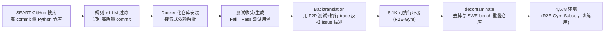

# R2E-Gym: Procedural Environments and Hybrid Verifiers for Scaling Open-Weights SWE Agents

> 用"commit 反向翻译 + 自动测试生成"把 SWE 训练环境规模扩到 8.1K 任务（超过依赖人工 issue 的 SWE-Gym 3 倍以上），并证明"执行式 + 学习式"混合验证器能突破单一 verifier 42-43% 的性能天花板，把 SWE-bench-Verified 推到 51%。

## 元信息

机构：UC Berkeley、Australian National University / 发表：2025-04-09（arXiv preprint）/ 链接：[arXiv](https://arxiv.org/abs/2504.07164) · [项目页/Code](https://r2e-gym.github.io) / 对比基线：SWE-Gym [[agentic-rl-environments]]（Pan et al. 2024，人工 issue+测试）、Agentless、Agentless-1.5（Xia et al. 2024b）、SWE-RL

## 要解决的问题

训练开源 SWE agent 面临两个瓶颈：① 可执行训练环境的规模化构建——SWE-Bench 训练集只有输出 patch、没有可执行环境；SWE-Gym 虽然有可执行环境，但依赖人工撰写的 GitHub issue 和单元测试，样本量被人工产出速度限死（人工 issue 只覆盖部分 commit 历史）；② 测试时计算的最优扩展策略——已有 execution-based（跑测试）和 execution-free（学习式打分）两类 verifier，但此前工作只单独研究，缺乏对二者互补性的系统分析。

## 方法

### SWEGen：从 commit 直接反向翻译，不依赖人工 issue

核心思路是彻底跳过"人工 issue → 定位 commit"这一环，反过来"从 commit 出发反推 issue"：

- **Commit 过滤**：单 commit 非测试文件改动 ≤5 个、改动行数 ≤100 行、patch 长度 ≤2000 字符，删除实体数 ≤1、新增/编辑实体数 ≤3，语句级改动 ≤10，再叠加 LLM-as-judge 过滤（Appendix A）。
- **仓库安装**：历史 commit 的依赖版本经常与当前环境冲突，用 Docker + "多组候选依赖配置顺序尝试、首个成功即退出"的半人工脚本解决（Listing 1）——这与 [[repolaunch]] 要解决的问题同源，但 R2E-Gym 走的是"搜索式尝试多个依赖组合"而非披露具体架构。
- **测试收集/生成**：优先复用已有 Fail→Pass 测试；缺测试的 commit 用 Agentless 式零样本方法补生成，但**以 ground-truth patch 作为生成上下文**（区别于 Agentless 的纯零样本）。
- **Backtranslation**：不是简单地把代码 diff 丢给 LLM 生成 issue（这样生成的描述过于泛化），而是把"失败测试 + 执行 trace + assertion 失败信息"一起喂给 LLM，模仿人工 bug report 的写法；并显式要求不泄露解法（Listing 3 的 10 条 prompt 规则）。
- 效果：合成 issue 训出的模型（27.8% PASS@1）与真实 issue 训出的模型（28.0%）几乎打平（400 条轨迹对照），验证了合成数据可以替代人工 issue 而不损失质量。

### 混合验证器：执行式 + 学习式互补

- **Execution-based (EB) verifier**：训练一个专职 testing-agent（Qwen-Coder-32B 微调）生成 M=10 条复现测试，加上已有回归测试过滤"破坏既有功能"的 patch。分数 = 在回归测试分数最高的候选里，取通过测试数最多的（Eq. 1）。
- **Execution-free (EF) verifier**：微调 Qwen2.5-Coder-14B（LoRA rank 64）直接看"issue + 完整轨迹 + patch"预测 YES/NO token，用 P(YES)/(P(YES)+P(NO)) 归一化成连续分数。
- **二者的互补性来自不同的失效模式**：EB verifier 只能给出离散的"通过测试数"，当多个候选测试分数打平时无法区分（distinguishability 低，多数问题里 <20% 生成测试能有效区分对错 patch，见 Figure 5-left）；EF verifier 能给连续分数区分平局，但**主要靠 agent 的"思考过程"文本而非最终 patch 本身做判断**——去掉轨迹只留 patch，BEST@26 从 42.8% 掉到 37.6%（Figure 7-a），且 attention 分析显示模型高度关注 agent 思考里的"乐观措辞"，容易被误导（Figure 7-b 的定性案例）。
- **Hybrid verifier**（Eq. 2）：先用 EF 分数取 Top-n 候选，再叠加 EB 的执行分数排序；EB 提供"验证事实"、EF 提供"打破平局的区分度"，且 Top-n 过滤能过滤掉极小概率是 toxic test（通过错误 patch、卡掉正确 patch）导致的误判。

## 实验与结果

- **规模化训练**（Table 3，SWE-bench-Verified，Qwen-2.5-Coder 系列）：SWEGen 合成数据在所有模型规模上都优于 SWE-Gym 同规模基线——7B: 10.6%→19.0%；14B: 16.4%→26.8%；32B: 20.6%→**34.4%**（+13.8pp）。
- **轨迹规模效应**（Figure 2）：14B 模型约 800 条轨迹后趋于饱和，32B 模型在样本量增加到 3,200 条时仍在提升——说明模型容量越大，对训练轨迹规模的边际收益消退得越慢。
- **Agent thought 的价值**：SFT 时保留 agent 思考过程训练比只训练动作序列高 4 个百分点（34.4% vs 30.4%，Table 3 底部消融）。
- **混合验证器测试时扩展**（Table 4、Figure 4）：单独 EB 或 EF 验证器都在约 42-43% 饱和；Hybrid 在 BEST@16 达到 49.4%，BEST@26 达到 **51.0%**，是当时开源权重 SWE agent 的新 SOTA，首次与部分商业模型（o1 49.0%、Claude-3.6-Sonnet+Tools 53.0%）打平或接近。
- **消融**（Figure 8/5-right）：仅用回归测试做 hybrid 聚合只有 47.4%；加上 agentic 生成的复现测试提到 51.0%；用 Agentless 官方零样本测试替代自训练 testing-agent 则降到 48.8%——说明"训练专职 testing-agent"这一设计选择本身贡献约 2.2pp；Top-n 过滤机制贡献从 49.8%→51.0%。
- **成本信号**：测试环境 rollout 通常比 code-editing agent rollout 更便宜（脚注 4），论文给出一个具体对比——编辑 agent rollout 从 16→21 只把 BEST@K 从 47.6% 提到 48.4%，而多采 5 条 test-agent rollout 能到 49.3%，即"多采测试样本"在算力效率上优于"多采编辑样本"。

## 局限与疑点

- **论文未披露任何 execution 基础设施的工程数字**：单任务 Docker 环境构建/安装耗时、镜像大小、并发执行密度、8.1K 环境的存储/算力总成本——这是我们最关心的维度，全篇没有量化（Repository Installation 一节只描述了"多组合尝试直到成功"的方法，未给出成功率或平均耗时）。
- Repository 安装过程作者自陈是"半人工、难以规模化"（semi-manual and challenging to scale），依赖未来更多 LLM 自动化——目前仍有人工介入环节。
- 测试生成的质量缺口明显：多数生成测试要么不能真正复现 bug（高 Pass→Pass）、要么连 ground-truth patch 都过不了（高 Fail→Fail），根源是测试脚本自身的 bug 或异常（Figure 6），这限制了 execution-based verifier 的天花板。
- Toxic test（通过错误 patch、卡掉正确 patch）虽然整体稀有，但对少数问题（最高达 10% 的测试）杀伤力很大，论文没有给出针对性的检测/过滤机制，只能靠 Top-n 过滤间接缓解。
- Hybrid verifier 的收益是在"已经有一个较强 32B 编辑 agent 产出候选池"的前提下测出来的（PASS@26=64.4% 的候选池上做 rerank），弱模型候选池上 hybrid 方案的增益幅度未验证。

## 对我们的启发

- **Docker 化历史 commit 是这类"程序化环境合成"管线绕不开的重资产成本**：依赖版本冲突需要"多组合尝试直到成功"的搜索式安装（Listing 1），这正是我们沙箱平台可以提供标准化能力的地方——如果我们能把"给定一个 commit + requirements.txt 自动搜索可行依赖组合并产出可复用镜像层"做成平台原语，可以直接复用给这类数据合成管线，而不是每个团队各自写半人工脚本。
- **测试 rollout 比编辑 agent rollout 更便宜这一发现，对我们的调度策略有直接指导意义**：如果我们的沙箱平台要支持"混合验证器"式的训练流水线，应该允许两类 rollout（重量级 code-editing 会话 vs 轻量级 test-generation 会话）用不同的资源配额/优先级调度，而不是统一按同等成本对待——这是一个具体的、可以落到调度策略里的差异化资源分配点。
- **环境规模化的最大已知缺口是"构建成本不透明"**，与我们之前读的 [[verifiable-reward-environment-generation]] 全景里其他几条路线（VHD-Play 给出 $0.01-0.03/环境、SkillGym 给出 4.5 小时/任务）形成对比——R2E-Gym 完全没有披露这类数字。值得作为一个具体的 follow-up：如果要复现或对标 R2E-Gym 这类"Docker 化历史仓库"的合成管线，我们应该自己先测一遍单仓库、单 commit 的平均构建耗时和失败率，填上这个数字缺口，再决定值不值得在自己平台上做类似能力。
- **Fail→Pass / Pass→Pass 测试信号是 SWE agent 环境的通用验证协议**（与 [[repolaunch]] 一致），说明我们如果要支持 SWE-bench 类训练/评测任务，沙箱镜像需要原生支持"运行前状态 + 运行后状态"两次测试执行并做差异比对，而不是只跑一次测试。

## 相关

- 相关概念：[[agentic-rl-environments]]（本文是该概念页 SWE 分类下 R2E-Gym 条目的深挖来源，并回应了该页此前"深挖 R2E-Gym 程序化合成流水线"的 follow-up）、[[verifiable-reward-environment-generation]]（SWEGen 的"从 commit 反向翻译生成 issue"是该概念页里尚未收录的第五条环境合成路线：commit-first / backtranslation-grounded）、[[generator-verifier-asymmetry]]（execution-based vs execution-free verifier 的互补性是该概念在 SWE 这一"易验证域"内部更细粒度的一个具体例证：即使域内验证相对便宜，仍存在"验证的区分度"与"验证的抗偏见能力"之间的二级权衡）、[[repolaunch]]（同样服务于 repo-level 可执行环境构建 + F2P/P2P 验证，可与本文的 Docker 化安装流程对比）
- 相关笔记：[[2511.09586]]（引用本文作为"环境规模化有效性"的量化证据之一）
