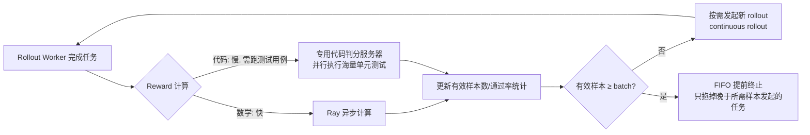

# MiMo: Unlocking the Reasoning Potential of Language Model — From Pretraining to Posttraining

> Xiaomi 用 25T token 预训练 + RL 后训练把一个 7B 模型练到超过 32B 基座和 o1-mini 的推理水平，同时给出一套同步、非异步但仍能吃满 GPU 的 rollout 引擎（Seamless Rollout Engine）。

## 元信息

机构：LLM-Core Xiaomi ｜ 发表：2025-05-12（v2 2025-06-05）｜ arXiv：https://arxiv.org/abs/2505.07608 ｜ Code：https://github.com/xiaomimimo/MiMo ｜ 对比基线：Llama-3.1-8B、Gemma-2-9B、Qwen2.5-7B（base）；GPT-4o、Claude-3.5-Sonnet、OpenAI o1-mini、QwQ-32B-Preview、DeepSeek-R1-Distill-Qwen-14B/7B（RL 后）

## 要解决的问题

当时业界普遍认为：① reasoning RL 要练出好效果依赖较大的基座模型（尤其代码推理，常见做法用 32B 级别）；② 在小模型上同时提升数学和代码能力很难兼顾。本文的立场是：RL 训练出的推理能力上限主要取决于**基座模型自身的推理潜力**，因此必须在预训练阶段就为推理做专门优化，而不能只在后训练阶段发力。

## 方法

### 预训练：为推理定制的数据与结构

- **推理数据抽取**：常见网页抽取工具（如 Trafilatura）会丢失数学公式和代码片段，作者自研 HTML 抽取工具专门保留数学内容、代码块和论坛站点结构；PDF 解析工具也针对 STEM/代码内容加强。
- **快速全局去重**：URL 去重 + MinHash 去重，全网页去重一天内完成；去重后再按多维质量分调整数据分布（去重算法本身不感知内容质量）。
- **多维数据过滤**：常见的启发式规则过滤器会误删含大量数学/代码内容的高质量网页，作者改用微调小 LLM 做领域分类 + 多维质量打分。
- **合成推理数据**：用先进推理模型对高推理深度的 STEM 内容做深入分析、对收集到的数学/代码题目生成解答，以及创意写作等通用查询；发现合成推理数据可以训练极高的 epoch 数而不过拟合（区别于非推理数据）。
- **三阶段数据配比**：Stage 1（全量源，压制低知识密度内容如广告/新闻）→ Stage 2（数学代码占比拉到约 70%，8,192 token 上下文）→ Stage 3（约 10% 合成推理响应，上下文扩到 32,768）。总计约 25 万亿 token。
- **架构**：标准 decoder-only Transformer（GQA、pre-RMSNorm、SwiGLU、RoPE），36 层、hidden dim 4,096、FFN 11,008、32 头/8 KV 组。
- **Multi-Token Prediction（MTP）**：预训练阶段只用单层 MTP（多层无额外收益）；训练后复制成两份、冻结主干和第一层 MTP，单独微调另外两层用于推理加速。AIME24 上第一层 MTP 接受率约 90%，第三层仍保持 75%+，配合投机解码显著加速长输出场景的解码。

### 后训练：SFT → RL

- **SFT**：开源+专有蒸馏数据，去重防泄漏、去混合语言/不完整响应、单查询最多 8 条响应，初版约 500K 样本（后续实验中扩到 6M，见下方讨论）。
- **RL 数据**：数学 100K 题（LLM 过滤证明题/选择题，不改写题目以避免 reward hacking，SFT 模型 rollout 16 次剔除通过率>90%的简单题，约剔除 50% 易题）；代码 30K 题（无测试用例的题目剔除，无 golden solution 时用高级推理模型 16 次 rollout 全部失败的题目剔除，同样用 SFT 模型过滤简单题）。
- **RL 算法**：修改版 [[grpo]]——① 去掉 KL loss（不损害稳定性，充分释放策略潜力）；② Dynamic Sampling（DAPO 提出，过采样后丢弃通过率为 0/1 的 prompt，保持有效梯度的批大小恒定）；③ Clip-Higher（DAPO 提出，只放宽上裁剪界 $\varepsilon_{high}$，缓解熵坍缩、促进探索）。
- **[[test-difficulty-driven-reward]]（代码稀疏奖励的核心创新）**：受 IOI（国际信息学奥赛）分组评分规则启发——把测试用例按多模型 rollout 的通过率聚类成不同难度分组，通过率越低难度越高。提出严格奖励（必须通过该难度组及更低难度组的全部测试才能拿到对应分数）和软性奖励（每组分数平均分摊到组内每条测试，通过的测试累加计分）两种方案，替代"全部测试通过才有奖励"的粗粒度 0/1 规则，让高难度题目也能提供密集学习信号。
- **Easy Data 重采样**：Dynamic Sampling 会把通过率=1 的题目从批次里丢弃，随着策略变强这类题目越来越多，导致采样效率持续下降；直接彻底移除这些题目会造成训练不稳定。作者维护一个"简单题池"，rollout 时以 10%（$\alpha$）概率从该池采样，在提升采样效率的同时避免策略更新崩溃。

### RL 基础设施：Seamless Rollout Engine（对我们平台最相关的部分）

基于 verl（Ray 管理计算/通信）+ vLLM。作者明确指出：多数解决"GPU 空闲"问题的现有方案依赖**异步训练**（引入策略滞后，见 [[async-rl-training]]），而本文选择保持同步、纯靠**重叠 rollout 与 reward 计算**来吃满 GPU，即 [[async-rl-training]] 分类里"不引入 staleness 的重叠"这一家族（与 RolloutPipe 同类思路的另一个生产实例）。三个组件：

1. **Continuous Rollout**：取消"等所有 rollout worker 完成才计算 reward"的同步屏障，worker 一完成立即计算 reward、更新有效样本/通过率统计，并据此按需发起新 rollout，而不是等一整批。
2. **Asynchronous Reward Computation**：代码判分开销远高于数学（要跑测试用例），用 Ray 起异步 reward 计算，并为代码判分单独分配专用服务器（in-house 在线判题环境，支持海量单元测试并行执行），避免拖慢 rollout 流水线。
3. **Early Termination**：当有效样本数已达到批大小需求时，用 FIFO 策略只终止"晚于已入选样本发起"的任务，避免粗暴掐断正在生成的长序列样本（会压制模型生成长回复的倾向，破坏训练稳定性）。

另外对 vLLM 的 "external launch" 模式做了健壮性增强：抢占（pre-emption）时清空 prefix caching 里已计算的 block，保证 KV cache 一致性；增大 scheduler steps 数时关闭异步输出处理以保证兼容性和性能；并为 vLLM 实现了 MTP 推理支持。

## 实验与结果

- **预训练效果（Table 1）**：MiMo-7B-Base 在 BBH 上 75.2 分（超 Qwen2.5-7B 约 5 分），LiveCodeBench v5 上 32.9（Qwen2.5-7B 仅 5.0），AIME 2024 上 32.9（Qwen2.5-7B 仅 10.1），全面超过同规模开源基座，甚至超过 32B 模型（Figure 1）。
- **RL 后效果（Table 4）**：MiMo-7B-RL AIME 2025 达 55.4，超 o1-mini（50.7）4.7 分；LiveCodeBench v6 达 49.3，超 QwQ-32B-Preview 10 个点以上。
- **Seamless Rollout Engine 加速（Table 2/3，256×H20 GPU 实测）**：相对 naive dynamic sampling 基线，Continuous Rollout 单独带来 1.99×/2.20×（总体/rollout）加速，叠加 Async Reward 后 2.09×/2.34×，三者叠加达到 **2.29× 训练加速、2.61× rollout 加速**；GPU 空闲率从 69.3% 降到 27.7%，样本浪费率从 22.1% 降到 12.9%。验证阶段单独测得 **1.96× 加速**，GPU 空闲率从 65.8% 降到 32.9%（Table 3）。
- **消融讨论（3.6 节，无表格但有明确结论）**：
  - 用"轻量 SFT"帮 base 模型对齐输出格式（如 `\boxed{}`）反而损害推理潜力和最终效果——直接从 base 模型 RL（MiMo-7B-RL-Zero）比轻量 SFT 后 RL 效果更好。
  - Base 模型直接 RL 时，数学任务后期出现"reward hacking"迹象（强探索能力钻了数学奖励规则的空子），代码任务因为有测试用例把关更难被 hack；这是从 SFT 模型开始 RL（而非 base 模型）在两个领域都更稳定增长的原因之一。
  - 语言混杂惩罚难以设计好：检测英文回复里混入中文容易，反过来（检测中文回复混入英文）很难区分正常的数学公式/代码英文词，容易引入新的 reward hacking。
  - SFT 数据从 500K 扩到 6M，各项推理指标（含后续 RL 效果）都进一步提升，未损害 RL 潜力（Table 6）。
  - 后续实验（MiMo-7B-RL-0530）用 on-policy RL + 逐步扩大生成长度预算（32K → 38K → 48K）显著提升效果（AIME24 从 68.2 涨到 80.1），是 7B 模型逼近 DeepSeek-R1 数学推理水平的关键因素。

## 局限与疑点

- Seamless Rollout Engine 的加速数字只在一次"随机选取的 5 步训练轨迹"上测量（256 H20 GPU），未说明是否在整个训练周期、不同集群规模下都保持类似量级；论文自己也承认这是"实验分析"而非全程统计。
- 语言混杂惩罚被作者自己承认设计失败（"fails to fully resolve...introduces risk of reward hacking"），但论文没有给出最终采用的具体处理方式或效果对比数字。
- SFT 数据从 500K 到 6M 的具体构成变化（数据来源、质量筛选标准是否也同步变化）未披露，无法判断提升完全来自"量"还是也混入了新的"质"变化。
- test-difficulty-driven reward 的严格/软性两种方案孰优孰劣，论文只在 Figure 5 给了定性对比图，未给出量化的最终评测分数差异。

## 对我们的启发

1. **代码 RL 的判题基础设施是可复用的沙箱能力**：论文提到"in-house online judge environment that enables parallel execution of extremely high-volume unit tests"，这正是我们沙箱平台如果要支持代码类 reasoning RL 训练必须补的能力——判题延迟直接决定 rollout 流水线是否会在 reward 计算阶段产生新的 GPU 空闲瓶颈（Seamless Rollout Engine 里"Async Reward"组件存在的直接原因就是代码判分慢）。可以调研：我们现有沙箱执行层能否承载"海量小任务、短生命周期、高并发"的单元测试执行模式，还是需要专门优化冷启动和密度。
2. **不做异步训练也能吃满 GPU 是一个可落地的折中方案**：相比 AReaL、LlamaRL 等引入 policy staleness 的全异步方案，Seamless Rollout Engine 证明"continuous rollout + 异步 reward + 精细化提前终止"这三个纯调度层面的优化，不改变训练算法本身，也能拿到 2.29× 训练加速——这对我们平台设计"训练系统调度栈"是一个优先级更高、风险更低的起点：先把同步流水线里的调度浪费榨干，再考虑是否要承担 staleness 的复杂度。
3. **测试难度分级奖励是奖励设计与判题基础设施的交叉点**：给测试用例按通过率分组、分级计分（IOI 风格）这一思路本身不依赖 MiMo 的具体模型，是通用的"稀疏奖励代码任务"缓解方案；如果我们要给客户/内部团队提供"RL 训练环境搭建"服务，判题服务除了跑测试，还应该能吐出每条测试用例在多个候选解上的通过率统计，才能支持这类分级奖励——这是判题 API 设计上一个值得提前考虑的字段（不仅返回 pass/fail，还要支持批量统计）。
4. **Follow-up**：调研我们判题/沙箱执行层目前处理"一题上千测试用例、需要区分难度分组"场景的吞吐与延迟基线，评估是否要为 RL 训练场景单独优化（可建 issue）。

## 相关

- 相关概念：[[grpo]]、[[rollout-efficiency]]、[[async-rl-training]]、[[test-difficulty-driven-reward]]
- 相关笔记：（暂无同主题笔记，本篇是该 issue #73 阅读清单下的独立条目，parent 为空）
