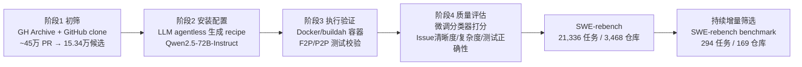

# SWE-rebench: An Automated Pipeline for Task Collection and Decontaminated Evaluation of Software Engineering Agents

> 全自动流水线从 GitHub 持续挖掘真实 PR/issue，产出 21K+ 可执行 SWE 任务，并用同一流水线维护一个防污染的持续更新 leaderboard，实测部分模型在 SWE-bench Verified 上的高分存在污染水分。

## 元信息

机构：Nebius / 发表：2025-05-26（arXiv preprint，v2 2025-11-04）/ 链接：[arXiv](https://arxiv.org/abs/2505.20411) · [数据集](https://huggingface.co/datasets/nebius/SWE-rebench) · [leaderboard](https://swe-rebench.com/leaderboard) · [Code](https://github.com/SWE-rebench/SWE-bench-fork) / 对比基线：SWE-bench [[swe-bench-pro]]、SWE-bench Verified、SWE-Gym（[[agentic-rl-environments]]）、SWE-PolyBench

## 要解决的问题

训练/评测 SWE agent 长期受两个瓶颈制约：① 高质量交互式训练数据稀缺——SWE-bench、SWE-Gym 这类数据集依赖人工逐仓库配置可执行环境，规模被人工产出速度限死，只能覆盖少数知名仓库；② 静态基准会过时——SWE-bench 自 2023 年底公开后，后续模型训练数据可能已见过其测试实例，导致分数虚高，且不同团队的 scaffolding、prompt、重试策略差异很大，结果难以横向比较。本文目标是把"任务挖掘 + 环境配置 + 质量把关"整条链路全自动化，同时用持续供给的新鲜任务维护一个防污染的标准化评测。

## 方法

四阶段全自动流水线（Figure 1），底层用 TractoAI 分布式存储/计算平台支撑规模化容器构建与并行验证：

### 阶段 1：初筛（Section 2.1）

从 GitHub Archive（事件流：issue 描述、讨论、关联 PR）与 GitHub 仓库克隆（完整 commit 历史，用于版本分析）两个来源下载 2025-05-01 前创建、关联 issue 的约 45 万条 PR，来自 3 万+ 使用宽松许可证、Python 占比 >75% 的仓库。再用一组规则过滤（issue 已标记 resolved、PR 已合并进主分支、PR 只关联单个 issue、issue 描述 >10 字符、PR 必须新增/修改测试且改动非测试文件、改动文件数 1–15 个）筛出约 15.34 万候选任务实例，每个实例拆成 solution patch（非测试文件改动）和 test patch（测试文件改动）。

### 阶段 2：自动化安装指令配置（Section 2.2）

按 `git tag` 推断的项目版本分组（归一化到 `major.minor`，约覆盖 95% 实例；其余各自独立成环境），每组选最新 `base_commit` 的任务代表整组环境。采用 agentless 方式（借鉴 [[2504.07164]] 同源的 Xia et al. 2024 思路）：LLM 先扫描 `README.md`/`Dockerfile`/`setup.py` 等文件定位安装信息来源，再用 Qwen2.5-72B-Instruct 把文件内容拼接后抽取成结构化 JSON 安装 recipe（每任务最多生成 3 条候选）；若安装或测试执行报错，LLM 读取错误日志对 recipe 做迭代修正。论文也试过让交互式 agent 直接操作 Docker 环境装依赖，效果有时更好但算力消耗显著更高，最终选择更省算力的 agentless 方案作为主路线。该方法在 31% 的仓库里至少为一个任务生成出可用的安装 recipe。

### 阶段 3：执行式安装验证（Section 2.3）

在容器内实际安装环境并跑 test patch 中的测试，要求同时满足：(1) 应用 solution patch 前，test patch 里至少有一个测试失败；(2) 应用后，原先失败的测试全部转为通过；(3) 原先通过的测试应用后仍然通过。用 buildah + tmpfs 做隔离容器构建以减少磁盘 I/O、加速构建，配合自建镜像仓库/PyPI/APT 镜像缓存常用依赖；安装成功后用 `pip freeze`/`conda env export` 记录精确依赖版本并冻结复用，缓解 Python 生态依赖未锁定导致的可复现性问题。

### 阶段 4：自动化任务质量评估（Section 2.4，核心的"防作弊/质量"环节）

考虑到 RL 训练场景下"看似失败实为任务本身有缺陷（issue 描述不清、测试有问题）"会错误惩罚 agent，本文没有像 SWE-bench Verified 那样纯人工标注，而是用 3,800+ 条 SWE-bench Verified 的人工标注微调 Qwen2.5-72B-Instruct，让模型看 (issue, 参考解 patch, test patch) 预测三个独立的二分类质量标签：**Issue Clarity**（issue 描述是否足够让开发者理解并解决问题）、**Task Complexity**（预计解决耗时是否 >1 小时，作为难度代理）、**Test Patch Correctness**（测试是否准确校验了修复意图、而不是过度绑定具体实现细节）。这三个 LLM 打的标签作为元数据随每条任务发布，供下游按需筛选任务难度/清晰度，比"改动文件数"这类粗糙启发式（SWE-bench Lite 用的方法）更精细——例如多文件改动可能只是重复参数更新（简单），单文件改动也可能 issue 描述模糊、测试不充分（难以验证）。

### 相较原始 SWE-bench 方法论的四处针对性修正（Appendix G，直接服务于任务有效性）

- **用 `head_commit` 而非 `merge_commit` 生成 patch**：原始 SWE-bench 用 `base_commit` 到 `merge_commit` 的 diff，中间若有其他人合并到主分支的无关改动会混入 diff，可能引入与本 PR 无关的测试（论文举了 `sympy__sympy-14821` 因此被 SWE-bench Verified 排除的例子）。本文优先用 PR 分支最后一次提交 `head_commit` 做 diff，隔离出真正属于该分支的改动；`head_commit` 因分支被删而不可用时退回 `merge_commit` 并记录在元数据里。
- **测试指令生成过滤已删除文件**：SWE-bench 用正则从 test patch 生成测试执行指令，可能误把已被删除的测试文件也生成为待执行指令；本文过滤掉这类无效指令。
- **AttributeError/ImportError 检查用完整 traceback**：测试若检查尚不存在的新属性/新 import，agent 必须"猜"出精确签名才能通过——这类问题在用简化 traceback（如某些仓库用 Pytest `tb=no`）跑测试时会被掩盖。本文统一用 `tb=line` 完整错误输出识别这类情况并记录到元数据，允许按需过滤（部分实例如"修复 import 错误"本身是合法任务，不应无差别排除）。
- **依赖版本固定**：见阶段 3，用 `pip freeze`/`conda env export` 首次成功安装后冻结版本，避免未来重建因依赖漂移而失败。

### SWE-rebench benchmark 与持续防污染（Section 3）

从 21,336 任务的大数据集里按 Appendix H 的过滤条件（测试执行日志无 AttributeError/ImportError 等严重错误；solution patch 改动 ≤3 个文件；patch 总词数 ≤500；issue 描述 16–1000 词、英文；issue 必须创建于 2025 年；LLM 评估难度标签 <3；F2P 测试数 ≤50）筛出 294 个任务、169 个仓库，构成持续维护的 SWE-rebench benchmark 与私有 leaderboard。评测原则：① 固定的最小 ReAct scaffold + 统一 prompt + 各模型开发者推荐的默认生成超参 + 统一 128K 上下文（不用 function-calling，一视同仁走纯文本交互，见 Appendix I 给出的完整 system prompt），避免高度工程化的 scaffold/多智能体框架/best-of-N 造成不可比；② 因为精确记录了 issue/PR 创建时间与模型发布时间，可以显式标记"issue 创建早于模型发布日期"的评测为潜在污染并在 leaderboard 标注，而不是简单假设数据集"新"就一定"干净"；③ 每个模型跑 5 次全量 benchmark，报告 SEM 和 pass@5，应对 agent 轨迹的高方差。

## 实验与结果

- **数据集规模**（Section 2.4 末尾）：21,336 个标注任务实例，来自 3,468 个不同 GitHub 仓库；benchmark 子集 294 任务 / 169 仓库。
- **质量分类器准确率**（Section 2.4，413 条验证集）：Task Complexity 81% accuracy / F1 0.82（对比未微调 Qwen-72B-Instruct 基线 68%）；Test Patch Correctness 67% accuracy / F1 0.65；Issue Clarity 79% accuracy / F1 0.76——三个质量维度里"测试是否正确"是最难自动判断的一项。
- **污染信号（Table 1）**：把 benchmark 任务按 issue 创建时间切成 2025-01 与 2025-03/04 两个子集对比。gpt-4.1 是唯一在 Mar–Apr 子集上明显下降的模型（31.1%→26.7% resolved）；DeepSeek-V3-0324 与 DeepSeek-V3-1226 两个版本在 SWE-rebench 上表现接近，但在 SWE-bench Verified 上分数分化明显（Table 2：39.7% vs 35.2%），论文将其解读为 SWE-bench Verified 上可能存在污染效应的间接证据。
- **模型对比（Table 2，SWE-bench Verified vs SWE-rebench Mar–Apr）**：所有对比模型在 SWE-rebench 上的 resolved 分数系统性低于 SWE-bench Verified（如 DeepSeek-V3-0324: 39.7%→21.3%；Qwen2.5-72B-Instruct: 11.3%→9.3%），一致方向的落差支持"SWE-bench Verified 分数可能因污染或过拟合被推高"的论点。
- **其他行为观察**：Qwen2.5-Coder-32B-Instruct 分数远低于其代码能力预期，轨迹分析显示指令跟随差——频繁幻觉环境响应或陷入格式错误循环；Qwen3 系列 think/no-think 模式表现接近，甚至 no-think 略优，暗示该模型基座能力已足够强，显式推理未带来可衡量优势；LLaMa-4-Maverick pass@5 高但平均 resolved 低，说明模型能产出正确解但run间一致性差。

## 局限与疑点

- 作者自陈的两条主要限制：① 全自动质量评估无法完全替代人工判断，会让部分任务描述不清或本质不可仅凭 issue 解出，拉低绝对成功率下限（相比 SWE-bench Verified 这种人工验证过的基准）；② 目前仅支持 Python，虽然流水线本身语言无关，但扩展到 Go/Java/Rust/JS 等需要额外的语言特定组件，留作未来工作。
- 安装 recipe 生成的 prompt 只在 18 个仓库上做过人工验证调优，是否能泛化到全部 3,468 个仓库的多样性未知；31% 仓库出至少一个可用 recipe 这个成功率本身也说明相当一部分仓库因环境复杂而被丢弃，样本存在"更容易自动配置的仓库"这一隐性偏置。
- 三个质量维度的分类器准确率并不高（Test Patch Correctness 仅 67%），意味着发布的质量标签本身有 30%+ 的噪声，下游按标签筛选任务时需要意识到这层不确定性，论文未给出置信区间或标签噪声对下游 RL 训练效果的敏感性分析。
- 污染论证是间接的（对比新旧模型版本在两个基准上的分数分化模式），没有做受控实验（如故意用已知污染/未污染数据训练同一模型对照），因果性弱于相关性。
- 与 R2E-Gym/SWEGen（[[2504.07164]]）不同，本文完全依赖真实存在的人工撰写 issue，不做 backtranslation 合成——这意味着任务规模和"新鲜度"完全受限于 GitHub 上实际产生的高质量 issue+PR 配对速率，是一种"挖矿式"而非"合成式"的规模化路径，长期可持续性取决于开源社区活跃度而非算力投入。

## 对我们的启发

- **"安装配置自动化 + 执行验证 + LLM 质量打分"三段式质检流水线，是我们平台如果要支撑自建 agent RL/评测环境时可以直接复用的架构模式**：尤其是阶段 4 用小规模人工标注（SWE-bench Verified 的 3,800 条）微调一个分类器去近似"人工验收"，这比每次都上人工审核便宜得多，也比纯启发式（文件数、行数）更可信——如果我们要建内部任务库（不管是 SWE 场景还是其他可验证场景），这条"用少量高质量人工标注 bootstrap 一个规模化质检分类器"的路径值得直接借鉴。
- **Appendix G 的四处针对性修正（head_commit 而非 merge_commit、过滤已删除文件的测试指令、完整 traceback 检测 AttributeError/ImportError、依赖版本冻结）都是可以直接抄进我们自己的 fail-to-pass/pass-to-pass 验证器实现里的具体工程 checklist**，属于"防止任务本身无效"这一类经验教训，和 [[benchmark-item-validity-audit]] 讨论的"防止 verifier 被 hack"是同一问题的另一面（前者防"假阳性无效任务"，后者防"假阳性通过"）——两者结合起来才是完整的任务质检闭环。
- **"issue 创建时间 vs 模型发布时间"这种可追溯的时间戳去污染机制**，比单纯依赖"数据集发布得够新"更可靠；如果我们平台要维护内部评测集或持续训练数据供给，应该在数据管线里强制记录源数据的原始产生时间（而不是采集时间），并在评测报告里显式标注每条结果相对模型发布日期是否存在潜在污染风险，而不是隐含假设"用了新基准就没有污染问题"。
- follow-up 建议：① 复现阶段 2 的 agentless 安装 recipe 生成方法（Qwen2.5-72B-Instruct + README/Dockerfile 解析），在我们自己关心的仓库集合上测一遍 31% 这个"首次生成即可用"成功率是否能复现或改进，作为评估"自动化环境配置"这条能力值不值得投入的依据；② 评估能否把 Appendix H 的 benchmark 过滤标准（≤3 文件、≤500 词 patch、issue 16-1000 词、F2P ≤50 测试）直接套用/调整成我们内部任务库的"可评测子集"筛选规则，减少人工逐条把关的工作量。

## 相关

- 相关概念：[[verifiable-reward-environment-generation]]（本文属于"环境先行"路线的一个具体实现：真实 issue/PR 挖掘 + LLM agentless 安装配置，与 AgentScaler 的"工具依赖图自动化"、R2E-Gym 的"commit 反向翻译"并列，是第三条不依赖人工模板也不依赖合成 issue 的规模化路径）、[[benchmark-item-validity-audit]]（阶段 4 的自动化质量评估与 Appendix G 的四处修正，都是"防止任务本身无效"这一问题在 SWE 领域的具体工程实践，可与该页讨论的"verifier 侧证据审计"互补）、[[agentic-rl-environments]]（21K+ 任务规模进一步充实该页 SWE 分类下的规模化证据）
- 相关笔记：[[2504.07164]]（同为"从 GitHub 真实数据规模化构造 SWE 训练环境"的代表作，但路线不同——R2E-Gym 靠 commit 反向翻译合成 issue、SWE-rebench 靠真实 issue+PR 挖矿，两者对比是理解"合成式 vs 挖矿式"环境规模化的一组直接案例）
