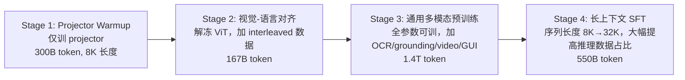

# MiMo-VL Technical Report

> Xiaomi 开源的 7B 视觉语言模型技术报告：四阶段预训练（2.4T token）+ Mixed On-policy RL（MORL，融合 RLVR 与 RLHF），在通用理解、多模态推理、GUI grounding 上全面超过同规模开源模型，GUI grounding 甚至超过专用模型 UI-TARS。

## 元信息

机构：Xiaomi（LLM-Core Team）/ 发表：2025-06-04（arXiv v1）/ 链接：[arXiv](https://arxiv.org/abs/2506.03569) · [Code](https://github.com/XiaomiMiMo/MiMo-VL) · [Eval Suite](https://github.com/XiaomiMiMo/lmms-eval) / 对比基线：Qwen2.5-VL-7B/72B、InternVL3-8B、Gemma-3-27B-IT、GPT-4o、Claude 3.7 Sonnet、QVQ-72B-Preview

## 要解决的问题

多模态预训练数据长期以短答案 QA 为主，容易让模型停留在表层模式匹配、在"思维模型"时代表现不出应有的推理深度；同时多任务 RL（推理、感知、grounding、人类偏好对齐）混合训练时，不同任务域之间存在相互干扰，难以稳定地同时提升所有能力。本文要解决"用什么样的预训练数据配方 + RL 框架，训出一个 7B 规模、同时具备强推理和强 grounding 能力的开源 VLM"。

## 方法

### 架构

三部分：Qwen2.5-ViT 原生分辨率视觉编码器 + 随机初始化的 MLP projector + [[grpo|MiMo-7B-Base]] 语言模型（继承其强推理能力）。

### 四阶段预训练（Table 1，共 2.4T token）

数据构造亮点：图像描述数据用 MetaCLIP 式双语（中英）metadata 去重平衡；interleaved 数据按知识密度/可读性过滤文本、按尺寸/纵横比/安全性过滤图像；OCR 数据刻意加入手写体、变形文字、模糊/遮挡文字提升鲁棒性；GUI 数据统一 mobile/web/desktop 三平台动作空间（见 Appendix D），并额外构造"看前后截图预测中间动作"的预训练任务；**合成推理数据**——用大推理模型对精选问题重写长 CoT 答案，经严格拒绝采样过滤（正确性 + 推理清晰度 + 去冗余 + 格式一致性），直接混入 Stage 3/4 预训练（而非仅作微调数据）。Stage 4 推理数据占比显著提高，MMMU 上平均响应 token 从 680 涨到 2.5K，且性能提升未出现饱和迹象。

### 后训练：Mixed On-policy Reinforcement Learning（MORL）

在 [[grpo]] 基础上做了一个**纯 on-policy 变体**：single-step 策略更新紧跟 rollout，去掉了 PPO 式 clipped surrogate 目标（因为不存在新旧策略差异）；同时沿用 [[grpo|MiMo-7B]] 报告里验证过的一组稳定性技巧：去 KL loss、动态采样、easy-data 过滤、重采样策略。

RLVR 覆盖五类可验证任务：视觉推理（80K 道 K-12/竞赛题，先用 LLM 把选择题改写成自由作答格式减少 reward hacking，再用 Math-Verify 规则库判分，并过滤 pass rate >90% 的过易题和不看图也能答对的题）、文本推理（复用 MiMo-7B 的数学数据，同样用 Math-Verify）、图像/GUI grounding（bbox 用 GIoU 计分，点选用是否落在 ground-truth 框内）、视觉计数（按预测计数准确率计分）、时序视频 grounding（模型输出 `[mm:ss,mm:ss]` 时间戳，用 IoU 计分）。

RLHF 走标准 Bradley-Terry 奖励建模：文本奖励模型从 MiMo-7B 初始化，多模态奖励模型从 MiMo-VL-7B 初始化；查询集经聚类去重、中英/helpfulness-harmlessness 配比平衡后，同一批查询同时用于训练奖励模型和跑 RLHF（作者称此举是为了降低 reward hacking 风险）。

### Reward-as-a-Service（RaaS）

MORL 要同时喂给 GRPO 训练循环推理、感知、grounding、多模态/文本 RLHF 等五类以上任务，每类需要不同的 reward 函数或奖励模型。论文引入 RaaS：一个 reward router 按查询任务类型动态选择对应的 reward 函数；各奖励模型部署为独立 HTTP 服务，保证低延迟、可横向扩展；所有 reward 统一归一化到 [0,1]，训练中不加任何格式奖励。整套 RL 训练跑在 verl（HybridFlow）框架之上，配合 MiMo-7B 报告里的 Seamless Rollout Engine。详见新建概念页 [[reward-as-a-service]]。

## 实验与结果

- 通用能力（Table 2）：MiMo-VL-7B-RL 在 40 个评测任务中 35 个超过 Qwen2.5-VL-7B；MMMU-val 66.7（SFT 版 64.6），超过 Gemma-3-27B-IT（64.9）；CharXiv-RQ 56.5，比 Qwen2.5-VL 高 14.0 分、比 InternVL3 高 18.9 分。
- 多模态推理（Table 3）：OlympiadBench 59.4，超过参数量大得多的模型（Qwen2.5-VL-72B 37.2、QVQ-72B-Preview 20.4）；MathVision RL 版 60.4（SFT 57.9）。
- GUI（Table 2、4.4 节、Figure 4）：OSWorld-G（no_refusal）RL 版 56.1，超过 GUI 专用模型 UI-TARS-1.0；ScreenSpot-Pro-avg 41.9，同样超过 Qwen2.5-VL-7B（29.0）。作为通用 VLM 在 GUI grounding 上追平/超过专用模型，是本文最值得关注的信号之一。
- Elo 评测（4.5 节、Figure 5）：基于 GPT-4o 判分的中英双语真实用户偏好评测，MiMo-VL-7B-RL 在所有开源 VLM 中 Elo 最高，接近 Claude 3.7 Sonnet；MORL 相比 SFT 版本带来 22+ 分的 Elo 提升。
- **On-policy RL vs vanilla GRPO 的规模化曲线（5.2 节、Figure 7）**：纯文本推理任务上对比，on-policy 算法性能随训练数据量持续正相关提升、观测窗口内无饱和迹象；vanilla GRPO 早期样本效率更高，但约 2 万条训练样本后性能饱和，继续训练收益可忽略。这是本文对训练基础设施最直接的启发——早期"看起来更快"的算法未必是长期更值得投入算力的选择。
- 任务干扰（5.3 节）：MORL 几乎在所有任务上都有提升，但推理任务与感知/grounding 任务（如 grounding、计数）之间存在增长趋势相反的干扰——推理任务在 RL 中鼓励更长 CoT，grounding/计数任务的响应长度却趋于缩短；作者认为任务难度差异和 reward hacking 风险也可能是干扰来源，未给出解决方案，仍在探索中。

## 局限与疑点

- 5.3 节坦承的任务干扰问题没有给出量化实验或解决方案，只是现象描述；对我们判断"多任务混合 RL 训练能否稳定收敛"缺乏可操作的量化依据。
- 训练所需的具体算力（GPU 卡数、训练时长、总训练成本）全文未披露，RaaS 的延迟、吞吐、奖励模型服务的资源占用也未给数字——这是本文相对于其工程亮点（RaaS、Seamless Rollout Engine）最大的信息缺口，只能作为架构参考而非可复现的性能基准。
- Table 2/3 中多数基线结果标注为"用自己的评测框架复现"（\* 标记），并非全部引用原论文数字，存在评测口径差异导致对比不完全公平的风险。
- OSWorld-G 用的是 "no_refusal" 子集，与完整 OSWorld-G 分数口径不同，横向对比其他论文数字时需注意。

## 对我们的启发

- **Reward-as-a-Service 是一个值得借鉴的奖励服务架构模式**：把"规则奖励 + 多个模型奖励"统一成 HTTP 服务、由 router 按任务类型分发，这与我们平台"验证器/沙箱执行结果反馈进 RL 训练"的场景高度类似——如果要支持多任务、多奖励类型的 agent RL 训练，reward 计算本身也需要按此模式做成可独立扩缩容的服务，而不是耦合在 rollout 循环里，否则最慢的一类奖励模型会拖慢整个 batch 的 GRPO 更新节奏。
- **on-policy GRPO 变体放弃 clipped surrogate 目标**换来更简单的训练循环，但代价是每次更新都要求 rollout 与训练严格同步（zero staleness），这对我们的 [[rollout-training-disaggregation]] 类调度架构是一个约束：如果要复用这类"纯 on-policy"算法，disaggregated rollout/training 架构需要保证极低的 policy lag，不能像异步方案那样容忍多步 staleness。
- **5.3 节的任务干扰现象**提示：如果我们的平台要支持"一个训练任务里混合多种验证器/奖励来源"（比如 code 执行正确性 + GUI grounding + 人类偏好打分），需要在调度层面预留"分域监控训练曲线、按需降权某类任务"的能力，而不是假设混合奖励天然兼容。
- GUI grounding 数据流水线的一个细节值得复用：用"前后截图预测中间动作"作为预训练任务来加强动态界面感知，这类数据构造思路如果我们要自建 GUI agent 训练/评测环境，可以直接照搬到环境采样管线里。
- Follow-up 建议（可转 issue）：
  1. 调研 RaaS 在生产环境下的延迟/吞吐数字（本文未披露），对照我们自己"验证器即服务"方案的设计目标做基准。
  2. 追踪 on-policy GRPO 变体（去 clipped surrogate）在更大规模、更多任务域下是否仍然优于 vanilla GRPO，判断是否值得作为我们平台默认支持的训练算法之一。

## 相关

- 相关概念：[[grpo]]、[[computer-use-agent]]、[[reward-as-a-service]]
