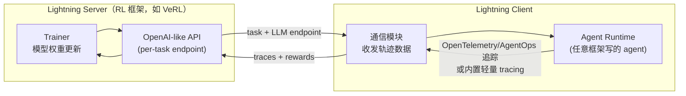

# Agent Lightning: Train ANY AI Agents with Reinforcement Learning

> 微软研究院提出的框架：把 agent 执行建模为 MDP、用统一数据接口把任意 agent 的轨迹拆成训练 transition（LightningRL），配合 Training-Agent Disaggregation 架构（OpenAI-like API 分离训练与 agent 执行），做到近零代码修改接入 LangChain / OpenAI Agents SDK / AutoGen 等任意框架写的 agent。

## 元信息

机构：Microsoft Research / 发表：2025-08-05（arXiv v1）/ 链接：[arXiv](https://arxiv.org/abs/2508.03680) · [Code](https://github.com/microsoft/agent-lightning) / 对比基线：概念上对比两类既有方案——(1) turn-concatenation + masking 类多轮 RL 工作（RAGEN、Trinity-RFT、rLLM、Search-R1，均基于 VeRL）；(2) 要求把 agent 逻辑重写进训练框架内部的方案（verl agent loop 等）。论文未做数值对比实验，只做定性区分。

## 要解决的问题

已有的 agentic RL 训练方案在"如何把复杂、动态的 agent 执行过程转成训练数据"这一步上有两类局限：一类要求把 agent 逻辑重新实现在 RL 训练框架内部（如 verl 的 agent loop），训练侧需要感知 agent 的编排逻辑才能正确组织数据（比如决定拼接顺序、在哪里加 mask），导致 agent 必须与特定训练框架紧耦合，跨异构 agent 生态（LangChain、OpenAI Agents SDK、AutoGen、纯手写）几乎无法复用；另一类（RAGEN、Search-R1、Trinity-RFT、rLLM 等）把一条轨迹的所有轮次拼接成一条长序列、用 mask 控制哪些 token 参与优化——这种做法只适合简单、顺序化的单 agent 工作流，遇到多 agent、动态编排（LLM 自己决定下一步调用谁）就难以扩展，而且 mask 会打断 RoPE 等位置编码假设的 token 连续性、需要针对每个应用手写 mask 策略、且拼接会让上下文随轮数增长不断变长、加重训练侧显存/计算负担。现实中的 agent 高度多样（框架选择多、编排逻辑动态不确定）且现有优化工具几乎都不支持自动化能力提升，这就是本文要解决的问题：设计一套与具体 agent 实现方式无关、能处理任意动态交互逻辑的通用 RL 训练方案。

## 方法

**统一数据接口：把 agent 执行建模为 MDP**。任意 agent 的一次执行都可以表示为一个有向无环图（组件调用为节点），但从这样的执行轨迹里解析出完整 DAG 既复杂又（对训练而言）没必要。本文改用 MDP 视角：state 是 agent 执行当前的一个快照，由一组"语义变量"（semantic variable，概念借自 [Parrot, OSDI'24]）组成；一次组件调用（LLM 或工具）定义为 `call = (meta, input, output)`；一次完整执行 `execution(x,k)` 是若干次调用的有序集合，每次调用可以带一个标量 reward，终局 reward 评估整体任务完成质量。RAG 场景的具体例子：UserInput → LLM 生成 Query → Search 工具检索 Passages → LLM 生成 Answer，reward 由 RAG_F1 打分；4 个语义变量随执行推进逐步"点亮"。

**LightningRL：分层 RL，转移（transition）而非拼接+mask**。把单条完整执行里"待优化 LLM 的每次调用"抽出来，只保留 `(input_t, output_t, r_t)` 三元组作为一条 transition，忽略产生这个 input 的具体拼接/渲染逻辑。LightningRL 分两步处理：(1) credit assignment 模块把整条轨迹的 episode-level return $R=\sum_t r_t$ 分配给轨迹里的每个 action——当前实现是最简单的**恒等分配**：每个 action 都拿到与最终 return 相同的值；(2) 分配后，每个 transition 就变成一条标准的单轮 RL 训练样本，可以直接喂给任意已有的单轮算法（GRPO、PPO、REINFORCE++）做 token 级别的优势估计——同一 task 的多次执行按 task 分组，套用 [[grpo]] 的组内均值/标准差归一化。这个设计的三个直接好处：(a) 不需要为每个应用手写 mask，transition 天然对齐 LLM 的输入结构，不破坏位置编码连续性；(b) 长轨迹被拆成一批批独立 transition 而不是一条不断变长的拼接序列，缓解上下文爆炸，还能用 batch accumulation 技术；(c) 可以选择性优化多 agent 系统里的部分 agent——只要把想训练的 agent 对应的 transition 纳入优化集合即可（本文 Text-to-SQL 实验里 3 个 agent 只训 2 个，用的就是这个机制）。论文承认当前"恒等分配"策略是简化实现，更精细的 credit assignment（例如学习一个逐 action 的价值函数）是留待未来的开放方向。

**Training-Agent Disaggregation（TA Disaggregation）架构**：

Server 是训练侧控制器（跑 VeRL 等 RL 框架），把数据集切批、用事件驱动方式管理生成/训练阶段切换，给每个任务分发一个独立的、OpenAI 兼容的 API 端点；Client 分两部分，一部分负责与 Server 通信收发数据，另一部分是 **Agent Runtime**——负责跑用户原样的 agent 代码并采集数据。这带来"训练框架 agent-agnostic、agent trainer-agnostic"的双向解耦：VeRL 只管优化 LLM 和硬件资源，不需要知道 agent 内部逻辑；agent 代码不需要感知底层用的是哪个 RL 框架。Agent Runtime 的关键设计：(1) **两级数据并行**——单机内多 worker 跑不同 agent 实例（intra-node）+ 多机各自管理一批 agent 实例（inter-node）；(2) **零代码修改的数据采集**——优先用 OpenTelemetry + AgentOps 的 tracing 能力自动插桩，采集 LLM 调用、工具调用、环境交互；不兼容 OpenTelemetry 的框架则退化到内置在 OpenAI-like API 端点里的轻量级 tracing；(3) **错误处理与鲁棒性**——探测 agent crash、长时间挂起的工具调用等未被 agent 代码自身处理的失败，失败任务可重试或转发给其他 agent 实例，RL 训练下的探索/利用动态会显著放大这类错误频率；(4) **Automatic Intermediate Rewarding (AIR)**——把系统监控信号（如工具调用的返回状态）自动转成中间奖励，缓解稀疏奖励问题，开发者可自定义规则；(5) **环境/奖励服务池化**——轻量本地环境和 reward 函数直接跑在 agent worker 内，资源密集或初始化成本高的环境（如手机模拟器）则托管为共享服务池，当前是简单池化，留待扩展为更复杂的 serverless 架构。

## 实验与结果

三个任务各配一个不同的 agent 框架，base model 统一用 Llama-3.2-3B-Instruct（Table 1）：

- **Text-to-SQL（LangChain，Spider 数据集）**：3-agent 工作流（SQL writer → SQL executor → checker → 按需 re-writer/answerer），全部由同一 LLM 以不同 prompt 承担不同角色；训练时只优化其中 2 个 agent（writer、re-writer），checker 保持不训练——验证了"选择性优化多 agent 系统中部分 agent"这一机制。Reward = 最终答案是否正确。
- **RAG（OpenAI Agents SDK，MuSiQue 多跳 QA，检索源为全量 21M 篇 Wikipedia 文档，BGE embedding + 余弦相似度）**：单 LLM 身兼 query 生成与最终作答两个角色，无显式多 agent 结构。Reward = $0.9 \times R_{correctness}(\text{F1}) + 0.1 \times R_{format}$。
- **Math QA + 工具使用（AutoGen，Calc-X 数据集）**：单 LLM 决定何时调用计算器工具、如何解读工具输出并给出最终答案。Reward = 最终答案是否正确。

三个任务的 Figure 5–7 均只展示训练/测试 reward 曲线，论文文本层面**没有报告具体的最终准确率数字或提升百分点**，只定性描述"reward 持续、稳定提升"。这是本文与 SkyRL-v0/SkyRL-Agent 等给出明确 pp 提升数字的论文相比明显更弱的一点——**成本、吞吐、资源规模**这类系统数字论文完全没有给出（无 rollout 速度、无与"agent 重写进训练框架"基线的 GPU 利用率对比）。

## 局限与疑点

- 全文没有任何最终准确率/pp 提升的量化数字，只有训练曲线插图；也没有给出与"agent 重写进训练框架"或"拼接+mask"基线的直接数值对比，"是否更优"停留在设计论证层面，未经实证验证。
- 三个任务都用相对轻量的 3B base model 和中等复杂度任务，未验证方法能否扩展到 SWE-Bench 级别的长程（20–50 轮以上）编码 agent 场景（对照 [[skyrl-v0]]、SkyRL-Agent 在这一场景下的实测）。
- Credit assignment 模块目前只实现了最简单的"恒等分配"（每个 action 都拿整条轨迹的 return），论文承认这是简化版，"学习一个逐 action 价值函数"等更精细方案是未来工作、未经验证。
- Automatic Intermediate Rewarding (AIR) 只有高层描述（"开发者可自定义"），没有给出默认算法、具体规则示例，也没有消融实验说明它对训练稳定性/速度的实际贡献。
- 多 LLM（而非单 LLM 扮演多角色）联合优化被明确标注为未解决问题：论文承认"把每个 LLM 当独立 MDP 分别优化"忽略了策略间的相互依赖，更严谨的 MARL/博弈论方法留作未来工作。
- 系统侧没有给出 Lightning Server/Client 的通信开销、扩展性上限、错误重试导致的额外算力开销等工程数据。

## 对我们的启发

- **Training-Agent Disaggregation 是"训练-执行解耦"这个模式在比 SkyRL 更上一层的具体实例**：SkyRL 拆的是"训练 GPU vs 沙箱容器执行"，Agent Lightning 拆的是更上游的"LLM 生成（训练框架管，GPU）vs agent 编排逻辑本身（client 端，可以完全不碰 GPU）"——它甚至不需要感知 agent 的控制流，只暴露一个按任务分发的 OpenAI 兼容端点。如果我们要做"agent 训练托管服务"，这提示一个可以直接照抄的接口设计：给用户一个 OpenAI 兼容 endpoint，用户任意框架写的 agent 代码原样跑在我们的 client/沙箱里，不需要改造，我们不需要理解用户 agent 的内部逻辑就能采集训练数据。
- **复用可观测性基础设施（OpenTelemetry/AgentOps）做训练数据采集**是"近零代码修改"这个目标背后真正的工程抓手：如果用户已经用 OpenTelemetry 给 agent 做了可观测性埋点，我们可以直接复用同一份 trace 转成训练样本，不需要用户为"训练"这件事单独改代码——这是我们平台如果要降低"接入训练"门槛时值得直接借鉴的机制。
- **transition-based（而非拼接+mask）的数据组织方式**直接解决了我们平台大概率会遇到的问题：长 agent 轨迹的拼接上下文会随轮数增长不断变长，拖累训练/推理显存和序列长度上限。这提示我们如果提供 agent RL 训练服务，"轨迹如何切成训练样本"应该在数据管道设计阶段就采用 transition 粒度，而不是事后优化一个已经定型的拼接方案。
- **AIR（从系统监控信号自动派生中间奖励）**是一个廉价、可推广的稀疏奖励缓解手段，即使本文没给出量化效果，值得记录为一个可复用的设计模式——例如把我们沙箱执行侧已有的工具调用返回码、超时、重试次数等监控信号，作为默认可选的中间奖励来源提供给训练用户。
- follow-up 建议：
  1. 精读 GitHub 仓库（microsoft/agent-lightning），确认 Lightning Server/Client 的具体通信协议、AIR 默认实现细节，并评估当前实现能否支撑 SWE-Bench 级别的长程任务（论文实验规模明显小于 SkyRL/SkyRL-Agent）。
  2. 评估 Agent Lightning 的 client/Agent Runtime 抽象与 SkyRL 的 Remote Sandbox Server 能否在同一平台上组合：用 Agent Lightning 的 OpenAI-like API + transition 数据接口做训练侧标准化，同时用 SkyRL 风格的沙箱做重量级环境执行。
  3. 跟踪 credit assignment 模块的后续演进（论文明确留白的"学习逐 action 价值函数"方向），判断它是否会改变 LightningRL 与标准 GRPO/PPO 的兼容性假设，进而影响我们对训练接口的抽象设计。

## 相关

- 相关概念：[[agentic-rl-frameworks]]、[[rollout-training-disaggregation]]、[[grpo]]、[[agent-rl-credit-assignment]]
- 相关笔记：[[2509.02547]]（综述 Table 11 把 Agent Lightning 列为 12 个 Agentic RL 专用框架之一，一句话概括"MDP 建模 + 执行训练解耦 + 分层 RL"，本篇补上了 MDP 形式化、LightningRL 算法细节、TA Disaggregation 架构与三个实验任务的具体设计）；[[skyrl-v0]]（同一"训练-执行解耦"模式在环境执行/沙箱层的实例，可与本文的 agent 编排逻辑层解耦对照）；[[2511.16108]]（SkyRL-Agent 论文 Table 1 把 Agent Lightning 列入框架能力对比，称其"rollout 执行只支持单一/少数训练后端、data-parallel 粒度"）
- 母论文：无（`parent` 为空，本篇是阅读清单 issue #72 的独立条目，非某篇论文的衍生解读）
