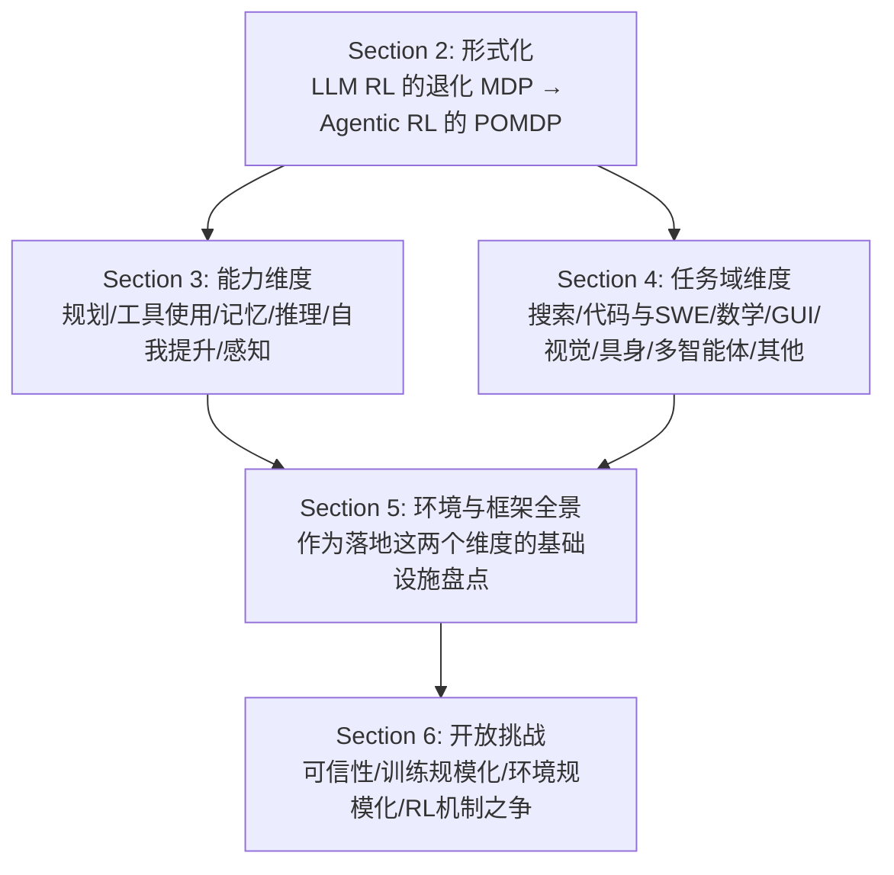

# The Landscape of Agentic Reinforcement Learning for LLMs: A Survey

> 95 页综述：把 Agentic RL 形式化为 POMDP（区别于传统 LLM RL 的单步 MDP），提出"能力×任务域"双轴分类法，并系统盘点开源环境（Table 10，约 43 个）与训练框架（Table 11，约 23 个）的全景图。

## 元信息

- 机构：Shanghai AI Laboratory、University of Oxford、National University of Singapore 等 15 家机构联合
- 发表：2025-09-02（arXiv v1）；2026-01 刊发于 TMLR（Transactions on Machine Learning Research）
- 链接：[arXiv](https://arxiv.org/abs/2509.02547) · [OpenReview](https://openreview.net/forum?id=RY19y2RI1O)
- 对比基线：不适用（综述类论文，非提出新方法）
- 规模：综合 500+ 篇近期工作

## 要解决的问题

早期 LLM RL（RLHF/RLAIF/DPO 等）把 LLM 当作静态条件生成器，优化目标是单轮输出对齐，本质是退化的单步 MDP。但随着 LLM 被用作长程决策的自主 agent（规划、工具调用、记忆、多轮交互），这套形式化不再适用，而领域内对"Agentic RL"缺乏统一定义和系统性的方法/环境/框架全景图，导致新入场者难以定位已有工作、复用已有基础设施。

## 方法

综述提出双轴分类法，不是单一技术方法，而是组织框架：

**Section 2（形式化）**：把传统 LLM RL 定义为退化的单步 MDP（状态=prompt，动作=response，一步终止），Agentic RL 定义为时序展开的 POMDP：状态转移、动作空间、观测都在多轮交互中演化，reward 可能延迟或稀疏。这个区分本身是全文的理论锚点。

**Section 3（能力分类）**：规划（planning）、工具使用（tool use）、记忆（memory）、自我提升（self-improvement）、推理（reasoning）、感知（perception）六类核心 agentic 能力，逐一梳理 RL 如何把这些能力从"启发式静态模块"训练成"自适应鲁棒行为"。

**Section 5（环境与框架，本次精读重点）**：

- **5.1 环境与仿真器**（[[agentic-rl-environments]]）：按任务域分六类——Web 环境（WebShop、WebArena、VisualwebArena、AppWorld 等）、GUI 环境（AndroidWorld、OSWorld）、代码与 SWE 环境（Debug-Gym、R2E-Gym、SWE-bench、SWE-rebench、TheAgentCompany 等）、领域特定环境（科研/MLE/生物医学/网络安全）、模拟与游戏环境（Crafter、Craftax、SMAC、Factorio）、通用环境（AgentGym、Agentbench、InternBootcamp）。Table 10 用"agent 能力标签 + 任务域 + 模态"三元组归类了约 43 个环境/基准。
- **5.2 RL 框架**（[[agentic-rl-frameworks]]）：三类——Agentic RL 专用框架（SkyRL-v0、AREAL、AgentFly、Agent Lightning、AWorld、ROLL、VerlTool、AgentRL 等 12 个）、RLHF/微调框架（OpenRLHF、TRL、HybridFlow 等 6 个）、通用 RL 框架（RLlib、Tianshou 等 5 个）。Table 11 列出关键特性一句话概括每个框架。

**Section 6（开放挑战）**：三个前沿方向——可信性（安全/幻觉/谄媚）、Agentic 训练规模化（算力/模型规模/数据规模/效率）、**Agentic 环境规模化**（6.3 节：环境从"静态实体"转向"可学习、可协同演化的动态系统"，自动化 reward 设计 + 自动化课程生成两条技术路线，与 [[verifiable-reward-environment-generation]] 直接相关）。此外 6.4 节讨论了 RL 到底是"放大器"（重塑采样分布、提升 pass@1）还是"新能力来源"（解锁 pass@k 边界）的机制之争，未有定论。

## 实验与结果

综述类论文没有自己的实验，关键"数字"体现在盘点规模和个别框架披露的工程数据：

- Table 10：约 43 个环境/基准，覆盖 Text / Text+Visual / Visual 三种模态，Web / GUI / SWE / MLE / Game / General 六大任务域。
- Table 11：约 23 个 RL 训练框架，其中 12 个是 Agentic RL 专用框架。
- **AWorld**（框架，Section 5.2）：通过跨集群大规模并行 rollout，把经验生成（agent 训练的主瓶颈）加速到单机的 **14.6×**——这是全文里少数几个量化的工程数字，直接印证"rollout/环境执行吞吐是 agent RL 训练的瓶颈"。
- 多个框架（AREAL、AgentFly、ROLL、AgentRL）都强调"异步执行 + 集中式资源/环境编排"作为架构核心特性，但除 AWorld 外均未给出具体加速比或吞吐数字。
- 6.2 节引用 Agent RL Scaling Law、ProRL/ProRLv2 等工作说明"延长 RL 训练时长"本身就能扩展推理边界，是独立于模型规模、数据规模的一个 scaling 轴。

## 局限与疑点

- 作为综述，大部分环境/框架条目只有 1–3 句话的定性描述，**缺乏统一的量化对比**（吞吐、成本、GPU 需求、并发密度）——对我们做基础设施选型来说，仍需回到各自原始论文/仓库找工程细节，这份综述提供的是"地图"而不是"评测报告"。
- Table 10/11 的信息来源主要是各项目自述的"关键特性"一句话，未经过综述作者独立复现验证，存在"自我宣传"表述被直接采信的风险。
- 6.4 节关于"RL 是放大器还是新能力来源"的机制之争，作者自己也承认尚无定论，属于开放问题而非结论。
- 95 页、500+ 引用的体量决定了广度优先于深度，具体到某个环境/框架的冷启动、镜像分发、隔离级别等我们最关心的工程细节几乎全部缺失（除 RepoLaunch 等在其他笔记里已单独深挖的个案外）。

## 对我们的启发

- **环境全景直接对应我们沙箱平台的能力矩阵**：Table 10 按"静态 vs 动态""文本 vs 视觉"分类的环境，映射到不同的隔离/执行需求——Web/SWE 类环境多是 Docker 容器 + 确定性状态（只在 agent 动作下变化），而 OSWorld / AndroidWorld / WindowsAgentArena 需要**完整的桌面/移动操作系统**（真实 Ubuntu/Windows/macOS 或 Android 模拟器），这类环境的隔离成本和冷启动开销远高于轻量代码沙箱，是评估我们 microVM 方案覆盖面时的具体标尺。
- **"静态 vs 动态"环境的区分是调度设计的关键变量**：大多数基准（WebArena、OSWorld 等）状态只在 agent 动作下改变，适合"按需启动、空闲即挂起"的沙箱生命周期；但 Factorio 这类"tick-based"环境即使 agent 不动作世界也在演化,需要**持续运行的后台进程**,这对我们的调度系统提出了不同于"请求驱动"沙箱的常驻资源管理需求。
- **AWorld 的 14.6× 加速数字**验证了一个判断：rollout/环境执行吞吐是 agent RL 训练规模化的主要瓶颈，这与我们平台"生产上跑不跑得起来、成本与密度"的关注点完全对齐——多个框架不约而同地把"异步执行 + 集中式环境编排"作为架构核心，说明这是行业共识的解法方向，值得对照自研调度系统的设计。
- **Agent Lightning 的"执行与训练解耦"架构**（把 agent 执行建模为独立 MDP，通过近零代码修改接入任意 agent）是一个值得关注的模式：这正是"沙箱执行服务"与"训练循环"分离、通过异步 API 对接的架构，如果我们要做通用 agent 训练基础设施，这类解耦设计值得借鉴。
- **6.3 节"环境规模化"的两条技术路线**（自动化 reward 设计 + 自动化课程生成）与已有笔记 [[verifiable-reward-environment-generation]] 的结论一致，进一步确认"环境生成的成本、质量校验、可复现性"是我们平台需要补的能力，不是个案。
- Follow-up 建议（可转 issue）：
  1. 逐项盘点 Table 10 里 OSWorld / AndroidWorld / WindowsAgentArena 这类全 OS 环境的具体隔离方案，评估我们 microVM 沙箱能否覆盖，缺口在哪。
  2. 深入精读 AWorld、Agent Lightning、AgentRL 三个框架的原始论文/代码，重点看它们的"环境编排"和"跨集群并行 rollout"具体如何实现，与我们自己的调度系统设计对比。
  3. 跟踪本综述 6.3 节"环境作为动态可优化系统"的后续工作，与 [[verifiable-reward-environment-generation]] 合并成专题跟踪。

## 相关

- 相关概念：[[agentic-rl]]、[[agentic-rl-environments]]、[[agentic-rl-frameworks]]、[[verifiable-reward-environment-generation]]
- 相关笔记：[[2609.23377]]（category-aware-expert-training，用到 [[repolaunch]] 构建 SWE 环境，是本综述 5.1.3 节"交互式 SWE 环境"分类的一个具体实例）、[[2609.27321]]（vhd-play，对应本综述 6.3 节"环境规模化"讨论的"机制先行"环境生成范式）
