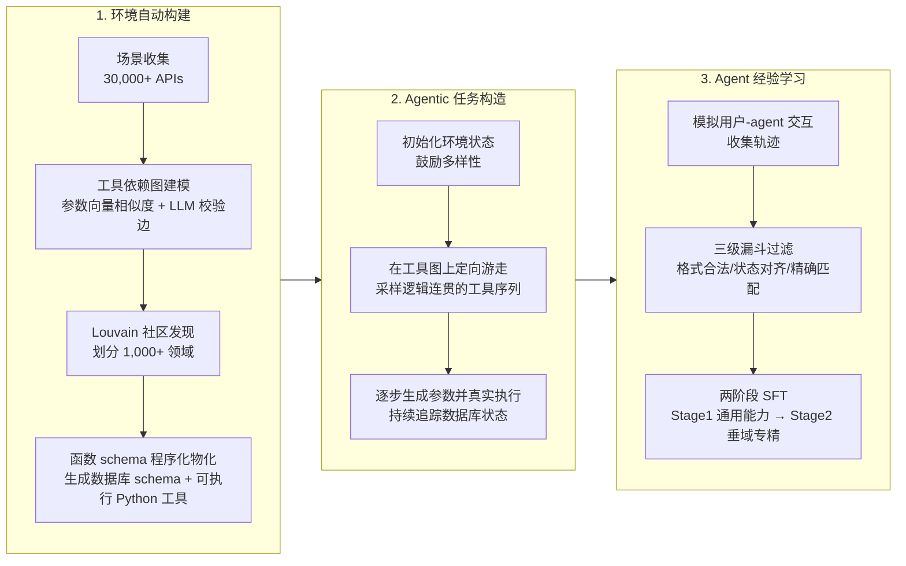

# Towards General Agentic Intelligence via Environment Scaling

> Tongyi Lab（阿里）提出自动化构建"数据库化"function-calling 环境的流水线，训练出 AgentScaler（4B/8B/30B-A3B）系列，在 tau-bench / tau2-Bench / ACEBench 上以远小参数量逼近千亿/万亿参数开源模型。

## 元信息

- 机构：Tongyi Lab, Alibaba Group
- 发表：2025-09-16（v1），cs.CL
- 链接：[arXiv](https://arxiv.org/abs/2509.13311) · [HTML](https://arxiv.org/html/2509.13311v1) · [Code](https://github.com/Alibaba-NLP/DeepResearch) · [Blog](https://tongyi-agent.github.io/blog/introducing-tongyi-deep-research/)
- 对比基线：闭源 Gemini-2.5-pro、Claude-Sonnet-4、GPT-o3/o4-mini、GPT-5-think；开源 GPT-OSS-120B、DeepSeek-V3.1-671B、Kimi-K2-1T、Qwen3-Thinking-235B、xLAM-2 系列等

## 要解决的问题

现有合成 agentic 数据的方法分两类，都有明显短板：① 反向范式——针对已有 assistant 工具调用逆向生成用户 query（如 Magnet），轨迹真实感有限；② 正向范式"模拟 agent-human 交互"（如 APIGen-MT、tau2-Bench）——先构造高层用户意图再自顶向下生成数据，但**环境本身不可规模化**：环境构造依赖人工搭建，缺乏自动化手段，难以大规模铺开。本文要同时解决"如何有原则地规模化环境"和"如何从这些环境的交互经验中有效训练 agent 能力"两个问题。

## 方法

核心设计原则：任何 function call 都可以看作对底层"环境数据库" $\mathcal{D}$ 的读写操作——read 型函数查询 $\mathcal{D}$（检索、查看、监控），write 型函数触发 $\mathcal{D}$ 的状态转移（修改、生成、执行）。同域工具通常共享相似的读写模式，可以用一个统一的数据库 schema 描述。

**环境自动构建**（Section 2.1）：① 场景收集——从 ToolBench、API-Gen 和内部工具库汇总 3 万+ API，过滤低质量 API 后重写描述、补齐输入输出规范，并基于输入输出关系系统性构造工具组合；② 工具依赖图建模——把每个工具的参数列表向量化算余弦相似度，超过阈值 $\tau$ 则连边（公式 1），再用 LLM 逐对校验域内工具依赖关系提高准确率；③ Louvain 社区发现做图聚类，把工具空间划分成 1,000+ 个领域（每个领域对应一个数据库 schema）；④ 函数 schema 程序化物化——用领域内工具参数生成数据库结构，再把每个工具形式化成对该数据库结构做读写操作的 Python 代码。作者提到人工检查发现在 tau-bench 相关领域生成的数据库结构和代码与 tau-bench 官方实现高度一致，间接验证了流水线的合理性。

**Agentic 任务构造**（Section 2.2）：先按数据库 schema 初始化一个尽量多样的环境状态；再在领域工具图上做定向游走——从随机起点出发，直到达到最大步数或走到出度为零的节点，得到一条逻辑连贯的工具序列；每一步生成对应参数并真实执行、持续追踪数据库状态演化。这种"边走边真实执行"的设计同时在两个粒度上提供可验证性：数据库级状态一致性 + 工具序列精确匹配，呼应 [[generator-verifier-asymmetry]] 里"易验证域适合确定性验证"的判断。

**Agent 经验学习**（Section 3）：先做模拟 human-agent 交互收集经验轨迹（呼应 tau-bench 的做法），再用三级漏斗过滤：① 格式有效性——保证用户/助手轮次交替合法，并用 n-gram 检测去掉严重重复的推理片段；② 环境状态对齐——只保留交互后数据库最终状态与 gold 状态一致的轨迹（验证 write 操作正确性）；③ function-calling 精确匹配——对纯 read 操作序列（无法用状态变化判定）改用更严格的工具序列+参数精确匹配。**特别之处：不过滤工具调用报错的轨迹**——只要最终仍满足上述过滤条件，中间出现失败反而被保留，用于提升模型鲁棒性。训练目标（公式 2）只在工具调用 token $\tau_t$ 和助手回复 token $y_t$ 上计算 loss，人类指令和工具返回结果被 mask 掉但仍可见于上下文。两阶段微调：Stage 1 在通用领域打基础（广度优先），Stage 2 在垂直领域用领域特定任务精调（对齐目标场景）。

## 实验与结果

- **主结果（Table 1）**：AgentScaler-30B-A3B 在 tau-bench（Retail 70.4 / Airline 54.0）、tau2-Bench（Retail 70.2 / Airline 60.0 / Telecom 55.3）、ACEBench-en Overall 75.7 上，**超过多数 1T 参数以下开源模型**（如 Deepseek-V3.1-671B Overall 69.3、Qwen3-Thinking-235B Overall 70.2），逼近 Kimi-K2-1T-A32B（Overall 77.4）等万亿参数模型，同时在多个子项上接近闭源模型水平。
- **小模型增益显著**：AgentScaler-4B 在 tau-bench Airline 上达到 54.0，与 30B 级模型相当；基座 Qwen3-Thinking-4B 本身 Airline 仅 52.5，Overall 仅 49.5 vs AgentScaler-4B 65.9。
- **跨语言泛化（Table 2，ACEBench-zh，OOD 评测）**：AgentScaler-4B 在中文测试集上 Overall 从基座的 43.9 提升到 65.6（+21.7），Agent 子项从 6.7 提升到 38.4（+31.7）——训练数据是英文合成环境，中文测试属于分布外，证明合成数据方法学到的是可迁移的工具使用能力而非语言/表层模式。
- **消融（Figure 3，ACEBench-en）**：Stage 1、Stage 2 相对基座 Qwen3-Thinking-30B-A3B 都有实质提升；Stage 2 的多步 agent 训练进一步提升 agent 子集分数和整体分数，验证两阶段设计的必要性。
- **稳定性分析（Figure 4，pass^k）**：AgentScaler-30B-A3B 在 tau2-Bench 各 k 值下的加权分数都稳定超过 Qwen3-Thinking-30B-A3B；但所有模型分数都随 k 增大而下降，说明"多次独立试验全对"意义上的稳定性仍是行业共同短板。
- **长程工具调用（Figure 5）**：tau-bench 上工具调用次数与轨迹准确率呈明显负相关，AgentScaler 也不例外——长链条工具调用仍是开放问题，作者列为未来工作方向。

## 局限与疑点

- 作者自陈两点局限：① **未做 RL**——目前只用两阶段 SFT，作者认为构造的模拟环境天然适合 RL（低延迟、状态稳定反馈），留作未来工作；② **模型规模上限 30B**——未验证 200B+/万亿参数规模下方法是否仍有效，援引"小模型才是 agentic AI 未来"的立场为这一选择辩护，但这更像事后合理化而非充分论证。
- 论文**完全未披露工程细节**：环境自动构建流水线的算力成本、生成 1,000+ 领域/数据库 schema 所需时间、单个环境的存储/运行开销、并发执行/训练时的资源规模——这些恰恰是我们沙箱平台最关心的数字，全部缺失。
- "人工检查发现生成的 tau-bench 相关领域与官方实现高度一致"这一说法只是定性描述，没有给出量化的一致性指标或检查覆盖的领域数量，说服力有限。
- 三级过滤漏斗会不会系统性偏向"容易验证的短序列/简单任务"，从而在数据分布上引入偏差（呼应 Figure 5 的长程能力短板），论文没有讨论这种潜在的过滤偏差与长程能力弱的因果关系。
- Table 1/2 里的基线来自不同规模、不同训练方法的模型混合对比，AgentScaler 与同规模基座（如 Qwen3-8B）的直接对比在部分子项（如 tau-bench Retail：AgentScaler-8B 50.4 反而低于 Qwen3-Thinking-4B 的 59.1）出现反直觉结果，论文未展开解释这类不一致。

## 对我们的启发

- **"工具即数据库读写操作"这一设计原则，是把 function-calling 环境的可验证性问题转化为工程问题的一个干净抽象**：一旦工具被形式化为对某个 schema 的读写代码，环境的"正确性"就能靠数据库状态比对 + 精确匹配自动判定，不需要人工或 LLM-as-judge 介入。这类环境的执行本质就是跑一段 Python 代码 + 操作一个内存态/轻量数据库，冷启动和资源开销应该远低于 OSWorld 一类全 OS 环境，是我们沙箱平台"轻量级、高并发"档位可以重点覆盖的场景。
- **Louvain 社区发现 + LLM 校验边的领域划分方法，提供了一条"从零散 API 池自动生成成百上千个隔离环境"的可复制路径**，值得对照我们现有的环境/镜像生成能力评估是否可以复用类似的自动化流水线，降低人工构建环境 schema 的边际成本。
- **三级漏斗过滤（格式合法 → 状态对齐 → 精确匹配）是一个可以直接借鉴的验证器设计模式**：分层过滤比单一验证标准更鲁棒，尤其是"保留含工具调用报错的轨迹"这个反直觉决定——提示我们在设计训练数据管线/沙箱验证逻辑时，不必强求"零错误轨迹"，适度保留失败-恢复过程反而有利于模型鲁棒性，这对我们评估沙箱平台该不该无差别拦截/重试工具调用失败有参考价值。
- **论文完全不披露成本侧数字，再次印证 [[gef-loop]] 笔记里"环境规模化的成本侧是行业共同盲区"的判断**——这类论文提供的是方法论蓝图，工程可行性（1,000+ 领域数据库同时运行的存储/并发成本）仍需我们自己实测评估。
- Follow-up 建议（可转 issue）：
  1. 尝试用本文的"工具依赖图 + Louvain 社区发现"方法在我们自己的内部工具/API 池上做一次小规模复现，评估自动划分领域的质量和人工介入成本。
  2. 评估"数据库读写型环境"能否作为我们沙箱平台的一个专门的轻量级 profile（相对于容器化/microVM 的重量级 profile），量化两者在冷启动和并发密度上的差异。
  3. 关注 AgentScaler 后续是否补充 RL 训练（作者在局限里明确提到这是下一步方向），跟进环境端是否会因 RL 训练暴露出目前 SFT 阶段未显现的成本/稳定性问题。

## 相关

- 相关概念：[[verifiable-reward-environment-generation]]、[[gef-loop]]、[[generator-verifier-asymmetry]]、[[agentic-rl-environments]]、[[agentic-rl]]
- 相关笔记：[[2511.09586]]——GEF loop 综述里"离线数据库快照模拟环境状态"的折中方案，本文正是这一模式的一个完整工程实现范例；[[2509.02547]]——Agentic RL 全景综述 Section 6.3 提到的"自动化 reward 设计"技术路线，本文的三级过滤漏斗是该路线的具体落地
