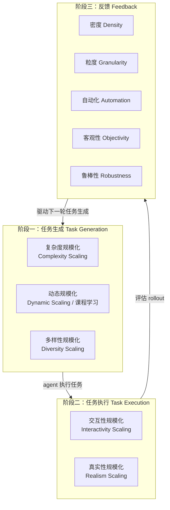

# Environment Scaling for Interactive Agentic Experience Collection: A Survey

> 22 页 NeurIPS 2025 SEA Workshop 综述：提出 Generation-Execution-Feedback（GEF）loop 作为 agentic RL 环境的统一框架，沿"任务生成 / 任务执行 / 反馈"三阶段系统盘点环境规模化方法。

## 元信息

- 机构：Hong Kong University of Science and Technology、King's College London、DAMO Academy Alibaba Group
- 发表：2025-11-12（v1），最新 v3 2025-12-23；NeurIPS 2025 SEA Workshop
- 链接：[arXiv](https://arxiv.org/abs/2511.09586) · [HTML](https://arxiv.org/html/2511.09586v3) · [Code/Awesome List](https://github.com/lukahhcm/Awesome_Scaling_Environments)
- 对比基线：不适用（综述类论文）；与 [[2509.02547]]（Agentic RL 全景综述）视角互补——后者是"能力×任务域"双轴全景，本文专注"环境本身如何规模化"这一单一主线，可视为对前者 Section 5.1/6.3 的深挖

## 要解决的问题

静态数据集上的 SFT 无法培养 agent 的适应性行为和长期决策能力：这类数据集构建成本高、受限于人类已有知识、缺乏动态性与真实感。行业共识正转向"agent 直接与环境交互、从经验中用 RL 学习"，但现有工作从环境生成、执行、反馈评估等不同角度各自推进，缺乏一个把这些工作串起来的系统性框架——这正是本文提出 GEF loop 分类法要填补的空白。

## 方法

核心贡献是把"环境如何支撑 agentic RL 训练"形式化为一个三阶段循环（Generation-Execution-Feedback），并在每个阶段内进一步拆出可规模化的具体维度：

**阶段一：任务生成**——① 复杂度规模化：从单步工具调用扩展到多轮、多步、层级/组合结构（如 TaskCraft 同时拓展"宽度"多子目标与"深度"更长工具链），再到带分支逻辑的条件/图结构任务（WebShaper、WebSailor）；② 动态规模化：环境按 agent 的成功率/进度率调度难度（课程学习），代表是 challenger-solver 协同进化范式（R-Zero）——challenger 依据 solver 的不确定性提出"边界难度"任务，solver 在过滤后的任务集上训练，形成越来越难的课程；③ 多样性规模化：[[agentic-rl-environments]] 里 AgentGym/AgentBank 用跨领域环境（Web、具身、代码、工具）证明异构性能提升域内外性能，但作者指出"简单任务放在复杂环境里，可能比复杂任务放在简单环境里更有效"，因此更该强调环境级而非任务级多样性。

**阶段二：任务执行**——① 交互性规模化：从"单一静态 ground-truth 路径"的非交互评测，转向允许 agent 真正调用 API/生成代码/操作 GUI 并据中间结果调整后续动作；瓶颈是 API 调用成本，离线真实数据库快照（如 Tongyi DeepResearch 的做法）是常见折中——用读写数据库状态模拟真实工具链失败和异步事件，同时把成本控制在预算内；② 真实性规模化：从"静态网页截图问答"转向可执行的代码/浏览器/操作系统环境（OSWorld 等）；多智能体场景下真实性则体现为底层通信基础设施是否可靠——例如 ARE（Andrews et al., 2025）把 agent 时钟与环境时钟解耦，将其他 agent 的活动视为独立异步事件，让世界状态异步演化，以收集更真实的交互经验。

**阶段三：反馈**——① 密度：轨迹级结果奖励（稀疏但训练稳定）vs 步骤级过程奖励（密集但易 reward hacking，PR-Clip-Delta 用相邻步骤奖励差裁剪来缓解）；② 粒度：从二元信号/单一分数，到多维度打分，再到 Rubrics as Rewards 的清单式、逐实例评分规则；③ 自动化：LLM-as-a-Judge → 训练专用 reward model → agentic 验证（引入外部搜索工具核实事实），但自动化会放大 verbosity/position/egocentric 等评委偏见；④ 客观性：RLVR 在数学/代码等易验证域效果好，但创意写作、医疗咨询等域缺乏 ground truth——BRPO 用成对生成式奖励模型规避直接打分创造力，ARE 把"参数匹配硬检查"（如校验邮箱 ID）与"生成式 rubric 软检查"结合；⑤ 鲁棒性：奖励层面防噪声（软概率化奖励）与防 hacking（overseer 评估动作的未来效用），环境层面防崩溃/延迟/工具输出损坏（Trinity-RFT 用异步推理 + 重试机制，Tongyi DeepResearch 用缓存 + 重试 + 切换相似 provider）。

**Section 5 实现与挑战**：按领域盘点了 Tool Use / Deep Research / SWE（Docker 作为执行沙箱的事实标准，兼顾跨机器一致性和隔离安全）/ Web Navigation / Computer Use / Embodied 六类环境的设计取舍（详见"实验与结果"）。核心挑战是 **Generator-Verifier Asymmetry**（[[generator-verifier-asymmetry]]）：数学/代码等易验证域里生成高质量任务难、验证却便宜；创意写作/医疗等易生成域里反过来——提出任务容易、验证需要主观判断或专家知识。未来方向是让 generator 与 verifier 协同进化（强 generator 当 verifier 反哺自身）。

## 实验与结果

综述类论文，量化结果来自附录的对比表格（Appendix B）：

- **Table 1（任务复杂度对比）**：从 ToolBench（单轮，无 depth 概念）到 WebSailor-32B（graph-based 结构，2~8 步为主、最多 30 步）呈现出"结构从 sequential → compositional → graph-based，深度从个位数到 30 步"的演进趋势；GAIA 分数随之走高——WebDancer-32B 40.7 → WebExplorer-8B 50.0 → WebShaper-32B 52.4 → WebSailor-32B 53.2，说明任务结构/深度的规模化与下游能力正相关（但表格未做严格消融，只是同期工作的横向陈列）。
- **Table 2（环境/任务多样性对比，SWE 方向）**：SWE-Gym-32B（2,438 任务、491 轨迹，真实仓库）SWE-bench 解决率 20.6% → R2E-Gym-32B（8,135 任务、3,321 轨迹，程序化合成）34.4% → SWE-Smith-32B（50,137 任务、5,016 轨迹，真实+合成混合）40.2%——**任务/轨迹规模每提升一个数量级，SWE-bench 解决率随之显著提升**，是这份综述里少有的、能直接支撑"环境规模化有效"论点的量化证据。
- 同一张表里 AgentGym-70B（14 个环境、89 任务、6,130 轨迹）ALFWorld 性能 88.0、AgentBank-13B（16 环境、51,287 轨迹）72.4，说明跨域环境数量与轨迹量并非线性决定下游表现，仍需结合具体任务域判断。

## 局限与疑点

- 作为 22 页的 workshop 综述（NeurIPS SEA Workshop，非主会/期刊），覆盖深度不及 [[2509.02547]] 这类 95 页 TMLR 综述，很多方法只有 1-2 句话带过，需要回原论文才能拿到工程细节。
- Table 1/2 里的"Performance"列直接摘录各论文自报的分数，不同方法的评测设置（模型规模、训练数据、prompt）并不完全可比，作者也未做归一化处理，只能看作粗略趋势参考而非严格因果结论。
- 对"环境规模化"的成本侧（构建/维护环境的算力和人力开销、镜像分发、并发执行的资源竞争）几乎没有讨论——这正是我们沙箱平台最关心的维度，全文属于"方法论全景"而非"工程可行性评估"。
- GEF loop 三阶段的划分本身缺乏严格的正交性验证：例如"动态规模化"（课程学习）本质上依赖"反馈"阶段的评估结果来决定下一轮任务难度，Section 2.2 和 Section 4 之间存在隐含的循环依赖，论文未明确讨论这种跨阶段耦合如何影响系统设计。

## 对我们的启发

- **GEF loop 提供了一个可直接映射到我们沙箱平台职责边界的框架**：任务生成（数据/环境平台的职责）→ 任务执行（我们沙箱平台的核心职责：提供隔离、并发、可复现的执行环境）→ 反馈评估（RL 框架侧的职责，但依赖沙箱提供可靠的执行结果作为验证输入）。这与 issue #57 阅读清单里"弄清岗位②（环境/数据平台）与岗位③（RL 框架）职责边界"的目标直接对齐——我们平台主要对应"任务执行"阶段的交互性与真实性规模化，同时要为"反馈"阶段的自动化验证提供稳定、可信的执行结果。
- **SWE-bench 量化数据（20.6% → 34.4% → 40.2%）证明"程序化生成可执行 Docker 环境"这条路线（R2E-Gym、SWE-Smith）ROI 明确**：值得深入研究它们如何从 GitHub 仓库自动构建 buildable/testable 环境、生成任务规模能到多大、故障率如何，这与我们已有的 [[repolaunch]] 笔记（repo-level 环境构建）方向高度重合，可以对照补齐"批量生成"这一环。
- **"离线数据库快照"折中方案值得借鉴**：为控制真实 API 调用成本，同时保留部分真实性（工具链失败、异步事件），多个系统选择用真实数据库快照 + 读写函数模拟环境，而非直接接真实 API 或纯 LLM 模拟世界模型。这提示我们沙箱平台可以为高频调用的外部服务（如常见 SaaS API）提供"快照回放"模式作为轻量级选项，降低训练时的外部依赖和成本。
- **ARE 的"环境时钟与 agent 时钟解耦、异步事件驱动"架构**是本文里少数直接触及调度设计的内容，与 [[agentic-rl-environments]] 笔记里 Factorio 这类"tick-based 动态环境"呼应，进一步印证"请求驱动 vs 常驻后台进程"是沙箱生命周期管理必须支持的两种模式，而非单一模式够用。
- **Generator-Verifier Asymmetry（[[generator-verifier-asymmetry]]）是判断一个新任务域"好不好接入 RLVR"的实用检验标准**：易验证域（数学/代码）适合我们现有的沙箱+测试用例验证模式；易生成难验证域（创意写作、策略制定）需要额外投入在验证器上（rubric、成对比较、agentic 验证），这决定了我们平台在不同业务场景下的验证成本预期。
- Follow-up 建议（可转 issue）：
  1. 深挖 R2E-Gym / SWE-Smith 的具体环境合成流水线（从 GitHub repo 自动生成可执行 Docker 环境的方法、规模、故障率），评估能否复用到 [[repolaunch]] 相关的沙箱镜像构建能力。
  2. 精读 ARE（Andrews et al., 2025）原文，重点看"环境时钟与 agent 时钟解耦"的具体实现，评估是否可以作为我们调度系统支持异步/事件驱动环境的参考架构。
  3. 跟踪 Generator-Verifier Asymmetry 方向的后续工作（强 generator 当 verifier），评估能否降低我们自建验证器/reward 的开发成本，尤其是在低可验证性的业务场景里。

## 相关

- 相关概念：[[gef-loop]]、[[generator-verifier-asymmetry]]、[[agentic-rl-environments]]、[[verifiable-reward-environment-generation]]、[[agentic-rl]]
- 相关笔记：[[2509.02547]]——同一阅读清单（issue #57「全景与综述」）下的姊妹综述，"能力×任务域"全景与"环境规模化"专题互补，二者对 Table 10（约 43 个环境）与本文 Table 1/2（复杂度/多样性对比）可以交叉参照
