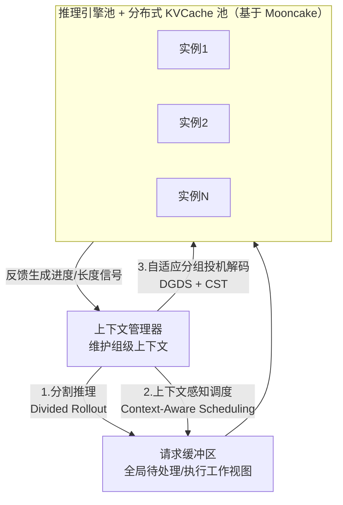

# Seer: Online Context Learning for Fast Synchronous LLM Reinforcement Learning

> Moonshot AI/清华：利用 GRPO 同组响应长度/模式强相关这一观察，用"推测请求探路 + 全局共享 KVCache 细粒度调度 + 组感知投机解码"三件套，在严格保持同步（不引入 off-policy）的前提下把 rollout 长尾延迟砍掉 72–94%，端到端吞吐提升最高 2.04×。

## 元信息

机构：Moonshot AI、清华大学 / 提交：2025-11-18（v3 更新至 2026-04-03）/ 链接：[arXiv](https://arxiv.org/abs/2511.14617) · [HTML](https://arxiv.org/html/2511.14617) / 对比基线：veRL（同步 RL SOTA）、StreamRL-Oracle（真实 prompt 长度版本）、香草投机解码（SuffixDecoding、Qwen2-7B-VL 小模型草稿、MTP）、Partial Rollout（非严格同步，2× 超发）。

## 要解决的问题

同步 RL 训练里 rollout 阶段占单步墙钟时间 63–87%，面临两个根本瓶颈：① **调度困境**——把同 prompt 的一组响应当作不可分割单元调度，早期 KVCache 占用小但持续时间长，后期长请求导致内存耗尽、频繁抢占重算；GRPO 的组大小 $G$ 进一步放大组级调度的不平衡。② **严重长尾**——GRPO 同组响应长度天然相似，长请求会聚成"整体偏长"的批次，在迭代末期只剩少数超长请求活跃、大部分加速器空闲；论文实测 Qwen2-VL-72B 场景长尾阶段占推理时间近 50%、13,686 次抢占、实例间完成时间差异占总时间 70%、各实例平均空闲 37%（1,580 秒）。异步 RL（如 StreamRL、AReaL）可以缓解这两个问题，但引入策略滞后（见 [[async-rl-training]]），本文选择保持严格同步、只优化同步执行本身。

## 方法

核心洞察：GRPO 对同一 prompt 采样 $G$ 个响应，同组响应在输出长度和 token 模式上有强相关性（图4 统计证实）；n-gram 投机解码实验（表2）显示纳入少量组内其他响应的引用可持续提升平均接受长度（n=0 基线 1.70 → n=15 时 2.53）。Seer 围绕"**分组感知的上下文学习**"设计三个协同组件：

**① 分割推理（Divided Rollout）**：把组级调度细化为请求块级调度——每个请求拆成有界的生成块序列，每块完成后可重新分配到当前内存/计算最空闲的实例，而不是绑定在原实例上跑到底。代价是块级重调度会导致 KVCache 需要跨实例迁移；论文基于 Mooncake 搭建跨节点 DRAM/SSD 分布式共享 KVCache 池，把"内存压力时被动驱逐"改成"利用块内存占用可预知这一特性做主动移动感知调度"，从而支撑细粒度重分配而不必每次全量重算。

**② 上下文感知调度（Context-Aware Scheduling）**：目标是近似最长优先调度（LFS）但不需要提前知道真实输出长度。三阶段流程：(a) 每组指定一个"推测请求"优先按短优先策略执行，快速探出该组的长度量级；(b) 上下文管理器把每组的估计输出长度更新为该组已完成请求里的最大生成长度，未完成组保守假设为长尾、初始化为生成长度上界；(c) 用这个估计值做 LFS——预测更长的组更早调度开始生成，同时对长期得不到调度的组做偶发照顾避免饥饿。实测（§4.4.1，图10）：仅分割推理只减少 21% 尾延迟，加上上下文感知调度后减少 89%，达到 Oracle LFS（完美已知长度）96% 的吞吐水平。

**③ 自适应分组投机解码（Adaptive Grouped Speculative Decoding）**：先建模投机解码单 token 生成时间 $T_{SD} = \frac{(1-\alpha)\cdot(D(B,\gamma)+T(B,\gamma))}{1-\alpha^{\gamma+1}}$（$\alpha$ 接受率，$\gamma$ 每步草稿 token 数，$B$ 批大小，$D$/$T$ 分别是草稿/目标模型前向时间），指出批大小小时投机解码收益明显，批大小大时草稿开销 $D(B,\gamma)$ 和目标模型前向 $T(B,\gamma)$ 都显著增长、固定 $\gamma$ 可能带来负收益——而 rollout 场景批大小天然在 1 到数百间剧烈波动，固定策略不可行。系统层用**分布式分组草稿服务器（DGDS）**：独立草稿服务器通过 RDMA 异步把组内上下文分发给各推理实例的嵌入式草稿客户端，每组维护一棵**压缩后缀树（CST）**聚合该组所有请求的 token 序列（匹配复杂度 $O(p+s)$），异步更新避免序列化阻塞关键路径。算法层用 Algorithm 1 做边际效益感知的自适应预算分配：先算出最小化 $T_{SD}(B,\gamma)$ 的最优 $\gamma^*$，若对应总预算小于当前批大小则直接禁用投机；否则按位置接受概率和优先级因子 $\lambda$ 把预算在高/低优先级请求间按边际效益分配。长尾阶段并发天然很低，允许更大 $\gamma$，CST 又持续聚合更多组内上下文，因此投机解码在长尾阶段收益最大——这与②的调度目标形成互补。

## 实验与结果

硬件：256×H800（32 节点）；模型/负载（表3）：Moonlight（32GB，32 GPU，组大小8，均长 22386）、Qwen2-VL-72B（146GB，128 GPU，组大小16，均长 7615）、Kimi-K2（1TB，256 GPU，组大小8，均长 38959），算法均为 GRPO。

- **端到端吞吐**（图7，相对 veRL）：Moonlight 1.90×、Qwen2-VL-72B **2.04×**、Kimi-K2 1.53×；且均超过 StreamRL-Oracle（后者用预设长度分桶，遇到 Kimi-K2 这类分布外负载表现变差）和香草投机解码方案（SuffixDecoding/小模型草稿/MTP 推测开销高或接受长度低）。组大小从 8 增到 16 时 veRL 性能下降而 Seer 额外提升约 5%。
- **长尾延迟**：定义为完成最后 10% 请求所需时间。Seer 相对基线降低 **72–94%**；Qwen2-VL-72B 场景根因数据——13,686 次抢占、最后 5% 请求平均长度仅在第 15 百分位但平均开始执行时间在第 42 百分位（说明短请求也被延误）、实例间完成时间差占总时间 70%、各实例平均空闲 1,580 秒（37%）。
- **改进分解（表4，累积加速）**：以 Qwen2-VL-72B 为例，基线 1.00× → +分割推理 1.42×（细粒度负载均衡贡献最大部分，内存受限任务上单项最高 42%）→ +上下文调度 1.56×（+14%）→ +自适应分组投机解码 2.04×（+26–48%，尤其在低并发的长尾阶段发挥）。
- **投机解码消融**（图11，单次迭代）：Seer 自适应分组 SD 相对香草 SD 吞吐 1.3×；平均接受长度上 Seer 分组 SD 比无分组的 CST 基线高 0.22；MTP 接受长度略高但推测开销大导致整体吞吐反而最低，小模型草稿接受长度最高但开销更大。
- **与非严格同步方案对比**（图12，Qwen2-VL-72B）：对比 Partial Rollout（放弃严格同步、过量发行 2× 请求缓解长尾），Seer 平均吞吐仍高 43%——因为 Partial Rollout 的高并发在内存受限场景下反而加剧抢占；论文额外指出 Partial Rollout 生成的长输出请求比例明显降低，可能给 RL 训练带来分布偏差（这是"用异步/超发换吞吐"的隐藏代价，而不仅是吞吐数字上的劣势）。

## 局限与疑点

- 长度相关性（图4）和模式相似性（表2）的统计仅在论文自己的工作负载上验证，未讨论该相关性强度如何随任务类型（如极长思维链 vs 短答案）、采样温度、训练进程演化而变化；上下文调度对"该假设不成立场景"的鲁棒性未知。
- 上下文感知调度达到 Oracle 96%，但"Oracle"本身指完美已知长度而非最优调度策略，96% 这个数字更多说明预测误差影响有限，不代表调度算法本身已接近理论上限。
- 分布式共享 KVCache 池（基于 Mooncake）跨节点迁移的具体带宽开销、迁移延迟、以及块粒度选择（多小算"细粒度"）没有给出量化数据或消融，是复现该系统的关键工程细节缺口。
- 与 [[rollout-training-mismatch]] 提到的"投机解码依赖 drafting 与 verifying 策略保持接近"这一前提相关：Seer 严格同步、组内草稿来自同一策略版本的其他请求，天然规避了 policy lag 导致的接受率下降问题，但论文没有明确讨论这是否是它选择"不异步化"的一个隐含动机。
- 实验全部基于 GRPO；论文未讨论组内长度/模式相关性假设是否适用于不需要组结构的算法（如去掉组 baseline 的 FlashREINFORCE、SAO，见 [[grpo]]）。

## 对我们的启发

- **"长尾优化"和"异步化"是两条可以独立走的路，本文证明前者单独就能拿到可观收益**：Seer 全程保持严格同步（零策略滞后），仍靠"分割推理 + 上下文调度 + 组感知投机解码"拿到 2.04× 吞吐、72–94% 尾延迟削减；这对我们平台设计调度系统是一个重要参照——如果客户对 on-policy 严格性有要求（不能接受 [[async-rl-training]] 引入的 staleness），细粒度调度 + 全局共享 KVCache + 投机解码这条路径依然有很大空间，不必被迫在"同步但慢"和"异步但快"之间二选一。
- **"分组感知"这个视角可以直接补充到我们对 [[rollout-efficiency]] 的理解里**：现有调度类工作（如 StreamRL）依赖长度预测器，Seer 提出一个更廉价的替代信号——利用 GRPO 组结构本身，用组内一个"探路请求"的真实完成长度去估计整组，不需要训练额外的长度预测模型；这是"怎么低成本获取调度所需信号"这个问题的一个具体、可复用的工程答案。
- **KVCache 从"被动驱逐"转向"主动移动感知调度"、且做成跨节点共享池而非绑定单实例**，与我们做沙箱/调度平台时对"状态如何跟着任务动态迁移"这一问题结构相同——本文给出的具体参照是把请求拆成有界块、块级 KVCache 占用可预知因而可以提前规划迁移，而不是等到内存压力才反应；这个"细粒度块 + 全局池 + 主动迁移"的组合模式值得在设计我们自己的资源调度原语时对照。
- follow-up 建议：
  1. 精读或联系作者确认分布式 KVCache 池的迁移带宽开销、块粒度选择依据，评估该架构在我们自己的多租户调度系统里复用的可行性。
  2. 评估"组感知投机解码"（组内其他请求的已生成 token 作为草稿来源）能否移植到我们如果要支持的其他分组采样算法（非 GRPO），需要弄清楚这个技巧多大程度依赖 GRPO 的组结构本身 vs 只是"同 prompt 多响应"这个更弱的条件。
  3. 对比 Seer 的"严格同步 + 系统优化"路线与 [[rollout-training-disaggregation]] 笔记里"资源池拆分 + 容忍中断"路线，在同一硬件预算下做量化对比，判断哪条路线更适合我们平台的目标工作负载（可能两者并不互斥，可组合）。

## 相关

- 相关概念：[[rollout-efficiency]]、[[async-rl-training]]、[[grpo]]、[[rollout-training-disaggregation]]、[[rollout-training-mismatch]]
- 相关笔记：暂无同团队/同主题笔记；与知识库里 [[2609.25463]]（rollout efficiency 综述）在"调度与负载均衡"和"投机解码"两个技术家族上直接对应，是该综述里这两个家族的一个具体、量化的最新实例
- 母论文：无（`parent` 为空，本篇是阅读清单独立条目）
