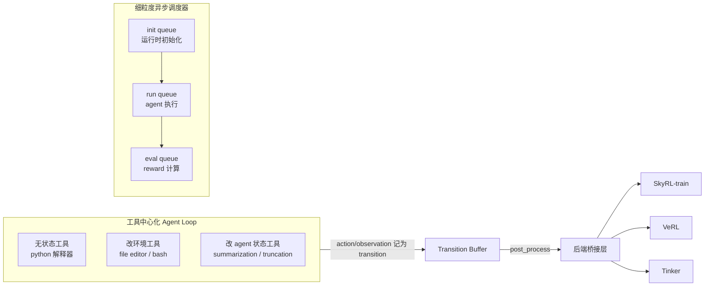

# SkyRL-Agent: Efficient RL Training for Multi-turn LLM Agent

> Berkeley/Anyscale/NovaSky 团队 SkyRL-v0 的后继工程化框架：把"运行时初始化/agent 执行/reward 计算"三阶段用可配置调度策略解耦，异步流水线相对朴素异步批处理再提速 1.55×；配合 AST 代码搜索工具，把 Qwen3-32B 训练成 SWE-Bench Verified 39.4% Pass@1 的 SA-SWE-32B，成本比同水平模型低 2×+。

## 元信息

机构：NovaSky AI、UC Berkeley、Anyscale / 发表：2025-11-20（arXiv v1）/ 链接：[arXiv](https://arxiv.org/abs/2511.16108) · [HTML](https://arxiv.org/html/2511.16108v1) · [Code](https://github.com/NovaSky-AI/SkyRL) · [模型](https://huggingface.co/NovaSky-AI/SA-SWE-32B) / 对比基线：SWE-agent-LM-32B（Claude 3.7 Sonnet 蒸馏）、SWE-Swiss、Kimi-dev（R1 蒸馏+RL，Agentless 脚手架）、DeepSWE（同数据集纯 RL）；框架层对比 VeRL-Tool、rLLM、GEM、Agent-Lightning [[skyrl-v0]]。

## 要解决的问题

已有 RL 训练框架（SkyRL-train、AReaL、VeRL、SLIME）把系统效率做到了设备放置、权重同步、并行策略这一层，Tinker 在此基础上抽象出微调/采样 API，但**"agentic rollout 编排层"**——如何生成、调度、评估大批多轮 agent 轨迹——仍缺统一方案，研究者各自为每个任务手搓异步 rollout、状态管理、训练框架对接的胶水代码，脆弱且难调试。论文提出框架应满足三个性质：(1) 灵活的工具/任务集成（无状态工具、改环境的工具、改 agent 自身状态的工具三类需要统一抽象）；(2) 细粒度 rollout 调度（intra-rollout：把一条轨迹拆成初始化/生成/评估几个阶段独立调度重叠；inter-rollout：全局调度顺序让 CPU/GPU 负载均衡）；(3) 训练后端无关（agent 设计、工具执行逻辑、训练后端三者解耦，同一套 agent 代码能跑在不同后端上）。Table 1 对比显示已有框架（VeRL-Tool、rLLM、GEM、Agent-Lightning）都绑定单一后端或只支持粗粒度 data-parallel 调度，且多是 Gym 风格（agent 自身状态管理在 `env.step` 之外用 ad hoc 代码维护）。

## 方法

SkyRL-Agent 由三个组件构成：

**工具中心化 agent loop**：agent 纯通过 OpenAI 风格 function call 行动，每个工具自带执行逻辑和运行时；已有 Gym 风格环境（如 R2E-Gym、OSWorld）可以把 `step()` 包成工具直接接入。三类工具（无状态/改环境/改 agent 状态）统一在同一套工具抽象下管理，而不是像 VeRL-Tool、rLLM、GEM 那样把 agent 自身状态管理放在 `env.step` 之外用 ad hoc 代码维护——这带来三个好处：agent/环境状态统一管理（context 管理这类"改 agent 状态"的操作也变得可学习）、多任务训练时不同数据集绑定不同工具集+验证器而无需改 agent loop、新任务接入只需提供工具实现+指令构造器+验证器三件套。

**细粒度异构调度（论文核心系统贡献）**：每条 rollout 被拆成三个阶段——① runtime initialization（工具运行时搭建）、② agent run（agent 通过工具执行动作）、③ reward calculation（结果评估）。调度器维护三个有界队列，按可配置策略在三阶段间路由任务，让 CPU 密集（初始化、评估）和 GPU 密集（生成）操作相互重叠。论文提供三种统一接口下的调度策略：**Async Batch**（全部轨迹并发启动，适合初始化和评估都轻量的场景，如 search-integrated reasoning）；**Async Batch (Bounded)**（限制并发池大小，适合需要限流保护运行时、或持久化资源可复用的场景，如 computer-use 里的长生命周期虚拟机）；**Async Pipeline**（用三个可独立配置大小的有界队列重叠 CPU 密集阶段与 GPU 密集推理，适合运行时或 reward 阶段开销大的任务）。在 SWE 训练场景，Async Pipeline 相对朴素的 Async Batch (Bounded) 带来约 **1.55× 加速**：Pipeline 方式下生成阶段 GPU 利用率稳定在约 90%，而 Async Batch (Bounded) 因运行时初始化和 reward 计算这类 CPU 密集操作阻塞 GPU 侧，利用率大幅波动、频繁跌落（Fig.1(b)，2×8 H100，batch size 64、8 rollouts/task）。这是 [[skyrl-v0]] 里"三阶段生产者-消费者流水线"思路的直接延续与量化验证，只是把"一种流水线"升级成"统一接口下的可配置调度策略族"。

**训练后端桥接**：采用 transition-based 设计——把每次 LLM 调用记录为独立 transition（输入 token、输出 token、log-prob），而非传统的 mask-based 拼接。好处三点：① 显式记录 log-prob 后可用 Flash-RL 等技术纠正推理引擎与训练引擎的数值不一致；② token 级输入输出保真，避免重新 tokenize 或文本后处理带来的 off-policy 漂移；③ 支持超越 mask 拼接的算法灵活性（动态摘要历史、插入结构化 prompt、跨轮切换 agent 角色）。对没有 context 修改的轨迹，系统自动退化为传统 mask 拼接方式（计算上打包共享前缀的 transition）。`post_process` 把结果转成统一中间格式，再各自适配 SkyRL-train / VeRL / Tinker 的具体输入结构，切换训练后端只需改配置不改 agent/任务代码。

**错误处理**：区分 terminal 错误（超上下文/超步数，直接终止 episode）和可恢复错误（解析失败、参数错误，向对话历史注入纠正性反馈让 agent 下一步自我修正）。

**SWE 训练配方**：用 SkyRL-Agent 训练 SA-SWE-32B（基座 Qwen3-32B，纯 RL，无蒸馏）。关键设计——**AST 代码搜索工具**：观察到 agent 在错误定位上表现差，主要原因是过度依赖逐文件浏览而不用 grep/find 类检索、且检索词不精确；受 LocAgent 启发实现支持模糊匹配+结构化模式搜索的 AST 搜索工具，并在搜索结果末尾附加"建议下一步搜什么"的上下文提示引导更精确的查询。论文强调这类工具增强对端到端 RL 训练至关重要：仅用 bash 的极简配置（如 Mini-SWE-Agent）在 R2E-Gym 数据上 64 条里 50 条不可解，稀疏延迟奖励下几乎学不动;工具增强配置则在 125 步内就达到或超过同规模已有模型的性能。评估时消融搜索工具，模型表现出涌现的"内化搜索行为"，性能基本不降——训练中搜索调用次数随训练进程稳步增加。**RL 算法与超参**：全 on-policy（batch size = mini-batch size = 64，8 rollouts/task），超出最大上下文（32K）或步数（50 轮）终止的轨迹在梯度计算时被 mask 掉（但不改奖励/advantage 估计，只是不参与梯度），采用 leave-one-out advantage 估计且**去掉 advantage 计算里的标准差归一化和长度归一化**（区别于标准 [[grpo]] 公式），禁用 KL 和 entropy loss，学习率 1e-6，Qwen3 chat template 改造以保留跨轮"thinking"连续性。**Hints 机制**：训练中注入结构化提示帮助 agent 从卡死循环、无效/不完整 function call、临近步数或上下文预算等失败状态里恢复，提升轨迹质量和有效训练样本比例。

## 实验与结果

**SWE-Bench Verified（Table 2，Simple ReAct 脚手架：仅 bash + file editor 两个工具，40K 上下文，最多 100 步）**：

| 模型 | 规模 | 训练方式 | Pass@1 | 训练成本（H100 小时） |
|---|---|---|---|---|
| Qwen3-32B（基座） | 32B | – | 24.4 | – |
| SWE-agent-LM-32B | 32B | Claude 3.7 Sonnet 蒸馏 | 38 | – |
| DeepSWE | 32B | 纯 RL，同 4.5K R2E-Gym 数据 | 36.4 | 9180 |
| **SA-SWE-32B** | 32B | 纯 RL，同数据 + 工具增强 | **39.4** | **4601** |

即同数据集下相对 DeepSWE 训练成本降低约 **50%**（9180→4601 H100 小时）且 Pass@1 更高 3 个百分点；SWE-Swiss（45.0）、Kimi-dev（48.6）用 Agentless 固定流水线上报的分数更高，但论文指出这些模型在本文 Simple ReAct 交互式评估设置下无法有效遵循 tool-call 指令，分数会显著更低，因此论文只引用其原始报告分数作参考、不认为严格可比。

**跨域泛化（Table 3，SA-SWE-32B 只在 SWE 任务上训练）**：Terminal-Bench（0.1.1 版，80 任务）13.75%→16.25%；BrowseComp-Plus（Avg. Turn）18.1→19.4；WebArena 3.68%→4.6%。训练过程中平均搜索调用次数从 3 次增至 4 次、平均轮数从 18 增至 25，说明模型学会更多依赖检索与迭代推理，这一趋势在 BrowseComp-Plus 上同样体现（尽管该任务从未在训练中出现）。

**其他 agent 案例研究（Section 5，验证框架可扩展性而非追求 SOTA）**：Deep Research agent（Qwen3-8B + GRPO，SkyRL-train 后端）：通用 verifier 下 12.6%→18.8%，gpt-oss-20b 判分下 9.2%→10.2%/11.0%（HLE-500）；工程教训——用本地部署 Qwen3-32B 做摘要器单次迭代耗时 2101.6s，换成 Qwen API 后降到 592.1s（约 3.5× 加速），最终改用 4× GH200 + 数据并行路由；同时需要对搜索结果做域名黑名单（Hugging Face/GitHub/GitLab/Chegg）防止评测答案泄露被检索到走"捷径"。Memory agent（Qwen3-8B 非思考模式 + Tinker 后端，LoRA rank 128）：RULER-HotpotQA 训练到 28K token、评估到 112K token 序列，用 GPT-5-nano 做验证器；对比 MemAgent 原文在 Qwen2.5-7B-Instruct 上报告 79.69% 准确率（batch 128、group 16，exact-match 验证器，训练设置不同不直接可比）。Computer Use agent（Qwen3-8B + GRPO，VeRL 后端）：仿照 ARPO 从 OSWorld 筛出 32 个 Hard/Medium/Easy 难度任务，用 Async Batch (Bounded) 调度器 + 32 个固定虚拟桌面环境，**把虚拟机作为 Ray remote task 启动，将 CPU 密集的环境反馈循环与 GPU 密集的模型生成解耦**；观察到训练奖励持续提升但验证准确率几乎不涨，说明任务对 Qwen3-8B 而言太难、学到的策略难以泛化出训练环境（与 ARPO 报告的类似现象一致）。

## 局限与疑点

- Table 2 里的横向对比作者自己承认"不同工作用不同脚手架和评测设置，数字未必严格可比"；SWE-Swiss、Kimi-dev 只引用原论文分数，未在同一 Simple ReAct 设置下重新跑分做严格对照。
- 1.55× 加速比只在 SWE 训练这一个具体工作负载下测得（2×8 H100，batch 64×8 rollouts），未给出该数字在其他任务（如更长/更短 rollout、不同 CPU:GPU 配比）下如何变化的敏感性分析。
- "leave-one-out advantage + 去掉标准差/长度归一化"这一算法选择缺少消融实验单独验证其对训练稳定性/最终性能的贡献，只作为整体配方的一部分报告。
- Computer Use agent 案例明确报告"训练奖励涨、验证准确率不涨"的负结果，论文未进一步分析失败原因（过拟合训练环境 vs 任务本身对 8B 模型过难），只归因于"任务太难"。
- Deep Research 的域名黑名单是一种被动补丁（发现泄漏后加黑名单），未讨论该方法的完备性或长期有效性。

## 对我们的启发

- **"统一接口下的可配置调度策略族"（Async Batch / Async Batch (Bounded) / Async Pipeline）比单一流水线更贴近我们平台的实际需求**：不同 agent 任务的 CPU/GPU 负载特征差异很大（reasoning 任务几乎不需要运行时初始化，computer-use 需要长生命周期虚拟机，SWE 需要跑测试这类偶发重负载），与其为每类任务单独设计调度器，SkyRL-Agent 的做法是把"运行时初始化/执行/评估"抽象成三个可路由的阶段，调度策略按任务特征选择——这个抽象本身可以作为我们平台"agent 训练环境执行服务"API 设计的直接参照，即把"环境准备-执行-评估"做成通用原语，调度策略作为可插拔配置，而不是任务粒度全部走同一种调度逻辑。
- **1.55× 加速 + 90% GPU 利用率是比 SkyRL-v0 的 4–5× 更保守但更可信的数字**：v0 的 4–5× 是相对"同步单批 rollout"这个明显低效的基线；本文的 1.55× 是相对已经异步化的 Async Batch (Bounded) 基线，说明"从同步到异步"的收益远大于"异步内部继续精细化调度"的边际收益——这提示我们平台做调度优化时应优先确保拿到"同步→异步"这第一档收益，再考虑精细化调度器带来的第二档收益，后者投入产出比更低。
- **训练前用小规模 rollout 探测任务难度、训练中用工具能力换取有效学习信号**这两点在 [[skyrl-v0]]、[[grpo]] 笔记里已经讨论过；本文的 AST 搜索工具补充了另一个角度——**给 agent 更好的工具本身也是提升 rollout 有效信号密度的手段**（工具增强让"64 条只解出 14 条"变成能在 125 步内收敛），这对我们如果要提供"agent RL 训练环境"托管服务是一个具体启示：环境/工具库的质量本身是训练效率的一等公民，不只是调度系统的事。
- follow-up 建议：
  1. 深入 SkyRL-Agent 开源代码，确认三种调度策略（Async Batch / Bounded / Pipeline）与队列大小配置的具体实现，评估能否直接抽象成我们调度系统的通用"环境准备-执行-评估"任务原语（呼应 [[skyrl-v0]] 笔记里同一条 follow-up）。
  2. Computer Use agent 案例里"虚拟机作为 Ray remote task + 环境反馈与生成解耦"是 [[rollout-training-disaggregation]] 模式在 GUI/OS 沙箱场景的又一实例，值得与 SkyRL-v0 的 Docker 容器场景、AWS EKS 的 GPU rollout/training 场景三者对比资源画像差异。
  3. transition-based 训练数据表示（token 级记录 + 自动退化为 mask 拼接）是否比我们现有的轨迹表示更适合支持"动态摘要/角色切换"这类非线性 context 管理，值得评估其对我们训练数据管道的适配成本。

## 相关

- 相关概念：[[agentic-rl-frameworks]]、[[async-rl-training]]、[[rollout-efficiency]]、[[rollout-training-disaggregation]]、[[grpo]]、[[agentic-rl-environments]]
- 相关笔记：[[skyrl-v0]]（同一 Berkeley/Anyscale/NovaSky 团队的前代博客，SkyRL-v0 提出"远程沙箱服务器 + 三阶段流水线"的原型，本文是其正式论文化、系统化版本：把流水线升级为可配置调度策略族，补上了 v0 缺失的量化对照实验（1.55× 加速、90% GPU 利用率）与完整训练配方；SkyRL-v0 笔记里的 follow-up 建议已在本文中得到部分回应）
- 母论文：无（`parent` 为空；本篇是阅读清单条目，与 [[skyrl-v0]] 是同团队前后两代工作而非严格的母子论文关系）
