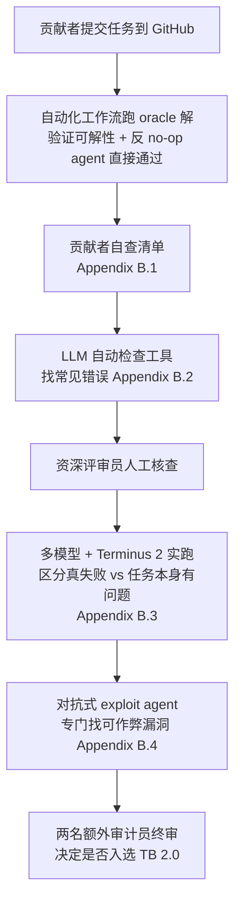

# Terminal-Bench: Benchmarking Agents on Hard, Realistic Tasks in Command Line Interfaces

> Terminal-Bench 2.0：89 个众包+三重人工审核的终端 agent 硬任务，把"任务 = 容器镜像 + 指令 + 终态测试 + oracle 解 + 时限"这套格式规范化为 [[harbor]] 任务格式的源头，前沿模型最高只解出 63%。

## 元信息

- 机构：Laude Institute 牵头（Terminal-Bench/Harbor 的创建方），联合 Stanford、Anthropic 等 40+ 机构，85 位作者、93 位社区贡献者的众包项目
- 发表：2026-01-17（arXiv v1，CC BY 4.0）
- 链接：[arXiv](https://arxiv.org/abs/2601.11868) · [项目页 tbench.ai](https://www.tbench.ai/) · 实验配置 [github.com/laude-institute/terminal-bench-experiments](https://github.com/laude-institute/terminal-bench-experiments/tree/main/configs/tb2)
- 对比基线：SWE-Bench 系列、SWE-Lancer、HumanEval、DevEval、τ-Bench、Berkeley Function Calling Leaderboard、WebArena、AppWorld、OSWorld、ReplicationBench、MLGym-Bench

## 要解决的问题

现有 agent 基准要么不测真实工作流（合成/玩具任务），要么已经饱和、测不出前沿模型的区分度。作者认为终端（terminal）是高技能、高价值工作（软件工程、科学计算、安全、机器学习）的通用接口，也是 Claude Code、Codex CLI、Gemini CLI 等主流 agent 产品的实际工作面（文中引用 Anthropic 口径 Claude Code 已有 \$1B run-rate 收入），但此前没有一个足够难、足够真实、且规范化到可以跨 agent/模型直接比较的终端任务基准。

## 方法

### 任务规范：五元组 + 终态验证

一个 Terminal-Bench 任务 = **指令（自然语言）+ Docker 镜像 + 一组测试 + 一份人工参考解 + 时间限制**。关键设计是**结果驱动（outcome-driven）**：测试只检查任务结束时容器的最终状态，不检查 agent 具体敲了什么命令或控制台输出——agent 可以用任意方式达成目标。这个规范后来被固化为 [[harbor]] 的任务格式（`instruction.md`+`task.toml`+`environment/`+`solution/`+`tests/`）并由 Harbor харness 执行，本文是这套格式的源头论文。

### 数据集构建：93 人众包 229 个任务，精选 89 个

任务作者需同时估计"初级工程师完成时间"和"领域专家完成时间"，并标注高层类别（软件工程最多，但也有"个人助理""视频处理"等非工程类别）。Table 1 显示专家估计里 48.6% 属于 <1 小时、47.3% 属于 1 小时–1 天，几乎没有专家也要 >1 周的任务；但按初级工程师估计，16.2% 需要 1 天–1 周，4.1%（3 个任务）需要 >1 周——其中 `fix-ocaml-gc`（修复一次失败优化后的 OCaml GC）专家要接近 1 天、初级工程师要 240 小时（10 天），体现该框架能表达真正长程复杂任务。

### 六阶段质量审核流程（Section 2.3, Figure 3）

三个验证标准贯穿全程：**specificity**（测试的充要性——通过当且仅当容器处于正确终态）、**solvability**（存在会让所有测试通过的 oracle 解）、**integrity**（不能靠不代表真实工作流的取巧手段通过，例如涉及 git 仓库某个 commit 的任务必须清除未来提交历史，防止 agent 直接看到"标准答案"式的未来状态）。平均每个入选任务获得约 3 个评审员小时的审核投入，93 位贡献者提交的 229 个任务最终只有 89 个入选。

### Terminus 2：中立评测脚手架（Appendix F）

因为 agent scaffold 之间差异巨大（有的用专门的文件编辑工具，有的直接把 agent 装进容器内用包管理器调用复杂程序），单独测模型能力很难脱离 scaffold 影响。作者做了 Terminus 2 作为中立基线：**唯一工具是一个 headless tmux 终端**，agent 只能靠发 Bash 按键序列操作（可以用 vim/emacs、方向键翻菜单、开多个 shell）。它还内置了一个**上下文摘要模块**，模型上下文打满时会调用 LLM 压缩历史，从而支撑需要数百万 token 的超长任务。

### Adapter 层：26 个外部基准统一接入

为了让任意 agent 能跑任意基准而不用为每个基准单独写接入代码，作者定义了 adapter 层：把外部基准（SWE-Bench Verified、MLE-Bench、Cybench、AlgoTune、AppWorld 等，见 Appendix D Table 5）的任务格式翻译成 Terminal-Bench 标准 schema，并要求做**平价实验（parity experiment）**——在原始版本和适配版本上跑相同 agent/模型多次，确认语义未被适配层破坏，通过验证才能合入。

### 实验设置

评测 6 个 agent scaffold（Claude Code、Codex CLI、Gemini CLI、OpenHands、Mini-SWE-Agent、Terminus 2）× 16 个前沿/开源模型，每个可行组合至少跑 5 次，累计 **32,155 次 trial**。执行用 [[harbor]] harness + Daytona 沙箱 provider，实验里并行跑 32–100 个容器。

## 实验与结果

- **最优组合 Codex CLI + GPT-5.2，解出 62.9%±3.0%**（Table 2），其后是 Terminus 2 + Claude Opus 4.5（57.8%）、Terminus 2 + Gemini 3 Pro（56.9%）；前 13 名全部是闭源模型组合。开源权重模型里最好的是 Terminus 2 + Kimi K2 Thinking（35.7%）。最小模型（GPT-OSS-20B）只有 3.1–3.4%。
- **模型选择通常比 agent scaffold 更重要**：Codex CLI 换成 GPT-5.2（vs GPT-5-Nano）解出率提升 52 个百分点；Gemini 2.5 Pro 配 Terminus 2 比配 OpenHands 高 17 个百分点。
- **成本与时长跨度极大**：跑完整个基准视模型定价从 \$1 到 \$100+ 不等；多数 trial 20 分钟内完成，但极端情况下单任务跑到 2 小时、上百次 API 调用、近 1 亿 token（Figure 10）。
- **turn 数/token 量与成功率几乎不相关**：episode 数与成功率相关系数 r=-0.028（p=0.916），输出 token 量与成功率 r=-0.170（p=0.515）——GPT-5-Nano 平均生成约 6 万 token 但只有 ~8% 成功率，verbosity 不代表更好的推理。
- **8 个月内 SOTA 翻倍**：Gemini 2.5 Pro 到 GPT-5.2 期间最高分接近翻倍（Figure 6），作者预计基准可能在一年内饱和。
- **人类预估难度与实测难度正相关但不完全一致**（r=0.436, p<0.001）：93.3% 人类标"hard"的任务模型也测出 hard；最大分歧出现在人类标"medium"但模型测出"hard"的任务（54.5%），多是需要创造性/对抗性推理的题目（如 XSS 过滤器绕过、Redcode 对抗策略）。
- **失败分类（MAST taxonomy 简化版：Execution/Coherence/Verification）**：Opus 4.5、GPT-5.2 等前沿闭源模型以 Execution 错误为主；开源模型 Qwen 3 Coder 的错误更均衡地分布在三类，且整体错误率更高。
- **命令级错误分析**：命令失败率从 9.2%（Grok 4）到 26.7%（GPT-OSS-120B）不等；3,800 个采样失败中，"调用不存在/不在 PATH 里的可执行文件"占比最高（24.1%），其次是"执行已存在程序时失败"（9.6%）。

## 局限与疑点

- 作者承认允许 agent 联网存在两个未解决风险：agent 理论上可搜到数据集直接读 oracle 解（目前数万条轨迹里未观察到，但需持续警惕）；模型厂商也可能把数据集训进语料，缓解手段仅是嵌入 Big-Bench canary string 防训练污染，未建私有测试集（作者明确留作 future work）。
- 联网依赖本身也损害可复现性：agent 可能调用外部 API 或下载会变化的包，机器资源/容器 runtime 差异也会让"同一任务"的有效环境产生偏差。
- 尽管有约三人时/任务的审核投入，作者仍明确承认部分任务可能不完全满足 2.3 节的验证标准——这正是后续 [[benchmark-item-validity-audit]]（对 Terminal-Bench 3 / Frontier-Bench 0.1 的独立审计）要系统化解决的问题，本文的六阶段审核是那套五分类审计方法论的前身，但本文自己没有做同等规模的事后再审计。
- 34 项高层结论建立在自报的"专家/初级工程师完成时间"上，这类主观估计本身没有做跨评审员一致性校验。

## 对我们的启发

1. **任务规范可以直接复用**：五元组（Docker 镜像+指令+终态测试+oracle 解+时限）+ 结果驱动测试（只查容器终态，不查命令序列）就是我们已经在用的 [[harbor]] 任务格式的源头设计。如果要给内部沙箱平台设计"agent 评测/RL 环境"标准接口，这套规范本身已经过一次大规模实践验证，可以直接对齐，不必重新发明。
2. **规模化评测对沙箱基础设施的具体压力点**：32,155 次 trial、32–100 容器并发、单任务最长 2 小时/近 1 亿 token——这是我们评估自己平台"能否撑起一次完整前沿模型评测跑"时的一组具体压力测试数字，尤其是要支持个别任务跑到 2 小时量级的超长会话而不被基础设施超时打断。
3. **质量审核流程值得搬进我们自己的环境构建流水线**：自动化 oracle 校验 → LLM lint 工具 → 人工评审 → 多模型 dry-run 区分"真失败"与"任务本身坏了" → 对抗式 exploit agent 找作弊漏洞 → 终审，这套六阶段流程可以直接套用到我们内部构造可验证奖励环境/评测集的场景，避免"通过率异常但不知道是模型不行还是环境/verifier 坏了"的问题（对应 [[benchmark-item-validity-audit]] 的诊断框架）。
4. **命令失败画像提示环境设计的一个坑**：命令失败最大来源是"调用了未安装/不在 PATH 里的可执行文件"（24.1%），说明基础镜像预装工具的完整度会直接混进"模型能力"信号里——我们自己搭 agent 训练/评测环境镜像时，工具缺失导致的失败应该被过滤掉，否则会把环境问题误判为能力缺口。

可执行的 follow-up：
- 对照精读 [[2609.26826]]（Terminal-Bench 3 / Frontier-Bench 0.1 审计），逐项比对本文 2.3 节六阶段审核与该文五分类有序验证 screen 的具体扩展关系。
- 查 Harbor 官方仓库确认 Terminus 2（tmux + 单一 bash 工具 + 上下文摘要模块）的具体实现是否已开源，能否直接拿来做我们内部环境的中立基线 agent。
- 调研 26 个 adapter 的 parity experiment 方法论细节，评估能否借用同样手法给我们自己的内部评测集和外部基准做等价性校验。

## 相关

- 相关概念：[[terminal-bench]]、[[harbor]]、[[benchmark-item-validity-audit]]
- 相关笔记：[[2609.26826]]（Terminal-Bench 3 生产记录审计，本文六阶段审核流程的后续延伸）、[[2609.26777]]（SWE-Serve，实际使用 Harbor 0.13.1 执行任务的案例）
