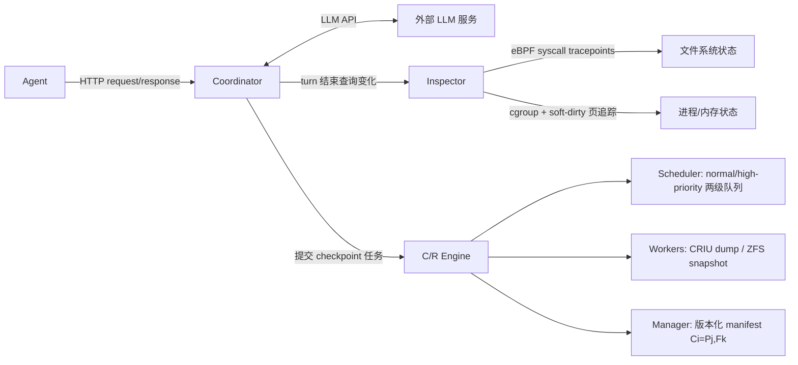

# Crab: A Semantics-Aware Checkpoint/Restore Runtime for Agent Sandboxes

> 用 eBPF 在 turn 边界上判断沙箱状态是否真的变了，只在"有变化"时按需做文件系统/进程/全量 checkpoint——跳过 75–87% 的空转 turn，checkpoint 和 LLM 等待时间重叠，recovery 正确率做到 100% 还把密度场景下的额外开销压到 1.9% 以内。

## 元信息

机构：HKUST（香港科技大学） / 发表：2026-04-30，arXiv v1，cs.OS / 链接：[arXiv](https://arxiv.org/abs/2604.28138) · 无公开代码仓库 / 对比基线：Chat-only、Chat+FS、Restart、Every-turn FullCkpt（CRIU+ZFS 全量），以及表 1 里定性对比的 Claude Code rewind、LangGraph、Docker、E2B（Firecracker）

## 要解决的问题

Agent 沙箱（容器/microVM）的状态不止是对话历史，还包括文件系统、长驻进程、已安装依赖等 OS 级状态。需要 checkpoint/restore（C/R）的四个场景：故障容错、spot/可抢占实例迁移、tree-based RL rollout 分支（如 Tree GRPO，从中间状态 fork 而非重跑共享前缀）、安全回滚（agent 把工作区搞坏后恢复到已知好状态）。

现有方案是两个极端：
- **应用层/框架层恢复**（Claude Code rewind、LangGraph 持久化）：只存对话或文件状态，丢失 shell 命令产生的进程状态、后台服务、已安装包等 OS 副作用——论文用故障注入实验量化：Chat-only 在 Terminal-Bench 上回放模式只有 6% 任务能正确恢复，真实 LLM 模式 28%；Chat+FS（加文件系统）回放 48%、真实 LLM 34%（§3.1，Figure 1）。
- **OS/VM 层全量 C/R**（CRIU、Firecracker 快照、Docker）：正确但"语义无关"——把每个 turn 都当作同等有状态处理。E2B（基于 Firecracker）单次快照开销 >4s；本文实测即使用更快的 ZFS（文件系统）+ runc/CRIU（进程）组合，100 沙箱/128 核主机下每轮全量 checkpoint 的到达速率中位数 17 req/s、p90 26 req/s，16 并发 128MB dump 需 1.3s，64 并发 1GB dump 需 47s（§3.2，Figure 2/3）——在高密度部署下无法扩展。

根本原因是**agent–OS 语义鸿沟**：agent 框架能看到工具调用，但看不到其 OS 级效果；OS 能看到文件/进程变化，但缺乏 turn 粒度的上下文来判断这次变化是否值得恢复。论文量化了这个鸿沟背后的稀疏性：Terminal-Bench 轨迹里 60.4% 的工具调用是 `run_shell_command`，工具签名完全无法区分"只是读文件"还是"装了后台服务"；12,483 条 shell 命令里只有 5.3% 带重定向、1.0% 用后台执行、16.2% 用管道，语法层面几乎看不出副作用（§3.3，Figure 4）。实测超过 75% 的 turn 不产生任何 recovery-relevant 的状态变化。

## 方法

Crab 是透明的 host-side runtime，不修改 agent 代码也不改 C/R 后端（CRIU、ZFS、runc），由三个组件构成：

- **Coordinator（控制面）**：以 HTTP 反向代理形式接在 agent–LLM 的请求路径上，天然获得 turn 边界（agent 向 LLM 发请求 = 上一个 turn 结束）。四个机制：(1) turn 边界检测并记录持久化对话日志；(2) 异步 checkpoint 派发——拦截到 outbound 请求后立刻查询 Inspector、提交 checkpoint 任务，这段时间正好和 LLM 推理并发，把 checkpoint 开销藏进"等 LLM 回复"的空档；(3) completion gating——LLM 响应回来时，若对应 checkpoint 还没完成就先 hold 住响应，直到 checkpoint 落盘才放行，保证下一个 turn 开始前恢复点已经持久化；(4) urgency signaling——如果 checkpoint 在 LLM 回复之后还没完成（说明已经暴露在关键路径上），把它从普通队列提升到高优先级队列。
- **Inspector（状态追踪）**：只负责"turn 产生了什么变化"，不负责决定何时 checkpoint。核心是**净变化（net-change）语义**：只统计相对上一次 checkpoint 之后**仍然存在的**持久变化,忽略 shell fork 短命子进程、同一 turn 内创建又删除的临时文件之类的瞬时效果，否则几乎每个 turn 都会被误判为"变了"。
  - 文件系统追踪：eBPF 挂在 `sys_enter`/`sys_exit` raw tracepoint 上,按文件粒度记录创建/删除/重命名/写入(排除 stdout 等特殊 handle),用户态 daemon 周期性从 BPF map 读取并计算净变化,checkpoint 完成后清空累积条目重置基线。
  - 进程/内存追踪:用 cgroup 界定沙箱内进程成员,记录进程创建/退出作为持久变化;存活进程则靠内核的 **soft-dirty 页追踪**(读 `/proc/PID/pagemap` 的 dirty bit)判断自上次 checkpoint 后是否写过任何虚拟内存页,checkpoint 完成后用 `/proc/PID/clear_refs` 清零 dirty bit。
  - Inspector 把每个 turn 分类成四档:跳过、仅文件系统、仅进程、完整 checkpoint。
- **C/R Engine（数据面）**:Scheduler 维护两级 FIFO 队列(normal/high-priority),用**反应式调度**而非预测 LLM 等待时长——因为等待时长事前不可预测,所以按"这个 checkpoint 的延迟是否已经暴露给 agent"这个可观测信号来决定优先级,不会饿死任何任务(每个任务最终都会在 LLM 响应到达时被提升,或在提升之前已经完成)。Workers 用 CRIU(经 runc)做进程 dump、OpenZFS snapshot 做文件系统快照(两者都是增量/CoW,ZFS snapshot 走块级 CoW)。Manager 把"文件系统 checkpoint"和"进程 checkpoint"解耦成可以独立产生的两类 artifact,用版本化 manifest $C_i=(P_j,F_k)$ 配对最新的进程态和文件系统态,并对 checkpoint 发布做事务化生命周期管理(pending→dumping→versioning→done/failed),避免恢复时用到不完整或不匹配的 artifact。

**两种部署模式的一致性处理**(§6):
- **agent-with-a-sandbox**(agent 在沙箱外,远程发命令,如 SWE-agent):沙箱崩溃时可能有命令"in-flight"未完成。Coordinator 在转发每条命令前先记进持久化对话记录,若恢复发生在命令完成前,检测到这条悬而未决的记录并对恢复后的沙箱重发该命令,对 agent 保持透明。
- **agent-in-a-sandbox**(agent 本身是沙箱内长驻进程,如 Claude Code/Codex):若把 agent 进程也纳入进程态追踪,几乎每个 turn 都会触发昂贵的进程 checkpoint,于是 Crab **把 agent 进程排除在追踪范围外**——但这会导致 manifest 里"文件系统态"和"agent 内存态"版本不匹配(比如 manifest 组合了 turn-2 的进程态 + turn-3 的文件系统态)。解法是**fast-forward 机制**:Coordinator 缓存所有历史 request-response 对,恢复后当滞后的 agent 重放它已经问过的请求时,直接从缓存返回合成响应而不转发给真实 LLM,逐步"快进"agent 的逻辑进度到 checkpoint head,期间不重新执行任何真实动作。

## 实验与结果

**环境**:AWS c6id.32xlarge(128 核、256GB、4×1.7TB NVMe,2.1M/1.1M 随机读写 IOPS);三组 agent/benchmark/LLM 配置——Claude-code+Terminal-Bench(Claude 4.6 Opus)、iFlow-cli+Terminal-Bench(iFlow-ROME)、SWE-agent+SWE-bench(MiniMax-M2.7)(Table 3)。每个 benchmark 采样 100 个该 agent 能无故障解决的任务,**确定性回放**录制好的 trace(排除 LLM 随机性对系统层测量的干扰)。

**正确性(Q1,§7.2)**:注入单次随机位置崩溃后,Crab / Restart / FullCkpt 三者在所有设置下都做到 100% 恢复正确率;Chat+FS 在 SWE-bench 上 100%(因为该 benchmark 主要看最终 patch,中间运行态不重要)但 Terminal-Bench 上只有 28%/42%(Claude-code/iFlow-cli);Chat-only 最差,Terminal-Bench 8%/13%、SWE-bench 9%。Inspector 在 2,063 个人工标注 turn 上的准确率(Table 4):进程变化检测 100% 准确、零 FP/FN;文件系统变化检测 98.3% 准确、2.3% 假阳性(FP 来自"写了又删"这类保守判定)、**零假阴性**——论文强调 FN 是唯一真正危险的错误类型,这里是零。

**端到端开销(Q1)**:16–96 沙箱/主机密度下,Crab 相对无故障执行的额外开销始终在 **0–1.9%** 以内。Restart 慢 1.52×(Terminal-Bench)/1.67×(SWE-bench);FullCkpt 在 SWE-bench 上还行(几乎全是文件系统 checkpoint,便宜),但 Terminal-Bench 上 64/96 密度时因宿主机 I/O 带宽争用分别慢 **3.06×/3.78×**,比直接 Restart 还差。Checkpoint 稀疏性(Figure 13):最高 87% 的 turn 被完全跳过;Claude-code 在 Terminal-Bench 上只有 5% 需要文件系统 checkpoint、8% 需要完整 checkpoint;SWE-bench 上约 25% 需要文件系统 checkpoint,几乎不需要完整 checkpoint。

**组件开销(Q2,§7.3)**:Coordinator 在 96 路密度下每 turn 开销仍是**几十微秒**(中位数 16–18µs,p95 27–40µs),比 LLM/工具延迟低 4–5 个数量级,占比 <0.02%。Inspector 延迟中位数 31–72ms(agent-in-sandbox 更高,因为还要追踪 agent 自身的 syscall),p95 全部 <200ms。Checkpoint 延迟呈明显双峰:文件系统 checkpoint 20–100ms,进程 checkpoint 700–1000ms,总体 p50/p95/p99 = 0.1/0.7/1.0s。

**机制有效性(Q3,§7.4)**:异步 checkpointing 让中位数暴露延迟为 **0**(超过一半任务的 checkpoint 完全在 LLM 等待窗口内完成),p95 暴露延迟在密度 16/32/64/96 下分别是 0%、0.37%、0.44%、3.65%。把 LLM 等待窗口人为压缩到 0.2×/0.4×/0.6× 做压力测试,反应式调度相对 FIFO 把中位数暴露延迟降最多 **41.6%**,p95 降最多 **31.3%**。

**Case study(Q4,§7.5,这是本文除故障恢复外最有意思的部分——把 C/R 暴露成 agent 可调用的工具)**:
- **主动回滚**:给 agent 一个 `sbx.rollback(ckpt)` 工具,替代脆弱的 shell 层自我修复。案例 A(QEMU 启动调试):baseline 52 步/434s,6 段回滚序列占 17 步、30.7% 墙钟时间、50% token(14.3K/28.7K),主因是一个杀不掉的 QEMU 进程占用端口导致反复 `kill -9` 失败卡住;换成 rollback() 后墙钟时间降 **29%**。案例 B(金融文档分类):3 段重复清理序列占 36% token,但因为这些步骤本身是纯文件系统操作、耗时不在清理本身而在"推理错误原因",墙钟时间只省 2.9%。
- **投机执行**:草稿模型(10× 快,~50% 接受率)在 fork 出的沙箱上先跑,oracle 模型并行算真实动作,一致则直接提交 fork、不一致则丢弃重跑——SWE-bench 上中位任务时间从 224.1s 降到 206.5s(**-7.9%**),误判代价中位数仅 2.2s(0.9%)。因为多数 turn 是无状态的,58.0% 的 fork 请求可以直接复用上一个 turn 的 fork、不用重新 clone+restore。
- **Spot 迁移**:60s 抢占预警窗口内,checkpoint+restore 中位数/p95 为 0.71s/1.00s;96 密度、共享 EBS(仅 500MB/s)、1–5 次抢占场景下相对无抢占基线只多 0.45–3.01%(中位数)/1.01–7.30%(p95)时间。
- **Tree-RL rollout 分支**:batch size 16、分支数 1–5(有效 batch 最高到 64)场景下,复用中间 checkpoint 而非重跑共享前缀,**rollout token 减少 40.0–64.2%**。

## 局限与疑点

- **评测以确定性回放为主**:§3.1 的"轻量恢复不正确"实验同时测了回放和真实 LLM 两种模式,但 §7 的主评测(正确性、开销、case study 的大部分)都用录制好的 trace 做确定性回放。这排除了 LLM 随机性对系统层测量的干扰,但也意味着"恢复后 agent 在真实 LLM 驱动下是否会因为环境微小差异而走上完全不同、甚至更差的轨迹"这一更贴近生产的问题没有被充分覆盖。
- **只注入单次随机崩溃**:所有正确性/开销实验都是每个任务注入恰好一次崩溃,没有测试多次崩溃、并发崩溃、或者 checkpoint 过程本身失败的场景。
- **eBPF 依赖与沙箱后端的兼容性未讨论**:Inspector 依赖 eBPF 挂 syscall tracepoint,前提是宿主机内核支持、且沙箱后端不会屏蔽 eBPF 可见性(比如用户态内核 gVisor 的 syscall 过滤机制是否会让这套追踪失效或需要改造,论文完全没提,这是我们如果要移植到非 runc/VM 后端时第一个要验证的问题)。
- **与 [[microvm-snapshot-uniqueness]] 的潜在交互未讨论**:CRIU 进程恢复/从 checkpoint fork 新沙箱(投机执行路径)理论上和"从同一快照克隆多实例"是同类风险——PRNG 种子、UUID、TLS 会话状态在 fork 出的沙箱间是否可能重复,论文完全没有涉及;虽然 Crab 的 fork 场景是单沙箱内串行 fork-提交/丢弃而非批量并发克隆,风险可能更小,但论文没有给出论证。
- **无公开代码**,所有机制细节(eBPF probe 具体实现、Scheduler 的具体阈值/参数)只能依赖论文描述,无法独立复现验证。
- Chat+FS 在 Terminal-Bench 上 28–48% 的正确率本身已经证明"文件系统级恢复仍然不够",但论文没有进一步拆解:在这些失败案例里,到底是因为丢失了进程状态、还是丢失了内存里的运行时上下文(比如解释器 REPL 状态),这两者对应的修复成本和工程优先级并不一样。

## 对我们的启发

- **"只在变化时 checkpoint"是比"分层快照"更激进的省成本方向,但代价是需要侵入式的内核级观测**:[[snapshot-layering]] 解决的是"同样要存快照,怎么存得更小、传得更快";Crab 解决的是"这次 turn 到底要不要存"。如果我们要在沙箱平台上做类似的选择性 checkpoint,核心投入点不是存储层优化,而是 eBPF/soft-dirty 这类低开销 OS 观测能力——这是我们目前架构里大概率缺的一层。
- **host-scoped 调度而非 per-sandbox 独立决策,是应对高密度场景的关键设计**:这和 [[sandbox-density-overcommit]] 里 DSec 的 sub-NUMA 分区、QoS 调度思路同构——高密度下任何资源消耗型操作(checkpoint 也是一种)都必须在主机级做统一调度,而不能让每个沙箱各自为政。Crab 的"反应式双队列"(是否已暴露在关键路径上)是一个值得直接借鉴的轻量调度规则,不需要预测 LLM 延迟分布。
- **把 C/R 暴露成 agent 可调用工具(§7.5 proactive rollback)是一个我们目前平台很可能没有的能力**:现有沙箱平台的 C/R 大多是运维侧(故障恢复、迁移)在用,Crab 证明把 `rollback()` 做成 agent 自己能调的 API,能直接省掉 agent 自己用 shell 命令笨拙"undo"的 token 和时间(案例 A 省 29% 墙钟 /案例 B 省 36% token)。如果我们的沙箱平台要支持这个能力,前提是 checkpoint 本身要快到 agent 愿意频繁调用——这反过来要求我们先有类似 Inspector 的轻量状态追踪,否则每次 rollback 都要配一次昂贵的全量 checkpoint,收益会被抵消。
- **Tree-RL rollout 的 token 节省数字(40.0–64.2%)和 issue 里 DeltaBox 的定位高度重叠,是两条不同的技术路线**:Crab 靠"减少 checkpoint 次数"省成本(大部分 turn 直接跳过),DeltaBox(据摘要,[[2605.22781]])靠"让每次 checkpoint 本身足够便宜"(14ms checkpoint / 5ms rollback,增量式 DeltaFS + DeltaCR)省成本——两者并不冲突,理论上甚至可以叠加(Crab 决定要不要 checkpoint,DeltaBox 的增量机制决定checkpoint 本身多便宜),值得在精读 DeltaBox(issue #113)之后专门写一节"捕获时机 vs 捕获粒度"的路线对比。
- Follow-up 建议(可转 issue):
  1. 精读 DeltaBox(#113)后,在 [[sandbox-checkpoint-restore]] 概念页补全两者的正面对比(目前只用摘要级信息做了初步判断,标注为待确认)。
  2. 调研 Crab 的 eBPF Inspector 方案能否移植到 gVisor/Kata 这类用户态内核或强隔离沙箱后端上——这类后端往往会拦截或重写 syscall,直接套用 raw tracepoint 方案可能失效,这是我们如果要借鉴这套设计必须先验证的前提。
  3. "把 rollback 暴露成 agent 工具"这个 case study 结论样本量很小(只有 2 个人工挑的案例),值得在我们自己的 agent 轨迹数据上跑一次更大规模的统计,看 token/墙钟收益是否稳定。

## 相关

- 相关概念:[[sandbox-checkpoint-restore]]（新建）、[[agentic-rollout-preemption]]、[[microvm-snapshot-uniqueness]]、[[agent-execution-sandbox]]、[[sandbox-density-overcommit]]
- 相关笔记:知识库内暂无同主题 C/R 笔记;DeltaBox（[[2605.22781]]，issue #113）为同方向对照论文，尚未精读，本文「对我们的启发」与 [[sandbox-checkpoint-restore]] 概念页里的对比均只基于 DeltaBox 摘要，待 #113 精读后补全核对
