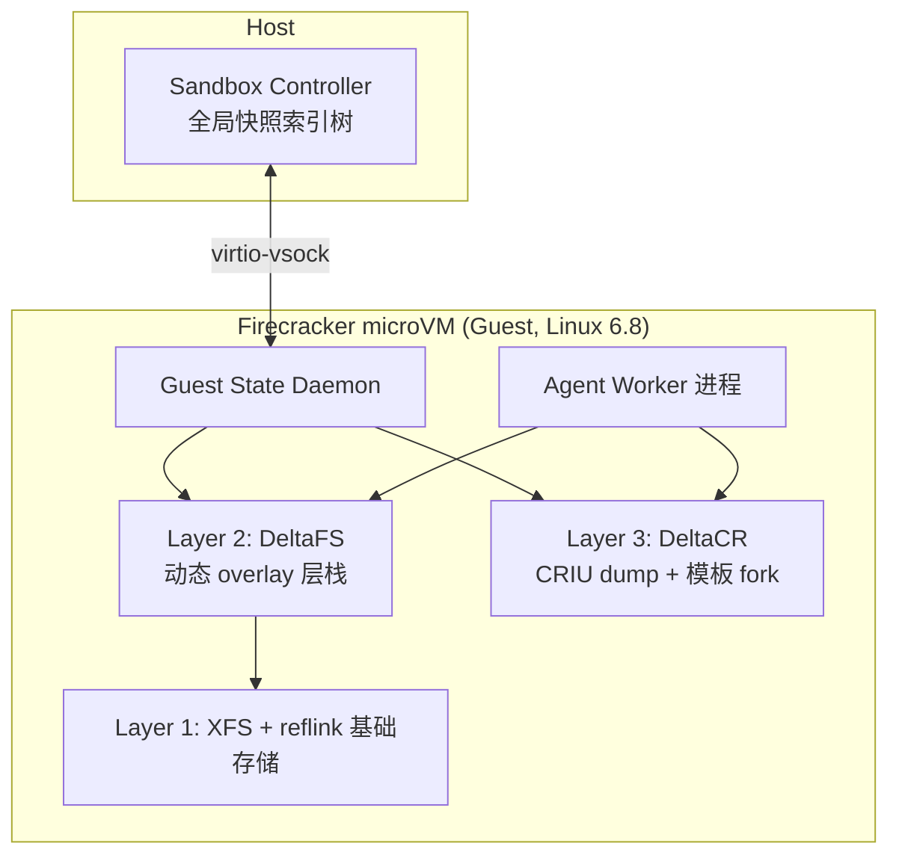

# DeltaBox: Scaling Stateful AI Agents with Millisecond-Level Sandbox Checkpoint/Rollback

> 上交 IPADS + 华为：把 agent 沙箱的 checkpoint/rollback 从"整份状态复制"改成"只存相邻两次 checkpoint 之间的增量"，文件态靠 overlayfs 动态插层、进程态靠 CRIU dump + 模板 fork()，checkpoint ≈10.83ms 藏在 LLM 推理窗口里、rollback ≈1.86ms。

## 元信息

- 机构：上海交通大学 IPADS（并行与分布式系统研究所）、教育部领域专用操作系统工程研究中心、华为技术有限公司
- 发表：2026-05-21（v1），2026-06-08 修订（v2），cs.OS / cs.AI
- 链接：[arXiv](https://arxiv.org/abs/2605.22781) · [HTML](https://arxiv.org/html/2605.22781v2)
- 对比基线：`replay+cp`（shutil.copytree + 命令重放）、`FC-Diff+dm`（[[firecracker]] 增量内存快照 + dm-snapshot）、`CRIU+cp`（copytree + 整进程 CRIU dump/restore）、E2B（开源版，内置 VM 级增量快照 pause/resume）、CubeSandbox（腾讯云，KVM\_PVM 定制内核的 clone）、[[2609.22978]]（DSec，只做 WAL 回放）

## 要解决的问题

Agent 的 test-time 搜索（MCTS/Tree-of-Thoughts/Best-of-N）和 RL 训练 rollout 都需要高频地把沙箱状态"存一下、退回去"：搜索要在树上频繁回溯到任意历史节点，RL 每个训练 step 要从同一个热启动状态并发 fork 出 $k$ 个独立 rollout。但沙箱状态是**文件系统态 + 进程态耦合**的整体——只回滚文件系统会让进程内存里还记着已经不存在的改动，只回滚进程会让它操作另一分支的文件（§2.2，论文称这为"coupling"问题，并在 §6 实验里验证了"只回滚文件系统而不回滚进程"会产生可观察的语义不一致）。

现有方案的问题被归纳为两条（Table 1）：
1. **文件态 C/R 慢**：Git stash/branch、`shutil.copytree`、Docker commit、Btrfs/LVM 快照都是按文件/目录整体复制，checkpoint 和 restore 都落在百毫秒到秒级。
2. **进程态 C/R 双向都慢**：已有沙箱大多只优化"restore（冷启动）"，把 checkpoint 当成一次性离线成本；E2B 的 checkpoint 要 ~4s/GiB RAM，CRIU 原生 restore 对多 GiB 进程要秒级——但 agent 需要 checkpoint 和 rollback 都在毫秒级、且在关键路径上。

论文的核心洞察（Key Insight）：**agent 相邻两次 checkpoint 之间的状态差异很小**（只有少量新文件或少量被改动的内存页），所以不该整份复制，只该存增量——但标准 Linux 内核/文件系统缺少支持这种"运行时动态分层"的机制。

## 方法

### 整体架构（StateManager + DeltaFS + DeltaCR）

三层：Layer 1 是真实文件系统（原型用支持 reflink 的 XFS，copy-up 靠 `vfs_clone_file_range` 克隆 extent 引用而非复制数据）；Layer 2 DeltaFS 管文件态；Layer 3 DeltaCR 管进程态；StateManager 跨 host（Sandbox Controller，维护与搜索树同构的快照索引树）和 guest（GSD，执行实际 C/R 动作）两层协调，保证每个 checkpoint 都是一致的 (文件系统, 内存) 配对。

### DeltaFS：运行时可重配置的 overlay 层栈

标准 Linux overlayfs 的层栈在 mount 时固定，改层必须 umount/mount，这对 agent 持有打开文件、且要高频 checkpoint 的场景不可行。DeltaFS 给 overlayfs 内核模块加了一个自定义 ioctl，在**不 umount 的前提下**重配置层栈：checkpoint 时把当前 upper 层改名降级为新的只读 lower 层、插入一个全新的空 upper 层，之后的写入自动变成对新 upper 的 copy-on-write；rollback 变成把层栈切回目标 checkpoint 对应的配置（层移除），时间复杂度 $O(1)$（§4.1）。

- **Lazy switch 处理跨 checkpoint 打开的文件**：每个文件系统维护一个 `checkpoint_gen` 计数器，inode 缓存自己上次解析时的代数；写路径比较代数，一致则走快路径直接写，不一致则重新按新层栈解析 inode、必要时 copy-up，用 per-inode mutex 保证原子性；并发 copy-up 竞争通过比较 backing mount 身份来解决（谁的代数新谁赢）。
- **XFS reflink 保证增量可控**：overlayfs copy-up 走 `vfs_clone_file_range`，reflink 让新 upper 文件先与源共享全部物理块、直到被覆写才真正分配新块（4KB 粒度）；rename 降级 upper 时 extent map 保持不变，reflink 可传递组合，因此一个跨 $N$ 次 checkpoint 都未被修改的 extent 只占一份物理块——这把"大文件的写放大"钳制为与文件大小无关的常数（而不是像某些方案重新物化降级层那样随 checkpoint 数线性增长）。

### DeltaCR：基于 CRIU + 模板 fork 的进程态 C/R

DeltaCR 建在 CRIU 之上，加了三个机制（§4.2）：

1. **模板池 + fork 快路径**：每次 checkpoint，GSD 既提交一次异步 CRIU dump（存到 tmpfs，作为慢路径兜底和灾难恢复），又让 agent 在下一个"静止点"（无 syscall 在途、文件未半写）自己 `fork()` 一次——主进程继续跑，子进程立即 `SIGSTOP` 注册为这个 checkpoint 的 _template\_k_，并被 reparent 出去以避免被后续 CRIU dump 带上。fork 只复制页表、不拷贝物理内存（页表级 CoW）。模板池容量有限（$N_{tpl}$），满了就 LRU 淘汰（SIGKILL），但淘汰只影响恢复延迟（退化到慢路径），不影响正确性，因为 CRIU 镜像仍留在磁盘。
2. **Restore 快路径 vs 慢路径**：目标 checkpoint 的模板还活着 → kill 当前进程、DeltaFS 层栈切换、`fork(template_k)` 产生新进程继续跑（低毫秒级，§3.3）；模板已被回收 → 走 CRIU `lazy-pages`（userfaultfd 按需调页，秒级）。
3. **Async-warm**：fork 后新进程与模板 CoW 共享全部页，第一次写会触发同步 CoW page fault；GSD 侧一个独立线程在后台用"读后写一字节"主动触发 CoW，把这些 fault 提前消化掉，不计入关键路径。
4. **Network Proxy Daemon（NPD）**：LLM SDK（openai/anthropic 等）会在进程里起后台 HTTP/2 连接池和线程池，这类长连接状态一旦被 fork 进模板会导致 socket 残留、连接池状态分裂、线程卡死在握手中。DeltaBox 把所有 LLM SDK 客户端搬到独立的 NPD 进程里，agent 只通过 FIFO token 和 NPD 通信，NPD 被排除在 CRIU dump 和模板 fork 之外。论文明确说明**不支持网络 I/O 的回滚**（会有外部副作用）。

### 一致性与垂圾回收

checkpoint 时异步 CRIU dump 和同步 DeltaFS ioctl 都观察同一个 SIGSTOP 静止瞬间，保证两者一致；CRIU dump 失败时 StateManager 主动回滚文件系统 ioctl，不留半态。针对 MCTS 场景，快照存储的垃圾回收用"reachability-aware"规则：只保留 UCT 还可能选中的非终止节点和保留给最终判别器的终止候选，其余回收——而不是简单按最近访问/访问次数淘汰（那样会导致 UCT 还握着某节点的 Q 值和访问计数，但该节点镜像已被删，造成"选中即恢复失败"的死循环）。

### 与 [[2609.22978]]（DSec）等方案的取舍（issue 精读重点）

- **Table 1 直接列出对比**：DSec 的 Ckpt/Restore 延迟列是"—/WAL replay"，Arbitrary Rollback 列是 ✗——论文 §2.3 原文批评："Agent sandboxes either lack event-level coupled rollback altogether (DSec only replays cached outputs from a write-ahead log, with no arbitrary rollback) or, like E2B, offer coupled, transparent C/R only through a VM-granular pause/snapshot at seconds scale"。即 DeltaBox 认为 DSec 解决的是"抢占后怎么重连"（见 [[agentic-rollout-preemption]]），而不是"任意回滚到历史状态"，两者是不同的问题，DSec 没有覆盖 DeltaBox 瞄准的 MCTS/BoN 式任意回溯场景。
- **VM 级快照（E2B、Firecracker 原生快照、CubeSandbox）的取舍**：Firecracker 原生快照只管 guest 内存+设备态，**不含块设备（文件系统）**，一致的文件系统回滚得另外做块设备快照（Table 1 脚注 ∗）；E2B 的 VM 级增量快照（dirty 内存页+dirty rootfs 块）虽然比"全量"快，但仍是 VM 粒度——一次 pause/resume 要 0.5–1.0s/事件（§6.2.1），且 VM 粒度意味着一个 VM 内不能对多条并发搜索分支分别独立回滚（一次快照会把 VM 内所有进程都捕获，§4.4）。CubeSandbox 的 CubeCoW 虽然做到了内存共享（克隆实例间共享未修改页，对应 [[snapshot-layering]] 讨论的"干净页共享"收益），但代价是需要非主线的定制 KVM\_PVM host 内核（host 需重建重启），不是 stock kernel（Table 1 "Stock host kernel" 列 CubeCoW 为 ✗，DeltaBox 为 ✓——因为 DeltaBox 的改动落在 **guest** 内核模块里，host 侧 KVM 不用改）。DeltaBox 走的是进程级 fork+overlay 层切换，天然支持"同一 VM 内多个独立可 checkpoint 的 agent 共享内核和只读基础层（经 reflink），回滚一条搜索分支不影响其它分支"。

## 实验与结果

硬件：四路 96 核/192 线程、760GB RAM 服务器；RL fan-out 实验额外用单节点 4×96GB GPU；DeltaBox 配置为 4 vCPU/8GB RAM 的 Firecracker microVM。

**MCTS 吞吐（Table 2，SWE-bench Verified 4 类代表性仓库：Django/SymPy/Scientific/Tools）**：
- DeltaBox 每事件 checkpoint 均值 **10.83ms**、restore 均值 **1.86ms**（加权平均，Weighted Avg 行）；对比 CRIU+cp（590.0ms ck / 811.4ms rs）、FC-Diff+dm（622.3ms ck / 3429ms rs）、E2B diff（524.4ms ck / 899.7ms rs）、replay+cp（347.0ms ck / 27694ms rs）。
- Restore 侧：E2B restore 是 DeltaBox 的 **~480×**，FC-Diff 是 **~1800×**，replay 是 **~15000×**。
- 端到端（Fig.6，30 轮 MCTS trajectory，Qwen3-Coder-30B）：DeltaBox 相对"LLM+action 理想时间"只膨胀到 **1.01–1.02×**，E2B (diff) 膨胀到 **1.30–1.93×**；状态管理占总时间比例 DeltaBox 为 **1–2%**，E2B 为 **23–48%**。

**RL fan-out（Table 3 + Fig.7）**：
- 原生内核 fork() 开销（无 VM/overlayfs/CRIU 基线，Table 3）：$N{=}1$ 时 p50 0.57ms，$N{=}64$ 时 p50 5.47ms/p99 14.74ms，吞吐 165.9 forks/s，aggregate RSS 679.4MB——子进程继承页表级 CoW，单个 fork 本身不是 $N{=}64$ 规模下的瓶颈。
- 子系统级 fan-out（Fig.7a）：DeltaBox 比 CubeSandbox 和 E2B **快一个数量级以上**（$N\in\{1,4,16,64\}$ 全范围）。
- **GPU 占用率（Fig.7c，issue 精读重点）**：在 $N{=}16/64$、Qwen2.5-7B LoRA 训练配置下，_expected sync GPU occupation_ $= (T_{gen}+T_{train})/(\text{sandbox}+T_{gen}+T_{train})$——DeltaBox 维持 **95–97%**，CubeSandbox **77–80%**，E2B 仅 **29–36%**。即同步 RL 训练下，sandbox fan-out 延迟直接变成 GPU 空闲时间，DeltaBox 把这部分浪费压到接近零。
- **与异步训练框架的交叉验证**：对标 verl/OpenRLHF 这类靠"训练与 rollout 异步解耦容忍 staleness"的生产系统（verl 阈值 <1），论文换算三者的 staleness 指标：$N{=}16$ 时 DeltaBox 1.67、CubeSandbox 2.25、E2B 6.13（三者都超阈值，DeltaBox 离阈值最近）；$N{=}64$（$T_{train}$=4.51s 更长）时 DeltaBox 降到 0.81（回到阈值内），CubeSandbox 1.25、E2B 5.04 仍超阈值。

**C/R 延迟分解（Table 4）**：checkpoint 的 10.83ms 里，fork（模板创建）占 8.87ms 是主项，DeltaFS ioctl 只占 0.07ms（并发执行，不是瓶颈），CRIU dump 异步、不计入 agent 感知延迟（故 checkpoint 对 agent 是 **0ms** 阻塞）；restore 快路径 1.86ms（fork 1.34ms + ioctl 0.19ms），慢路径（CRIU lazy-pages）9.29ms。

**写放大（Fig.9）**：ext4 与无 reflink 的 XFS 完全重叠，每次编辑按文件大小整体重新复制，线性增长；reflink 让 copy-up 字节数基本不随文件大小变化（真实 swe-search 编辑只改文件的一小部分）；物理 I/O 上 XFS 元数据效率在小文件（1–8KB）占主导（132KB→26KB），reflink 块共享在大文件（128–256KB）占主导（315KB→141KB）。

**其它消融**：轻量级 checkpoint（跳过只读/幂等动作的 CRIU dump，仅记元数据标记）在 1689 个事件里 62.0% 走这条路径；reachability-aware GC 比"保留所有 checkpoint"减少末态存储 **46–63%**（9 条 SWE-bench 轨迹）。

## 局限与疑点

- **网络 I/O 不支持回滚**：论文明确承认（§4.2.3），一旦 agent 的动作产生了外部网络副作用（调了真实 API、改了远程状态），rollback 只能回滚本地文件/进程态，无法撤销已发出的网络请求——这对"agent 调用有副作用的外部工具"场景是一个结构性限制，不是实现细节问题。
- **RL fan-out 的克隆唯一性问题未被讨论**：Fig.7(b)(c) 测的是从同一个"冻结源"连续 fork 出 $N$ 个子进程做并发 rollout——这正是 [[microvm-snapshot-uniqueness]] 页讨论的"多个克隆实例共享完全相同内存状态"场景（PRNG 种子、请求 ID 等本该唯一的值可能重复）。论文全文没有提到对 fork 出的子进程做任何重新播种/身份重置处理，这是一个论文未覆盖、但我们若照搬这套机制做 RL rollout fan-out 时必须自己补上的风险点。
- **评测环境单一**：全部实验在一台四路服务器上完成，没有多节点/跨机调度场景的数据；GPU occupation 的"expected"字样（Fig.7c 标题）提示这是从 (a)(b) 两组独立测量换算出来的理论值，不是真实同步训练 loop 里端到端测的墙钟数字。
- **CubeSandbox 对比的公平性**：CubeSandbox 需要定制 `KVM_PVM` host 内核（非 mainline），DeltaBox 的改动在 guest 内核模块里——两者"改动位置"不同，直接比延迟数字时这一部署成本差异值得留意（论文自己在 Table 1 脚注里也点出了这一点，不是我们额外发现的问题）。
- **DeltaCR 是 ~1200 行 Python 编排 CRIU/模板池/async-warm/NPD**，关键路径上的协调逻辑用 Python 实现，§5 未讨论 Python 自身的 GIL/调度抖动是否会在更高并发下成为新的尾延迟来源（Table 2 的 p99 数字目前看起来还可控，但论文没有专门做这方面的压力测试）。
- 与 Crab（[Wu et al., 2026]，论文自己提到的同期相关工作）相比，DeltaBox 聚焦"把 OS 级 C/R 原语做到毫秒级"，没有 Crab 的"用 eBPF 判断该不该 checkpoint"这类语义感知粒度控制；论文自己承认两者互补，但没有给出整合后的数字。

## 对我们的启发

1. **"进程级 fork + overlay 动态分层"是比"VM 级快照"更细粒度、更快的 checkpoint/rollback 路线，值得作为我们冷启动/回滚能力的候选补强点**：如果我们的沙箱平台目前做 checkpoint/rollback 是靠 Firecracker 原生快照或整份目录复制，DeltaBox 的核心对比数字（restore 1.86ms vs. E2B 899.7ms、CRIU+cp 811.4ms）说明"VM 粒度"和"进程粒度"中间有两个数量级的空间——尤其是如果我们有 agent test-time 搜索（MCTS/BoN）或类似 tree search 的产品需求，这条路线直接对口。
2. **RL rollout fan-out 的 GPU 占用率数字（95–97% vs. 29–36%）给了一个具体的"sandbox fan-out 延迟 = GPU 空闲时间"量化模型**：$(T_{gen}+T_{train})/(\text{sandbox}+T_{gen}+T_{train})$ 这个公式本身就是一个可以直接套用到我们自己训练系统的评估框架——如果我们的 rollout fan-out（无论是容器还是 microVM）延迟占比明显，换算后的 GPU 浪费可能比想象中更显著，值得先用这个公式估算一下我们当前的数字量级。
3. **"文件态 + 进程态耦合一致性"是容易被忽视的正确性坑**：论文验证了"只回滚文件系统而不回滚进程"会产生语义不一致（§6），这提示我们如果平台只做了文件系统层面的 checkpoint/rollback（比较常见、实现简单），在真正需要"backtrack 到历史某一步继续跑"的场景下可能已经隐藏了正确性问题,只是还没被观测到。
4. **克隆唯一性风险需要我们自己补**：如果要借鉴 DeltaBox 的"fork 多个子进程做并发 rollout"模式，必须同步考虑 [[microvm-snapshot-uniqueness]] 页描述的 PRNG/UUID 重用问题——论文没做这件事，不代表这件事可以忽略，而是我们落地时的一个必答项（比如 `MADV_WIPEONFORK` 之类对 fork 场景原生存在的机制是否足够，还是需要额外的重新播种 hook）。
5. Follow-up 建议（可转 issue）：
   - 调研 Crab（eBPF 语义感知 checkpoint 粒度判断）与 DeltaBox 整合的可能性,看是否有后续论文给出整合后的数字；
   - 评估我们现有存储栈是否具备 XFS reflink 或等价的 block-level CoW 能力（这是 DeltaFS 写放大优化的物理前提）,如果没有,这条路线的收益会打折扣;
   - 用本文的 GPU occupation 公式,结合我们现有 rollout fan-out 的实测延迟,估算一次我们自己的"sandbox 延迟→GPU 浪费"量级，判断这项优化的优先级。

## 相关

- 相关概念：[[sandbox-checkpoint-rollback]]（新建）、[[microvm-sandbox]]、[[firecracker]]、[[snapshot-layering]]、[[microvm-snapshot-uniqueness]]、[[agentic-rollout-preemption]]
- 相关笔记：[[2609.22978]]（DSec，被本文在 Table 1/§2.3 直接批评"只能 WAL 回放、不能任意回滚"）
