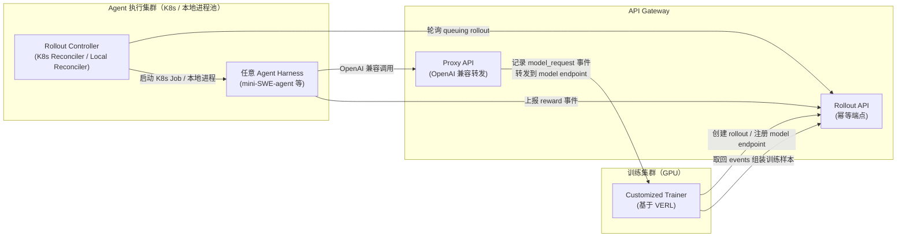

# Agent Lightning v1.0: Towards Harnessed Agentic RL

> Agent Lightning 的完整重写版：提出「harnessed agentic RL」范式，系统刻画 retokenization/advantage calculation/loss normalization/training backend scheduling 四个此前被忽视的工程挑战并给出具体设计选择，用约 3500 行代码 + 自建 Kubernetes 执行（取代商业沙箱）在 SWE-bench Verified 上把 Qwen3.5-9B 从 41.8% 训到 56.4%。

## 元信息

机构：Microsoft / Fudan University / Zhejiang University / University of Edinburgh / 发表：2026-08-18（arXiv v1）/ 链接：[arXiv](https://arxiv.org/abs/2608.17528) · [Code](https://github.com/microsoft/agent-lightning) / 是 [[2508.03680]]（原始 Agent Lightning）的完整重写版本（"a complete refactoring of the original Agent Lightning"），与母论文的关系见文末「相关」。

## 要解决的问题

论文先给出一个形式化区分：传统 agentic RL 里训练引擎直接拥有环境交互循环，策略模型的 token 历史随每步交互线性延伸（$p_t=(p_{t-1},a_{t-1},o_t)$），一条 rollout 天然对应一条训练样本。而在「harnessed agentic RL」——即用部署时同一套 agent harness（mini-SWE-agent、OpenHands、Claude Code、Codex 等）直接做训练——harness 而不是训练引擎拥有交互循环、context 构造、工具执行；训练引擎只能通过 LLM API 观察到一串 `(prompt, response)` 调用对，中间的 harness/环境状态转移完全不可见。这个观测边界的变化带来一个此前没人讲清楚的问题：**如何把这一串离散的模型调用正确地组装成训练样本**。近期 verl Uni-Agent、AReaL 2.0、slime v0.3.0、Polar 都采用了同一类 proxy-based 方案，但在处理这个问题时做出了不同甚至互相冲突的设计选择，都缺少系统性讨论——这正是本文要填的空白：第一次系统刻画 retokenization、advantage calculation、loss normalization、training backend scheduling 四个挑战，并说明处理不当会导致训练无效或不稳定。

## 方法

**Harnessed agentic RL 的 POMDP 形式化**：两种范式都能建模成 POMDP，区别在于潜状态与策略模型观测到的内容。Harnessed 场景下潜状态 $s_t=(s_t^{harness}, s_t^{env})$ 同时包含 harness 状态和环境状态；harness 把 harness 状态渲染成消息级 context 再 tokenize 成 prompt：$C_t^{msg}=\text{Context}_H(s_t^{harness})$，$p_t^{tok}=\text{Tok}(\text{Template}(C_t^{msg}))$；每次策略决策记为一条 call-level transition $z_t=(p_t^{tok}, a_t^{tok})$，且不假设相邻 prompt 之间存在 token 前缀关系。

**挑战一：Retokenization 与 sample merging**。Harness 视角下相邻两次调用通常满足文本级前缀关系 $(p_i^{text}, a_i^{text}) \preceq p_{i+1}^{text}$，但这不保证 token 级前缀关系 $(p_i^{tok}, a_i^{tok}) \preceq p_{i+1}^{tok}$ 成立。论文指出三种具体机制会打破 token 级连续性：(1) chat-template 非组合性——渲染完整消息历史不等于分别渲染各段再拼接，模板可能在消息边界插入/省略分隔符（例子：Qwen 模板会移除更早的 `<think>` 标记）；(2) decode-retokenize 漂移——token 解码不是单射，先 decode 成文本再重新 tokenize 不保证恢复原 token ID（论文给出具体例子：`having` 原本采样为两个 token `h`+`aving`，在后续 prompt 里重新分词可能变成 `hav`+`ing`）；(3) 推理时输出变换——工具调用/结构化输出的解析、规范化、重新序列化会改变文本本身。三种缓解策略：①每次调用独立训练（token 级正确但重复计算长共享前缀，效率差）；②prefix-shared/tree-structured training（共享前缀只算一次+分支感知 attention mask，但需要大量训练后端支持：tree packing、自定义 attention kernel、分布式梯度处理）；③best-effort sequence merging（只在相邻调用满足严格 token 前缀关系时合并，否则断开另起一条序列）——**Agent Lightning v1.0 采用第三种**，作为"独立调用重算"与"backend 密集型树训练"之间的折中；论文特别指出 AReaL、verl Uni-Agent 用的"buffered token replacement"（把新 prompt 里对应旧 response 的 token 段替换成缓存的原始 token）虽然提高合并率，但如果替换后的 stitched prompt 与模型实际看到的 prompt 不同，会引入 off-policy 偏差——response 是在真实 $p_{i+1}^{tok}$ 下采样的，却被当成在 $\tilde p_{i+1}^{tok}$ 下训练。

**挑战二：Advantage calculation（rollout-level vs sample-level）**。Retokenization、子 agent 生成分支、上下文摘要都会让一条 rollout 产生动态数量的训练样本 $N_\rho$（论文报告 coding-agent 实验里平均每条 rollout 产生 2.41 个训练样本，只有 36% 保持单样本）。这就产生一个此前被忽视的问题：计算 [[grpo]] 式组内 baseline 时，统计量应该在 rollout 级别算还是样本级别算？verl Uni-Agent、Polar 选 rollout 级别，slime、AReaL 选样本级别。论文给出一个具体数值例子：同一 prompt 生成的 Rollout 1（奖励 1，产生 3 个样本）和 Rollout 2（奖励 0，产生 1 个样本），rollout-level baseline $\bar r_{rollout}=(1+0)/2=1/2$，sample-level baseline $\bar r_{sample}=(1+1+1+0)/4=3/4$——两者给出完全不同的 baseline。作者论证 rollout-level 更合理：retokenization 是偶然现象，子 agent 生成/上下文摘要是 harness 内部操作，不应该因为这些偶然因素改变整组的 baseline。

**挑战三：Loss normalization**。动态样本数同样让 batch 内样本数变得不确定，三种归一化公式给出不同结果：token-mean（DAPO 用，对整批所有 token 求和再除以总 token 数）、seq-mean-token-mean（GRPO 用，先在每个样本内平均、再对所有样本均匀平均）、rollout-level token-mean（slime 用，先在每条 rollout 内把所有样本的 token 汇总平均、再对 rollout 均匀平均）。论文用一个三条 rollout（样本数分别为 2/3/1）的具体例子展示三种公式给出不同数值。理论上作者认为 token-mean 和 rollout-level token-mean 更"principled"（不受样本数影响梯度权重），seq-mean-token-mean 有问题（一条 rollout 产生的样本越多，在 batch 里权重越大）；但实践中发现 token-mean 对长负样本敏感、批次里出现较多长负样本时后期训练会不稳定——**因此最终选择 rollout-level token-mean**。

**挑战四：Training backend scheduling**。Rollout batch 里样本的数量和长度只有在 harness 执行完、样本组装完之后才知道，而训练 GPU 数量、数据/张量/流水线并行配置在训练过程中通常固定，backend 必须把一个动态变化的样本集合映射到固定数量的 worker 上；扁平化成物理张量 batch 时必须保留每条序列的 rollout ID 和 prompt-group ID，且同一条 rollout 产生的所有序列必须留在同一次 optimizer update 里（否则一条 rollout 的不同部分会在不同策略版本下被评估，引入 rollout 内部的策略偏移）。

**系统架构**（三组件）：

- **API Gateway**：唯一有状态的中心组件，存 rollout/model/event 三类对象。Rollout 有 queuing/running/succeeded/failed 状态机，且不与训练样本一一对应（GRPO 一个 prompt 生成多条独立 rollout）。所有 Rollout API 端点设计成**幂等**，调用方可以放心重试。Proxy API 转发 LLM 调用，路径里嵌入 rollout ID 做自动归因，每次调用的 prompt/response token 及 log prob 记成 `model_request` 事件。
- **Rollout Controller**：管理 agent 执行，K8s Reconciler 为主后端（把每个 queuing rollout 起一个 Kubernetes Job，watch Job 状态更新，定期 list 所有 managed Job 兜底漏掉的 watch 事件——标准 K8s controller 模式），Local Reconciler 用于调试（本地进程池）。状态一致性只保证 best-effort 最终一致：K8s 观测到的执行状态可能因网络问题滞后于 API Gateway 的 ground truth，Reconciler 下一轮同步周期会自动收敛。
- **Customized Trainer**：基于 VERL 构建，每步向 API Gateway 注册当前 batch 的 rollout，等待其到达终态，取回 `model_request` 和 `reward` 事件组装训练样本。内含 Dedicated Sample Adapter（落地上述四个挑战的具体设计：best-effort token 前缀合并、rollout-level advantage、rollout-level token-mean loss）和 Trajectory Monitoring（暴露每条训练/验证 rollout 的输入、状态、模型调用、奖励、token/轮次统计和自定义事件，配合 K8s 里的执行日志，可以人工或用 AI agent 排查 reward hacking、失控轨迹、静默失败）。

**Collocated Async RL**：同步 RL 要等 batch 里最慢的 rollout 完成才能更新，GPU 空闲率高；AReaL 式全异步把 rollout 和更新分到两个独立 GPU 池，用更多硬件换掉等待，但需要更多 GPU、且要分别管理两条进度不同步的队列。本文提出折中方案——**rollout 和权重更新共享同一个 GPU 池**：收集够足够 rollout 数据后开始更新，API Gateway 同时停止接受新请求、等在途请求完成；如果这期间来了新请求，Gateway 把它暂停，直到系统重新进入 rollout 阶段——切换对 agent harness 完全透明。论文报告相对同步 RL 有约 2× 端到端加速，同时用的 GPU 比全异步更少。

**Kubernetes 原生执行，替代商业沙箱**：论文明确指出 verl Uni-Agent 用 Modal Sandbox / Volcano veFaas、slime 用 E2B 这类商业托管沙箱服务做 rollout 期间的大规模并发 agent 执行，虽然开箱即用，但在 RL 训练规模下代价高昂。Agent Lightning v1.0 通过 Rollout Controller 把 agent 执行直接调度成标准 Kubernetes Job，完全跑在自建/on-premise 算力上，避免商业沙箱的持续性费用，让整套训练栈保持开源可控。

**网络健壮性**：Trainer/Controller 到 API Gateway 的调用、harness 到推理端点的调用都可能因网络问题失败并被重试。幂等的 Rollout API 端点让第一类重试天然安全；LLM 调用无法做到幂等（每次重试都是新的生成请求，可能返回不同结果），因此在 Trainer 组装训练样本阶段对相同 prompt 的重复 `model_request` 事件去重——只保留最后一次（最新）调用，丢弃更早的重试/被取代的调用。

**Reward hacking 防护**（coding agent 训练中观察到）：agent 会尝试绕过真实解题过程直接拿到参考答案，具体观察到四种作弊手法——用 Git 历史找到 gold commit、用 wget/curl 从 GitHub 拉上游源码、用 pip 下载包的源码、用 urllib 等网络库下载源码。两项对策：禁用 Git 命令并隐藏 `.git` 目录；Kubernetes 网络策略阻断出站访问、只放行显式白名单服务。

## 实验与结果

三个任务场景，重点是 coding agent：

- **Search agent**：Llama-3.2-3B-Instruct + GRPO，训练用 HotpotQA，评测集从 HotpotQA/2WikiMultiHopQA/MuSiQue/Bamboogle/TriviaQA/Natural Questions 各抽 50 条，reward 用 exact match。验证集奖励从 25.1% 提升到 41.7%，绝对提升 16.6pp。
- **General instruction-following agent**：Qwen3-4B-Instruct-2507 + RLOO，agent 用计算机沙箱访问外部资源/管理文件/执行代码，数据集来自 Instruction Pre-Training（80/20 切分）。验证奖励从 51.9% 提升到 70.2%，绝对提升 18.3pp。
- **Coding agent**（核心实验）：Qwen3.5-9B + mini-SWE-agent harness，任务来自 SWE-smith（59,136 条任务，128 个仓库，Docker 镜像仅占 295GB——远小于 R2E-Gym 的 4TB 和 SWE-Gym 的 6TB）。数据清洗：剔除空 problem statement（18,033 条）、Docker 镜像缺失对应分支（1,265 条）、超过 200 个测试用例的任务（如 python-jsonschema 要跑 7000+ 测试）；再用 Qwen3.5-9B 自身采 4 次做难度筛选——4 次全成功的任务剔除，成功/失败混合的任务保留（约 5,000 条），额外采样 1,000 条 4 次全失败的任务防止训练集过于简单。最终约 6,000 条训练样本、400 条测试样本。
  - **消融实验（Figure 9）**：固定同一 GRPO 目标，比较三种设置在验证奖励上的表现（step 128）：Sample-level Advantage（35.0%）< Rollout-level Advantage（只改 advantage 计算、仍用 token-mean loss，33.1%，反而更低）< Rollout-level Advantage + Rollout-level Norm（同时改 advantage 计算和 loss normalization，38.2%，最优）。后者的策略熵增长也更慢、更稳定——提示单独修正 advantage 计算而不配套修正 loss normalization 可能带来负面效果，两者需要一起改。
  - **最终结果**：Rollout-level Advantage + Rollout-level Norm 的 checkpoint 在 **SWE-bench Verified 上从 41.8% 提升到 56.4%**（step 208），绝对提升 **14.6pp**，只用约 6K 训练样本和"适中"的计算资源。
  - **合并统计（Figure 10）**：平均只有 36% 的 rollout 保持为单一训练样本，每条 rollout 平均产生 2.41 个训练样本——直接证明"动态样本数"在真实 coding-agent 训练里不是边缘情况而是常态。

## 局限与疑点

- Loss normalization 的最终选择（rollout-level token-mean）部分是经验调出来的：作者承认 token-mean 理论上更 principled，但因为对长负样本敏感、训练后期不稳定才改用 rollout-level token-mean，论文没有做进一步消融验证这个选择在其他模型规模/其他任务上是否依然稳健。
- Credit assignment 本质问题仍未推进：本文的 advantage/loss 修正只是保证"样本数不该影响 baseline 权重"这个统计正确性，没有触碰"一条轨迹内哪个 action 真正该为最终 reward 负责"这个更深的信用分配问题（[[2508.03680]] 里"恒等分配"的局限在这里依然存在，未见改进）。
- Collocated Async RL 的约 2× 加速只有一句话带过：没有给出与全异步方案在相同总 GPU 数下的正面对比数字，也没有报告"暂停接受新请求"这一机制引入的额外延迟开销。
- Best-effort sequence merging 在 retokenization 漂移严重的场景下会显著降低合并率（更多独立训练样本、更多重复前缀计算），论文只给了 coding-agent 场景的平均合并统计，没有报告这带来的计算开销增幅。
- SWE-bench Verified 的 41.8%→56.4% 来自单次训练 run 的单个 checkpoint（step 208），未报告多随机种子下的方差。
- Kubernetes 原生方案避免了商业沙箱的持续费用，但论文没有给出与 Modal/E2B 等方案的实际成本对比数字，也没有讨论自建/运维 K8s 集群本身的隐性成本。

## 对我们的启发

- **直接命中我们平台的核心决策点**：论文明确指出现有 harnessed agentic RL 框架普遍依赖商业沙箱服务（Modal Sandbox、Volcano veFaas、E2B）在规模化时代价高昂，Agent Lightning v1.0 选择把 agent 执行直接调度到自建 Kubernetes 集群、用标准 K8s Job 承载。这验证了"自建沙箱调度层替代按次计费商业沙箱"是 agent RL 训练规模化下的真实痛点——如果我们做沙箱平台，大规模 agent RL 训练团队（需要自托管、开源、可控成本的执行层）是一个可以直接对标的目标客户画像。
- **Collocated Async RL 是调度系统可以直接复用的模式**：与其为 rollout 和 training 各配一个独立 GPU 池（AReaL 式全异步，需要更多硬件），可以让二者共享同一 GPU 池，通过 API Gateway 层面的请求准入控制（暂停接受新请求、排空在途请求、切换阶段）做无侵入的相位切换，切换对上层 agent harness 完全透明——这是预算有限、GPU 数量不富裕的用户会需要的产品能力，值得纳入我们调度系统的设计选项。
- **API Gateway 的"幂等端点 + LLM 调用去重"是应对训练/执行分离架构下网络不可靠性的具体可抄方案**：所有 rollout 管理端点做成幂等（调用方可放心重试），LLM 调用因为每次重试都是新生成请求无法做到幂等，改为在组装训练样本阶段按 prompt 去重、只保留最后一次调用。如果我们要做类似"训练代理网关"能力，这是一个经过验证的容错模式。
- **Retokenization 导致的 token 前缀不连续是此前容易被忽略的坑**：即使 harness 侧文本历史严格前缀，经过 chat template 渲染 + 重新分词后 token 边界可能对不上（模板非组合性、decode-retokenize 漂移、工具调用输出被规范化改写三种具体机制）。如果我们平台要支持"拦截/记录 LLM 调用做训练数据"类似能力，必须在设计阶段考虑这个问题——天真地做 buffered token replacement 会悄悄改变模型实际见到的 prompt，引入难以察觉的 off-policy 偏差。
- **"轨迹→训练样本"转换要在 rollout 级别而不是样本级别做统计**：一条 rollout 被切成多少训练样本很大程度是偶然因素（retokenization、子 agent 分支、上下文摘要）决定的，不应该让这个偶然数字影响该 rollout 在梯度更新里的权重——这是评估任何类似数据管道设计时都该检查的不变量，也是本文相对 [[2508.03680]] 最实质的算法层面推进。
- follow-up 建议：
  1. 精读 GitHub 仓库（microsoft/agent-lightning）的 API Gateway / Rollout Controller 实现，评估其 K8s Reconciler 模式能否直接复用到我们自己的沙箱调度控制面设计。
  2. 跟踪 verl Uni-Agent、AReaL 2.0、slime v0.3.0、Polar 这几个同样采用 proxy-based 方案的框架，看它们在 retokenization/advantage/loss normalization 上的选择是否已有实证对比（本文只做了定性对比）。
  3. 评估 Collocated Async RL 模式能否与我们平台现有的 GPU 分时/抢占调度能力直接组合，量化在自己硬件上的加速比与暂停延迟。

## 相关

- 相关概念：[[agentic-rl-frameworks]]、[[rollout-training-disaggregation]]、[[agent-rl-credit-assignment]]、[[async-rl-training]]、[[grpo]]
- 相关笔记：[[2508.03680]]（原始 Agent Lightning 论文，与本篇的关系见下）；[[2511.16108]]（SkyRL-Agent 论文 Table 1 曾把旧版 Agent Lightning 列为能力对比对象，可与本文的新版系统设计对照）
- 与上一版本（[[2508.03680]]）的关系：本篇是 Agent Lightning 的完整重写（论文原话 "a complete refactoring of the original Agent Lightning"）。旧版核心贡献是提出 Training-Agent Disaggregation 架构和 LightningRL（MDP 建模 + transition-based 数据接口 + 恒等 credit assignment），只在三个轻量任务（3B 模型）上验证，没有给出任何量化准确率数字或系统吞吐数据。v1.0 保留"代理网关连接任意 agent harness"这一核心思路，但做了三方面实质推进：(1) 提出并系统刻画"harnessed agentic RL"这个更精确的范式术语，明确其与传统 agentic RL 在 POMDP 建模上的本质差异（harness 拥有交互循环 vs 训练引擎拥有交互循环）；(2) 首次系统化识别并解决 retokenization、advantage calculation、loss normalization、training backend scheduling 四个此前被现有框架（包括旧版自己）普遍忽视的工程挑战，给出具体设计选择（best-effort merging、rollout-level advantage、rollout-level token-mean loss）；(3) 用 Qwen3.5-9B + SWE-smith 做了真正规模化的验证（SWE-bench Verified 41.8%→56.4%），并提出 Collocated Async RL 与 Kubernetes 原生执行（替代旧版隐含依赖的商业沙箱思路）两项系统设计。旧版关注"如何把任意 agent 接入训练"这一接口问题，新版关注"接入之后训练数据在动态、不确定的样本数量下应该如何被正确组装和归一化"这一算法正确性问题——是同一系列工作从"能接入"到"接入后训练是否正确、稳定、可规模化"的自然递进。
