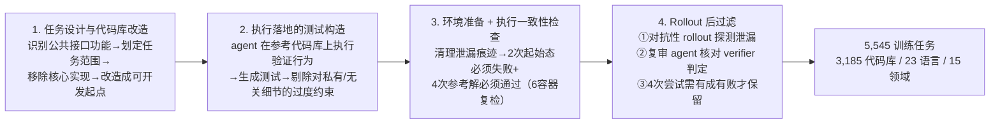

# CodeMidas: Scaling Agentic Coding RL Environments from Code Itself

> 只用源代码本身（不依赖 issue/PR/commit/现有测试/文档）自动把开源代码库的已实现功能改造成可验证的 coding RL 环境，多阶段 agentic 质检把关。

## 元信息

Xiaomi LLM Core / 北大 / 港大 / 人大，2026-09-18（arXiv:2609.22068）。链接：[arXiv](https://arxiv.org/abs/2609.22068) · 无公开代码/项目页。
对比基线（Table 1，任务专属输入要求）：[[swe-rebench-v2]]（需要 issue 或 PR）、R2E-Gym（需要 commit）、SWE-smith（需要 PR/commit）、SWE-Flow（需要已有测试）、SWE-Hub（需要已有测试）、R2E / MindForge（需要文档）。CodeMidas 是表中唯一"六项全免"（不需要 issue/PR/commit/现有测试/书面描述）且语言覆盖最广（23 种）的方案。

## 要解决的问题

现有 coding RL 环境构造管线都锚定在"开发记录"上：要么从 issue/PR/commit 直接或经模型改写得到任务描述（SWE-bench、R2E-Gym、[[swe-rebench-v2]]），要么围绕已有测试合成故障/任务（SWE-smith、SWE-Flow、SWE-Hub），要么靠已有文档给出需求规格（R2E、MindForge）。这些方法的任务覆盖面被"记录的变更/测试/文档"的覆盖面卡死，且往往只覆盖单一语言。CodeMidas 想验证：能否只用源代码本身（已实现的功能）作为任务专属输入，构造出可靠、可规模化、跨语言的 RL 训练环境。

## 方法

CodeMidas 是四模块的 agentic 流水线（Figure 1），核心思路是"删掉已实现的核心功能 → 让 agent 重新实现 → 用原始实现做参考解和测试基准"：

**1. 任务设计与代码库改造**：agent 检查代码库结构与构建元数据，找出有公共入口和可观察结果的功能（CLI 工具、纯库函数、有状态库 API），优先选择需要跨代码库推理的任务。定位公共入口和共享依赖后，移除核心实现，把剩余代码调整成一个连贯的开发起点；原始实现单独保留作为参考解。

**2. 执行落地的测试构造**：agent 把任务陈述的行为要求映射成测试输入和边界情况，在参考代码库副本上真实执行来记录预期结果。对陈述固定的行为用参考执行结果做断言；对未特别规定的方面（如异常消息的具体措辞）只检查陈述要求的约束，不额外加限制。随后另一个 agent 复查每条断言，剔除陈述未支持的限制（如精确措辞、偶然顺序、内部结构），若某断言依赖私有符号且无行为替代则直接拒绝该任务。

**3. 环境准备与执行一致性检查**：从统一基础镜像开始装依赖、清理可能暴露被删实现的痕迹（编译产物、缓存、构造过程留下的文件），移除与目标功能相关的原始测试。每个任务在训练运行时配置下用 6 个全新容器复检：2 个跑起始代码库（必须都失败）、4 个跑参考解（必须都通过），用重复验证筛掉不稳定的执行结果。

**4. Rollout 后过滤**（区别于纯静态检查的关键一环）：
- **泄漏过滤**：对抗性 rollout 中，agent 尝试搜索整个可见环境（编译产物、缓存、构造 agent 遗留文件、已安装的目标项目副本）找可绕过实现工作直接拿到答案的漏洞，记录支撑证据；独立复审确认后拒绝该任务。
- **agent 解答一致性核验**：针对每个任务跑 4 次真实 coding agent 尝试，复审 agent 结合任务陈述、verifier、参考解检查每次实现是否真的满足要求，标记假阳性（本应判错但通过测试）和假阴性（本应判对却测试不过），发现 verifier 缺陷则拒绝任务。
- **rollout 结果过滤**：一个前沿模型多次尝试并由 verifier 打分，全通过或全失败的任务会被剔除（可能是任务过难/过易，或测试仍有缺陷，但无法定位原因），只保留"有成功也有失败"的任务。

最终保留 **5,545** 个任务，来自 **3,185** 个代码库，覆盖 **23** 种语言、**15** 个技术领域（Figure 2/3）：Python 21.4%、TypeScript 18.3%、Go 16.2%、C++ 12.5%、JavaScript 11.3% 领跑；系统软件（17.4%）、Web 技术（14.6%）、开发者工具（13.6%）是最大的三个领域。参考解中位数 142 行（IQR 66–305 行），65.9% 的任务改动 ≥2 个源文件（Figure 4）。

## 实验与结果

用 [[grpo]] 训练 MiMo-V2.5：batch size 32，每任务 32 次 rollout，二值执行奖励（无学习型 reward model 或 verifier），最大 prompt 8,192 token / 最大响应 516,096 token，单次 rollout 最多 500 轮，最大 staleness 8，Adam lr 5×10⁻⁶（Table A1，完整训练超参见 Appendix A）。

**五个外部基准全面提升**（Figure 5，绝对分数变化）：
- DeepSWE v1.1 pass rate：10.0% → 21.7%（+11.7pp）
- ProgramBench Almost Solved（≥95% 测试通过率占比）：4.5 → 21.5（+17pp）
- Terminal-Bench v2.1 pass rate：63.7% → 72.2%（+8.5pp）
- 另两个基准（SWE-bench Pro、RepoZero C2Rust）也有提升（论文摘要单独强调前三个）

CodeMidas Val（200 个训练集外抽样任务，每任务 3 次尝试）上 pass rate 从 35.0% 升到 44.7%，训练轨迹长度同步增长（Figure 6），从 step 40 起稳定领先初始策略约 8–10pp。

**任务规模与质量消融**（Section 5.1，Figure 7/8）：1k/3k/5k(全量) 三档高质量任务池分数逐级提升——DeepSWE 从 17.57→19.05→21.70，CodeMidas Val 从 41.30→43.22→44.73。更关键的对照：未经清理/一致性检查/rollout 后过滤的"vanilla 8k"样本，被高质量 5k 全量在 SWE-bench Pro / DeepSWE / CodeMidas Val 上分别高出 0.59 / 4.59 / 4.49pp；**even 高质量 3k 子集也全面超过未过滤的 8k**——说明质量过滤（本文四道工序里的第 3、4 步）比单纯堆任务数量更重要。

**行为分析**（Section 5.2，Table 2/3）：对比早期与后期训练 rollout，代码库探索（编辑前 read/search 调用数）从 27.2 次升到 40.1 次，代码起草率（写入代码片段在此前推理中已出现的比例）从 0.36 升到 0.63，自我验证（编辑后不同验证命令数）从 2.03 升到 2.53。在 CodeMidas Val 同任务同 checkpoint 对照下，agent 自己写并执行检查的 rollout 平均通过率比没有的高 4.2pp（95% CI 1.8–6.6）。这些行为变化在 SWE-bench Pro、ProgramBench、Terminal-Bench v2.1 三个外部基准上同样出现（Table 3），是"泛化到域外任务"的行为学证据，不只是分数好看。

## 局限与疑点

- **构造成本完全未披露**：与 [[verifiable-reward-environment-generation]] 页面里 VHD-Play（$0.01–0.03/环境）、SkillGym（4.5 小时/任务）、[[swe-rebench-v2]]（$0.0873/仓库 + 26,400 job-hours 构建）相比，CodeMidas 没有给出任何 $ 或算力数字——而它的流水线明显更"重"：每个候选任务要跑任务设计 agent、测试构造 agent、测试复查 agent、6 容器一致性检查，外加 rollout 后过滤的对抗性泄漏探测 + 4 次真实 coding agent 尝试 + 复审 agent，这是目前几条路线里 agentic 计算投入最密集的一条，但成本可见度反而是空白。
- **过滤有效性未量化**：泄漏过滤、agent 解答一致性核验都依赖"复审 agent 的判断"，论文没有报告这些判断本身的准确率/漏检率（人工抽检或多裁判一致性）——[[benchmark-item-validity-audit]] 的方法论（oracle run / nop run / cheat-variant trial 三类主动探测 + 有序判定规则）比这里的复审步骤更系统，但 CodeMidas 没有采用类似的可信度分级。
- **消融只覆盖一个模型（MiMo-V2.5）**，任务规模效应和"5k 优于未过滤 8k"的结论是否在其他基座模型上同样成立未知。
- **语言/领域分布由开源生态的可得性决定**（Python/TypeScript/Go/C++/JavaScript 占主导），而非按需求主动配平，长尾语言的任务密度和质量未单独讨论。
- 从起始代码库中"删除核心实现再让 agent 重写"这种构造方式，理论上可能引入与真实开发场景不同的任务分布（真实场景是"从无到有增量开发"或"修 bug"，而不是"代码库突然缺了一块"）——论文未讨论这种构造方式本身带来的分布偏移。

## 对我们的启发

1. **补全"环境生成"概念页的第六条路线**：CodeMidas 是"代码先行（source-grounded）"——不需要 issue/PR/commit/现有测试/文档，只用源代码本身，是目前语言覆盖最广（23 种）且任务专属输入要求最少的方案（Table 1）。已并入 [[verifiable-reward-environment-generation]]。
2. **多阶段 agentic 质检管线可直接对应 issue #71 关心的"质量与防作弊"**：泄漏过滤（对抗性 rollout 主动找漏洞）+ 解答一致性核验（复审 agent 核对 verifier 判定，标记假阳性/假阴性）+ rollout 结果过滤（剔除全通过/全失败任务）这三步组合，是一套可以直接搬到我们自己任务/数据集构造流水线里的"生成后质检"三件套，比单纯执行一致性检查（fail-to-pass 复测）更能拦截"任务本身有缺陷但静态检查测不出"的情况。
3. **成本盲区是采纳前必须先补的功课**：在决定是否复刻这条"代码先行"路线之前，需要先自己估算一遍这个多 agent 流水线（任务设计 + 测试构造 + 复查 + 6 容器一致性检查 + 对抗泄漏探测 + 4 次真实 rollout + 复审）单任务的 token/算力成本——量级上大概率比 [[swe-rebench-v2]] 的挖掘先行路线贵得多，但论文完全没给数字，需要自己用类似规模的内部代码库做小样本验证再决定是否规模化投入。
4. **"高质量小数据集打赢未过滤大数据集"这条消融结果**（3k 过滤后 > 8k 未过滤）值得在我们自己的任务/数据集构造决策里作为优先级参考：如果算力/时间有限，投入质检/过滤流程比单纯扩大候选池规模更划算。

## 相关

- 相关概念：[[verifiable-reward-environment-generation]]、[[swe-rebench-v2]]、[[benchmark-item-validity-audit]]、[[grpo]]、[[agentic-rl-environments]]
- 相关笔记：[[2602.23866]]（挖掘先行，语言覆盖对比基准）
