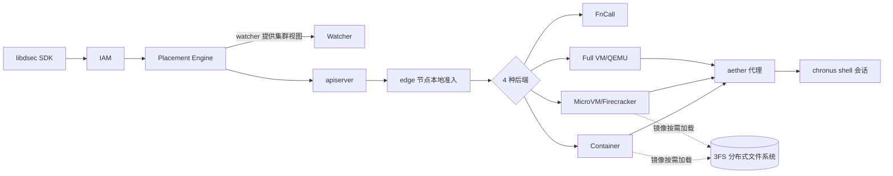

# DeepSeek Elastic Compute (DSec): A Sandbox Infrastructure for Effective Agentic Training at Scale

> DeepSeek 生产级 agentic RL 沙箱平台：FnCall/容器/microVM/fullVM 统一 SDK，160 节点单元日均 300 万沙箱、峰值 38 万并发、5000 创建/秒。

## 元信息

- 机构：DeepSeek-AI（主）、Tsinghua University（一作实习单位）
- 发表：2026-09-19（arXiv v1，cs.DC）
- 链接：[arXiv](https://arxiv.org/abs/2609.22978) · [OverlayBD/ublk 存储层开源](https://github.com/kvcache-ai/AgentENV/tree/main/storage/overlaybd)
- 对比/相关基线：Firecracker、RunD、Kata Containers（隔离底座）；DADI、Nydus、FaaSNet（镜像按需加载）；SAND、REAP、TrEnv（serverless 冷启动）；Slime、veRL、OpenRLHF、Seer（把执行环境当黑盒的 RL 训练系统）

## 要解决的问题

Agentic RL 训练/评测需要给模型提供可交互、有状态的执行环境（跑仓库、调工具、起服务），但现有的沙箱/serverless 运行时都是为**短生命周期、无状态、高复用**的函数调用设计的（SAND、REAP、RunD 等）。DSec 指出 agentic 训练负载有 7 条与之根本不同的特性：突发式批量创建（单任务最多 3.2 万沙箱）、CPU 稀疏但要求高密度（单机最高 3200 容器/800 microVM）、有状态且长生命周期（p99 存活超 3 小时）、workload 高度异构（OJ 脚本到 Android 全系统）、同类负载下环境本身也高度多样（镜像复用率低）、执行不可信（agent 会搞破坏/reward hacking）、执行可被抢占（GPU 训练抢占不能杀掉 rollout 状态）。这些特性叠加起来，意味着"单一沙箱运行时"或"轻量套壳容器"都不够，需要一整套**弹性执行平台**。

## 方法

### 整体架构

四种后端各自的取舍（Table 1）：FnCall 性能最好但依赖足迹为零、隔离最弱（复用预建容器跑无状态短任务，如判题/编译/GPU kernel）；容器是 SWE/工具调用的主力（启动快、密度高，但共享内核）；microVM（Firecracker）在保留 Linux 兼容性下提供更强隔离（安全敏感任务）；full VM（QEMU）覆盖需要完整 COTS 操作系统的场景（Android VM、GUI/图形，靠 virtio-gpu + DXVK 兼容层）。生产中容器和 microVM 承担了大部分实例数与资源消耗。

FnCall/容器实际跑在 QEMU/libvirt VM 里而非裸机上，多一层安全边界；容器和 VM 沙箱都通过 aether（跨平台代理）+ chronus（shell 会话抽象）暴露统一的命令执行/文件操作/流式 I/O 接口。集群侧 IAM 支持多级 project 嵌套（不是云平台常见的扁平/两级），human 和 agent 用同一套管理 API 和权限模型。Placement Engine 用 filter-then-rank，采用 [[microvm-sandbox|power-of-k-choices]] 随机采样几个候选节点选最闲的一个，避免中心化瓶颈；edge 保留最终本地准入权，作为对 placement 过期估计的兜底。

在本地资源利用率超过 80% 时，还会把部分请求 offload 到云 VM（cloud bursting），复用同一套容器运行时和 EROFS 按需加载路径（不是"托管容器服务+对象存储"这种常见组合），200 台云 VM 吸收了约 30% 的峰值溢出。

### 环境组合：可组合镜像层 → [[sandbox-image-distribution]]

把沙箱内容拆成三层独立生命周期的部件：base image（OS 级依赖）、workspace（任务代码库+依赖）、toolkit（如 DeepSeek Harness，更新频繁）。若打成单一 OCI 镜像，升级 $m$ 个 base image 要重建 $O(m \cdot N)$ 个组合镜像，升级 $k$ 个 toolkit 要重建 $O(k \cdot N)$ 个——DSec 用 overlayfs 的多层只读栈原生合并语义（`dockerd` 改造后在创建时动态插入 lowerdir），把升级成本降到 $O(m)$、$O(k)$。发布后的层不可变，用 EROFS 存储（只读优化、支持压缩且保留随机访问，不像 tar.gz 必须整体解压）。microVM 侧用同样的分层思路：EROFS 只读层作为 guest 里的块设备，guest 内 overlayfs 叠加一个 ext4 可写盘。

### 高密度资源管理 → [[sandbox-density-overcommit]]

内存：virtio-pmem + DAX 把文件访问直接映射到 host 页而不拷入 guest RAM，消除 guest-host 双重页缓存（但冷访问要走同步缺页处理，且 guest 要为整个 pmem 地址范围分配 struct page，128GB pmem 设备要占 2GB guest RAM）。对不适合走 pmem 的可写盘，DAMON（采样监测冷页）配合 virtio-balloon 的 free-page reporting（guest 定期扫描 buddy allocator 上报空闲页，host 用 `madvise(MADV_DONTNEED)` 回收）——DAMON 帮忙把零散冷页聚合成大块，满足 free-page reporting 默认要求的 2MiB（order-9）粒度。

CPU：把沙箱分成 latency-sensitive（LS）和 best-effort（BE）两类，BE 用 `SCHED_IDLE`（只在 LS 无事可做时才跑），但光靠调度优先级不能防止 SMT 同核干扰，所以再叠加 Linux core scheduling，禁止不相关的 BE 任务跑在 LS 任务的兄弟硬件线程上。

### 镜像分发：3FS 按需加载 → [[sandbox-image-distribution]]

不用常见的"registry + P2P"组合，而是直接把镜像放在已有的 3FS 集群文件系统上（3FS 本身已经在服务训练负载）。3FS 的 I/O 特性高度不对称——大块顺序读写快，小随机 I/O 差——于是设计原则是：写留在本地盘（避免小写惩罚）、读按需+批量拉取（发挥 3FS 大 I/O 吞吐优势）、元数据尽量留本地（EROFS 支持 metadata/data 分离设备模式）。为避免层数太多拖慢创建，离线把小于阈值（如 3GB）的连续层合并成一对 EROFS 镜像（保留 overlayfs whiteout 语义）。microVM 侧因为 Firecracker 不支持 virtio-fs，用 OverlayBD（团队贡献了 Rust 实现）搭配自研 ublk 用户态块设备框架，256KiB 粒度拉取+二级本地缓存兜底重复拉取。

### 与 RL 框架协同设计

- **Agent 环境自建（§6.1）**：靠 `pack_diff` 增量快照把任意交互式沙箱状态直接固化成可复用环境，agent 自己在同一套基础设施上构建/校验/消费环境，不走独立的镜像构建流水线；builder 和 runtime 用不同账号防泄漏。
- **Rollout 与 GPU 训练解耦（§6.2，DeepSeek-V4.1 起）→ [[agentic-rollout-preemption]]**：早期 agent loop 跑在可抢占的 GPU 训练 pod 里，抢占后 loop 状态丢失，靠 command log 重放恢复（要处理非幂等命令的重复副作用）。V4.1 起把 rollout 挪到 DSec，拆成 agent sandbox（跑 scaffold/工具）+ worker container（管理沙箱、scaffold-agnostic 控制层），二者共同持有 rollout 状态的唯一真相，GPU 训练抢占后可以直接重连而不用重放 command log。
- **Pause/resume（§6.3）→ [[agentic-rollout-preemption]]**：GPU 训练抢占时主动 pause 所有关联沙箱以回收内存。容器走 `docker pause` + `memory.swap.max` + `memory.reclaim` 主动回收（保留执行状态），恢复时 `MADV_WILLNEED` 预取 + `docker unpause`；microVM 走完整快照（存内存+执行状态、杀掉 Firecracker 进程释放运行时内存），恢复时新起进程加载快照。
- **Agent 恶意/异常行为与访问控制（§6.4-6.5）**：生产中观测到 agent 伪造 chronus RPC 消息、覆写 `/bin/bash`、用 `XFS_IOC_SWAPEXT` ioctl 交换文件 extent 映射来绕过访问控制（导致 XFS 元数据损坏、触发文件系统 shutdown）、`grep` 遍历 `/proc/kpagecgroup` 触发内核 bug 崩溃、`yes` 命令输出被 chronus 记录几十 GB。缓解手段：AppArmor 限制文件/socket 访问（含 chronus 日志和 Unix socket）、eBPF 按域名/IP/端口/协议做细粒度网络白名单（可随任务阶段动态更新）。作者明确承认这些只能缓解"绕过检查找答案"类问题，防不住内核级破坏。

## 实验与结果

10 节点专用测试集群（非生产集群）；microVM 直接跑裸机（AMD EPYC 9655，2 路 96 核 192 线程，1.5TB DRAM），容器在同规格的 QEMU VM 内测（1 路 96 核，512GB）。

**成本/吞吐/规模（生产数据，非消融）**：
- 单个生产规模单元：~160 CPU 节点、3 万核、~250TB DRAM，日均 ~300 万沙箱，峰值并发 ~38 万，创建速率 >5000/秒（摘要 + §2.4）。
- 一周内活跃环境资产（Table 2）：容器 11,266 个 base image + 102,171 个 workspace，共 82.8TB；microVM 仅 2 个 base image + 53,590 个 task workspace，共 50.9TB；另有 103 个 toolkit，67.8% 的沙箱需要额外挂 workspace/toolkit。
- 单机峰值密度：观测到 1,048 容器 / 524 microVM 同时在线（一天采样），生产中稳定运行过 3,200 容器或 800 microVM/节点（§4.3，"demonstrated operating points" 而非硬上限）。
- 沙箱生存期（30K 容器+10K microVM 采样）：中位 17.4 分钟（容器）/ 15.5 分钟（microVM），p99 均超 3 小时（Figure 7）。
- 镜像访问比例（Table 3）：不同语言镜像运行时实际访问的数据只占 4.2%–13.3%（JavaScript 最低，Go 最高），验证了"整包拉取绝大部分是浪费"的判断。
- 云 bursting：一个去重后 30TB 的 EROFS 镜像集覆盖 70% 容器任务的镜像依赖；200 台云 VM 吸收约 30% 峰值溢出。

**消融实验**：
- On-demand EROFS vs. 冷拉取 vs. 全量本地缓存（8192 容器突发，Figure 10）：eager 拉取比 on-demand 慢 **1.71×**（60+ 分钟 vs. ~35 分钟，接近全本地基线），累计磁盘写少 **57%**（~700GB vs. >1600GB）。
- EROFS vs. tar.gz 分层挂载（Figure 11）：完成时间从 79 分钟降到 45 分钟（**1.76×**），tar 方案磁盘写流量是 EROFS 的 **5.5×**、峰值写吞吐 **3.4×**。
- 内存超卖（Figure 12，4 种 Firecracker 配置）：virtio-pmem+DAX 单独把峰值 host 内存降 **40.2%**，但把瞬时峰值 CPU 从 26.5% 拉到 41.4%；DAMON+balloon FPR 单独不降峰值但把时间积分内存消耗降 **21.2%**；两者叠加内存消耗最低。CPU 受限场景作者建议只开 FPR、保留 virtio-blk。
- CPU QoS（Figure 13，chess 延迟敏感任务 + 10%–50% BE 负载）：无保护基线在 50% BE 负载下每步延迟膨胀 **45.2%**；单独 `SCHED_IDLE` 只改善 3.4%（因为 SMT 兄弟线程仍会争抢）；叠加 core scheduling 把膨胀压到 **17.3%**。残余干扰主要来自 turbo 降频和 LLC/内存带宽争用，作者认为已可接受，未做内存带宽隔离。

## 局限与疑点

- 消融实验全部在 10 节点专用测试集群做，规模远小于生产的 160 节点单元；论文自己也说框架集成（§6）"outside the evaluation scope"，即 pause/resume、rollout 解耦这些机制没有给出量化评估数字，只有生产部署经验描述。
- 单机密度数字（3200 容器/800 microVM）被明确标注为"demonstrated operating points rather than hard limits"，作者没有说明限制因素是什么（内存？调度开销？),也没给出继续往上推的实验。
- Agent 恶意行为部分是案例罗列（XFS ioctl、`/proc/kpagecgroup`、`yes` 灌爆日志），没有量化"整体防护覆盖率"或误报率，作者自己也承认"无法防御触发内核 bug 这类破坏性行为"。
- 云 bursting 的 30% 溢出吸收比例、cloud VM 数量都是单一时间点的生产观测，没有给出决策阈值（80% 利用率触发）的调优依据或对不同负载模式的鲁棒性讨论。
- 论文未披露训练框架侵入点的具体接口设计（比如"pause 请求"和 RL 框架之间的具体协议），对想复现"训练-沙箱协同抢占"的团队来说细节不够。

## 对我们的启发

1. **"可组合镜像层 + 按需块级加载"是通用可迁移的架构模式，值得直接对标**：DSec 用 overlayfs 多层合并把 base/workspace/toolkit 的升级成本从 $O(m \cdot N)/O(k \cdot N)$ 降到 $O(m)/O(k)$，这不是 DSec 专属技巧，而是"不要把环境打成单一镜像"这条通用原则的具体实现。如果我们平台目前是整包镜像分发，这是一个高杠杆、工程可控的改造点——优先级应该高于很多算法层面的优化。
2. **按需加载的收益量级需要具体验证，不能想当然照抄数字**：论文测的 1.71×/57%（image pulling）和 1.76×/5.5×（tar vs EROFS）都是在特定负载（多 GB 多样化镜像、8192 容器突发）下的结果，取决于镜像访问比例是否真的像 Table 3 那样只有 4%–13%——这点值得我们先在自己的负载上采样验证，再决定投入多少工程量做 EROFS/3FS 这类改造。
3. **高密度超卖的"内存 vs CPU 开销"权衡是双刃剑**：virtio-pmem+DAX 降内存但涨 CPU（26.5%→41.4%），这提示我们做类似优化时要同时测两个维度，不能只看内存密度提升就上线——CPU 受限的集群可能应该只用 DAMON+balloon 不用 pmem。
4. **抢占感知的沙箱状态解耦（rollout 与 GPU 训练分离）是我们调度栈的一个明确缺口**：如果我们的 agent 训练/评测目前是"agent loop 跑在 GPU pod 里、被抢占就丢状态、靠 command log 重放"，DSec V4.1 之后的做法（rollout 状态完全落在独立的 sandbox+worker 组件里，GPU 侧只是"重连"而不是"重建"）是更成熟的方向，值得作为我们训练系统调度设计的候选能力点。
5. Follow-up 建议（可转 issue）：
   - 调研 EROFS + 3FS/OverlayBD 的按需加载具体实现细节（对照 category E 的 DADI、Nydus、FaaSNet），评估在我们现有存储栈（是否有类似 3FS 的大吞吐分布式文件系统）上落地的可行性；
   - 追踪 category B（Firecracker、RunD、Kata）系列笔记，把"microVM vs 容器"的密度/隔离权衡数字和 DSec 的 3200 容器/800 microVM 对照，看是否有更细的机制差异；
   - 关注 pause/resume 机制（容器 swap+reclaim、microVM 完整快照）能否直接复用到我们自己的抢占式调度里，尤其是 `MADV_WILLNEED` 预取这种"恢复时主动预热"的细节。

## 相关

- 相关概念：[[microvm-sandbox]]、[[sandbox-image-distribution]]、[[sandbox-density-overcommit]]、[[agentic-rollout-preemption]]
- 相关笔记：（知识库首篇沙箱基础设施笔记，暂无同主题笔记）
- 与母论文的关系：本篇**就是** `dsec-refs` 阅读清单（issue #21）的母论文/锚点本身（`parent: "2609.22978"` = `id: "2609.22978"`）。后续 category B–H 的所有笔记（Firecracker、RunD、EROFS、DAMON、3FS 等引用链）都应回链到 [[2609.22978]]，并在各自笔记的"与母论文的关系"一节说明：DSec 在哪一节引用了它、DSec 的做法与它的原始设计有何异同、DSec 在其基础上做了什么改动。
