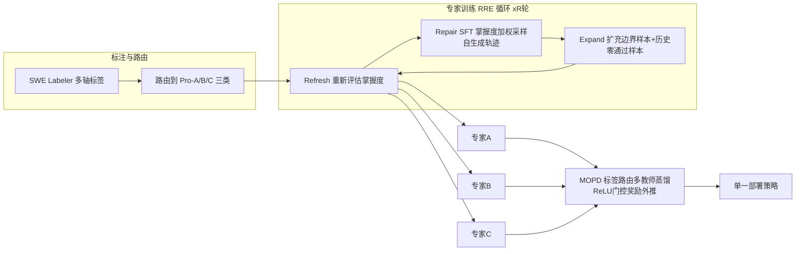

# One to More, More to One: Category-Aware Iterative Expert Training for Software Engineering Agents

> 用"分类专家 RL + 多教师蒸馏回单模型"解决 SWE agent 池化 RL 训练中"此消彼长"的类别跷跷板问题。

## 元信息

- 机构：论文未标注；HF 发布方为 `Logics-MLLM`
- 发表：2026-09-20（arXiv v1）
- 链接：[arXiv](https://arxiv.org/abs/2609.23377) · [模型/Code (HF)](https://huggingface.co/Logics-MLLM/Logics-SWE-Qwen3.6-27B)
- 基础模型：Qwen3.6-27B
- 对比基线：Pooled RL（池化联合训练）、Balanced RL（类别平衡采样）、Agentless（管道分解式修复）、Branch-Train-Merge 类跨域专家融合方法

## 要解决的问题

现有 repo-level SWE agent 训练大多把所有任务池化在一起做联合 RL（如 SWE-RL），用一个共享策略、一个聚合分数评估。但作者观察到一个"**类别跷跷板**（category see-saw）"现象：在池化 RL 下，某些任务类别在进步的同时，另一些类别在退步，而聚合分数上涨会**掩盖**这种内部此消彼长的重新分配（论文 Table 1、Figure 2）。

已有的两类缓解思路都不够：
- 管道分解（如 Agentless 把故障定位/修复拆成阶段）解决的是任务内的功能分工，不是跨类别的能力冲突；
- 跨域专家融合（Branch-Train-Merge 等）多用于数学/代码生成等**跨域**场景，没有在单一 SWE 域内做**类别级**专家化的先例。

## 方法

整体是"先分再合"的两阶段范式：**类别专家迭代训练 → 多教师蒸馏回单策略**。

### 1. SWE Labeler：多轴分层标签

把 repo-level 任务标注到可路由类别，两条语义轴（任务类型 26 个 L1 家族 + 119 个 L2 标签，来源 ISO/IEC 25010、CWE、Fowler 重构目录；仓库领域 21 个 L1 + 108 个 L2）+ 三条序数轴（修改范围/认知复杂度/预计解决时间，各 4 级）。据此把 [[swe-bench-pro]] 的 618 个审计任务路由为三个操作类别：Pro-A 服务/数据/安全（221）、Pro-B 用户面应用（201）、Pro-C 系统/工具/运行时（196）。

### 2. Agentic-miniRL：训练每个类别专家的 RL 算法

在标准 GRPO 式 RL 基础上做了 4 处修正（原文式 11–16）：
- **RLOO 奖励中心化**：$\bar{R}_i = \frac{G}{G-1}(R_i - \frac{1}{G}\sum_j R_j)$，避免稀缺成功信号被进一步稀释；
- **K1 正则化**：在奖励路径而非辅助损失里加 $-\beta(\log \pi_{\theta^-} - \log \pi_{ref})$，抑制长训练对参考策略的漂移；
- **代理比值裁剪（miniRL 式 token 更新）**：$w_{i,t}=\text{clip}(\pi_\theta/\mu_b, c_{min}, c_{max})$，符号感知掩码只在策略越界后才抑制更新；
- **轮次感知的损失缩减**：token 求和 → 轮内平均 → 轨迹间平均，工具观察 token 被掩码排除，避免长轨迹/多轮工具调用的梯度失衡。

### 3. Refresh-Repair-Expand（RRE）循环（算法 1）

每一轮三个阶段：
1. **Refresh**：在当前 RL 训练集上重估策略的通过率 $\hat p^{(r)}_{c,RL}$，与训练前 $\hat p^{(r)}_{c,pre}$ 比较，识别退化实例和已饱和（掌握）实例；
2. **Repair**：从本轮 RL 生成、验证通过的轨迹里按"掌握度越低配额越高（非递增）"采样，做 SFT 修复，再次 Refresh 得到 $\hat p^{(r)}_{c,SFT}$；
3. **Expand**：把候选池扩展为"当前边界样本"（$0<\hat p<1$）∪"历史证明可解但当前 pass 率为 0 的样本"，作为下一轮 RL 训练集。

三个类别专家都从同一个基础模型 $\pi_0$ 出发，**不引入外部教师轨迹**，全靠可执行 Agentic RL 塑造类别行为。

### 4. 标签路由多教师 On-Policy 蒸馏（MOPD）

学生目标：$L_{student}(\theta) = -\mathbb{E}_{x,\tau\sim\pi_\theta}[\sum_c w_c \cdot T_c(\tau|x)\cdot \log\pi_\theta(\tau|x)]$，其中 $w_c$ 按标签路由到对应类别教师 $T_c$。关键设计是 **ReLU 门控奖励外推**：$\max(0, reward_{teacher} - reward_{ref})$，只保留每个教师相对参考策略"更好"方向上的信号，排除教师退化区域，避免蒸馏把某个专家的负面漂移也带进单一策略。

## 实验与结果

| 基准 | 基线 | MOPD 最终策略 | 提升 |
|---|---|---|---|
| Pro-618（[[swe-bench-pro]] 审计子集，618/731） | 52.64% | 58.04% | +5.39pp |
| [[swe-bench-multilingual]]（300 任务，9 种语言） | 56.22% | 59.00% | +2.78pp |

（数字交叉验证自论文摘要与 HF 模型卡）

- 类别级结果（Figure 2、Section 6.2–6.3）：论文用"跷跷板间隙"（SSG，式 6）量化池化 RL 下类别间此消彼长；RRE 循环后 Repair SFT 能部分恢复被牺牲类别的收益，但 MOPD 整合后**并非所有专家收益都能在单一策略里保留**——这是作者自己承认的局限。
- 消融对照包括：Pooled RL、Balanced RL（类别平衡采样）、无 RRE 的初始类别 RL、无融合的独立专家 vs. MOPD。
- 训练数据规模：约 3.2 万条可执行候选任务池（Section 4.1）；SWE Labeler 在三个基准上共标注 1531 个实例做验证。
- 环境构建：用 **RepoLaunch**（见 [[repolaunch]]）搭建可执行仓库环境；验证器基于 fail-to-pass / pass-to-pass 测试；有专门的"反 reward hacking"完整性检查协议（Section 5.7）。
- **GPU/算力成本未在论文中量化**——批次配置、KL 系数、裁剪界限有提及但没给出具体资源数字，RRE 需要多轮 refresh+eval，计算开销未披露。

## 局限与疑点

- 作者自己承认（Section 7–8）：① 没有给出"何时该把一个域拆分为多个类别、何时该保持统一"的判据；② 专家分化受限于可观测标签体系，捕捉不到隐性的能力冲突；③ 整体分数提升不代表所有类别收益都被保留——高分可能仍然掩盖部分类别的损失。
- Pro-618 是从 731 个任务里审计过滤剩下的（丢弃 15%），过滤标准和被丢弃任务的分布未详细披露，可能影响基准可比性。
- 三分类（服务/数据/安全、用户面应用、系统/工具/运行时）是启发式划分，不是从数据里聚类得出的最优切分，换个任务分布未必成立。
- RRE 的计算成本（多轮 refresh 全量重新评估）未量化，是否能在更大规模任务池上摊销存疑。
- 未披露具体 GPU 数量、训练时长、总 rollout 量级，难以评估这套方法的工程可复现成本。

## 对我们的启发

- **"先分专家再蒸馏"是应对任务异构性的一个可迁移套路**：如果我们平台上跑的 agent 训练任务本身覆盖多个差异很大的子域（比如不同语言/不同代码库风格/不同任务类型），池化 RL 可能存在类似"类别跷跷板"——建议在我们自己的训练评测里也按任务子类型拆开看分数，而不是只看聚合分数，否则容易被"整体在涨、某类在崩"的假象骗过去。
- **RRE 循环意味着训练侧需要频繁做"全量重估通过率"**（Refresh 阶段），这对我们的 sandbox/执行环境提出了明确要求：需要支持**低成本、高频次的批量 rollout 评估**（不只是训练时的 rollout，还有专门的诊断性重估），这直接影响沙箱的**冷启动速度和并发密度**——如果重估本身很贵，RRE 这类"训练中反复诊断"的方法在我们平台上落地会很痛。
- **RepoLaunch + fail-to-pass/pass-to-pass 验证器**是 repo-level 可执行任务构建的标准范式，值得跟进它的镜像分发和环境隔离方案（论文未展开，但这是我们平台能力对齐的一个具体调研点）。
- **多教师 on-policy 蒸馏（MOPD）用 ReLU 门控奖励外推来"取长舍短"**，这个思路可以直接用于我们如果做"多个专精模型 → 一个部署模型"的场景，不需要额外的教师轨迹数据、只需要教师和学生共享 rollout 基础设施——对训练系统的要求是"教师推断"和"学生生成"要能在同一套 serving/调度栈里高效跑，值得纳入训练系统调度设计的候选需求。
- Follow-up 建议（可转 issue）：
  1. 调研 RepoLaunch 的具体环境构建/镜像分发机制，是否可以对标我们自己的沙箱镜像分发方案；
  2. 关注是否有后续工作把"类别跷跷板"量化指标（SSG）用在别的 agent 训练场景（不限于 SWE），可作为我们自己训练评测体系的一个诊断工具；
  3. 追踪 Qwen3.6-27B 系列模型和 SWE-bench Pro/Multilingual 榜单更新，看这条"专家训练+蒸馏"路线是否被后续工作证实可复现。

## 相关

- 相关概念：[[category-aware-expert-training]]、[[swe-bench-pro]]、[[swe-bench-multilingual]]、[[on-policy-distillation]]、[[repolaunch]]
- 相关笔记：（知识库首篇笔记，暂无）
