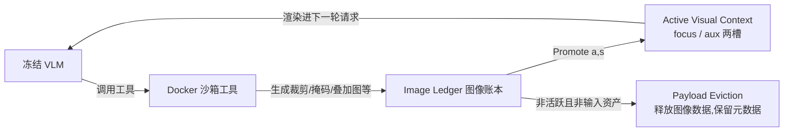

# VLM-in-Sandbox: Visual Workspaces for Agentic Visual Reasoning

> 给沙箱化 VLM agent 引入"图像账本 + 有界活跃视觉上下文 + 显式 Promote"，把视觉证据的生成与管理解耦，训练自由地压 token 又提准确率。

## 元信息

- 机构：论文页面未标注
- 发表：2026-09-21（arXiv v1）
- 链接：[arXiv](https://arxiv.org/abs/2609.24362)（无代码仓库/项目页）
- 对比基线：Vanilla VLM（无工具）、Append-only Sandbox（工具生成的图像全部累加进上下文，即"LLM-in-Sandbox"范式直接搬到 VLM 上的朴素做法）

## 要解决的问题

LLM-in-Sandbox 范式（工具执行 + 持久文件 + 多轮推理）从纯文本 LLM 扩展到 VLM 时，会产生一类文本沙箱没有的状态管理问题：视觉推理过程会生成裁剪图、掩码、叠加标注、放大区域、分析渲染图等"图像值中间证据"。这些证据不能像文本输出一样直接线性拼接进对话历史——朴素的 append-only 做法会让上下文里的图像数量随轨迹步数无界增长，既浪费 token 也会把关键证据"埋"在历史里（论文 Figure 1 的高分辨率视觉搜索例子）。

作者的核心论点：VLM agent 缺的不是更多工具，而是**一套显式保留、索引、选择、重新呈现视觉证据的机制**——即"视觉证据状态管理"应该和"视觉证据生成"分开。

## 方法

训练自由（training-free）框架，冻结 VLM 通过 Docker 沙箱调用工具，工具产出的视觉证据由一个独立的 **Visual Workspace** 组件管理生命周期。

### 核心组件

- **Image Ledger $\mathcal{L}_t$**：登记所有生成的视觉工件，给每个赋予稳定 ID，记录文件位置和父子溯源关系；对"非活跃、非输入"的资产做**载荷驱逐**（metadata 保留，图像数据从内存释放，Algorithm 1）。
- **Active Visual Context $\mathcal{C}_t = \{focus_t, aux_t\}$**：只有两个命名槽位，刻意设置上限以防止上下文随生成图像数量（可能几十张）无界膨胀。
- **显式 Promote 操作**：$\text{Promote}(a, s)$，$a \in \mathcal{L}_t$，$s \in \{focus, aux\}$。关键设计是**生成的工件默认在后续轮次不可见**，必须由模型主动 Promote 才能重新进入视觉上下文——这把"证据生成"（沙箱工具负责）和"证据管理"（Workspace 负责）彻底分开。
- **请求编译**（式 3）：$x_t = \text{Compile}(q, \mathcal{T}_{[-k:]}, \text{Recap}(\mathcal{T}_{<-k}), \mathcal{L}_{t-1}, \mathcal{C}_{t-1}, g_t)$，$k=3$ 表示最近 3 轮完整保留，更早的轮次用确定性摘要（Recap）压缩；只有 $\mathcal{C}_{t-1}$ 里的资产会被渲染成图像发给模型，其余的只以文字形式引用（文件名/ID）。
- **运行时接口**（Table 3）：Register / Resolve·List / Promote / ActiveSlots / EvictPayload；Algorithm 1 给出完整运行循环，最大步数 $T_{max}=20$。

## 实验与结果

**评测规模**：7 个基准共 6,350 条样本，4 个基座 VLM。
- 高分辨率视觉搜索：HRBench-4K（800）、V*Bench（191）
- 数学：WeMath（1,740）、MathVision-mini（304）
- 通用：MMStar（1,500）、RealWorldQA（765）、MMMU（1,050）
- 基座模型：GPT-4.1-mini、Gemini-2.5-Flash（闭源）；Qwen3.5-9B、Ministral-3-8B-Instruct（开源）

**主结果**（Table 1，样本加权平均准确率，Vanilla → +Append-only Sandbox → +VLM-in-Sandbox）：
| 基座模型 | Vanilla | +Sandbox | +Ours |
|---|---|---|---|
| GPT-4.1-mini | 65.81% | 64.95% | 67.47% |
| Gemini-2.5-Flash | 76.11% | 78.41% | 79.65% |
| Qwen3.5-9B | 72.99% | 76.79% | 78.08% |
| Ministral-3-8B | 48.50% | 56.79% | 58.11% |

四个模型上 VLM-in-Sandbox 都是三者中最高分；值得注意 GPT-4.1-mini 上 Append-only Sandbox 反而**低于** Vanilla（64.95% < 65.81%），说明朴素累加视觉证据可能是负收益，管理机制本身才是增益来源。

**Token 效率**（Figure 3，相对 +Sandbox Only 的总 token 降幅）：GPT-4.1-mini −25.7%、Gemini-2.5-Flash −51.8%、Qwen3.5-9B −16.3%、Ministral-3-8B −11.7%。

**受控 2×2 消融**（N=1,260，GPT-4.1-mini，V*Bench+MathVision+RealWorldQA）：与"自动可见+无限保留"对照组相比，VLM-in-Sandbox 达到 66.27% 准确率，**token 少 18.6%**（95% CI [0.40, 3.25] pp 提升，p=0.014；52 次挽回 vs 29 次退步）。

**全量可靠性统计**（GPT-4.1-mini 全部 6,350 例，相对 Original Append-only）：302 次挽回、142 次退步，挽回/退步比 2.13（95% CI [1.83, 3.21]，p<0.001），准确率 +2.52pp。

**上下文规模增长对比**（固定轨迹重放，100 条轨迹，工件数从 4 涨到 32 时的 token 量）：Matched-Auto-All 从 8.90K 涨到 42.30K；VLM-in-Sandbox 从 8.40K 只涨到 17.90K（因为可见的派生图像数稳定在约 2 张）。

**推理侧成本**（本地 vLLM + prefix caching，8×H20，N=1,260）：总 token 11.29K vs 13.50K（−23.5%），未缓存 prompt −16.4%，首 token 时延（TTFT）−19.7%，端到端时延 −13.0%。

## 局限与疑点

- **训练自由 = 高度依赖基座模型的判断力**：框架不训练模型，完全靠基座 VLM 自己决定何时用工具、何时停、哪些证据值得重新调入视觉上下文。Qwen3.5-9B 相对 Vanilla 有 734 次挽回但也有 411 次退步，其 RealWorldQA 上的负收益与"更长、工件更密集"但其实本可直接回答的轨迹相关——作者自己承认这是真实的权衡（trade-off），不是免费午餐。
- **只评测静态图像推理**：作者明确说明视频场景（保留时序证据、每次请求只暴露相关帧/片段）是未来工作，时序检索与跟踪未覆盖。
- **工具调用本身有开销**：Visual Workspace 降低的是重复视觉负载，不消除模型和工具执行的计算成本——工具增强推理天然比单次 Vanilla 调用贵。
- Promote 操作在"挽回"案例里只占 7.4%（Qwen3.5-9B 数据），说明大部分收益来自"有界保留"本身而非"模型主动选择"，与消融结论（下）一致但也说明显式选择机制的边际贡献有限。
- 未提供代码仓库或项目页，复现依赖论文描述的 Algorithm 1 和 Table 3 接口定义。

### 消融要点（Table 10、11，Figure 7）

- 因子分解：仅"有界保留"贡献 +1.19pp、省 16.7% token（p=0.072）；仅"模型主动选择"贡献 +0.56pp；两者叠加 +1.83pp、省 18.6%（p=0.014）——**一旦上下文容量被限定，"选择"改变的主要是"看哪些证据"而不是"看多少"，且收益体现在准确率而非成本上**。
- 活跃槽位数：1 槽 token 最低但准确率一般；2 槽（默认）准确率最高；4 槽 token 增加但准确率没有进一步提升。
- 历史轮次预算：20 步（默认）66.27%/11.53K token；10 步 65.71%（−0.56pp）/10.74K（−6.9%）；30 步 66.27%（不变）/11.61K（+0.7%）——超过 20 步收益饱和。

## 对我们的启发

- **这是"截图/视觉证据爆炸"问题的一个通用解法，直接对应 computer-use/GUI agent 的痛点**：computer-use agent 每一步截图都是"视觉值中间证据"，朴素做法（append-only 全部截图进上下文）正是本文验证过的**负收益**基线（GPT-4.1-mini 上 Append-only 反而低于 Vanilla）。Image Ledger + 有界 Active Context + 显式 Promote 这套模式可以直接迁移到我们平台上跑的 GUI/computer-use agent 训练与评测环境里，作为"截图上下文管理"的参考设计，而不用等模型自己隐式学会"该看哪张截图"。
- **Payload Eviction（图像数据释放但元数据保留）是一个明确的沙箱基础设施要求**：如果我们要支持这类 agent，沙箱/执行环境需要提供"文件级持久化 + 按需重新读取"的能力（工件写到持久文件系统，Ledger 只存引用），而不是让所有生成图像常驻进程内存或直接塞进模型上下文——这是密度和成本控制的关键点。
- **Prefix caching 场景下,"请求体更小"带来的收益会被放大**：本文用 vLLM + prefix caching 证明了 token 精简对 TTFT（−19.7%）和端到端时延（−13.0%）有直接收益。这提示我们：如果平台上的推理服务层已经在用 prefix caching，那么在 agent 侧做视觉证据裁剪（哪怕不追求准确率提升）本身就能省推理成本，值得作为一个独立于"效果提升"的优化点向训练/评测团队推荐。
- Follow-up 建议（可转 issue）：
  1. 调研本文的 Image Ledger / Active Visual Context 设计能否直接套到我们现有的 computer-use agent 评测流程，做一次"append-only vs 有界上下文"的内部对比实验；
  2. 关注是否有后续工作把这套"训练自由的视觉证据状态管理"和 RL 训练结合（本文明确说是 training-free，没有验证 RL 微调场景下是否还需要类似机制）；
  3. 视频/时序场景是作者留的开放问题，如果我们平台涉及长时序 GUI 操作录屏类任务，可以持续跟踪该方向的后续论文。

## 相关

- 相关概念：[[visual-workspace]]
- 相关笔记：（暂无同主题笔记）
