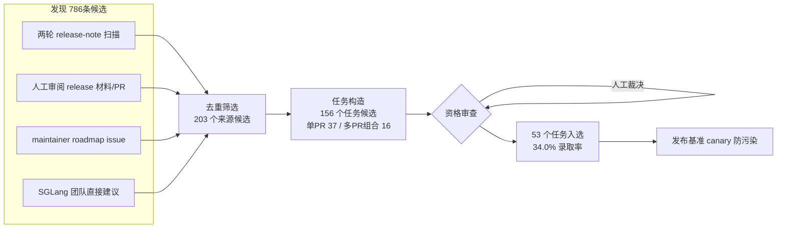

# SWE-Serve: Benchmarking Agentic Engineering for Production Inference Serving

> 用 SGLang 真实合并的生产变更构建 53 个 repo 级推理引擎任务，实测发现 agent"本地测试全过"和"生产可用"之间有一条 23.4 个百分点的巨大鸿沟。

## 元信息

- 机构：NVIDIA、UC Berkeley（作者与机构对应关系因 arXiv HTML 渲染把作者名和机构名合并显示，未能逐人区分；Jiantao Jiao 为 UC Berkeley EECS 教授，推测对应 Berkeley 一方）
- 发表：2026-09-22（arXiv v1）
- 链接：[arXiv](https://arxiv.org/abs/2609.26777)（未在正文/参考文献中找到独立的 benchmark 代码/数据发布链接，论文声称"we release the benchmark, execution environments, and verifiers"但未给出可点击 URL）
- 对比基线：[[swe-bench-pro]]、SWE-bench Verified、DeepSWE、Terminal-Bench 3、KernelBench、SOL-ExecBench、InferenceBench、ISO-Bench

## 要解决的问题

现有 agent 评测基准要么是通用 repo 级软件工程（SWE-bench 系列），不专门测推理引擎；要么是通用终端 agent 基准（Terminal-Bench 3），推理任务占比极低（74 个任务里只有 3 个，4.1%）；要么是专门的推理性能基准（KernelBench、SOL-ExecBench、InferenceBench、ISO-Bench），但只测孤立的 kernel 生成或性能优化，不测 repo 规模的生产级功能实现。

更关键的是，作者观察到一个此前基准都没有单独测量的现象：一个补丁可以**通过所有单元/集成测试，却在通过真实服务进程端到端跑起来时失败**。例如 Gemma 4 MoE 核心服务任务里，33 个 agent 补丁中有 16 个（48.5%）通过了除 E2E 外的所有测试，却没能把指定模型正确地服务起来（Appendix Table 10）。作者把这种"局部正确但生产不可用"的差距正式定义为 **production correctness**：不仅要满足任务行为要求，还要在推理系统里跑通、保持既有功能不被破坏、满足任务特定的性能约束。

## 方法

SWE-Serve 本质是"从 SGLang 真实合并的 PR 里抽取任务 + 严格的可执行验证 + 多轮资格审查"的基准构建流水线，而不是一个训练方法。

### 1. 任务定义与评分（3.1 节）

每个任务 = 指令 + 沙箱化执行环境规格（在指定 base commit 上检出 SGLang）+ oracle 解 + 隐藏可执行验证器。执行框架用 [[harbor]]（Terminal-Bench 团队做的开源 agent 评测框架，本文用 0.13.1 版）。agent 可以检查/编辑/构建/测试仓库（包括仓库自带测试），但拿不到 oracle 解、源变更标识符或隐藏验证器。评分沿用 SWE-bench 的 fail-to-pass（F2P，base commit 上不存在、要求新增的行为）/ pass-to-pass（P2P，base commit 上已存在、必须保持的行为）范式；有需要时验证器还会加上模型服务端到端（E2E）测试或校准过的性能门槛。**任务的完整测试集合定义了它的 production correctness 要求，必须全部通过才算过**。

### 2. 构成与规模（3.2 节）

53 个任务分六个"工程家族"：模型/后端支持（12）、投机与高级解码（14）、kernel/量化/性能（8）、缓存与运行时状态（7）、分布式执行与调度（4）、服务 API 与运行时正确性（8）。构造范围：37 个来自单个上游变更，16 个整合 2–6 个相关变更（跨 PR 边界的一个完整工程目标），总共取材 83 个独立合并 PR。执行环境 12 CPU + 41 GPU（单卡 H100）；19 个任务带严格的模型服务 E2E 测试，3 个任务带校准性能门槛。oracle 补丁规模中位数 553 行、7 个文件（最大 6,077 行 / 35 个文件），比 [[swe-bench-pro]]、SWE-bench Verified、DeepSWE 的 oracle 补丁平均改动的行数和文件数都大，但平均 prompt 比 DeepSWE、SWE-bench Pro 更短——意味着 agent 需要自己判断怎么实现，而不是跟着 prescriptive 的计划走。

作者还在测试之前，仅凭任务指令和验证器测试给每个任务打了三个标签：runtime-domain 广度（覆盖 request I/O、调度与请求生命周期、模型执行、KV cache 与资源管理四个域中的几个，取自 vLLM/SGLang/TensorRT-LLM/Triton 四个主流推理系统的运行时职责归纳）、是否测跨操作/生命周期阶段保持的持久状态、是否测并发协调。

### 3. 构造与资格审查（3.3 节）

三阶段：发现（786 条来源候选 → 203 个来源候选）→ 任务构造（156 个任务候选）→ 资格审查（53 个入选，**34.0% 录取率**）。录取要求：no-op 在指定硬件环境上必须挂掉所有 F2P、通过所有 P2P；oracle 必须全通过（性能类任务在多个 H100 节点上重复验证以应对计时抖动）；每个入选任务还要经过 agent 辅助的对抗性探测（用 agent 生成的补丁和轨迹找"验证器误拒有效方案""验证器误收 shortcut 解""未被测到的需求""环境导致的执行失败"）和人工裁决。这个流程里 17 个过宽的任务候选被替换为更窄的任务，27 个任务候选被要求修改验证器。入选后每个任务配置里加了一个固定的 canary 字符串，方便未来检测训练语料是否混入了本基准内容。

### 4. 闭卷评测

因为开卷试点确认三个被测模型都会做"针对具体任务的上游检索"，正式评测强制闭卷：屏蔽公网和上游仓库访问，只放行 Hugging Face（因为服务任务需要模型权重）；每条轨迹都审计是否有违规检索尝试，本次评测中所有违规尝试均被拦截，没有因此作废任何一次试验。

## 实验与结果

评测用 mini-SWE-agent v2.4.3（SWE-bench/SWE-agent 团队做的、只用 Bash 操作仓库的模型无关 harness）跑满 11 个模型，附加 5 个模型 × 5 档 reasoning effort = 31 个模型-effort 组合，每个组合跑 3 次（K=3）。单次尝试上限 350 步 / 210 分钟，单条命令超时 120 秒。

**主榜单（Table 3，各模型取自身最佳配置）：**

| 模型 | Effort | pass@1（95% CI） | pass³（三次全过） | 单任务均成本 | 单任务均耗时 |
|---|---|---|---|---|---|
| Claude Opus 5 | max | 75%±4% | 70% | $17.40 | 57.5 分钟 |
| GPT-5.6 Sol | max | 75%±6% | 68% | $12.26 | 29.5 分钟 |
| Claude Sonnet 5 | xhigh | 64%±4% | 51% | $6.61 | 40.6 分钟 |
| Kimi K3 | max | 64%±6% | 51% | $7.24 | 99.9 分钟 |
| GPT-5.6 Luna | max | 64%±4% | 51% | $0.95 | 28.9 分钟 |
| DeepSeek V4 Flash (0731) | max | 55%±5% | 42% | $0.69 | 36.4 分钟 |
| Inkling S | xhigh | 35%±3% | 25% | $0.44 | 17.6 分钟 |

（完整 11 模型见论文 Table 3；40 个百分点的 pass@1 跨度，四个都是 64% pass@1 的配置之间单任务成本相差 7.6×、耗时相差 3.9×，说明同 pass@1 下选型还要看成本/延迟。）

**核心发现：局部正确 ≠ 生产正确（[[production-correctness-gap]]，5.2 节）**

- **模型服务 E2E gap**：19 个任务（627 个补丁）上，把 276 个模型服务 E2E 测试从评分里去掉、其余不变，pass 率从 45.9%（完整验证器）涨到 69.4%，**涨了 23.4 个百分点**，11 个模型的最佳配置全部涨（无一例外）。Bootstrap 重采样 19 个任务 10,000 次得到 95% CI 为 13.4–34.4 点；排除 4 个"只有 E2E 测试、没有非 E2E 测试"的任务后差距仍有 22.8 点。
- **配对对照实验**：12 个可配对任务上跑 10,000 次随机化"去掉相同数量测试"的对照——去掉 38 个 E2E 测试平均带来 16.1 次 fail-to-pass 反转，去掉同样数量的非 E2E 测试只带来 8.0 次，**2.0 倍差距**；92.2% 的随机配对里 E2E 去除产生的反转数更多。
- **Gemma 4 MoE 例子**：33 个 agent 补丁里 16 个（48.5%）通过除 E2E 外的所有测试，但没能正确加载官方 checkpoint、把 token 正确路由到 128 个专家中的 top-8、跑通文本/图像服务接口或有序 batch 生成。
- **runtime-domain 广度**：26 个单域任务平均 pass 率 69.0%，27 个多域任务只有 47.7%，**差 21.3 个百分点**，多域任务在每个模型配置上 pass 率都更低。
- **持久状态 / 并发协调**：在 SWE-Serve 的 GPU 任务上，测持久状态的任务 pass 率低 20.8 点，测并发协调的任务（6 个）低 29.0 点；这两个差距在 SWE-Serve 的 CPU 任务和 DeepSWE 上都比较小——说明差距主要来自"真正要跑起来的推理服务系统"这个场景本身，而不是任务难度普遍更高。
- Reasoning effort 拉满也救不了：GPT-5.6 系列提高 effort 能涨聚合 pass 率，但不能稳定缩小上述生产正确性 gap，最大 effort 下差距依然显著。

**Harness 敏感性（5.3 节）**：把两个最强配置（GPT-5.6 Sol、Claude Opus 5，均 max effort）换成各自的原生 harness（Codex、Claude Code）重跑，pass@1 都没有提升——mini-SWE-agent 两个模型都是 75.5%，Codex 是 73.6%，Claude Code 是 69.8%。这与 DeepSWE 基准报告的结论一致。Harness 也影响资源开销：GPT-5.6 Sol 换 mini-SWE-agent 用更少 output token 拿到相近 pass@1；Opus 5 换 mini-SWE-agent pass@1 更高但用了更多 output token。

## 局限与疑点

作者自己承认（Section 6）：
- 只在 SGLang 上取材，是否能推广到 vLLM/TensorRT-LLM/Triton 等其它推理系统还不确定；
- 限定单卡 H100 或纯 CPU 执行（为控成本、提高可复现性），**排除了多 GPU/多节点场景**（并行、disaggregation、分布式协调）——这恰好是很多生产推理系统最容易出问题的地方，本基准测不到；
- 可执行评分测的是功能、回归、集成、端到端和目标性能要求，测不了可维护性、架构契合度，也替代不了 maintainer review；补丁规模/改动分散度只能作为实现复杂度的粗略指标；
- 闭卷执行和轨迹审计能防止评测过程中检索上游解，但**防不住模型训练语料本身就见过公开的 SGLang 代码**（污染问题），只能靠 canary 字符串支持未来的训练语料去污检测；没有私有 held-out 任务集做兜底，作者把这个列为未来工作。

此外从读者角度看：
- 作者与机构对应关系在本文里因排版被合并，不能确定具体每位作者归属哪个机构；
- "生产正确性"目前只由 E2E 测试和持久状态/并发测试代理定义，没有覆盖可观测性、灰度发布、回滚等更广义的"生产就绪"维度（论文 4.4.1 节明确说 runtime-domain 分类"不覆盖基础设施、部署、工具链、可观测性或推理工程全栈"）。

## 对我们的启发

- **"本地测试全过 ≠ 生产可用"这条结论直接命中我们平台最关心的问题**：如果我们要用 agent 训练/评测流水线产出面向生产的代码变更（尤其是涉及推理服务这类有状态、长驻进程的系统），只看单元/集成测试通过率会系统性高估真实可用性——本文给出一个可复制的量化方法（保留 E2E 测试子集，对比"有/无 E2E"两种评分），值得直接搬进我们自己的 agent 评测体系，而不是只看"补丁通过率"一个数字。
- **持久状态和并发协调是 pass 率骤降的主因之一**（GPU 任务上分别低 20.8 点和 29.0 点），这与我们做沙箱/调度系统时最容易踩的坑高度重合：agent 在无状态、单次运行的沙箱里"测试通过"的补丁，一旦放到真正长驻、有状态、并发访问的服务进程里就可能失效。提示我们：给 agent 用的沙箱执行环境如果只能跑"一次性、无状态"的验证，评出来的能力会系统性偏乐观；如果我们要做面向推理服务这类场景的 agent 训练环境，需要认真考虑"能启动一个真实的长驻服务进程 + 支持并发请求"这个能力，而不只是跑 unittest。
- **[[harbor]]（Terminal-Bench 团队的开源 agent 评测框架，容器化沙箱执行）是这类 repo 级 + GPU 依赖任务的基础设施样本**，本文用它统一管理 CPU/H100 沙箱、350 步/210 分钟的执行限额、120 秒单命令超时——这些具体限额数字和"因基础设施问题才重跑、不因 agent 自身失败重跑"的策略，可以直接对标我们自己 agent 训练/评测沙箱的资源配额与重试策略设计。
- **任务构造漏斗（786 → 203 → 156 → 53，34.0% 录取率）和"agent 辅助对抗性探测 + 人工裁决"的资格审查流程**，是一套可复用的"如何从真实 PR 里榨出高质量可执行任务"的方法论，值得在我们自己往训练/评测环境里灌入真实生产变更时参考，尤其是"no-op 必须全挂、oracle 必须全过"这类基本卫生检查。
- **闭卷执行 + 逐轨迹审计**（屏蔽公网/上游仓库，只放行必要的模型权重源，审计每条轨迹的检索行为）是评测完整性的一个具体工程实现，如果我们要防止 agent 评测被"背题"污染，这是一个可以直接借鉴的沙箱网络策略模板（allowlist 而不是全禁，同时留痕审计）。
- Follow-up 建议（可转 issue）：
  1. 调研 [[harbor]] 的具体沙箱隔离机制（容器 vs microVM、GPU 直通方式、CPU/H100 任务的资源隔离策略），对标我们自己的 agent 沙箱平台；
  2. 如果我们后续要做面向推理服务/系统类任务的 agent 训练环境，参考本文的"model-serving E2E 测试"设计一套类似的"服务态验证器"，而不是只依赖离线单元测试；
  3. 跟踪 SWE-Serve 是否发布公开代码/数据集链接（当前论文提到"we release"但未给出可点击 URL），发布后评估能否直接接入我们的评测流水线。

## 相关

- 相关概念：[[swe-serve]]、[[production-correctness-gap]]、[[harbor]]、[[swe-bench-pro]]
- 相关笔记：[[2609.23377]]（[[swe-bench-pro]] 的审计子集 Pro-618 是本文对比基线之一，两篇笔记可互相印证"repo 级 SWE 评测"这条线的最新进展）
