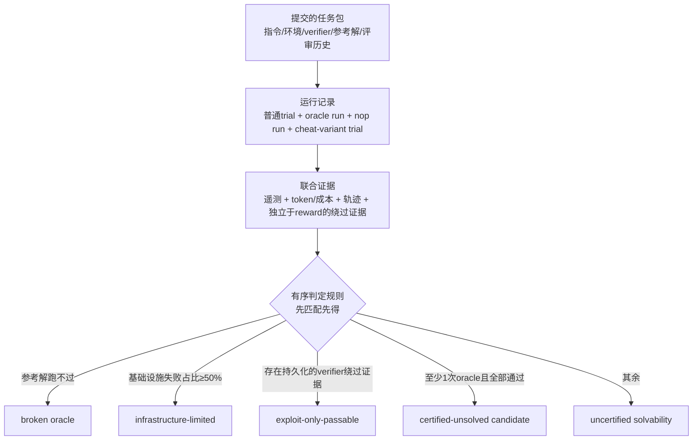

# What Makes a Terminal-Bench Task Hard? Separating Genuine Hardness from Fake-Hardness on an Adjudicated Agentic Corpus

> 对 Terminal-Bench 生产记录做全面审计：全员失败（all-fail）任务里只有 62% 能被证据支持为"真难"，其余是 oracle 坏了、基础设施瓶颈或 verifier 能被绕过。

## 元信息

- 机构：论文正文标注"[Affiliations and contact e-mail to be added]"，暂未公开作者所属机构
- 发表：2026-09-20（arXiv v1）
- 链接：[arXiv](https://arxiv.org/abs/2609.26826)（未见 Code / 项目页链接）
- 对比基线：无模型对比，本文不是模型排行，而是对 Terminal-Bench 3 / Frontier-Bench 0.1 生产记录本身的审计

## 要解决的问题

前沿 agentic 基准需要"当前模型解不出来"的任务才有区分度，但通过率为 0 不等于任务真的难：可能是指令缺上下文、参考解坏了、执行环境不可达，或者 verifier 能被绕过。这些不同原因在排行榜上呈现出**同一个数字**，科学含义却完全不同。agentic 任务比静态 QA 基准多了指令、文件、依赖、工具、执行环境、参考解、verifier 等多个层次，失败可能出在任意一层，单看 pass rate 无法判断失败到底发生在哪一层 [[terminal-bench]]。

## 方法

论文把 Terminal-Bench 3 / Frontier-Bench 0.1 的一份冻结生产记录（快照 `3c5be84efd707da8`：1081 个 PR、639 个已评分任务、28801 次 trial、$105,933 agent 花费，PR 语料冻结截至 PR 1416）当作**任务生产语料**而非单纯排行榜来用，联合任务包、PR 历史、参考解、trial 遥测、轨迹、控制实验、评审记录一起审计 [[terminal-bench]]。

核心是针对**无诚实通过（all-fail）**的 125 个任务，用三类控制实验拆解证据：
- **oracle run**：跑作者参考解，测试既定路线是否被 verifier 接受（通过只证明"至少一条路线被接受"，不证明 verifier 完备）；
- **nop run**：提交空解，测试 verifier 能否拒绝最简单的空解泄漏；
- **cheat-variant trial**：诱导 agent 用任意手段通过，探测 verifier 能被诱导接受什么。

然后应用**有序、互斥的判定规则**：参考解跑不过 → broken oracle；基础设施失败占普通失败次数 ≥ 一半（默认阈值 τ=0.5）→ infrastructure-limited；存在独立于 reward、可复现、在验证时真正骗过 verifier 的持久化 artifact → exploit-only-passable；至少一次 oracle run 且全部通过 → certified-unsolved candidate；其余 → uncertified solvability。严格的绕过证据要求排除了"分数异常""能访问 verifier 文件""agent 事后自己撤销的临时改动"这类弱证据。方法论细节见 [[benchmark-item-validity-audit]]。

## 实验与结果

- 125 个 all-fail 任务中，78 个存活为 certified-unsolved candidate；14 个 broken oracle，8 个 infrastructure-limited，4 个 exploit-only-passable，21 个 uncertified solvability（Figure 2）。
- **认证强度阶梯**（Table 1）：125 → 85（观察到 oracle 通过）→ 79（τ=0.5 下基础设施干净）→ 78（无严格绕过证据）→ 若再要求 ≥2 次独立 oracle run，只剩 25 个。78 个 certified-unsolved 里有 53 个仅有 1 次参考解记录。
- **可靠性/敏感性检查**（Table 2）：判分小组对争议 trial 的一致率 48/53；小组多数意见与人工标注一致率 41/53；12/12 个抽样标签在对抗性复核下保持不变；基础设施阈值敏感性分析下只有 1–3 个任务标签会变化——说明五分类结论不依赖单一脆弱阈值。
- 被拒的 555 个 closed-unmerged PR 里，最大拒绝原因是"难度不足"，但很多是因指令模糊、verifier 问题、不确定性、元数据/重复被拒。不同拒绝原因的平均诚实通过率差异很大：难度不足类 0.64，verifier 过拟合/太难类 0.10，指令模糊类 0.17，环境损坏/不确定类 0.18，可利用 verifier 类 0.41，质量/元数据类 0.45。349 个进入过 trial harness 的被拒 PR 中，约 31% 诚实通过率 >0.5，约 42% ≤0.2；排除明显 verifier 缺陷后，"agent 真解不出来"的占比升到约 45%。
- **成本作为通过率之外的难度信号**：在 346 个至少通过一次的任务中，比较"广义真难候选"（217 个）与"可解任务"（129 个）首次诚实通过所需的最小 output token 数，中位数 24829 vs 12388，AUC 0.750（95% CI [0.700, 0.801]）——通过率饱和之后，token 成本仍是有区分度的难度信号，但作者强调这是观察性而非因果性的度量。

## 局限与疑点

- certified-unsolved 标签**不证明**内在困难、verifier 完备，或失败发生在预期的能力关键点上；78 个里有 53 个只有单次 oracle 记录，独立实现的参考解证据仍缺失。
- 作者承认所有结果绑定在单一冻结快照上，后续的基准修复、新任务、新模型跑分都可能改变原始计数，这也是为什么把快照 ID 作为每条量化结论的一部分。
- 没有做受控的"提示阶梯"实验（固定任务/环境/模型/预算只加预先注册的提示信息，观察任务是否从失败翻转为成功），因此无法区分"agent 缺上下文"与"真正能力不足"，作者把这列为未来工作。
- 拒绝分类是单次 LLM judge 从评审记录里打的单一主因标签，而非多个领域专家重复标注，可能有分类噪声；论文本身也承认这一点。
- 论文未公开审计出的具体 125 个 all-fail 任务 ID 清单和被拒 PR 明细，第三方难以直接复现或验证审计结果。

## 对我们的启发

1. **我们平台如果要提供"可信的内部评测/验收"能力，需要类似的三类控制实验作为标准动作**：跑参考解（oracle）、跑空解（nop）、跑"不择手段通过"探针（cheat-variant），而不是只看 agent 的一次 pass/fail。这套 harness 本身可以做成沙箱平台的一个可复用能力（类似"评测夹具"），供内部 agent 训练/验收流水线直接复用。
2. **可验证奖励环境构造和评测基准构造面临同一类风险**：verifier 能否被绕过、reference solution 是否唯一可信，这与我们已经在 [[verifiable-reward-environment-generation]] 里关注的"环境先行"reward hacking 风险是同一枚硬币的两面——一个在训练时出现，一个在评测时出现。值得在我们自己的环境/评测校验流程里，把"独立于 reward 的持久化绕过证据"这类硬指标also纳入自动准入检查。
3. **基础设施失败会污染难度信号**：论文里 8/125 的 all-fail 任务纯粹是因为沙箱/执行环境不可达。这提醒我们，作为沙箱平台方，环境稳定性（冷启动失败率、依赖拉取失败率等）本身就是评测数据质量的隐藏变量——如果我们给别的团队提供 agent 评测执行环境，需要把"基础设施失败率"单独上报，而不是让它混进模型的 pass/fail 统计。
4. **可考虑的 follow-up**：（a）调研我们内部/常用的 agentic 基准（如 terminal/SWE 类）是否也做过类似的 oracle/nop/cheat-variant 三件套校验，缺失的话可以作为一个 issue 推进；（b）评估"最小 token 到首次通过"这类成本信号能否复用到我们自己的训练数据难度分层里。

## 相关

- 相关概念：[[terminal-bench]]、[[benchmark-item-validity-audit]]、[[verifiable-reward-environment-generation]]
- 相关笔记：暂无同主题笔记（本仓库首篇聚焦"基准有效性审计"的笔记）
</content>
