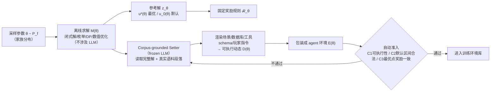

# Verifiable Hidden Dynamics Play: Generating Agentic RL Environments from Solved Mechanisms

> 先离线求解数学模型再包装成有状态工具环境，奖励与动态共享同一个已求解参考解，$0.01–0.03/条生成 3300 个 agentic RL 环境。

## 元信息

- 机构：Georgia Institute of Technology（第一作者 Xinjie Shen）；其余作者 Alibaba Token Foundry / Alibaba Group
- 发表：2026-09-23（arXiv v1）
- 链接：[arXiv](https://arxiv.org/abs/2609.27321)（未公开代码/项目页）
- 训练目标模型：Qwen3.6-35B-A3B；Setter（环境渲染器）同样用 Qwen3.6-35B-A3B（frozen），另与 Qwen3.7-Max 做 setter 能力对比
- 对比基线：书面(F)/知情-agentic(I)/隐藏-agentic(A) 三种呈现形式对照；外部基准上以 Qwen3.7-Max 为参考线

## 要解决的问题

现有 agent RL 环境生成管线普遍是"**环境先行**"：先构造环境 E，再事后定义结果规则 ℛ_E、标注轨迹，导致动态与评测事后对齐、容易错配（reward hacking、评测标准和真实动态脱节）。

论文用一个诊断实验直接证明这个缺口有多大：同一批数学问题，写成静态书面题时模型得分 0.962；改写成需要有状态交互（隐藏参数、多轮工具调用）的 agentic 形式后骤降到 0.204——说明差距主要在"有状态交互能力"，而不是"数学问题求解能力"本身。

## 方法

**核心设计反转**：不是 `E → 定义 ℛ_E`（环境先行），而是 `M(θ) → 求解 z_θ → 固定 ℛ_θ(·;z_θ)`，再 `M(θ) → 实例化 D(θ) → 包装 E(θ)`（机制先行）——奖励规则和可执行动态从同一个已求解的数学模型继承，天然对齐。

1. **采样与求解**：参数 θ 从机制家族分布 P_f 中抽取，用闭式解 / 枚举 / DP / 数值优化求解，全程不涉及 LLM，保证最优值 u*(θ) 和默认值 u_0(θ) 客观可信。
2. **语料落地渲染**：frozen setter LLM 拿到完整的解（含 θ 及其求解结果）和一段真实世界语料，生成场景描述、数据库、工具 schema、玩家（agent）指令——把抽象数学问题"包装"成看起来自然的 agentic 任务。
3. **自动准入**：三重校验——C1 环境是否可执行、C2 默认动作区间是否合法、C3 在最优点处奖励是否与预计算的 u* 一致——三者都通过才收进训练库，不通过打回 setter 重渲染。

**奖励信号**（式 4）：
$$r(\pi;\theta) = \text{clip}_{[0,1]}\left(\frac{u(\pi,\theta) - u_0(\theta)}{u^*(\theta) - u_0(\theta)}\right)$$

默认动作映射到 0、已验证的最优解映射到 1，两端在交互开始前就已经固定好，不依赖 LLM 自评。

**三种呈现形式对照**（书面 F / 知情-agentic I，参数可见 / 隐藏-agentic A，参数隐藏），用来把"有状态交互能力缺口"和"数学问题求解能力"分离开，量化二者各自的可学习空间。

覆盖 **11 个机制家族**：库存 DP、路径规划（Held-Karp DP）、背包、线性/二次规划、选址、调度、拖期、谈判、序贯停止、序贯搜索、搜索增强推荐。

## 实验与结果

**规模与成本**（Table 1）：3300 个准入环境，每个环境 ≥10 个工具，**成本 $0.01–0.03/条**准入记录，28 个语料域（归一化熵 0.997），平均单集 59.7 轮 assistant 交互。

**主训练效果**：Qwen3.6-35B-A3B 在五家族诊断上 agentic 分数从 0.204 → 0.815（+0.611），弥合 77% 的书面-agentic 差距。

| 呈现形式 | 训练前 | 训练后 |
|---|---|---|
| 书面 F | 0.962 | 0.992 |
| 知情-agentic I（参数可见） | 0.231 | 0.875 |
| 隐藏-agentic A（参数隐藏） | 0.204 | 0.815 |

泛化：held-out（同训练家族的未见实例）+0.56；near-OOD（未见优化家族）+0.63；far-OOD（差异更大的家族）+0.24～0.16。

**外部迁移**（Figure 4）：E-Commerce Bench（365 天门店模拟）期末余额提升 3.4 倍，且超过 Qwen3.7-Max 参考；BFCL V4 十个交互格 +2.84 分；TravelBench 0.700 → 0.794（**仍低于 Qwen3.7-Max 参考的 0.891**，说明外部迁移收益是相对自身 base 的提升，不是绝对碾压）。

**消融**（App H.5）：+0.443 的 agentic 增益中，只有 +0.030 可归因于工具调用采用率提升，剩下 +0.413 是在固定工具使用层内取得的——支持"训练激发已有能力"而非"训练教会模型用工具"的解释。

**Co-scaling frontier**（Figure 5，4 个背包问题规模配置 6×5 到 11×11）：基座模型性能随规模增大持续下降（0.432→0.085），训练后模型性能持续提升（0.843→0.946），且增益随复杂度扩大（+0.412→+0.861）。

**Setter 容量对比**（Table 3）：frozen 35B setter 准入率 70%（21/30，三个家族），平均生成尝试 2.50 次，接口精炼率 45.5%；换 Qwen3.7-Max 做 setter 则 100% 准入、1.03 次尝试、0% 精炼——说明**起始 checkpoint 决定"能否生成"，更强 setter 只提升生成效率，不扩展核心可行边界**。

**训练配置**（App C.5）：GRPO 算法，64 prompts/step，16 个保留 rollout/prompt（18 次尝试），学习率 2×10⁻⁶，clip ratio 4×10⁻³，仅 **34 个 optimizer steps**，用了 2176/2200 个训练环境，产出 34816 条打分 rollout。**论文未披露这部分 RL 训练本身的 GPU/算力成本**，只量化了环境生成成本。

**验证覆盖**：480 次执行审计零异常，240 次重复终局 100% 一致，无案例超过预计算的最优值 u*(θ)。

## 局限与疑点

- 作者自己承认（App K）：适用范围限制在"可形式化为数学模型、可采样/可求解"的机制类问题家族；不宣称训练后的策略显式重建了底层模型，也不宣称运筹优化求解能力本身等价于通用 agentic 能力。
- **只公开了环境生成成本（$0.01–0.03/条），RL 训练阶段本身的算力成本完全没披露**——34 个 optimizer steps 看起来很少，但没给出对应的 GPU 数量/时长，无法评估端到端总成本。
- 11 个机制家族全部可形式化为运筹/组合优化问题，跟我们生产上真正在跑的 SWE/terminal 类 agent 任务（非结构化、依赖真实代码库/系统状态）差异较大——环境生成成本低，但覆盖的"任务类型"窄，能否扩展到这类任务未经验证。
- TravelBench 外部迁移效果训练后仍低于 Qwen3.7-Max 参考基准，说明"外部迁移收益"是相对自身 base 的提升幅度，不是绝对性能领先。
- Setter 容量实验表明生成质量/效率强依赖渲染模型的能力强弱，论文没有讨论换成更弱/更小的 setter 会造成怎样的准入率下降，可复现成本存在不确定性。

## 对我们的启发

- **"先离线求解、再包装成有状态环境，奖励从解的过程原生继承"是一个可复用的设计模式**：把"环境构造"和"可验证奖励设计"这两件通常分离、容易错配的事绑定到同一个源头（已求解的数学模型）。如果我们平台上有可以形式化为可求解优化/组合问题的任务（比如调度、装箱、路由——这跟我们自己做调度系统直接相关），可以照搬这套"离线求解最优解 → LLM 套壳成有状态工具环境 → 奖励=归一化到[0,1]的最优解距离"流程：比人工设计 reward 规则更省成本，也更不容易被 reward hacking（最优值是外部客观计算得出，不依赖 LLM 自评）。
- **环境生成成本已经量化到 $0.01–0.03/条**（3300 条全库约 $33–99 美元量级），这给了我们一个具体的成本基准：如果要给沙箱平台配套"环境自动生成"能力，"采样参数 → 离线求解 → LLM 渲染 → 三重自动校验准入"这套四步流程，比人工设计+人工验证的路线更容易控制成本和保证质量。
- **Setter 容量实验（Table 3）提示环境生成质量强依赖渲染模型能力**：如果我们要做类似的自动生成管线，需要预留"生成失败重试/接口精炼"的重试预算（论文里 frozen 35B setter 平均要 2.5 次尝试、45.5% 案例需要接口精炼）。这对应我们平台侧需要支持**环境生成期的高频短生命周期沙箱执行校验**——不是训练期的高吞吐 rollout，而是生成期反复起停验证正确性，这是两种不同的沙箱使用模式，值得分别评估冷启动和并发密度需求。
- **RL 训练本身只用了 34 个 optimizer step 就见效**，说明如果环境构造质量足够高（奖励天然对齐），训练侧不需要海量 rollout 就能显著提升——这反过来说明"环境/奖励质量"投入的优先级可能高于"训练算力堆量"，值得在我们自己评估训练系统投入优先级时参考（但论文没给训练算力成本数字，这个结论目前只是定性观察）。
- Follow-up 建议（可转 issue）：
  1. 调研"机制先行"生成范式能否直接套用到我们自己的调度/资源分配类问题——这跟我们本身做调度系统的业务高度贴合，可能可以直接拿我们的调度问题当"可解的数学模型"来生成 agent 训练环境；
  2. 关注"480 次执行审计零异常"这类可验证性审计协议设计，能否作为我们自己环境构造正确性校验的标准做法；
  3. 追踪后续工作是否把"机制家族"覆盖扩展到 SWE/terminal 等更贴近我们生产场景的非结构化任务类型；
  4. 补充调研这套管线里 RL 训练阶段（而非环境生成阶段）的实际算力/GPU 成本，论文未披露，需要看后续版本或作者代码是否公开。

## 相关

- 相关概念：[[vhd-play]]、[[verifiable-reward-environment-generation]]
- 相关笔记：与 [[2609.23377]] 同属 agentic RL 训练方向，但方法路线不同（本文关注环境/奖励自动生成，[[2609.23377]] 关注 SWE 领域的类别专家训练+蒸馏）
