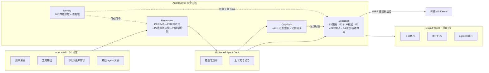

# AgentKernel: The Trust-Native Agentic Operating System

> 提出"agent 操作系统"定位：身份/感知/认知/执行四支柱做强制性、不可绕过的中介层，执行支柱用 eBPF 钩子把语义权限落到 syscall 级别的进程树监控——是纯架构定位论文，无实测数据，比较表是自评。

## 元信息

- 机构：DeepKernel Lab；通讯作者 Zhuotao Liu（刘卓涛），清华大学
- 发表：2026-08-29（arXiv v1，cs.CR / cs.AI，38 页 5 图）
- 链接：[arXiv](https://arxiv.org/abs/2609.29647) · 无公开代码/项目页
- 对比基线：AGT（Microsoft Agent Governance Toolkit）、AIOS、OpenFang、SmythOS SRE、Letta、nono（execution sandbox）——Table 3 里逐维度打分对比，全部由作者自评

## 要解决的问题

现有 agent "harness" 生态（编排框架 LangChain/AutoGen、agent 运行时 AIOS/OpenFang/Letta、治理平台 AGT/LangSmith、执行沙箱 nono/E2B/Anthropic sandbox-runtime）各管一段，但没有一个是**强制性、不可绕过**的统一层：治理平台自己承认是"application-level governance, not OS kernel-level isolation"（AGT 原话），策略引擎和 agent 业务逻辑共享同一个进程信任边界，prompt injection 一旦得手就能同时绕过检查和执行防护。

论文的核心论点：这不是缺一个更强的 guardrail 插件，而是缺一层类比传统 OS kernel 的**语义层操作系统**——把身份、输入中介、内存治理、执行控制做成强制性服务，而不是可选中间件。

## 方法

**设计原则（5 条，§3）**：(1) 安全内核必须是外部、不可绕过的 reference monitor，独立于 LLM 推理循环之外（因为 LLM 本身可被 prompt injection 操纵，把检查逻辑放进 context 里等于把检查和被检查对象一起攻陷）；(2) 多方策略取**交集**而非并集（$\mathcal{S}_{\text{eff}} = \mathcal{S}_{\text{dev}} \cap \mathcal{S}_{\text{ops}} \cap \mathcal{S}_{\text{ctx}}$）；(3) 四支柱独立防御，互不级联失效；(4) 语义层中介 + syscall 层托底（eBPF）双层设计；(5) agent 只暴露 LLM/工具/存储三个窄适配器接口，其余路径一律视为绕过。

**四支柱实现**：
- **Identity**：私钥常驻本地 Agent Kernel（HSM 式托管，可选 TEE 分层），远程 Global Agent Registry（GAR）签发 Agent Identity Card（AIC），四维绑定开发者/代码制品/运营方/部署上下文。AIC 的权限上限 $S_{\max}$ 是执行支柱 E1/E3 的结构性输入；委托是 kernel 系统调用，子 agent 权限必须是父集合真子集，父 AIC 吊销级联失效整个委托子树。
- **Perception**：P1 源标签（SYSTEM/USER/TOOL/EXTERNAL/UNTRUSTED 五级信任）→ P2 规则过滤（毫秒级，拦截已知注入模板）→ P3 语义防火墙（轻量 LLM 分类器，对低信任源用更严阈值）→ P4 多轮越狱检测。信任级别继承自 Identity（AIC 验证过的对端降低后续感知开销）。
- **Cognition**：不是"整个 session 取最差标签"的粗粒度做法，而是**逐条记忆项在乘积格（product lattice）上做污点传播**：切分来源片段→抽取候选记忆项→找到仍能支持该项有效性（效用损失 ≤ λ）的最小安全标签集合（反链，不是单一最坏标签）。默认私有、显式共享；检索出的历史内容标记为不可执行数据，防止"记忆当指令"攻击。
- **Execution**：E1 确定性规则（sub-ms，deny-list/能力对齐）→ E2 轻量 LLM 校验意图一致性（仅 E1 升级时触发）→ **E3 eBPF/内核钩子管理器**——执行前预计算 allowlist（文件路径/网络端点/DNS），装进 eBPF probe，监控工具派生的整个进程树（子进程继承同样约束），违规立即暂停；即使工具实现本身是恶意的也出不了 allowlist → E4 计划-轨迹对齐器，事后比对声明的计划和实际执行轨迹，专门标注"LLM 声称做了但轨迹显示没发生"的幻觉动作。并发/多 agent 场景下，每个执行 token 或子 AIC 映射到独立 BPF namespace + 进程树，互不干扰。

## 实验与结果

**这是一篇没有实测评估的架构定位论文**。全文没有性能基准、成本/吞吐/密度数字、也没有针对 prompt injection/越狱基准的实测准确率——§7.4 明确写"comprehensive performance and security characterization under realistic workloads is pending"，并把三个具体的实测问题（eBPF probe 安装/拆除延迟分布、lattice 检索在百万级记忆条目下的可扩展性、对抗性场景下的安全姿态）列进"未来工作"。

唯一的"结果"是 **Table 3**：作者按 15 个维度（分属四支柱+跨支柱整合）把 AgentKernel 和 AGT/AIOS/OpenFang/SmythOS/Letta/nono 逐项打分（●完整支持/◦部分支持/—无），AgentKernel 在几乎每一维都是 ●，其余系统大多是 — 或 ◦。**这张表完全是作者自评，没有第三方或可复现的测评协议**。

§6.1.4 对执行沙箱（nono、E2B、Anthropic sandbox-runtime）的定位：nono 提供 Landlock/Seatbelt 内核沙箱 + Sigstore 签名 + 凭证代理注入 + 网络 allowlist；E2B 是云侧隔离环境（Python/JS SDK）；Anthropic sandbox-runtime 在不用容器运行时的前提下做 OS 级文件系统/网络限制。作者的论点是这些沙箱提供的隔离是**二元的（在/不在沙箱内）**，而 AgentKernel 的 allowlist 是**动态计算的**——由 agent 身份、输入 provenance、记忆污点级别共同决定,细粒度更高。

## 局限与疑点

- **零实测数据**：性能开销、安全有效性（P3 语义防火墙的误报/漏报率、E3 eBPF allowlist 在并发工具调用下是否有竞态）全部留作 future work（§5.5、§7.4、§7.5 明确列出）。评价这套设计是否真的"低开销"目前无从判断。
- **Table 3 比较表是自评**：没有第三方复现协议，且六个对比系统（AGT/AIOS/OpenFang/SmythOS/Letta/nono）的定位、成熟度、开源程度差异很大，放在同一张打分表里横向比较，方法论上存疑。
- **TCB 本身没有最小化**：论文承认 GAR + Agent Kernel + 三适配器 + eBPF 子系统 + LLM 分类器（P3/E2）+ 密码学原语共同构成一个庞大且异构的可信计算基（§7.4），P3/E2 这两个 LLM 组件本身处在 TCB 内部，其对抗鲁棒性未经表征——即用 LLM 去守卫 LLM 的经典悖论并未真正解决，只是靠 defense-in-depth "缓解但不消除"。
- **非绕过假设是部署责任，非架构保证**：全部安全论证建立在"三个适配器是 agent 触达 LLM/工具/存储的唯一路径"这个假设上（Principle 5），如果部署环境里 agent 还持有 ambient credential 或直连文件系统，中介就不完整——论文承认这是"操作性挑战，不是理论挑战"，但没有给出自动化验证部署完整性的机制。
- **eBPF 依赖 Linux**，macOS/Windows 上可用性受限，论文只说"需要等价的不可绕过后端"，未给出方案。
- 形式化验证（Coq/TLA+ 证明单调权限衰减链、语义-syscall 桥接）全部推迟到"companion publications"，当前所有不变量只是"按构造声称成立"，未机械验证。

## 对我们的启发

- **E3 层（eBPF 进程树监控 + 执行前动态 allowlist）是对我们沙箱平台最直接可借鉴的设计**：把权限收敛（身份 $S_{\max}$ ∩ 工具 manifest ∩ 上下文污点）在工具调用**之前**算出一次性 allowlist，再用 eBPF hook 装载、监控整个派生进程树（子进程继承同一约束）——这跟我们做隔离/超卖场景下"防止沙箱内进程逃逸到未授权资源"的需求高度对应，值得评估在我们的 microVM/容器运行时上用 eBPF 做同等粒度的动态 allowlist，而不是启动时一次性写死的静态策略。
- **并发隔离思路（每个执行 token/子 AIC 映射独立 BPF namespace + 进程树）**可以类比我们做高密度沙箱调度时"同一节点多租户互不干扰"的需求——本质是把"身份"当作调度和隔离的一等公民，而不是事后贴标签，这跟我们自己关心的"沙箱密度、超卖"问题在设计取向上是一致的参考思路。
- **但这篇论文完全没有成本/开销数字**，不能直接拿来做我们自己的容量规划依据；eBPF probe 安装/拆除延迟、lattice 检索在大规模记忆库下的可扩展性都是论文自己列出的待验证问题——如果我们要借鉴，需要自己做延迟和吞吐的实测，不能假设"论文说低开销"就真的低开销。
- **"语义层中介 + syscall 层托底"的双层设计**给了一个思考框架：我们平台目前的隔离能力大多停留在 syscall/容器边界这一层（谁能访问什么文件、什么网络），如果未来要支持更强的 agent 安全保证（防止 prompt injection 驱动的越权工具调用),可能需要在调度/网关层加一层"语义感知"的审计（比如记录工具调用意图 vs 实际 syscall 轨迹的对齐检查，对应论文里的 E4 Plan–Trace Aligner），这是我们目前架构里缺的一类能力。
- Follow-up 建议（可转 issue）：
  1. 关注该论文后续版本或 companion publication 是否公布实测数据（eBPF 开销、lattice 检索延迟)，届时重新评估工程可行性；
  2. 调研 nono（Landlock/Seatbelt + Sigstore 签名）和 Anthropic sandbox-runtime（无容器运行时的 OS 级限制）的具体实现，跟我们现有 microVM/容器隔离方案做技术选型对比，这两个是目前唯一有公开代码的对照系统（nono ~2.4K star、E2B ~12.2K star、sandbox-runtime ~4.1K star，截至 2026-05）；
  3. 评估是否要在我们的执行沙箱里加一层"动态 allowlist（按身份/输入来源/上游污点收敛）"而非静态权限配置，作为独立于本论文的工程实验。

## 相关

- 相关概念：[[agent-os-kernel]]、[[agent-execution-sandbox]]
- 相关笔记：目前知识库内暂无同主题（agent 安全/信任边界）笔记，是本方向的首篇录入
