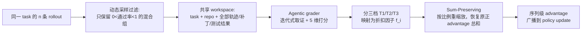

# Groupwise Agentic Grading and Advantage Redistribution for Code Agent RL

> 用一个 SFT 训练出的 agentic grader 给 GRPO 同组内"都通过测试"的代码 agent 轨迹按实现质量分档，再用一个保和的重缩放公式把降权扣掉的 advantage 还给高质量轨迹，避免正负 advantage 失衡导致训练不稳。

## 元信息

- 机构：小米 LLM Core（联合中国人民大学、北京大学、香港大学）
- 发表：2026-09-26（arXiv v1）
- 链接：[arXiv](https://arxiv.org/abs/2609.32577)；未提供代码/数据发布链接
- 对比基线：不加在线质量打分的二值奖励 [[grpo]] 基线（同样用 DAPO 式动态采样过滤退化组）；工业级混合任务 RL 场景下与 Kimi K3、GPT-5.6 Sol、Claude Opus 5 三个外部前沿模型对比

## 要解决的问题

代码 agent RL 常用可执行测试给二值奖励（通过/不通过）。在 [[grpo]] 的组相对 advantage 估计下，同一组内所有测试通过的轨迹拿到完全相同的正 advantage，模型学不到"哪种实现更好"——一个只做最小必要改动、遵循仓库规范的补丁，和一个引入无关重构、削弱验证或改了范围外代码的补丁，只要都通过测试就被同等对待。作者的目标是在不破坏组内正负 advantage 总量平衡的前提下，把学习信号从"能不能过测试"细化到"实现质量好不好"。

## 方法

- **动态采样（沿用 DAPO 思路）**：只保留组内通过率 $0<\bar R<1$ 的混合结果组，[[grpo]] 下所有通过轨迹初始 advantage 都是 $1-\bar R$。
- **Groupwise agentic grading**：grader 把整组（含失败轨迹，仅作上下文参考，不参与排名）放进共享 workspace，迭代式取证——先看逐轮摘要定位可疑处，再读具体轨迹片段、把补丁与仓库代码/测试日志交叉核对，必要时自己跑 targeted checks；否定性判断必须引用具体的补丁位置/轨迹事件/执行结果。两次实验（Flash、Pro）用的 grader 都是同一个 MiMo-V2.6-Pro 的 pre-RL SFT checkpoint。初版用 Claude Opus 5 做 grader，端到端约 2000s/组；SFT 训练出专用 grader 后降到约 600s/组，并结合 partial-rollout 调度让打分与其他任务的 rollout 生成重叠，避免打分成为训练关键路径。
- **五维质量标准**（论文附录 Table 2）：approach suitability（是否对症下药）、implementation precision（改动是否精准、覆盖完整）、minimality of changes（是否限于必要改动）、unintended side effects（是否破坏既有行为）、codebase consistency（是否遵循现有约定）。加权得分 $W_i=0.30s^{app}+0.25s^{prec}+0.20s^{min}+0.15s^{side}+0.10s^{style}$，各项 1–5 分。
- **三档分层**：先筛出 $\mathcal T_3$（确认存在未经请求的重写/针对测试的取巧、approach 分最低、或 minimality 和 side-effect 都 ≤2）；剩余候选中所有维度都 ≥4 且无严重流程问题的进 $\mathcal T_1$，其余进 $\mathcal T_2$；$\mathcal T_2$ 内按并列组排名线性插值折扣。Flash 配置的折扣因子：$\mathcal T_1$ 头名 $f=1$、次名 $f_{runner}=0.9$；$\mathcal T_2$ 在 $[f_{min}{=}0.4, f_{max}{=}0.85]$ 之间线性分布；$\mathcal T_3$ 固定 $f_{low}=0.2$。
- **Sum-Preserving 重缩放**（核心公式）：单纯乘折扣 $\widetilde A_i=f_iA_i$ 会让组内负 advantage 总量超过正 advantage 总量（因为原始 advantage 和为零），削弱对成功轨迹的强化。论文改为对所有通过轨迹统一乘一个重缩放系数 $\lambda=S_+ / \sum_{j\in\mathcal P}f_jA_j$（$S_+$ 是原始正 advantage 总和），恢复 $\sum_{i\in\mathcal P}A_i^\star=S_+$，同时保持折扣产生的相对权重比 $A_i^\star/A_j^\star=f_i/f_j$ 不变、失败轨迹 advantage 不动。二值奖励下有闭式解 $A_i^\star=(1-\bar R)\,f_i/\bar f_{\mathcal P}$，其中 $\bar f_{\mathcal P}$ 是通过子集折扣因子均值——因子高于均值的轨迹从别人那里"抢"到额外 credit，低于均值的让出。
- **工程安全阀**：实际实现给 $\lambda$ 设上限 $\lambda_{max}=1.5$（Flash 配置），触发上限后精确的保和性质不再严格成立，只做重新中心化保证组内均值为零；打分结果不可用（如排名缺失通过轨迹）时直接回退到原始二值 advantage；确认作弊（抄袭/外部答案）的轨迹奖励清零后重算组统计，这一步和质量重排序分开处理。附录证明该方法在 mean-centered 估计器下等价于一个显式的 reward-space 变换（式 9），而不是单独引入了一条 reward-shaping 规则。

## 实验与结果

- **规模**：controlled 实验用 MiMo-V2.6-Flash（310B 总参数/15B 激活）纯代码 RL；工业级混合任务 RL 同时跑 Flash 和 MiMo-V2.6-Pro（1.02T 总参数/42B 激活）。主实验 batch 128、每 prompt 16 条 rollout；混合任务 RL 每次更新 1568 个 prompt、每 prompt 16 条 rollout。评测用 DeepSWE v1.1（长程 SWE 任务）和 SWE-bench Pro，avg@3。
- **Flash 主实验**（Section 4.2）：二值奖励基线在 step 28 因性能骤降而提前停止——DeepSWE 通过率从 step 20 的 58.5% 掉到 step 28 的 50.2%；同一 step，Gagar 达到 62.2%，领先基线 12.1pp，继续训练到 step 44 峰值 63.4%。SWE-bench Pro 上基线在 step 16–28 停滞在约 59%，Gagar 持续上涨到 step 52 的 62.5%。
- **交互效率**：step 28 时 Gagar 把 DeepSWE 平均轮数从 132.3 降到 111.6（-15.6%）、平均 token 长度从 191.9k 降到 172.9k（-9.9%）；SWE-bench Pro 平均轮数从 58.4 降到 54.6（-6.5%）、token 从 79.9k 降到 68.6k（-14.1%）。
- **实现质量盲评**（Section 4.3，用 Claude Opus 5 作为独立于训练期 grader 的外部评审，对 30 个 DeepSWE 任务、匿名乱序打分）：最终 checkpoint 上 Gagar 平均质量分 4.03 vs 基线 3.70；通过候选间平均胜率 69.8%；组内排名第一（含并列拆分）占比 65.0%；最高质量档 $\mathcal T_1$ 占比从 25.4% 升到 34.3%。
- **Sum-Preserving 消融**（Section 4.4，只降权不重缩放 vs 完整方法，前 30 步）：只降权不重缩放导致 policy-gradient loss 前 30 步均值 0.0304，完整方法只有 0.0021（对应负 advantage 超配的理论预期，式 1）；policy entropy 从 0.359 涨到 0.905（完整方法只涨到 0.513）；平均训练 rollout 长度从 47.1k 涨到 114.1k token（完整方法只到 69.9k）；DeepSWE 通过率从 56.5%（step18）跌到 48.8%（step20）后部分回升到 56.2%（step28），远低于完整方法的 62.2%；step 22 轮数/token 峰值达 158.3 轮 / 246.7k token，step 28 仍高达 143.5 轮 / 236.0k token（完整方法同期仅 111.6 轮 / 172.9k token）。
- **工业级混合任务 RL 最终结果**（Table 1，%）：

  | Model | DeepSWE | SWE-bench Pro |
  | --- | --- | --- |
  | K3 | 69.0 | 63.3 |
  | GPT-5.6 Sol | 73.0 | 60.5 |
  | Claude Opus 5 | 74.0 | 79.9 |
  | MiMo-V2.6-Flash | 67.9 | 60.9 |
  | MiMo-V2.6-Pro | 71.9 | 62.7 |

  Pro 在 DeepSWE 上以 1.02T 总参数超过 2.8T 的 Kimi K3，在 SWE-bench Pro 上超过 GPT-5.6 Sol（62.7% vs 60.5%），但在 SWE-bench Pro 上仍落后 Claude Opus 5 约 17.2pp（62.7% vs 79.9%）——"接近前沿"的说法要按具体基准分开看，不能一概而论。

## 局限与疑点

- **打分延迟仍是训练路径上的隐性成本**：即使 SFT 蒸馏后单组约 600s，靠异步 + partial-rollout 调度对冲，但没有给出"打分吞吐 vs rollout 生成吞吐"的整体资源占用数字（grader 本身要占多少推理算力/沙箱执行配额），不清楚在更大 batch（如混合任务 RL 的 1568 prompt/更新）下这一环节是否会成为新瓶颈。
- **训练期 grader 与评测期 judge 的独立性有限**：训练用的 SFT grader 最初是从 Claude Opus 5 的打分行为蒸馏而来（论文原话是"初始实现用 Claude Opus 5"），而 4.3 节质量评测又用 Claude Opus 5 做外部裁判、用的是同一套五维标准——虽然论文强调是"distinct from the online grader"的独立实例，但训练信号来源和评测标准仍共享同一套五维 rubric 设计，存在"优化目标即评测目标"的自我印证风险，论文没有引入完全独立的第三方质量标准做交叉验证。
- **折扣因子和 $\lambda_{max}$ 是手调超参**：$f_{runner}=0.9, f_{min}=0.4, f_{max}=0.85, f_{low}=0.2, \lambda_{max}=1.5$ 只公布了 Flash 的配置，未做敏感性分析，也没说明这组数字是怎么调出来的、换任务分布/换模型规模是否需要重调。
- **反作弊检测本身依赖同一个 grader**：确认"抄袭/外部答案"轨迹会被清零奖励，但检测的假阳性/假阴性率未报告。
- **基线是否同样启用动态采样未完全明确**：3.1 节把动态采样描述为训练设置的一部分，但 4.1 节 Baselines 只说基线"不带在线质量打分"，没有逐字确认基线和 Gagar 是否共享完全相同的动态采样/组过滤逻辑——大概率相同，但论文没有把这一点写清楚。

## 对我们的启发

Gagar 本质是一个训练算法（credit assignment / reward shaping），但它的工程实现方式对我们的沙箱与调度平台有几点直接可落地的启发：

1. **Grader 是训练流水线里需要一等公民调度的新负载类型**：打分阶段要"跑 targeted checks"，意味着 grader 不只是一次额外的推理调用，还要能访问和 rollout 生成时相同的可执行仓库环境——如果我们要支持类似的 quality-aware RL 流程，沙箱平台需要把"agentic grader 的执行沙箱"作为独立的容量维度纳入超卖/密度规划，而不是只算 rollout 生成本身的沙箱配额。
2. **打分延迟是可量化的容量规划输入**：论文给出的具体数字——Opus 5 做 grader 约 2000s/组，SFT 蒸馏后约 600s/组——是设计"打分吞吐 vs 训练 step 节奏"配比时的直接参考值；如果我们要在自己的训练框架里接入异步打分 + partial-rollout 调度，需要预留足够的并行 grader 推理 + 沙箱执行槽位，防止打分成为训练关键路径。
3. **消融结果是一条通用的"降权不重缩放"报警信号**：Section 4.4 显示，只降权不做保和重缩放，20–30 步内 policy entropy 和 rollout 长度就会失控增长（长度从 47.1k 涨到 114.1k token），并伴随评测分数震荡。这不只是 Gagar 特有的坑，而是任何在我们平台上做奖励/advantage 后处理（无论是不是用 agentic grader）都可能踩的通用故障模式——训练监控侧可以把"entropy/rollout 长度增长率"当作奖励塑形配置错误的早期报警信号，独立于具体用了哪种打分方法。

**可执行的 follow-up：**
- 调研我们现有的 rollout 调度架构是否已经支持"组内 rollout 全部完成 → 异步打分 → 回填 advantage → 进入 policy update"这条钩子，如果不支持需要评估改造成本；[[rollout-training-disaggregation]] 目前只覆盖了 rollout/training 两类负载的资源池拆分，还没有覆盖"打分"这第三类负载，是一个可以补充的方向。
- 评估把"agentic grader 执行沙箱"单独计量进密度/超卖模型所需的改动量（区分 rollout 沙箱 vs grader 沙箱的资源画像是否不同，比如 grader 更偏读多写少、生命周期更短）。
- 补一份关于 [[grpo]] 系奖励塑形/credit assignment 方法的横向对比笔记（EDAS、PAPO、GTPO/GRPO-S 等论文 2.3 节相关工作提到的方法），看这类"组内失衡报警"故障模式是否在其他方法里也有类似的实证记录。

## 相关

- 相关概念：[[grpo]]、[[swe-bench-pro]]、[[groupwise-agentic-grading]]
- 相关笔记：[[2609.19969]]（同样用 DeepSWE v1.1 做评测基准）、[[2609.23377]]（同为小米/相关团队在 SWE agent RL 上的另一条技术路线——类别专家训练，都是在 GRPO 之上做算法改造）
