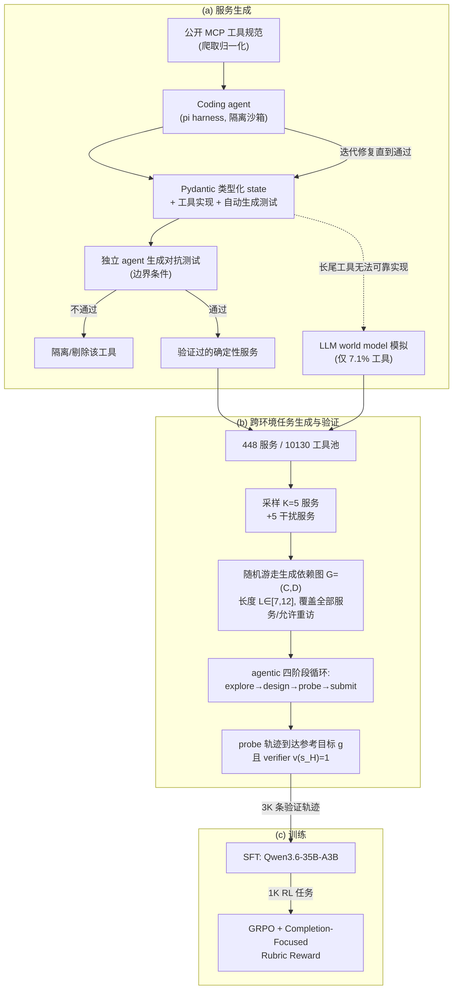

# CompoWorld: Compositional Environment Scaling for General Agents

> 把有限的可复用服务库通过依赖图随机游走组合出海量跨服务任务，配合按"未满足程度"加权的 rubric 奖励训练通用 agent。

## 元信息

AllSpark Team（未披露具体机构）/ 2026-09-27 / [arXiv](https://arxiv.org/abs/2609.33665) · [Code](https://github.com/AllSpark-Research/CompoWorld)。
对比基线：GPT-5.4、Claude Opus 4.6、Gemini-3.1 Pro、DeepSeek-V4-Flash、GLM-5.2、Kimi-K2.6、Qwen3.8-27B、Qwen3.5-397B-A17B，以及同规模（35B-A3B）的 agent 专用模型 Apodex 1.1 Mini、Occamy-1.0、Agents-A1、Nex-N2-mini、BigBang-1.0、Ornith-1.5-35B。方法论上与 [[verifiable-reward-environment-generation]] 页面已收录的 VHD-Play（机制先行）、SkillGym（skill-模板先行）、AgentScaler（工具即数据库读写）、[[recreation-bench]]（参考先行）并列，是该概念页的第五条技术路线。

## 要解决的问题

现有 agent 环境自动构造方法（AgentScaler、ScaleEnv、Agent-World 等）大多只在**单个环境内**生成任务，但真实工作流经常需要跨多个服务串联信息与动作（例如：查 Snowflake 数据库找逾期工单 → 查 PDF 手册确定处理方式 → 用邮件通知经理和客户）。AppWorld 这类多应用基准已经暴露了这个需求，但训练侧缺少对应的、可规模化的跨环境任务生成方法。论文把"服务组合本身"变成环境规模化的一个可控维度，并给出三个具体挑战：① 自动生成的服务要能独立可靠执行、又能互相兼容组合；② 合成任务要有真实的跨服务依赖、且可解可验证；③ 这些任务要能同时喂给 SFT 和 agentic RL，包括 agent 只完成部分工作流的情况。

## 方法

**服务生成（typed environment modeling）**：从公开 MCP 实现爬取工具规范，coding agent（跑在 pi harness 提供的隔离执行沙箱里）为每个服务推断实体、写出 Pydantic 状态模型和工具实现，Pydantic 校验拒绝非法字段/更新，保证状态迁移符合 schema。生成后先跑自造测试反复修复，再由**独立 agent** 针对规范生成对抗测试（含边界条件）做二次质检，未通过的工具直接隔离、不计入确定性环境。无法可靠本地实现的长尾工具（依赖外部系统或超出 coding agent 能力）改用 LLM world model 模拟状态更新与观测，同样经过 Pydantic 校验类型合法——最终只有 **7.1%** 的工具、约 **10%** 的样本会用到 world model，绝大多数训练信号仍来自确定性执行。最终产出 448 个服务、10,130 个工具，覆盖 13 个以上业务域（软件开发/DevOps 占比最大 22%）。

**跨环境任务生成与验证**：把 $K$ 个服务组合成乘积环境 $E_C=\bigotimes_i E_i$（联合状态空间、按服务命名空间隔离的动作/观测空间，式 (1)）。用**随机游走**在选中的服务上生成依赖图 $G=(C,D)$：游走长度 $L>K$，覆盖全部服务、不能连续重复访问同一服务、且必须至少重访一个服务（式 (3)）——重访对应"之前拿到的信息已过期，需要重新读取"这种典型跨服务约束。给定这个游走骨架，coding agent 在四阶段循环里把它具体化：explore（在沙箱里摸清服务工具/状态格式）→ design（把游走变成具体场景、初始状态 $s_0$、指令 $u$、结构化 rubric）→ probe（agent 自己执行游走求出参考目标 $g$，rubric 逐条转成可执行终态检查，verifier 必须接受这条参考轨迹，式 (4)）→ submit。验证只检查任务相关条件，不要求和参考轨迹逐字段相同，允许其他成功轨迹走不同工具序列。

**Completion-Focused Rubric Reward**：跨服务任务通常要求多个条件同时成立，均匀 rubric 打分（$R_i^{uniform}=M^{-1}\sum_j b_{ij}$）能给部分完成的轨迹以部分credit，但对"整体是否达成用户目标"不敏感——例如更新了记录但没发通知,仍然可能拿到不低的均匀分。CompoWorld 改为按组内该条 rubric 的**通过率**反向加权：$p_j=\frac1N\sum_i b_{ij}$，$w_j=\lambda+(1-p_j)$，$R_i=\sum_j w_j b_{ij}/\sum_j w_j$（式 5），$\lambda>0$ 保证每条 rubric 都有正权重。组内通过率越低的条件权重越高,把学习信号集中到"大家都做不到的那些未满足项"上,而不是被"大家都轻松满足的简单项"稀释。之后照常套 GRPO（组内奖励标准化取 advantage，式 6-8，clip 参数 (0.20, 0.28)，$N=8$，KL/熵系数为 0）。

## 实验与结果

八个 benchmark 平均提升 **+9.17 分**（Table 1）：τ³-Banking +5.84、DeepPlanning +9.17、VitaBench +10.50、VitaBench2.0 +1.62、**AutomationBench +22.00**（10.33%→32.33%，超过 GPT-5.4 的 27.67% 和 Claude Opus 4.6 的 25.50%，逼近 DeepSeek-V4-Flash 的 36.33%）、WildClawBench +3.18、SkillsBench +15.19、ALE +5.82。在 AutomationBench 上领先全部 6 个同规模（35B-A3B）agent 专用模型，比最强基线 Occamy-1.0 高 4.73 分。AutomationBench 分域结果（Table 2）：均分从 41.94 升到 72.68，HR 提升最大（+49.40），Sales 提升虽大（+31.45）但绝对分仍最低（58.93）。

**环境规模化实验**（§5.3.1）：固定服务库和 SFT 流程，只变 SFT 样本量（100/500/1K/3K，每条样本对应一个独立组合环境）。100 条起就全面超过 backbone；AutomationBench 在 1K 时达到 33.33%，3K 时略降到 32.67%；SkillsBench 在 500→1K 先涨（44.23→45.13）3K 时回落到 40.91（仍高于 backbone 32.52）——说明不是"数据越多越好"的单调关系,规模效应会饱和甚至轻微回退。用组合数公式 $N_K=\binom{n}{K}$ 说明：$n=448$、$K=5$ 时组合空间约 $1.47\times10^{11}$，$K=7$ 时约 $6.86\times10^{14}$——但作者明确指出这只是候选组合数,真正决定训练价值的是任务合成与验证能挑出多少个"有意义、可解"的组合。

**组合 vs 单一环境消融**（§5.3.2，Figure 5a）：固定 1K 条轨迹和相同 SFT 流程，对比"来自单一环境"vs"来自组合环境"两种数据来源。组合环境全面碾压：τ³-Banking 9.62→17.53（+7.91），AutomationBench 12.83→33.33（+20.50）。**更值得注意的是**，单一环境 SFT 在 τ³-Banking 和 DeepPlanning 上反而比 backbone 略有下降——单纯堆更多"单环境"数据不保证提升,组合结构本身才是关键收益来源。

**RL 训练动态**（§5.3.3）：SFT 之后均匀 rubric 分已经偏高（容易的条件基本都满足了），但完整任务通过率仍低——这是论文观察到的普遍现象："rubric 分不低但 pass rate 低"。Completion-Focused 加权后训练奖励曲线：前 10 步到约 0.69，中段稳定在 0.65-0.67，80 步回升到 0.75，150 步收敛到约 0.79。RL 相对纯 SFT 平均再提 1.2 分,但**不是所有 benchmark 都涨**——SkillsBench 明显受益,τ³-Banking 反而略降。作者坦承"整体提升主要由 SFT 驱动"。

## 局限与疑点

- **环境质量靠下游收益间接证明，没有大规模直接校验**（Appendix B 自陈）：论文承认无法对全部合成环境做逐个人工核验，只能靠"训练后收益持续为正"来反推环境整体可用,这不能排除个别环境有错误但恰好没被下游任务触发的情况。
- **RL 收益有限且不稳定**：8 个 benchmark 里只提升 1.2 分（远小于 SFT 的 9.17 分主贡献），且 τ³-Banking 上 RL 后反而下降——Completion-Focused Rubric Reward 的价值目前主要体现在"帮助 RL 不掉分/小幅提升"，而不是像标题暗示的那样是主要收益来源。
- **AutomationBench 版本和评测协议差异**：部分 baseline（Occamy-1.0 等 5 个模型）用的是"其他报告里的数字"而非同一协议下评测，作者自己也标注了"Apodex 是我们自己跑的、其余引用 Occamy report"，跨协议对比的可比性打折扣。
- **世界模型模拟误差未定量评估**：论文承认"一旦模拟观测不准确，可能影响后续决策"，但没有给出 7.1% 世界模型工具对最终任务成功率的直接影响量化（只做了整体消融，没有单独隔离 world-model 工具的误差贡献）。
- **随机游走生成的依赖图是否代表真实工作流分布未验证**：长度 $L\in[7,12]$、$K=5$ 是经验选定的超参数，论文没有和"真实企业工作流的服务调用链长度分布"做对照。

## 对我们的启发

- **"隔离沙箱内跑 coding agent 生成+自测+对抗测试服务代码"这条流水线本身就是我们平台的目标负载**：每个服务的 explore/design/probe/submit 四阶段循环、加上独立 agent 做对抗测试，本质上是大量短生命周期、高并发的 agentic coding sandbox 任务（[[agent-execution-sandbox]]）。论文用"pi harness"承载这些沙箱，但完全没有披露沙箱数量、并发度、单个服务生成耗时——这正是我们如果要支撑同类 pipeline 需要自己压测的关键容量指标。
- **服务级"乘积环境"的隔离模型对我们沙箱设计有直接参考价值**：$E_C=\bigotimes E_i$ 意味着每个服务的状态、工具和沙箱资源理论上可以独立管理，跨服务任务只通过 agent 的 observation/action 序列耦合,不需要跨服务共享底层状态存储——如果我们要支持这类多服务组合训练,可以按"每服务一个轻量沙箱/mock 进程 + 共享的编排层"来设计,而不必为每个组合任务整体起一个大环境。
- **训练数据规模化的成本结构值得对照我们自己的 rollout 成本模型**：3K SFT 轨迹 + 1K RL 任务就能撬动明显收益（AutomationBench +22 分），说明这类跨服务组合任务的"数据效率"可能高于纯单环境任务——但论文没有披露生成 448 个服务 + 验证这些轨迹所消耗的 agent 调用/算力成本，无法算出真实的单位收益成本比,这是一个值得追问的空白。
- follow-up 1：调研 "pi harness" 项目本身（`earendil2026pi`引用，论文未展开），看它作为"agentic 服务生成专用沙箱运行时"和我们现有沙箱能力的差距。
- follow-up 2：Completion-Focused Rubric Reward 的加权公式 $w_j=\lambda+(1-p_j)$ 计算开销很低（只需组内统计通过率），如果我们平台要支持 rubric 类奖励的 RL 训练,可以直接作为默认的 reward 后处理层,而不需要等团队自己重新发明。
- follow-up 3：调研 AutomationBench、τ³-Banking 等使用的 benchmark harness（OpenHands、Claude Code、OpenClaw）在多服务/多工具场景下的沙箱隔离与并发模型，判断是否可以复用为我们内部评测环境。

## 相关

- 相关概念：[[verifiable-reward-environment-generation]]、[[gef-loop]]、[[agentic-rl-environments]]、[[grpo]]、[[generator-verifier-asymmetry]]、[[agent-execution-sandbox]]
- 相关笔记：无（本篇为知识库中首篇讨论"服务组合式"环境生成的笔记）
