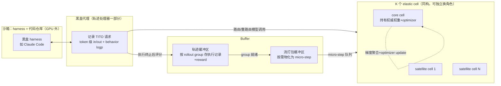

# QwenGyre: An Elastic Reinforcement Learning Framework for Training xLong-Horizon Agents

> 用"可独立换角色的小 GPU cell"做细粒度弹性调度、加"共享前缀轨迹树"做分支执行去重，把 xLong（小时级、近百万 token、黑盒 harness）agentic RL 的端到端时间比 Colocate/Async 压缩 1.2×–1.85×。

## 元信息

- 机构：Alibaba Token Hub（阿里巴巴集团）、中国科学技术大学、清华大学
- 发表：2026-09-27（arXiv v1）
- 链接：[arXiv](https://arxiv.org/abs/2609.33848) · 代码/项目页未见
- 对比基线：Async（[[rollout-training-disaggregation|固定资源池]] 式异步）、Colocate（HybridFlow/ReaL 式共享池整体切换）；两者均使用与 QwenGyre 相同的 boundary dispatch 和 [[grpo|scheduling staleness]] 目标值做公平对比

## 要解决的问题

论文定义了一个新的工作负载区间 **xLong-horizon**：单次 rollout 执行持续数小时、包含数百次模型-环境交互、跨越近 100 万 token（比常见的 SWE-bench 式"数十次交互"的 long-horizon 再高一个量级），典型场景是端到端仓库生成、系统复刻、跨代码库重构。这带来两个此前系统没有专门解决的问题：

1. **调度**：xLong 执行的时长方差极大（尾部执行可能是中位数的数倍），且 harness 这一层没有通用的 checkpoint/resume 能力——训练框架只能通过一个代理转发模型调用、拿到任务级评估结果，看不到、也管不了 harness 内部状态。[[async-rl-training|Colocate]] 因为要整池切换，必须等最慢的尾部执行结束，GPU 大量空闲；[[rollout-training-disaggregation|Async]] 固定资源池划分虽然能重叠两个阶段，但在 xLong 场景下一批数据准备好的等待时间会远超一个训练 step 的时间，僵化的划分又不能把空闲的一侧资源借给另一侧。
2. **轨迹构造**：为了撑过数小时执行，黑盒 harness（如 Claude Code）普遍会压缩（compact）饱和的历史、把子任务委派给独立上下文的 sub-agent、重试失败路径——这让一次执行不再是一条线性轨迹，而是一棵分支的、非线性的上下文图。如果对每条路径都展开成独立训练样本，共享前缀会被重复编码/重复计入 loss，训练开销爆炸；同时评估黑盒 harness 只能拿到"任务级"结果，必须自己决定用哪些角色、哪些 token、按什么权重参与训练目标。

## 方法

QwenGyre 由两个协作的平面组成：**弹性调度器**（解决问题 1）和**轨迹处理器**（解决问题 2），通过共享的训练 micro-step 流连接。

### 弹性调度器：用"waterlevel"驱动 cell 角色切换

- **拓扑感知的资源组织**：K 个同构的 elastic cell 共享同一套训练并行布局（TP/PP/EP/CP 组保持在 cell 内、优先高带宽互联），外加一个可选的 standalone rollout 池。cell 按固定顺序排列，第一个是持有权威权重、唯一拥有 optimizer 状态的 **core cell**，其余是 **satellite cell**。
- **Boundary dispatch + waterlevel 控制**：调度器维护三个累计计数——已派发 $d(t)$、已启动 $p(t)$、已终止 $f(t)$——定义 waterlevel $w(t)=d(t)-f(t)$（未完成执行数，burst 内单调不增）。只有当"剩余 rollout 容量能覆盖当前未完成执行数"（$w(t)\le C_R(t)-C_e$，式 5）时，下一个 cell 才能从 rollout 转去训练；转移按 core 优先、satellite 按序的顺序**串行**发生，一旦转入训练就保持到本 burst 结束，形成一个不断增长的"训练前缀"。burst 结束权重同步后，core 是否继续留在训练还要看下一批数据是否已经备好（式 6），否则退回 rollout。
- **Harness-preserving 角色转移**：转移时代理把模型调用重路由到新目的地，harness/工作区/工具执行状态全程不受影响；转移前源 cell 先停止接收新请求，调度器预留目标容量，取消源端在途请求后代理透明重试到新目的地。**KV-cache 通过 RDMA 迁移**：源端先 pin 住 KV 块，取消请求且停止写入后目标端读取，源端等目标确认接管才释放，减少前缀重算。角色状态管理上，rollout 参数/KV cache/临时 buffer 被卸载，训练参数/buffer 被恢复；后端进程和通信组全程不重建。实测切换耗时：rollout→训练 8.52s，训练→rollout 3.46s，相对数小时的 rollout 执行几乎可忽略。
- **流式训练支持 satellite 中途加入**：core 通过 Mooncake Transfer Engine 在训练开始前及每个后续 step 前暴露自己的权重 buffer；satellite 按固定顺序加入正在进行的 batch，RDMA 拉取 core 的权重快照后即可开始训练而不打断 core；梯度累积期间权重保持不变，保证加入者读到一致快照，controller 在 optimizer update 前关闭加入窗口。K 个有序 cell 预先建好 K-1 组通信组（对应 2..K 个 cell 的每个前缀），每次集合通信用匹配当前参与前缀的那组。轨迹缓冲区按 rollout group 存执行记录+reward，流打包缓冲区按需从最旧策略版本的就绪 group 里取数据、物化成 token 行、重排以提升 packing 效率，发出小粒度的 micro-step；cell 从共享队列原子领取 micro-step（更快的 cell 多领），让参与 batch 的各 cell 尽量同时完成，用持续的 1F1B 流水线处理，数据暂时不可用时在一致的调度点暂停而不丢流水线状态。

### 轨迹处理器：TITO 轨迹树 + 部分评分 + 有界去重采样

- **TITO 记录 + 前缀共享轨迹树**：代理以 token-in/token-out（TITO）记录每次模型调用的精确输入/输出 token id、behavior log-prob 和元数据；同时按 call ID 缓存原始工具调用负载，在匹配历史前还原它们，避免 harness 对工具调用做格式重排导致的历史误判。每次执行的所有记录被组织成一棵**轨迹树**：新请求与已有路径做前缀匹配，只编码新增内容并作为新节点挂上去，分叉的上下文形成分支，无匹配前缀的请求挂到根——由此显式捕捉 compaction 和 sub-agent 调用引入的不同上下文路径，候选轨迹在被选中前始终留在这个共享表示里，避免对每条路径做全历史展开。
- **部分评分（Partial Scoring）**：执行终止（包括超时）后，QwenGyre 对**已保留的工作产物**打分而非对时长/轨迹长度/终止状态打分，这样超时但已有部分进展的执行也能拿到有效、区分度更高的分数（不是所有失败给同一个 0 分）。评估器返回分数、有效性状态、被评估状态的引用；评估失败（区别于合法的 0 分）会在预算内重试，预算耗尽则整条执行被剔除出训练；对于连镜像拉取失败这类完全没有可评估产物的罕见情况，插入 reward=0 的占位轨迹。
- **有界、按角色优先级去重的轨迹采样**：先按"provenance"打掩码——只有策略在 rollout 时真正生成的 token 才是可训练目标，harness 注入的 system/user/tool 内容只作为条件上下文；然后把轨迹树的叶子按角色分类并排序：`main > main-summary > sub-agent > sub-agent-summary`（式 7）——主 agent 的回合是任务级 reward 最直接归因的对象，压缩摘要类轨迹管理上下文而非直接做任务，优先级更低。采样过程从最高优先级、仍有未掩码 token 的类别里按未掩码 token 数成比例抽一条叶子，把它 root-to-leaf 路径全部掩码（保证共享前缀不被重复计入训练），重复直到没有可训练 token 或达到每次执行最多 $J_{\max}$ 条轨迹的上限。被选中的轨迹继承其执行的组相对 advantage，在**执行内部对可训练 token 求平均、再对执行间求平均**，防止某次执行因为选出更多轨迹就获得更大的聚合权重。RL 算法用他们对 GSPO 的改造（token 级 importance weight 上限 5，[[grpo|sequence-level clipping]] 区间 [0.995, 1.005]）。

## 实验与结果

- **规模**：Qwen 3.6 122B（NL2RepoBench 用 32 节点/8 cell×4 节点，DeepSWE/TerminalBench 用 24 节点/6 cell）与旗舰模型 Qwen 3.8 2.4T（4 cell×48 节点，共 192 节点）。所有任务都用 Claude Code 2.1.220 在容器化环境里执行 shell/文件操作——即论文自己也是"黑盒 harness"落地的直接例证。
- **端到端速度（Table 2、Figure 7/8）**：
  - Qwen 3.6 122B + NL2RepoBench：相对 Async 提速 1.42–1.53×，相对 Colocate 1.36–1.47×（48 步，两个 staleness 目标下）。
  - Qwen 3.6 122B + DeepSWE/TerminalBench（24 步）：相对 Async 1.38–1.57×，相对 Colocate 1.61–1.85×（Table 2）。
  - **旗舰模型 Qwen 3.8 2.4T + NL2RepoBench**（约 700K token/rollout）：48 步 QwenGyre 耗时 75.42 小时，Async 134.55 小时，Colocate 91.47 小时——分别提速 1.78× 和 1.21×；同时评测 passrate 从 52.48% 提升到 58.54%，训练分数曲线与两个 baseline 基本一致（说明加速不是靠牺牲训练效果换来的）。
  - 论文指出：在这个配置下相对 Colocate 的增益变小，是因为 query 时长高度集中在超时上限附近（61.1% 的 query 超过 4 小时，其中 38.2% 以整体超时结束），留给 QwenGyre"提前回收部分 cell 逐步扩训练"的窗口更窄。
- **消融（Table 1，NL2RepoBench 前 12 步）**——论文用一条演化路径说明每个设计要素的边际贡献：
  - Async 加 streaming（A0→A3）：省 11.6%，但固定资源划分仍是根本瓶颈。
  - Colocate 加 standalone rollout 节点（C0→C1）：只省 2.9%，因为额外派发以牺牲每 burst 训练步数为代价；再加 streaming（C1→C2）省 14.8%，但因为 28 个共置节点仍要整体切换，streaming 只能在 burst 末期开始。
  - **Streaming + 细粒度弹性分配的组合（C2→E0）**：再提速 1.19×——这是论文论证"两个机制缺一不可"的关键证据：streaming 让数据更早可用，细粒度分配让训练资源能随数据到达同步扩容。
  - 单步 burst（E1）比多步 burst（E0）慢 10.9%，但仍比同样单步 burst 的 streaming Async（A3）快 1.24×、比 streaming Colocate（C2）快 1.08×——说明细粒度弹性分配本身的收益不依赖多步 burst。
  - Cell 粒度（E0 的 8×4 节点 vs E2 的 4×8 节点）：在这个 32 节点预算下只差 2.2%，因为 E0 本身训练已被 rollout 完全隐藏（20.85% slack），粗一点的粒度只是把很小一部分训练暴露到关键路径上。
  - **轨迹采样预算**：只采主轨迹（$J_{\max}=1$）训练分数更低、梯度范数更大；$J_{\max}=5$ 已能匹配"全采样"（uncapped）的训练分数和梯度范数，同时把前 42 步的平均前向-反向时间压到 uncapped 的 74.8%（相对 $J_{\max}=1$ 的 41.4% 高出一截，但换来了训练质量），即用 25.2% 的前向-反向时间节省换到了几乎无损的训练效果。

## 局限与疑点

- **GPU 预算下限未知**：弹性调度需要多个能独立切换角色的 cell，同时保留足够 rollout 容量服务未完成执行；论文承认"预算太小可能无法支撑这种组织形式"，但只在 32 节点预算下测过 cell 数量从 8 降到 4 的影响（2.2% 差异），没有测过更小总预算下的效率退化曲线——对于预算有限的团队，这条边界在哪里是未知数。
- **多步 burst 下无法做全局 shuffle**：$\mu>1$ 时 streaming training 把就绪的 rollout group 增量分配给相继的 update，无法在 burst 开始前对所有 minibatch 做全局重排；论文只用执行时间的消融量化了单步 vs 多步 burst 的速度差，**没有隔离测量这种非全局随机化对学习质量本身的影响**——如果读者的训练流程强依赖全局 shuffle，需要自己验证这一点。
- **旗舰模型上相对 Colocate 的收益缩水到 1.21×**：论文把原因归结为"query 时长集中在超时上限附近，留给早期 cell 回收的窗口变窄"，这是一个定性解释，没有给出"timeout 集中度"与"QwenGyre 相对 Colocate 收益"之间的定量关系，读者难以预判自己的工作负载会落在哪个区间。
- **角色分类规则是 Claude Code 专属的启发式**：`main > main-summary > sub-agent > sub-agent-summary` 的优先级是针对 Claude Code harness 的角色结构设计的；论文没有讨论这套分类规则在其他 harness（不同的 compaction/sub-agent 语义）上是否需要重新定义，是否具有通用性存疑。
- **评估器/部分评分机制本身依赖任务可"部分评估"**：Partial Scoring 假设执行终止时的工作产物是可评估的（如已生成的部分代码可跑测试），对于产物形态更抽象、没有清晰"部分正确性"定义的任务（如某些开放式对话/规划任务），这套机制能否直接套用未讨论。
- 论文完全由 Alibaba 内部团队完成，评测集（NL2RepoBench、DeepSWE、TerminalBench）里 NL2RepoBench 训练阶段用的是"另一个 Qwen 3.7-Max 做评估器打分"——评估器本身的偏差/一致性未做单独讨论。

## 对我们的启发

1. **"cell 级弹性角色切换 + harness 状态原地保留"是比"整池 colocate"或"静态 async 分区"更细粒度的第三种调度范式**，值得作为我们沙箱/训练混部调度系统的候选设计：它不要求两类 workload 物理隔离（像 [[rollout-training-disaggregation]] 里 Spot rollout / 稳定 training 池那种按中断容忍度切分），而是让**同一批 GPU 单元按需在两种角色间切换**，代价是需要维护 KV-cache RDMA 迁移和请求透明重路由这两套基础设施。如果我们的调度层已经具备类似的"cell/资源组"抽象，可以评估往这个方向补齐角色切换能力。
2. **"waterlevel"（未完成执行数 vs 剩余 rollout 容量）是一个简单但有效的调度触发信号**，本质是一个基于未完成工作量的水位线控制，不需要复杂预测；我们做调度系统时，这种基于实时计数器（已派发/已启动/已终止）的简单阈值控制，比依赖长期负载预测的方案更容易落地和调试，可以作为弹性伸缩触发器的参考设计。
3. **黑盒 harness 场景下的"请求透明重路由 + KV-cache RDMA 迁移"直接对应我们沙箱迁移/负载均衡的技术栈**：这与 [[agentic-rollout-preemption]] 里 DeepSeek 的"沙箱 pause/resume + token 级 KV/路由状态持久化"是同一问题的不同解法——QwenGyre 是"转发点"层面的迁移（代理把请求路由到新 GPU 引擎，harness 完全不感知），DeepSeek 是"沙箱"层面的暂停恢复。两者可以正交组合：我们如果同时需要"GPU 引擎级角色切换"和"沙箱级抢占回收"，可以分别借鉴。
4. **轨迹树前缀去重 + 按角色优先级的有界采样，是把"评测产物"转成"训练数据"这一步的工程范式**，尤其是 $J_{\max}=5$ 用 25.2% 的前向-反向时间节省换到几乎无损训练效果这个消融结果，说明"限制每次执行的训练轨迹数"是一个性价比很高的旋钮——如果我们要自建 agent RL 数据管线，这是一个可以直接照搬的具体参数化设计（角色优先级排序 + 概率正比于未掩码 token 数的抽样 + 执行内/执行间两层平均）。
5. **Follow-up 建议**（可转 issue）：
   - 调研 QwenGyre 相关工作里提到的 TideRL、BiDiRL、DynaResize、Libra 这几个"弹性 rollout-训练资源重分配"系统，横向对比它们与 QwenGyre 在触发信号、切换粒度、状态保留方式上的异同，判断哪种设计最贴近我们现有调度器的扩展路径。
   - 精读 Agent Lightning / LEGO-RL / Polar / ClawGym II（论文 §7 提到的"黑盒 harness 结构化轨迹"同类工作），确认 QwenGyre 的轨迹树设计相对它们的增量具体在哪（论文自己的定位是"三者各自解决轨迹捕获/信用分配/前缀计算中的一个子问题，QwenGyre 是耦合调度与轨迹处理"）。
   - 如果我们要复现"cell 级弹性切换"，需要先验证 Mooncake Transfer Engine 的 RDMA 权重拉取 + KV-cache 迁移在我们自己的硬件互联拓扑上是否可行，这是论文假设的前提条件，未必在所有集群上都成立。

## 相关

- 相关概念：[[elastic-rollout-training-scheduling]]（新建）、[[agent-trajectory-tree-dedup]]（新建）、[[agentic-rl]]、[[rollout-efficiency]]、[[async-rl-training]]、[[rollout-training-disaggregation]]、[[agentic-rollout-preemption]]、[[grpo]]
- 相关笔记：[[2609.25463]]（Rollout Efficiency 综述，QwenGyre 的弹性调度落在其"Resource-Aware Execution + Pipeline Decoupling"交叉处）、[[2609.19969]] [[2609.22978]]（DeepSeek 的 rollout-训练抢占解耦，与本文的角色切换是互补的两层机制）
