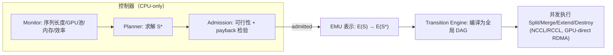

# Nereus: Adaptive Parallelism for LLM Post-Training

> RL 后训练跑起来后，TP/PP/DP 执行计划应该能像 K8s 里的 Pod 一样在线重排布——Nereus 用「模型-阶段副本」作为状态迁移的最小单元，把重规划开销压到运行时间的 0.079%。

## 元信息

机构：Aalto University / Shenzhen University of Advanced Technology / Zhejiang University
发表：2026-09-28（arXiv, cs.DC / cs.AI）
链接：[arXiv](https://arxiv.org/abs/2609.34645) · [HTML](https://arxiv.org/html/2609.34645v1) ·（未见开源代码链接）
对比基线：OpenRLHF、Verl (HybridFlow)、Laminar（异步）；迁移效率对比 UCP、MCP、Gemini、Tenplex、Oobleck、DynaRL

## 要解决的问题

RL 后训练一次运行会协调 actor/critic/reward/reference 等多个模型跨 generation / inference / training 三个阶段，在 GPU 集群上运行。现有系统（Verl、OpenRLHF、AReaL、[[async-rl-training|Laminar]] 等）把 GPU 分配和并行度（DP/TP/PP）在启动时定死，此后不再变化——即便运行过程中出现三类漂移（drift）：

- **资源供给漂移**：Spot 实例被回收、共享集群调度器重新分配节点（作者引用的 AWS trace 显示 16-GPU job 十小时内有 10+ 次可用量变化）。
- **负载需求漂移**：actor 学会生成更长轨迹，Llama-3.1-8B 场景下 1000 步内生成序列长度从 500 涨到 8000 token（16×），KV cache 与激活内存随之暴涨；(4,2,2) 的 TP/PP/DP 配置在 2K token 时最快，到 4K 直接 OOM。
- **硬件效率漂移**：网络拥塞、限流、多租户干扰让同一执行计划的实际 step 延迟发生变化；离线预测器（llm-analysis）在 8 GPU 时选出不可行计划，在 64–256 GPU 时选出的计划比实测最优慢达 1.56×。

已有的部分方案要么完全不动态调整（同步/异步 RL 框架，Table 1 的 A 类），要么靠 checkpoint/restart 整体重建状态（B 类，粒度太粗、停顿长），要么只管单模型的弹性状态迁移（Tenplex、Oobleck，C 类，不协调多模型），要么在固定资源池内做组件级迁移（DynaRL，D 类）。多模型跨阶段协同适配留下三个未解决的问题：**何时**调整、**迁移什么状态**、**如何执行迁移**。

## 方法

Nereus 把这三个问题拆成三个独立又协同的模块（Fig. 1）：

**1. 何时调整——payback-based 准入策略**（[[elastic-parallelism-adaptation]]）
Monitor 持续读取序列长度、可用 GPU 池、峰值内存、计算/通信效率；两类触发器——GPU 数变化或内存违例（立即触发）、信号相对上次重规划参考值漂移超过阈值 $\delta_x$（论文取 $\delta_{\mathrm{len}}=30\%$）。触发后 Planner 求解：

$$\mathcal{S}^{*} = \arg\min_{\mathcal{S}} \widehat{L}_{\mathrm{step}}(\mathcal{S}) \quad \text{s.t.}\quad \mathrm{Mem}_{\mathrm{peak}}(\mathcal{S}) \le \mathrm{Mem}_{\mathrm{cap}},\ \sum_{\mathsf{M}\in\mathcal{C}_s}|\mathcal{R}_{\mathsf{M}}| \le |P_{\mathrm{gpu}}|$$

代价模型扩展 NanoFlow/Alpa 的思路到耦合多模型场景，按算子类别（GEMM、attention、某链路上的 all-reduce）在线校准效率系数，用 DP 在 latency–resource frontier 上选出全局计划。准入分两条路径：**urgent**（当前计划不可行时，放弃盈利性要求、只求可行，必要时退化到更小 batch/重计算，最终兜底 checkpoint/restart）与**opportunistic**（需要满足 payback 判据）：

$$\Delta L > 0 \ \land\ \frac{\widehat{L}_{\mathrm{tran}}}{\Delta L} \le \gamma H_x$$

其中 $\Delta L$ 是切换后预测的单步延迟节省，$\widehat{L}_{\mathrm{tran}}$ 是迁移的预测代价，$H_x$ 是触发信号下次越过阈值的步数（EMA 估计），$\gamma\in[0,1]$（默认 0.5）是置信边际。本质是把 Pollux/Sia 的 payback 原则从跨 job 集群调度搬到单个耦合 job 内部。

**2. 迁移什么状态——Elastic Model Unit（EMU）**
核心抽象：`EMU = ⟨M, T_{tp×pp}, R, θ, ω⟩`，即一个 model-stage（模型×阶段，如「actor generation」）的一个副本——把 TP/PP 及其状态封装在单元内部，DP 只体现为副本数量。选择这个边界而非 job 级（checkpoint 粒度）或 shard 级（Tenplex 粒度）的理由：TP/PP 要求跨 rank 强同步（collectives + 点对点），必须整体挪动；DP 副本间只是周期性同步，可以独立增删而不打乱内部通信模式。四个原语覆盖整个计划空间：

- **Split**：一个 EMU 拆成 k 个更小 TP/PP 布局的独立单元（同 GPU 集合内 resharding）。
- **Merge**：k 个副本合并成一个更大 TP/PP 单元。
- **Extend**：在新分配的 GPU 上复制出一个新副本，DP+1。
- **Destroy**：终止一个冗余副本、释放其 GPU，DP-1（只删冗余拷贝，不丢逻辑状态）。

**3. 如何执行迁移——全局迁移 DAG**
每个 model-stage 的变化按固定顺序 Split→Destroy→Extend→Merge 编译成局部 DAG；当多个 model-stage 共享临近满载的 GPU 池时，Nereus 加两条确定性规则：release-before-acquire（优先执行释放资源的原语）+ 按 generation→inference→training 的阶段序破环。当某次 Extend 的资源获取被阻塞，引擎会挑一个可执行的 Destroy 释放所需 GPU 并插入资源依赖边；若递归依赖到被阻塞的获取本身，则不选它，从而保证 DAG 无环——找不到这样的 Destroy 时该目标计划直接判不可行。执行层面用标准 NCCL/RCCL collectives（Split 用 AllGather、Extend 用 rank-aligned Broadcast），走 GPU-direct RDMA，不引入自定义传输栈；安全边界只在 RL-step 完成（同步）或权重同步点（异步）触发，保证参数/优化器状态、更新计数器、策略版本、RNG/dataloader 状态在迁移前后保持训练语义一致（全局 batch size 通过调整 per-replica batch 和梯度累积步数维持）。

## 实验与结果

三个集群：Cluster #1（128 节点/1024×AMD MI250X）、#2（64 节点/256×A100）、#3（8 节点/64×H200）(Table 3)。

**端到端吞吐**（Llama-3.1-8B PPO，§7.2）：
- 相对 OpenRLHF 提速 2.14–7.27×（中位数 3.99×），最大值出现在 Cluster #2 的 64 GPU 场景。
- 相对 Verl 提速 1.10–1.47×（中位数 1.21×）；step latency 最多降 31.9%。
- 强扩展性：Cluster #1 从 32→1024 GPU，Nereus step latency 降 15×，OpenRLHF 只降 10×；1024 GPU 处端到端仍比 OpenRLHF 快 3.20×。
- 8B–70B 模型规模上 Nereus 全线优于 Verl（Fig. 9）。

**计划选择质量**（§7.3.1–7.3.2）：代价模型对训练阶段延迟的预测 MAPE 4.96%（最大误差 14.61%，$R^2=0.9993$，72 组样本外测量）；在 18 组设置（3 种序列长度 × 6 种 GPU 规模）穷举的 480 个可行计划中，选中计划有 61.1% 精确命中经验最优，全部设置都在 5% 以内（p95 gap 4.1%）；重规划决策开销从 32 GPU 的 0.17ms 到 1024 GPU 的 338ms（SCIP 求解器同任务从 3.4ms 涨到 511s），峰值重规划内存 <100MB。

**真实漂移 trace 下的决策质量**（§7.3.3，Table/Fig. 11，**这是摘要里 27.7% 的出处**）：基于真实数据构造的 trace（序列长度从均值 1147.5 增长到 3722 token，GPU 从 8 变到 32），Nereus 平均 step latency 861.9s，比固定 TP/PP 初始布局（1191.6s）低 27.7%，比 DynaRL 式准入低 8.3%，比每 3 步强制重规划低 2.5%。三条留出 trace 上 Nereus 均值 858.7s/step，DynaRL 式 928.3s/step；每条 trace 只做两次 TP/PP 迁移，单次 6.5–16s，没有一次因迁移导致 OOM。

**迁移本身的代价**（§7.4，最关键的系统数字）：
- Table 2：16→32 GPU 同一份 8B actor/critic 迁移，checkpoint/restart（UCP）836.74s，shard 级（Tenplex）66.43s，EMU（Nereus）**6.52s**。
- Table 4：Extend（纯扩容）2.45–8.48s（4→8 到 32→64 GPU），比 Oobleck 快 3.8–9.9×，比 Gemini 快 6.7–10.8×，比 Tenplex 快 9.3–16.2×，比 UCP 快 115.7–284.1×。
- 1000 步、扩展到 1024 GPU 的完整 run 里，6 次 TP/PP 迁移共耗时 49.5s / 62353s 总时长（**0.079%**）；其中最大一次（同时把 GPU 从 512 翻倍到 1024）耗时 31.55s，UCP 做同样的事要 1629s。
- 70B 模型在 64 GPU 上做 resharding，比 MCP 快 99.1%，比 Tenplex 快 96.7%；8B 模型在 8–64 GPU 上稳定 15.7–16.1s（Tenplex 62.7–65.0s，MCP 329.9–486.5s）。
- 迁移 DAG 规划：1024 GPU 时 Nereus 用 1.22ms vs SCIP 求解器 120.10s（快 98443×），完成时间与 SCIP 最优解的 gap 全程 ≤6.9%。
- 跨 model-stage 并发协调（Table 5）：3 类重叠场景下 Nereus 100% 成功，DynaRL 式独立局部 DAG 只有 34–62% 成功（失败全部是共享 GPU 死锁，加长 timeout 也解决不了）。

**泛化性**（§7.5）：ReMax/GRPO 场景下 Nereus 比 Verl 分别快 13.3%/15.8%；全异步场景比 [[async-rl-training|Laminar]] 快 37.3%。训练行为对照：50 步内 Nereus 和 Verl 的 reward/KL 曲线基本重合（reward 0.90 都在 step 32 前后达到），但 Nereus 墙钟时间更短（3141s vs 3646s，含 4 次迁移，降 13.9%）。

## 局限与疑点

- **没有开源代码**：论文未给出 code_url，Nereus 43k 行 Python/C++/CUDA/HIP 实现是否可复现，目前无法验证。
- **plan search 限定 TP/PP 为 2 的幂**：作者承认这是遵循「GPU 集群常见实践」的简化，未讨论非 2 的幂配置下的损失。
- **同步执行假设安全边界=RL-step 完成**：异步场景的安全边界是权重同步点，论文没有展开讨论权重同步频率本身如何影响迁移窗口的可用性——如果权重同步很稀疏，迁移决策的响应延迟可能被拉长（这点作者未量化）。
- **对比 DynaRL 用的是"style"复现**：论文写的是 "DynaRL-style admission" / "DynaRL's per-component migration"，暗示是按论文描述复现而非跑原始系统，具体复现保真度未知。
- **代价模型校准依赖同构算子类别假设**："一个模型可以复用效率估计，只要算子形状和类别匹配"——异构模型混部（不同架构、不同精度）时这一假设是否成立没有讨论。
- **评测都在受控 benchmark trace 或围绕 8B 模型展开**：唯二的"真实漂移"trace 也是基于 Fig 3/4 的观测「构造」的（"trace built from real data"），并非直接接入生产环境在线跑；生产环境里资源撤销、抢占叠加发生的复杂交互情形未见验证。

## 对我们的启发

这篇论文对应研究方向里「训练系统 GPU 调度 + 弹性与容错」这一核心焦点，几乎是把「Pod 在线重调度」的思路系统化地搬进了 RL 后训练场景，几条可以直接对照我们平台设计的地方：

1. **EMU 这个状态边界的选择原则值得抄**：把"紧耦合的 TP/PP"与"松耦合的 DP 副本"分开处理，是这篇论文能把 16→32 GPU 迁移代价从 UCP 的 836s 压到 6.5s 的根本原因（Table 2）。如果我们平台未来要支持训练/推理任务的在线弹性伸缩（不只是 RL 后训练，也包括长时训练 job 的抢占迁移），"状态边界与依赖结构对齐"这条设计原则本身比 Nereus 的具体实现更通用——值得在我们自己的弹性调度/checkpoint 系统里对照检查：我们现在的迁移/checkpoint 粒度是不是也在"整体重建"和"逐 shard 手工协调"之间二选一，缺一个中间层？
2. **payback-based 准入是「值不值得抢占式重调度」的现成判据**：$\widehat{L}_{\mathrm{tran}} / \Delta L \le \gamma H_x$ 这个公式直接可以套用到我们自己的调度器决定"是否要为了资源效率重新摆放某个正在跑的任务"——尤其是我们做沙箱密度/超卖场景下的重平衡决策时，同样存在"迁移开销 vs 收益 vs 距离下次状态变化还有多久"的权衡结构，可以作为设计参考（[[agentic-rollout-preemption]] 里讨论的是"抢占时不丢状态"，这篇是"主动决定要不要挪"，两者互补）。
3. **迁移代价 0.079%（1024 GPU 规模）这个数字本身是一个强证据**：证明"允许执行计划在线漂移"在大规模下几乎不损失有效算力，这为我们评估"是否要在自己的训练/推理平台上支持更激进的在线重调度"提供了成本下界参考，而不是停留在"listen 起来很有风险"的直觉判断。

可执行的 follow-up：
- 找 Nereus 是否后续开源（目前未见 code_url），如果开源，评估能否复用其 transition DAG 调度器思路到我们自己的弹性训练/推理任务迁移场景。
- 调研我们现有的 checkpoint/resharding 方案（如果有）当前的状态迁移粒度是 job 级还是 shard 级，对照 Table 2 的三档粒度定位我们的位置，判断是否值得引入一层"model-stage 副本"级别的抽象。
- 把 payback-based admission 的公式套用到我们沙箱/训练资源再平衡场景做一次纸面推演，看这个判据在我们的抢占频率和迁移开销量级下是否成立。

## 相关

- 相关概念：[[elastic-parallelism-adaptation]]（本文新建，核心概念）、[[grpo]]、[[rollout-training-disaggregation]]、[[async-rl-training]]、[[agentic-rollout-preemption]]、[[expert-parallelism]]
- 相关笔记：（暂无同主题笔记，本篇是知识库里第一篇覆盖"RL 训练执行计划在线自适应"的笔记）
