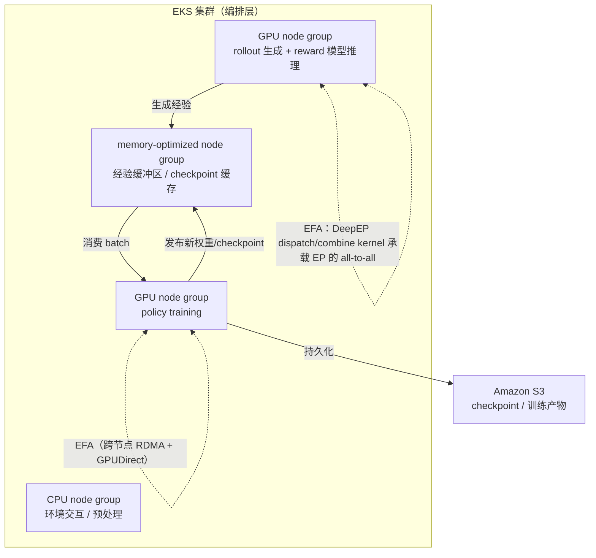

# Scaling MoE reinforcement learning on Amazon EKS with EFA and DeepEP with 40% more throughput

> AWS 官方博客：用 EKS 分节点组编排 + DeepEP-over-EFA 优化专家并行通信 + Spot rollout，把 MoE RL 的 rollout 吞吐提升 40%。

## 元信息

- 机构：AWS（官方 Machine Learning Blog，正文未列具体作者）
- 发表：2026-09-25
- 链接：[原文](https://aws.amazon.com/blogs/machine-learning/scaling-moe-reinforcement-learning-on-amazon-eks-with-efa-and-deepep-with-40-more-throughput/) · 引用的开源训练脚手架 [Miles](https://github.com/radixark/miles) · [DeepEP](https://github.com/deepseek-ai/DeepEP)
- 对比基线：同为 48×P5en（16 训练 + 32 推理）实例、同一个"super-sparse MoE model"，Slime 技术栈（无 EFA 加速专家并行） vs. DeepEP-over-EFA 技术栈

## 要解决的问题

MoE 模型做大规模 RLHF / GRPO 后训练时，三个挑战同时出现：① rollout 生成（弹性、追求聚合吞吐）与 policy training（紧耦合、要求 lockstep 同步）两种异构工作负载要协调；② 要在数百个加速卡间维持高吞吐通信；③ 要动态编排各子系统使其不互相拖累。

文章指出 MoE 相比稠密模型引入了新的基础设施矛盾：MoE 为了降推理成本做得越来越稀疏，训练反而**越来越受通信瓶颈约束而非算力约束**——根源是 Expert Parallelism（[[expert-parallelism]]）带来的动态 all-to-all token 路由，这是在 TP/DP/PP 之外新增的一种稀疏、细粒度、不均衡的通信模式。训练慢会拖慢推理 worker，推理吞吐不够又会让训练卡空转。

## 方法

架构三层独立伸缩：**EKS** 负责异构 worker（GPU rollout/训练、CPU 环境、内存优化经验缓冲）的调度、扩缩容与故障恢复；**EFA**（配合 P5/P6 上的 NVIDIA GPUDirect RDMA + OS bypass）承担跨实例的低延迟通信；**S3** 做数据集、checkpoint、训练产物的持久层。节点内高带宽走 NVLink/NVSwitch，节点间走 EFA。

核心优化点是 **[[deepep]] over EFA**：用专用的 dispatch/combine GPU kernel 替换通用 NCCL all-to-all collective，节点内走 NVLink，节点间通过 libfabric 把数据发到 EFA 上；AWS 向 DeepEP 上游贡献了 libfabric 移植，使 DeepEP v2 原生支持 EFA，同时 NCCL 2.31 也补上了针对稠密 collective 通信的 EFA 优化。

另一处优化是把 rollout 生成放到 EC2 Spot Instances 上（[[rollout-training-disaggregation]]）：rollout 是可分区的独立推理任务，worker 被 Spot 中断只需把未完成任务退回队列重新分配，不影响整体 RL 任务；而 policy training 保持在稳定容量（on-demand）上，避免 Spot 中断触发 NCCL 超时拖垮紧耦合的训练同步。

## 实验与结果

- 唯一给出的量化实验：48×P5en 实例（16 台专用训练 + 32 台专用推理），跑同一个"super-sparse MoE model"（引用了 [radixark/miles 仓库里的一个 GLM-5-744B-A40B 配置脚本](https://github.com/radixark/miles/blob/main/scripts/run_glm5_744b_a40b.py) 作为示例）。启用 DeepEP over EFA 后，**聚合 RL rollout 吞吐提升 40%**（Figure 5，柱状图未给出具体绝对吞吐数字）。
- 两个对比配置的技术栈**不只是"开不开 DeepEP"这一个变量**：基线是 Slime 技术栈（CUDA 12.9、PyTorch 2.9.1、NCCL 2.27、SGLang 0.5.9、Slime 0.2.4，无 EFA 加速专家并行）；改进版是本文的 DeepEP-over-EFA 技术栈（CUDA 13.0、PyTorch 2.12、NCCL 2.31、EFA 1.49、DeepEP 2.0、SGLang 0.5.17、Miles 0.1.0）——CUDA/PyTorch/NCCL/SGLang/训练框架全部同时升级了，"40%"这个数字里有多少是 DeepEP/EFA 的贡献、有多少来自其余组件升级（尤其 NCCL 2.27→2.31、SGLang 0.5.9→0.5.17），文章没有做消融，无法拆分。
- 文中另提到"内部工作负载"上该架构把端到端 policy 迭代时间也缩短了，并"扩展到约一千个加速卡规模"，但这两点**都没有给出具体数字**，只是定性表述。
- 没有给出成本数据（Spot 相对 On-Demand 具体省了多少、中断率如何），也没有和 InfiniBand 集群或其他拓扑感知 EP 通信库（如 DeepEP 之外的方案）做对比。

## 局限与疑点

- **对照组混淆变量过多**：如上，40% 提升是在同时升级了 CUDA/PyTorch/NCCL/SGLang/训练框架的情况下测出来的，不是纯粹的 DeepEP/EFA 消融实验，实际归因存疑。
- 只在一个模型（"super-sparse MoE"，未给出确切专家数/激活参数比例的完整消融）、一种实例配比（16 训练 + 32 推理）、一个规模（48 实例）下验证，能否外推到不同 EP 并行度、不同节点规模缺乏证据。
- 这是 AWS 官方博客，天然是在推广 EKS + EFA + DeepEP 这套自家技术栈组合，读数字时要留一个"广告"折扣；未与非 AWS 方案（如裸金属 + InfiniBand，或其他云的 RDMA 网络）做横向对比。
- Spot rollout 的可行性依赖"rollout worker 可以做到细粒度、可容忍中断的任务切分"，文章给出了设计原则（bounded work units、频繁发布已完成样本、drain on interruption）但没给出具体的任务粒度或排空延迟的工程细节。

## 对我们的启发

1. **rollout 与 training 要按 SLA 拆成两种资源池调度**：rollout 是无状态、可分区、可容忍中断的推理负载，适合上 Spot / 抢占式实例，靠"任务粒度小、频繁 checkpoint 完成样本、中断即退回队列"来做弹性伸缩；training 是强同步 lockstep 负载，一旦有慢节点/掉线就可能触发 NCCL 超时拖垮整个 job，必须放在稳定容量上并与 rollout 的资源波动隔离开。这正是我们沙箱/调度平台要支持的"同一 RL 任务下两类完全不同抢占/中断语义的 GPU workload 混部"能力——如果我们的调度器能把 rollout worker 标记为可抢占、把 training worker 标记为不可抢占且需要拓扑亲和，会直接对齐这篇文章的架构建议。
2. **Expert Parallelism 的通信模式对我们的拓扑感知调度提出新要求**：MoE 的 EP 通信是稀疏、细粒度、不均衡的 all-to-all，且这种流量随 EP 并行度增大会越来越依赖跨节点带宽，不能再假设"节点内 NVLink 够用、跨节点通信只是补充"。这意味着我们做 GPU 节点 placement / gang scheduling 时，需要把 EP 的通信域（哪些专家分片必须同节点、哪些可以跨节点但要保证跨节点带宽）作为一等公民纳入放置策略，而不只是套用 TP/PP 的规整通信假设。
3. **三层独立伸缩的架构分层（编排 / 高性能网络 / 持久存储）可以直接映照我们自己的平台设计**：把"控制面调度"（对应 EKS）、"跨节点高性能通信"（对应 EFA/DeepEP）、"经验回放与 checkpoint 的持久层 vs 高频读写的内存层"（对应 S3 vs memory-optimized node group）分开独立扩缩容，这个思路可以直接检验我们现有沙箱平台是否也做到了类似的关注点分离，尤其是"经验缓冲区"这种高频、非持久、需要低延迟访问的中间态数据层，我们目前有没有对应的组件。
4. Follow-up（可转 issue）：
   - 调研 DeepEP 的 dispatch/combine kernel 与 libfabric 移植细节，评估能否在我们自己的网络环境（非 AWS EFA，比如 RoCE/InfiniBand）上复用，或者需要哪些改造。
   - 调研除 EC2 Spot 外，其他云 / 自建集群上"抢占式实例 + 优雅排空"的等价实现方案，评估我们的调度器目前是否已支持类似的 rollout worker 中断-重排队语义。
   - 找一篇有消融实验（单独隔离 DeepEP/EFA 贡献 vs. 框架版本升级贡献）的论文或报告，验证"40% 吞吐提升主要来自通信优化"这个说法是否站得住。

## 相关

- 相关概念：[[expert-parallelism]]、[[deepep]]、[[rollout-training-disaggregation]]
- 相关笔记：（暂无同域笔记，本篇是知识库中第一篇 MoE RL 基础设施相关笔记）
