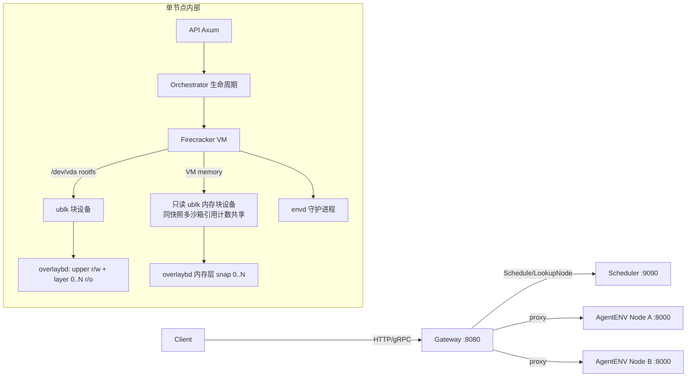

# AgentENV（kvcache-ai，Kimi K3 训练环境平台）文档

> 开源、自托管、E2B API 兼容的 Firecracker 沙箱运行时，为 Kimi K3 的 agentic RL 训练供能，生产规模达 150 万镜像、9.6x 内存超卖，是与我们平台架构最贴近的公开对标系统之一。

## 元信息

- 机构：kvcache-ai（GitHub 开源组织；贡献者含 Tsinghua University 邮箱域名的学生开发者，MIT 协议，90.1% Rust）
- 抓取版本：`latest`（mdBook 文档站），GitHub 仓库 `kvcache-ai/AgentENV`（3.6k star，34 个贡献者，2026-09-29 仍有活跃提交）
- 链接：[文档首页](https://kvcache-ai.github.io/AgentENV/latest/) · [Code](https://github.com/kvcache-ai/AgentENV) · [PVM 部署指南](https://kvcache-ai.github.io/AgentENV/latest/deployment/pvm.html)
- 对比基线：[[2609.22978]]（DSec，DeepSeek 的沙箱基础设施论文）；本篇的 storage/overlaybd 模块与 DSec 论文中"OverlayBD/ublk 存储层开源"链接指向的**是同一个 GitHub 仓库路径**（`kvcache-ai/AgentENV/tree/main/storage/overlaybd`），且两边贡献者名单里都出现 **Jialiang Huang**（DSec 论文一作，AgentENV 早期核心贡献者之一）——两个系统在存储层实现上大概率同源或有直接的人员/代码往来，但公开材料未明确说明具体协作关系，不能过度推断。

## 要解决的问题

Agentic RL 训练需要给模型提供大量、多样、有状态的 Linux 执行环境（跑代码解释器、工具调用、自主编程 agent），但通用 serverless/容器运行时假设"短生命周期、无状态、高复用"，无法直接满足训练规模的沙箱需求。AgentENV 要解决的是"自托管、可对接 RL 训练循环、跟 E2B 生态 SDK 兼容"的沙箱运行时问题：既要有 Firecracker 级别的强隔离，又要在镜像分发、快照恢复、fork 并行、内存超卖上做到生产可用的速度和密度。

## 方法

### 整体架构

单节点内 **API 层（Axum）** 校验请求后转发给 **Orchestrator**（状态机：Creating→Running→Pausing→Paused→Resuming→Snapshotting→Forking→Killing），Orchestrator 创建 Firecracker VM、配好网络、挂好块设备；VM 用**分层块设备**（overlaybd 只读层 + 可写 upper 层）启动，多沙箱共享同一批只读 base 层；VM 内 **envd** 守护进程负责命令执行/文件操作/健康上报；客户端通过 **反向代理**（`/proxy`，路由 header 或子域名）访问沙箱内暴露的服务。多节点场景在此之上加一层 **Gateway + Scheduler** 控制面（gRPC，`Schedule`/`LookupNode`/`RecordAssignment`/`Heartbeat`，round_robin 或 random 策略，sandbox-to-node 绑定默认纯内存、可选 Redis 持久化）。

### 存储子系统：overlaybd（LSMT）+ ublk

核心是把"分层镜像文件"转成"VM 可挂载的块设备"，两个自研 Rust crate 分工明确：

- **overlaybd（LSMT，Log-Structured Merge Tree 分层镜像格式）**：每层文件有 `HeaderTrailer`（magic `LSMT\0\1\2`）+ `DiskSegmentMapping` 段索引（16 字节/条，50 位偏移+14 位长度+55 位物理偏移位打包）。读路径按层从上到下查段索引，第一个命中的层给数据；写路径全部追加到 upper 层。压缩用 zstd level 3，支持随机访问跳表 + CRC32C 校验（不像 tar.gz 必须整体解压）。**快照（pause）路径**：`create_snapshot_and_restack()` 把当前可写 upper 层通过 `close_seal_and_reopen()` 密封成新的只读层，再在原地打开一个全新的可写 upper——这是 [[snapshot-layering|多层写时复制快照]] 的一种具体实现。
- **ublk（用户态块设备）**：用 Linux `ublk` 内核驱动把 overlaybd 镜像暴露成 `/dev/ublkbN` 块设备。设备生命周期走 io_uring `UringCmd` 控制通道，每队列独立 worker 线程 + slab 分配 I/O slot，支持 kernel 6.8+ 的零拷贝 `AutoRegBuffer`。一个独立长驻进程 `uvm-ublk-daemon` 统一管理全节点所有 ublk 设备（含 warm-pool acquire/release、resize、restack、delete），节点主进程只持有一个轻量 client 与其通信，把设备控制面和节点生命周期解耦。

### 内存快照恢复：ublk 而非 userfaultfd

与常见的 userfaultfd 按需拉页方案不同（`storage/uffd-core/` 保留了备用实现但**未纳入构建**），AgentENV 的内存快照恢复走同一套 ublk-backed overlaybd 机制：恢复时创建一个只读 ublk 设备（由多层内存 overlaybd 层堆叠而成），作为 Firecracker 的 `BackendType::File` 内存后端传入，Firecracker mmap 该块设备，首次写时 COW 到匿名内存，底层设备本身从不被修改。**同一快照模板启动的多个沙箱共享同一个内存 ublk 设备（引用计数）**，Linux page cache 因此也能跨沙箱复用，显著降低并发从同一模板启动时的 I/O。快照创建时（pause）查询 Firecracker 的 dirty/present 内存范围，用 `process_vm_readv` 读取选中内存并直接构造 overlaybd 内存层，父层按快照链堆叠形成完整内存镜像。

### 沙箱生命周期与三个核心概念

Template（可复用启动点，构建即产出一个已提交快照）、Sandbox（运行中的隔离环境）、Snapshot（从运行中沙箱捕获的持久检查点，可重复启动新沙箱）三者关系：构建模板产出快照 → 启动模板/快照产出沙箱 → 对运行中沙箱做快照产出新快照（不替换源沙箱）。**Fork**（从运行沙箱克隆出多个独立子沙箱，用于并行 agent workflow）是与 Snapshot 并列的一等操作：fork 出的子沙箱拿到**独立的** `envdAccessToken`/`trafficAccessToken`，源沙箱 fork 完成后回到 Running 状态。挂载的持久卷（volume）在 fork/snapshot 时也会自动各自做一份写时复制分叉，不需要手动管理。

### 三种认证凭据分离

API key（保护控制面 lifecycle/管理 API，`X-API-Key`）、`trafficAccessToken`（保护沙箱对外暴露的应用流量，`e2b-traffic-access-token`，`allowPublicTraffic:false` 时才需要）、`envdAccessToken`（保护 envd 控制操作如命令执行/文件传输，`secure:true` 时才需要）三者互不通用；后两者从沙箱身份 + 一个与 API key 无关的随机种子派生，集群部署时该种子需要在所有 runtime 节点间保持一致。

### PVM：无 KVM 场景的兜底虚拟化模式

当宿主机（常见于云 VM，嵌套虚拟化未开放）没有标准 `/dev/kvm` 时，AgentENV 提供实验性的 **PVM 部署模式**——直接采用 [[pvm]] 论文（*PVM: Efficient Shadow Paging for Deploying Secure Containers in Cloud-native Environment*, SOSP'23）提出的方案：宿主装一个带 `CONFIG_KVM_PVM=m` 的 PVM 专用内核（预编译包发布在 `kvcache-ai/linux` release，基于上游 `virt-pvm/linux` 的 `pvm-612` 分支，Linux 6.12.33），guest 内核开 `CONFIG_PVM_GUEST`；装好之后 AgentENV 依然通过标准 `/dev/kvm` 接口创建 Firecracker microVM，上层代码无感知虚拟化后端切换。一个节点只能二选一运行在 `kvm` 或 `pvm` 模式，两种模式的快照/暂停沙箱互不兼容、互相拒绝恢复。

## 实验与结果

本篇是产品文档而非论文，**没有可复现的实验方法论或消融表格**，以下数字全部来自文档/README 的性能声明（vendor claim），未说明测试环境、负载、硬件规格：

- 快照沙箱冷启动/恢复 <50ms，暂停 <100ms；增量快照捕获（含重度磁盘改动场景）<100ms（文档首页 Overview）。
- 生产规模：镜像/快照聚合足迹可**远超**单机磁盘容量、扩展到 **150 万镜像**（README，引用 Kimi K3 技术报告）；生产内存超卖比达 **9.6x**（README，Preserve performance and density over time 一节；文档站首页版本表述为"高超卖比"但未给具体倍数——两个页面同一版本号下数字表述不一致，见"争议与矛盾"）。
- 存储实测量级：单个 storage 层压缩用 zstd level 3；ublk I/O 支持 kernel 6.8+ 的零拷贝 `AutoRegBuffer`（相对传统 `UserBuffer` 分配的具体性能差没有给出数字）。

## 局限与疑点

- **完全没有第三方或自我评测数字**：所有性能声明（<50ms/<100ms/9.6x/150 万镜像）都是营销式摘要，没有测试方法、硬件规格、负载特征、置信区间，不能当作可比较的基准数据引用，只能当作"这个数量级是可达到的"的定性参照。
- **"9.6x 内存超卖比"与文档首页原始表述不一致**：GitHub README（`published: 2026-08-19` 之后修订）写的是具体倍数 9.6x，而 mdBook 文档首页 Overview 只说"sustaining high overcommit as environments run longer and diverge"，不给数字——两处内容明显是同一段文案的不同版本，数字可能是后加的生产更新，抓取时未找到两者的版本对应关系说明。
- **与 DSec（[[2609.22978]]）的关系停留在代码路径重合 + 人员重合的间接证据**，公开文档/README 都没有一句话明确说明 AgentENV 和 DSec 是否同一套基础设施的两个开源面（面向 DeepSeek vs 面向 Kimi K3），也没有说明 `storage/overlaybd` 这个 crate 具体是谁先写的、双方如何分享代码——这是一个值得后续追问但目前无法从公开材料确认的问题。
- PVM 部署路径被文档自己标注为 **EXPERIMENTAL**："尚未合并进主线 Linux 内核，fork 出来的内核可能得不到主线同等程度的测试和安全更新"——生产采用前需要自行评估这个风险。
- fork 操作只说明子沙箱获得独立的访问凭据（`envdAccessToken`/`trafficAccessToken`），**完全没有提及**内存快照克隆常见的"意外唯一性"问题（PRNG 种子、UUID、TLS/TCP 会话状态重复，参见 [[microvm-snapshot-uniqueness]]）——不确定这是"AgentENV 已经在更底层解决了但文档没写"还是"这个问题在他们的使用场景（fork 主要用于并行 agent workflow 而非需要密码学唯一性的服务）下没有被当成需要解决的问题"，只能存疑。

## 对我们的启发

1. **overlaybd（LSMT）+ ublk 是一套可以直接参考的、生产验证过的"块级按需加载 + 快照"实现路径**：相比 DSec 论文只给了架构描述和消融数字，AgentENV 把这套机制的完整 Rust 实现开源了（含格式细节、设备生命周期、warm-pool 设计），如果我们要做类似的按需镜像加载/快照子系统，这是比论文更可执行的参照对象——可以直接读代码而不是猜测实现细节。
2. **"同一快照模板的多个沙箱共享一个只读内存 ublk 设备（引用计数）"是一个值得对照的并发启动优化**：这与 [[microvm-snapshot-uniqueness]] 笔记里 Aurora DSQL"克隆实例共享未修改内存页"的做法是同一个思路的不同实现，说明"批量从同一快照启动时共享干净内存页"是这个领域的共识优化点，而不是某一家的特例——我们做批量沙箱冷启动优化时应该把这个能力列为标配而非加分项。
3. **Fork 作为一等公民操作（而非只有 pause/resume/snapshot）值得纳入我们的 API 设计**：AgentENV 把"从运行沙箱并行克隆出多个独立子沙箱"做成显式 API，并自动处理凭据、挂载卷的写时复制分叉——如果我们的 agent 训练场景也有"同一个初始状态、需要并行探索多条轨迹"的需求（如 RL rollout 的多分支采样），这是一个现成的 API 形状参考，比我们自己从零设计更省心。
4. **PVM 作为"无 KVM 宿主"兜底方案已经有可用的开源内核实现**：这直接回答了 [[pvm]] 概念页此前记录的开放问题（"PVM 是否已开源、有无可复现实现"）——`virt-pvm/linux`（上游）+ `kvcache-ai/linux`（预编译发布）已经是一个真实可部署、被生产系统采用的实现,如果我们未来需要在不受控的云 IaaS（无 `/dev/kvm` 权限）上跑强隔离沙箱，这是一条已验证可行、无需自己从论文重新实现的路径,但要正视文档自己标注的"EXPERIMENTAL/未进主线"风险。
5. **E2B API 兼容是一个廉价但高杠杆的生态选择**：不需要设计新 SDK，直接复用 E2B 现成的 Python/TS 生态,同时保留自托管、可对接内部调度器的自由度——如果我们评估要不要自建沙箱 SDK,"做一个 E2B 兼容层"可能比"从零设计协议"更快获得可用的客户端工具链。
6. Follow-up 建议（可转 issue）：
   - 读 `storage/overlaybd` 与 DSec §5.3 的代码/论文原文做逐项对照，确认两者是否共享底层实现，核实"Jialiang Huang 在两处都出现"这条线索背后的实际协作关系；
   - 实测或至少找到第三方评测,核实"<50ms 冷启动/9.6x 超卖"这类 vendor claim 数字在我们自己负载下是否成立,不要直接把数量级当作可比较基准;
   - 评估 PVM 部署路径（`kvcache-ai/linux` 预编译内核）在我们云环境上的可落地性,作为"无 host 权限场景强隔离"问题的候选方案之一。

## 相关

- 相关概念：[[sandbox-image-distribution]]、[[on-demand-image-loading]]、[[sandbox-density-overcommit]]、[[microvm-snapshot-uniqueness]]、[[pvm]]、[[agent-execution-sandbox]]、[[microvm-sandbox]]、[[firecracker]]
- 相关笔记：[[2609.22978]]（DSec，同类沙箱基础设施论文，存储层代码路径与部分贡献者重合）
- 与同issue阅读清单条目的关系：本 issue（#74，"F 对标：同类团队公开的环境/沙箱做法"）另一条目 **Kimi K2: Open Agentic Intelligence**（`id: 2507.20534`，标记为已读 #86，但当前知识库尚未找到对应笔记文件，可能笔记未合并或已被后续整理移除）本应是理解 AgentENV 业务背景（agentic 数据合成 + RL 基础设施）的前置阅读，本篇写作时未能交叉核对，留待后续补充。
