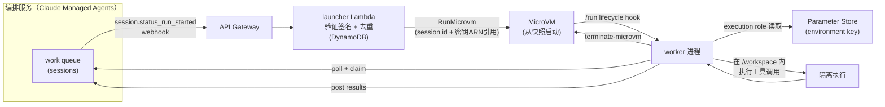

# Running self-hosted AI agent sandboxes with AWS Lambda MicroVMs

> AWS 把 AgentCore Runtime 里"每 agent session 一个 microVM"的隔离模型，产品化成通用的 **AWS Lambda MicroVMs**，并给出一套面向第三方自建编排系统（示例用 Anthropic Claude Managed Agents）的 webhook 启动 + 会话级隔离 + 4x 原地扩容参考架构。

## 元信息

- 作者/机构：AWS Compute Blog（未署名个人作者，官方产品博文），2026-09-18 发布
- 链接：[原文](https://aws.amazon.com/blogs/compute/running-self-hosted-ai-agent-sandboxes-with-aws-lambda-microvms/) · [参考实现仓库](https://github.com/aws-samples/sample-lambda-microvm-claude-managed-agents)
- 关联产品/文档：[Lambda MicroVMs 开发者指南](https://docs.aws.amazon.com/lambda/latest/dg/lambda-microvms-guide.html)、Lambda MicroVMs 发布公告博文（原文链接但未精读）、[Anthropic Claude Managed Agents 自托管沙箱文档](https://platform.claude.com/docs/en/managed-agents/self-hosted-sandboxes)
- 对比基线/相关笔记：[[brooker-seven-years-of-firecracker]]（本文是其 AgentCore Runtime "per-session microVM" 案例的产品化延伸）、[[2102.12892]]（本文完全未提及克隆唯一性问题，见「局限与疑点」）、母论文 [[2609.22978]]

## 要解决的问题

企业自建的内部 AI agent（如帮工程师优化数据库查询）在一次 session 里可能有多个工具调用：连真实数据库、生成代码、执行代码。当同时有几十个开发者使用同一个 agent 时，每个 session 都需要独立的凭据、独立的文件系统、独立的网络边界——没有隔离的话，一个 session 的工具调用可能污染另一个 session 的状态，或让凭据跨租户泄露。本文要解决的是：如何在**自己的 AWS 账号内**（而非依赖某个共享的多租户计算池）为每个 agent session 提供这种隔离，同时保持无服务器的弹性和按量付费。

## 方法

### AWS Lambda MicroVMs：产品化的三个关键能力

Lambda MicroVMs 是一个新的通用计算环境（区别于经典的 per-function AWS Lambda），底层同样用 Firecracker 虚拟化，但暴露的是**通用 Amazon Linux 运行时**，单个 microVM 最长可运行 **8 小时**，用户可编程式 launch / suspend / resume / terminate。三个关键能力：

1. **每环境 VM 级隔离**：每个 microVM 跑在独立的 Firecracker 虚拟机里，基于硬件虚拟化隔离，但不像完整 VM 那样有资源开销和启动延迟——两个开发者的 session 即使同时运行也互相不可见。
2. **从快照启动**：与 [[brooker-lambda-snapstart]] 里的 Lambda SnapStart 思路一致，microVM 从预先打好的内存+磁盘快照启动，完全跳过应用初始化。
3. **4x 原地垂直扩容**：运行中的 microVM 可以把 CPU/内存原地扩容到初始分配的最多 4 倍（初始规格范围 0.25 vCPU/0.5GB 到 4 vCPU/8GB），不需要终止重建——agent 如果 session 中途需要跑一次重计算（如大数据转换），可以直接扩容而不用重新开始。

### 生命周期与触发模式：webhook 触发 vs 常驻轮询

Lambda MicroVMs 支持可配置的**空闲策略（idle policy）**：一段可配置的空闲时间后，microVM 自动 suspend（保留磁盘和内存状态），收到入站流量或显式调用 resume API 时恢复；[lifecycle hooks](https://docs.aws.amazon.com/lambda/latest/dg/microvms-launching.html#microvms-launching-lifecycle-hooks) 允许在关键生命周期节点（如 `/run`）注入自定义逻辑。作者明确指出这决定了触发模式的选择：

- **Webhook 触发**：编排系统在 session 就绪时发一次 webhook，控制面按需启动一个新 microVM。每个 session 对应一次入站事件、一次全新的 microVM——与 idle policy 的生命周期天然契合。
- **常驻轮询**：一个长驻进程持续轮询工作队列。这种模式与 idle policy 冲突——session 之间没有入站流量，idle policy 会把轮询进程本身 suspend 掉；要么关闭 idle policy 并为空轮询付费，要么改用 webhook 触发。

本文明确建议：Lambda MicroVMs 上的自建沙箱应该用 **webhook 触发**，而不是常驻轮询。

### 参考架构

关键设计点：

- **去重**：webhook event ID 作为幂等键，用 Powertools for AWS Lambda + DynamoDB 持久层保证 exactly-once，webhook 重试不会启动多余的 microVM。
- **凭据边界**：launcher 只持有 webhook 签名密钥；它只把 environment key 的 **ARN 引用**（不是密钥本身）传进 microVM 的 dispatch payload；worker 在 microVM 内部用自己的 execution role 去 Parameter Store 拉取真正的密钥。数据库连接串等敏感信息完全不经过 launcher，也不离开自己的 AWS 环境——任何单一组件都不同时持有两类密钥。
- **成本模型**：按 microVM 实际运行时长（per session）计费，加上 API Gateway 请求、Parameter Store 调用、launcher Lambda 调用的常规费用；没有 session 时不产生 microVM 费用，成本随并发 session 数和时长线性变化，不为空闲计算付费。
- **安全纵深**：AWS WAF（OWASP 托管规则集 + IP 信誉 + 限流）→ API Gateway 请求校验 → launcher 的 HMAC 签名验证（真正的鉴权边界）→ 每个 session 独立 microVM（不共享内存/磁盘/网络命名空间）→ IAM 角色按 ARN 精确 scope → S3 制品桶阻止公开访问、开版本控制、服务端加密。

### 与 Claude Platform on AWS（CPOA）的变体

若通过 CPOA 而非 Anthropic 一方 API 接入，worker 端需要换用 `AnthropicAWS` 客户端并提供 workspace ID；鉴权可选 CPOA API key（12 小时短时 STS token，需要定期轮换）或 **SigV4/IAM**（microVM 的 execution role 直接签名请求，不需要存储或轮换任何密钥，作者推荐生产环境用这条路径）。除鉴权外，webhook 验证、去重、凭据隔离、idle policy 等其余部分完全不变。

## 实验与结果

本文是产品参考架构博文，不含独立评测或压测数据：

- 未给出 microVM 启动延迟（从快照恢复到 worker 可用）、suspend/resume 的具体耗时数字。
- 未给出 4x 垂直扩容触发和生效的延迟数字。
- 成本模型只有定性描述（"按实际运行时长计费" "空闲不产生 microVM 费用"），没有给出典型 session 的具体成本估算。
- 参考架构的验证方式是"创建测试 session，确认端到端流程跑通"，不涉及并发规模或密度测试。

## 局限与疑点

- 这是 AWS 官方产品参考架构博文，示例场景（约 50 个开发者共用一个内部数据库优化 agent）规模远小于 agentic RL 训练场景（对照母论文 DSec 单 scale unit 日均 300 万沙箱实例、峰值 38 万并发），文中完全没有讨论多 session 并发时的机器级放置、密度、超卖问题——不能从本文推断 Lambda MicroVMs 在 DSec 这种规模/密度下的表现。
- 全文没有提及**克隆/快照恢复后的唯一性问题**（[[2102.12892]] 与 [[brooker-lambda-snapstart]] 反复强调的 PRNG/密钥/连接状态重新播种问题）——"从快照启动"意味着同一份快照会被用来启动大量独立 session 的 microVM，理论上应该面临同样的唯一性风险,但本文只字未提,是一个值得跟进确认的疑点（官方产品是否已在平台层处理、还是本文简化略过）。
- "4x 原地垂直扩容"的实现机制未说明（是否涉及短暂 pause+resize+resume、是否需要 guest 内核配合识别新资源），无法评估其对正在执行的工具调用的影响（是否会中断/暂停执行）。
- Idle policy 的具体空闲阈值、suspend 触发条件、resume 延迟均未量化，只有产品能力的定性描述。

## 对我们的启发

- **AWS 已经把 AgentCore 内部验证过的"per-session microVM"隔离模型开放成通用产品能力**（Lambda MicroVMs），并明确面向第三方自建编排系统（本文示例用 Anthropic Claude Managed Agents）——这意味着"per-session 隔离 + 快照启动 + 空闲挂起"正在从单一厂商内部实践变成行业可购买的基础设施层能力。我们评估自建沙箱平台的定位时，需要考虑：我们是在做一个和 Lambda MicroVMs 同层的通用隔离原语，还是在做一个像 DSec 一样、与训练框架深度协同（[[2609.22978]] §6.2/§6.3）的垂直集成平台——这是两种不同的产品/架构定位，值得明确取舍。
- **凭据边界设计（ARN 引用传递 + 运行时按需拉取，任何组件不同时持有两类密钥）是一个可以直接复用的安全模式**：如果我们的 launcher/worker（或调度器/沙箱执行侧）目前是把凭据直接塞进启动 payload，值得改成"只传引用、运行时按 execution role 拉取"，缩小凭据暴露面。
- **4x 原地垂直扩容是我们目前知识库里没有覆盖的能力缺口**：DSec 论文全文检索未发现类似的"session 中途原地扩容 vCPU/内存"机制描述；agentic RL 训练的 rollout 里，agent 触发的某些工具调用（如跑一次完整测试套件、大规模数据处理）同样可能出现中途资源需求突增，如果我们目前是"整个 session 生命周期固定资源规格"，这是一个值得评估是否要补的能力，即使实现代价是需要 guest 内核配合识别热插拔资源。
- **webhook 触发 vs 常驻轮询与 idle policy 的冲突，是"外部编排系统 + 我们沙箱执行层"集成模式设计时的一个具体教训**：如果我们未来对外（或对内部其他团队）暴露沙箱启动 API 并支持空闲自动挂起，需要在文档里明确告知调用方"用事件触发而不是常驻轮询"，否则调用方的常驻轮询逻辑会持续和空闲策略打架，要么被意外挂起、要么被迫关闭空闲策略而多付费。
- Follow-up 建议（可转 issue）：
  1. 查 Lambda MicroVMs 官方发布公告博文与 Developer Guide，确认是否披露了快照恢复延迟、suspend/resume 耗时等量化数字，以及是否处理了克隆唯一性问题（对照 [[2102.12892]]）；
  2. 评估我们自己的 agentic RL 训练沙箱是否存在"session 中途资源需求突增"的真实场景（如工具调用触发的重计算），若存在，评估原地垂直扩容 vs 提前按峰值预留资源两条路线的成本对比；
  3. 审计我们现有 launcher/调度器到沙箱执行侧的凭据传递路径，确认是否已经做到"任何单一组件不同时持有两类密钥"，如果没有，评估引入 ARN 引用 + 运行时拉取模式的改造成本。

## 相关

- 相关概念：[[agent-session-sandbox-isolation]]、[[guest-memory-marginal-cost]]、[[snapshot-layering]]
- 相关笔记：[[brooker-seven-years-of-firecracker]]（本文是其 AgentCore Runtime per-session microVM 案例的产品化/开放给第三方版本）、[[brooker-lambda-snapstart]]（"从快照启动"跳过初始化的思路与 SnapStart 一脉相承，但本文完全未讨论 SnapStart 系列反复强调的克隆唯一性问题）、[[2102.12892]]（本文的空白点：未提及克隆快照的唯一性风险）
- 与母论文的关系：逐字检索 `.cache/papers/2609.22978.txt`（DSec 全文）确认，DSec 未提及 AWS、Lambda、Firecracker MicroVMs 产品或本文，两者没有引用关系，是同一时期两套独立的沙箱基础设施实践。但有三处值得直接对照的机制相似性与差异：
  1. **暂停/恢复机制几乎一致**：DSec §6.3 对 microVM 的 pause = 把内存与执行状态存成快照、终止 Firecracker 进程释放运行时内存；resume = 启动新进程、恢复快照——这与本文 Lambda MicroVMs 的 idle policy（空闲后 suspend，保留磁盘和内存状态；收到流量或调用 resume API 后恢复）在机制层面高度一致。**触发方式不同**：DSec 的 pause 由 RL 框架在 GPU 训练被抢占时**主动、显式**发起（§6.2/§6.3，与训练侧抢占信号绑定）；Lambda MicroVMs 的 idle policy 是平台侧基于**空闲时长自动触发**，不感知任何上游业务信号。这提示我们：如果沙箱平台的挂起/恢复只支持"空闲超时自动触发"，无法覆盖 DSec 这种"由上游调度事件主动触发挂起"的场景，两种触发模式最好都支持。
  2. **快照的用途不同**：DSec §6.1 的 `pack_diff`（增量磁盘快照）是把一次交互式 session 直接变成**可复用的环境构建产物**（agent 自己搭建环境、打快照、供后续 sandbox 复用，替代独立的镜像构建流水线）；本文的"从快照启动"则是**单向的冷启动优化**（预先构建好一份快照，之后所有 session 都从它启动，快照本身不再演化）。两者都用了 Firecracker 快照能力，但解决的是环境构建 vs 冷启动两个不同问题，DSec 的用法更接近 [[snapshot-layering]] 概念页里"把快照当系统构建工具"的思路，比本文的用法更进一步。
  3. **规模与集成模式不同**：DSec 是与训练框架深度协同的垂直集成平台，服务的是自己的 agentic RL 训练/评测负载，单 scale unit 日均 300 万沙箱实例、峰值 38 万并发（§2.4）；本文的 Lambda MicroVMs 参考架构面向的是"第三方自建编排系统对接的通用沙箱层"，示例场景是几十个开发者共用的内部工具，规模、密度、放置策略均未讨论。两者不是同一细分市场的直接竞品，但都在回答"如何给 agent 的每次工具调用/session 一个隔离环境"这个共同问题,是评估我们自己该走"通用基础设施层"还是"垂直集成平台"路线时的两个具体参照系。
