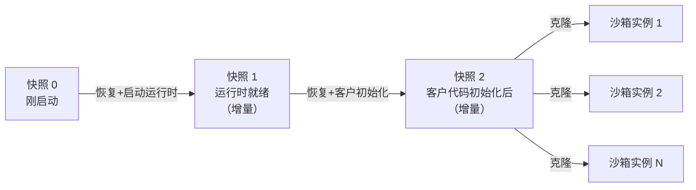

# Lambda Snapstart, and snapshots as a tool for system builders

> AWS Lambda SnapStart 用"客户代码初始化后"的 microVM 快照做克隆式冷启动优化，Firecracker/Lambda 作者 Marc Brooker 借这篇博文抛出快照克隆带来的四类系统难题（唯一性、连接状态、数据搬运、分层去重）。

## 元信息

- 作者：Marc Brooker（AWS，Firecracker 与 Lambda 团队）
- 发表：个人博客，2022-11-29，配合当年 re:Invent Peter DeSantis keynote 发布 SnapStart 功能
- 链接：[博文原文](https://brooker.co.za/blog/2022/11/29/snapstart.html)
- 本文直接引用/关联的作者自家工作：[[2102.12892]]（Restoring Uniqueness in MicroVM Snapshots，本文直接引用其三段原文）、Firecracker NSDI'20 论文（脚注 4，快照恢复延迟数字出处，尚未精读）；本文写作时**尚未公开**、但问题描述与半年后发表内容高度吻合的后续工作：[[2023-brooker-lambda-container-loading]]

## 要解决的问题

Lambda 函数的冷启动时间 = 下载函数/容器 + 启动语言运行时（JVM 等）+ 运行初始化代码（静态代码、类加载、JIT），microVM 自身启动不计入（可提前完成）。对用大型语言运行时/框架的函数，这部分初始化常常占冷启动时间的大头。SnapStart 的思路：在"客户代码初始化完成后"给 microVM 打一次完整快照（含内存、设备状态、CPU 寄存器），之后用这份快照的克隆启动新沙箱，把初始化工作从每个并发实例都做一遍（O(N)）摊薄成只做一次（O(1)）。本文不讲 SnapStart 的实现细节，而是借此讨论"快照克隆"这一底层技术给系统设计者带来的四类通用挑战。

## 方法

作者按问题类型展开，而非按系统架构展开：

### 1. 唯一性问题（Uniqueness）

克隆出的 microVM 内存、CPU 状态完全相同：不依赖 `rdrand` 硬件指令的软件 PRNG 会产出相同的随机数流，除非主动处理。本文直接引用 [[2102.12892]] 三段原文说明后果的严重性——UUID 是数据库主键与分布式追踪请求 ID 的常见来源；Paxos、向量时钟等协议依赖参与者能唯一标识自己；密码学密钥一旦可预测会直接摧毁机密性与认证性。作者提到团队已在推动 OpenSSL、Linux、Java 社区，让 `java.security.SecureRandom`、`/dev/urandom` 等常见 PRNG 在快照克隆后正确重新播种——这是 [[2102.12892]] 里 MADV_WIPEONSUSPEND / SysGenId 两个内核接口的通俗版披露。

### 2. 状态问题（连接/协议状态）——[[2102.12892]] 未展开的一类"克隆之痛"

TCP 之类协议在两端维护状态（如序列号），假设连接生命周期内只有一个客户端。初始化阶段建立的连接一旦被多个克隆实例复用，协议语义被破坏，连接必须重建；此外还有时间问题：初始化期间建立的连接，到克隆真正被使用时，对端可能已经放弃该连接。作者给出的方案只是"重新建立连接"，并坦言这对 TLS 等安全协议开销不小，会稀释 SnapStart 的冷启动收益——他把这列为开放研究方向：快速重建安全协议、clone-aware 协议/代理、甚至协议感知的会话管理器（举例 RDS Proxy；脚注引用 Hunhoff & Rozner 的 NSDI'20 poster《Network Connection Optimization for Serverless Workloads》，并说明"据我所知他们没有把这项工作继续做下去"）。

### 3. 数据搬运问题（Moving Data）——本文自称"构建 SnapStart 最大的挑战"

若克隆只在创建快照的同一台机器上恢复，内存读取仍是本地读取；但要把快照恢复能力扩展到 Lambda 规模，快照数据必须被分发到需要它的地方。若朴素地把内存读取换成按需从网络存储拉取，网络延迟会迅速抵消 SnapStart 的冷启动收益。作者给出两条方向：① 数据层延迟低到接近本地内存读取水平，可以直接做按需加载；② 通过学习多个 microVM 克隆的行为来预测性预取内存内容，避免按需加载。作者明确说"我们会在不久的将来详细介绍我们的具体解法"——这与半年后发表的 [[2023-brooker-lambda-container-loading]]（USENIX ATC'23，块级 FUSE 按需加载 + 收敛加密去重 + 纠删码缓存）在问题描述上高度吻合；但需注意，那篇论文讨论的是**容器镜像**的按需加载，本文讨论的是**快照内存**的按需加载/预取，两者对象不同，本文没有证据表明二者用的是同一套底层机制（详见下文「相关」）。

### 4. 分层快照（Layers Upon Layers）

一个 microVM 可以在多个阶段打快照：刚启动后、语言运行时启动后、客户代码初始化后，且不必只选一个——可以先在"刚启动"打快照，恢复它启动运行时后再打一次快照（只存相对父快照的变化），再恢复运行时快照做客户初始化后打第三次快照，形成一棵快照树：

与 Kernel Samepage Merging（KSM）等传统内存去重技术不同，这里的页面共享是**基于血缘（provenance）**而非**事后扫描内容**——子快照本就是从父快照恢复而来，哪些页相同天然已知，不需要运行时后台扫描比对，因此没有 KSM 式的 CPU vs 内存权衡。这棵树还带来一个附加好处：不同层级可用不同加密密钥（公共组件用服务侧密钥，客户数据用客户自己控制的密钥）。作者给出的数字：对常见负载，这种方式最多能把数据搬运量减少 90%（未说明测量方法与基线）。

### 5. 内存/缓存的边际成本问题（Hungry Hungry Hippos）

Linux 默认会尽量占满可用内存（page cache 等），单机场景下这是对的——填满一个空闲页的边际成本几乎为零。但在 SnapStart 这类场景下，保留不太可能再被用到的、磁盘支持的页面只会让快照变大却没有收益，这个道理同样适用于运行时/应用/库各层的缓存。作者认为需要一种能感知"边际成本已变化"的自适应缓存策略，提到 DAMON 这类工具能提供监控与控制手段，但明确称这是"开放的研究领域"，未给出具体方案。

## 实验与结果

本文是技术博文而非论文，没有系统的实验方法论，给出的具体数字很少且大多未说明测量口径：

- Firecracker 快照恢复最快可到 4ms（完整的 Linux 系统约 10ms）；作者认为亚毫秒级恢复"应该可能"（推测，非实测）。
- 分层快照对常见负载最多减少 90% 的数据搬运量（未说明基线、负载定义、测量方法）。
- 其余均为定性论证，无表格/图表。

## 局限与疑点

- 本文是 AWS 官方产品发布的配套技术博文，作者本人也是被介绍功能的构建者，"90% 数据搬运减少"等数字没有可复现的方法论支撑，应视为厂商声称而非独立验证结果。
- "数据搬运"问题作者明确表示不能透露 AWS 未来计划，只给出方向性讨论，具体解法在本文写作时尚未公开——半年后的 [[2023-brooker-lambda-container-loading]] 是否就是本文所指的解法，无法从两篇文本本身确认，只是时间线与问题描述高度吻合的合理推测，不能当作已证实的因果关系引用。
- TCP/TLS 连接重建问题作者承认会"稀释"冷启动收益，但没有给出具体量化影响，也没有说明 Lambda 生产环境实际采用的方案。
- 内存边际成本自适应缓存策略同样停留在"开放研究领域"的定性讨论，没有可操作方案。
- 分层快照的密钥分层管理只有一句话带过，没有讨论具体的密钥派生/轮换/撤销机制——对比 [[2023-brooker-lambda-container-loading]] 收敛加密方案的详尽程度，本文这部分明显是简化科普，不能当作工程规范参考。

## 对我们的启发

- **快照克隆的"唯一性代价"清单要扩展到网络连接/协议状态，不能只查 PRNG/密钥**：本文把 [[2102.12892]] 的"克隆之痛"扩展到了 TCP/TLS 连接状态——如果我们的沙箱平台未来做类似的"预热后克隆多个实例"设计，除了随机数与密钥（[[2102.12892]] 已覆盖），还要检查预热阶段建立的网络连接、会话、协议状态是否会被多个克隆实例复用，这是容易被遗漏的一类问题。
- **分层快照（按 provenance 去重 + 分层密钥）是比"整份快照/整份镜像去重"更细粒度的优化方向**：如果我们的沙箱环境构建本身有天然的分阶段结构（如 base 环境 → 装依赖 → agent 特定配置），在每个阶段边界打快照、只存增量，可以比 [[2023-brooker-lambda-container-loading]] 的收敛加密去重更彻底地避免重复分发公共部分，且不需要事后扫描比对（无 KSM 式的 CPU/内存权衡）。已建立 [[snapshot-layering]] 概念页跟踪这个机制，供后续设计参考。
- **"数据搬运是快照分发规模化的最大挑战"是一条重要的架构预警**：如果我们计划用 microVM/容器快照做冷启动优化并跨节点分发，不能想当然地认为"快照恢复=本地内存读取"那么快——一旦跨机器分发，朴素的按需网络拉取会直接吃掉快照方案的全部收益，必须在设计初期就规划数据层延迟目标或预取策略，可参照 [[on-demand-image-loading]] 里已落地的具体解法（尽管那是针对镜像而非快照内存）。
- **不能把沙箱 guest 内核配置照搬普通单机场景的默认值**：如果我们用快照/checkpoint 做冷启动优化，guest 内的 page cache、应用缓存策略需要按"这些页会被打进快照、传输、存储"的边际成本重新评估，而不是让 Linux "尽量占满内存"的默认策略生效，否则快照体积和传输成本会不必要地膨胀。
- Follow-up 建议（可转 issue）：
  1. 待精读 Seven Years of Firecracker、Ten Years of AWS Lambda（同清单剩余条目），核实本文"数据搬运"解法与分层快照机制在后续披露中是否有更具体细节，以及是否与 [[2023-brooker-lambda-container-loading]] 共享底层基础设施；
  2. 评估我们自己的沙箱镜像/环境构建流程是否有天然的分阶段边界，若有，评估引入类似分层快照（provenance-based 增量 + 分层密钥）机制的可行性；
  3. 盘点我们沙箱预热/快照方案中，除 PRNG/密钥外，是否还存在"预热阶段建立、恢复后失效"的网络连接或协议状态（如数据库连接池、长连接 RPC），若有，需要设计恢复后重建的机制。

## 相关

- 相关概念：[[microvm-snapshot-uniqueness]]、[[on-demand-image-loading]]、[[snapshot-layering]]
- 相关笔记：[[2102.12892]]（本文直接引用其三段原文说明唯一性问题的严重性，是同一团队对同一问题的通俗版与技术版）、[[2023-brooker-lambda-container-loading]]（本文"数据搬运"问题的疑似后续解法，发表时间吻合但无法从文本直接确认因果关系）、[[2021-balaji-fireplace]]（同属阅读清单 Key C「AWS Lambda 专题」，同样是 Lambda/Firecracker 生产系统的公开细节）
- 与母论文的关系：逐字检索 `.cache/papers/2609.22978.txt`（DSec 全文）确认，"Brooker" 仅在 Firecracker NSDI'20 论文的作者列表引用中出现一次，DSec 正文完全没有出现"SnapStart"字样，也没有引用本文。DSec §6.3「Suspending Sandboxes for Preemptive RL Training」描述的 microVM pause/resume（快照后终止 Firecracker 进程释放运行时内存，后续请求透明 resume）在机制上正是本文所说的"后置初始化快照"思路的一个应用实例——都是利用 Firecracker 的快照/恢复能力跳过重复初始化，但 DSec 的场景是**同一身份的单实例挂起-恢复**（不涉及克隆出多个并发实例，与 [[2102.12892]] 在 [[microvm-snapshot-uniqueness]] 里已确认的结论一致），而 SnapStart 的核心场景恰恰是**用同一份快照克隆出多个独立实例**。也就是说，本文讨论的"唯一性""数据搬运""分层快照"这几类问题主要针对克隆场景，按 DSec §6.3 目前公开的描述**不直接适用**于 DSec 自己的 pause/resume 机制，除非 DSec 的快照复用方式在未公开细节里包含"一份快照启动多个沙箱"的用法（这一点在 [[2102.12892]] 笔记里已指出无法从 DSec 原文确认）。
