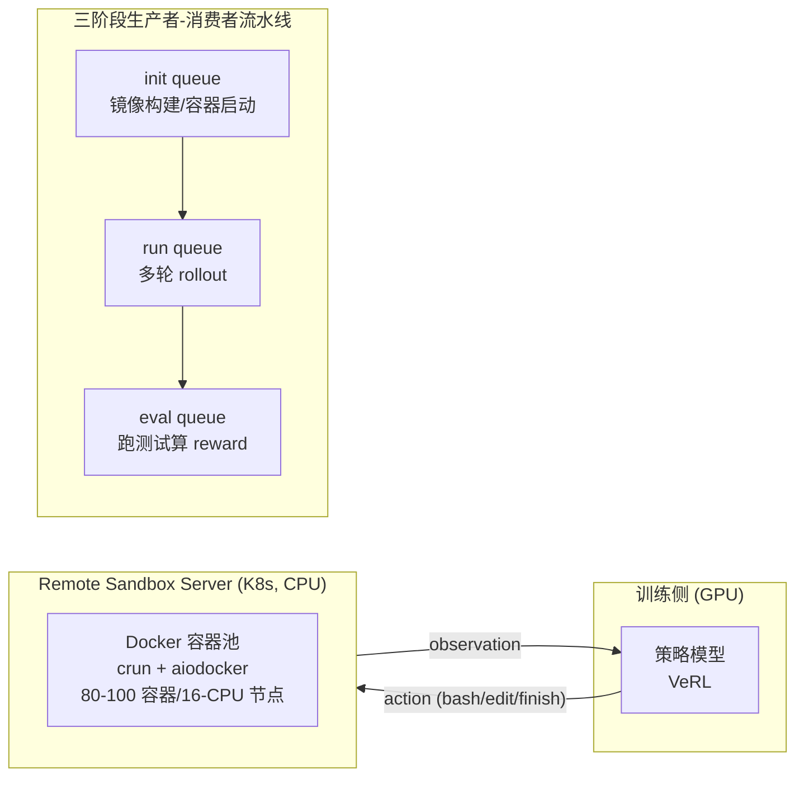

# SkyRL-v0: Train Real-World Long-Horizon Agents via Reinforcement Learning

> Berkeley/Anyscale/All Hands AI 联合发布的 SkyRL-v0：基于 VeRL + OpenHands 的多轮 agent RL 训练管线，用远程沙箱服务器解耦环境执行与训练、异步 rollout + 三阶段生产者-消费者流水线把 rollout 生成加速 4–5×，仅用约 300 条训练样本在 SWE-Bench-Verified 上取得可观提升。

## 元信息

机构：UC Berkeley Sky Computing Lab、Anyscale、All Hands AI（OpenHands 团队）/ 发表：2025-05-06（Notion 博客）/ 链接：[博客](https://novasky-ai.notion.site/skyrl-v0) · [Code](https://github.com/NovaSky-AI/SkyRL) / 对比基线：VeRL、OpenRLHF 的同步单批 rollout 实现（作为"naive baseline"）；模型对比基线为 OpenHands-7B-Agent / Qwen3-8B / Qwen3-14B 各自的未训练版本。

## 要解决的问题

已有多轮 RL 框架（Search-R1、ToRL 等，均基于 VeRL）证明了"单一工具交替使用"的多轮 RL 可行，但只覆盖无状态、短程交互（如搜索增强推理、简单代码执行）。SWE-Bench、WebDev、Web Browsing 这类真实任务要求 agent 调用多种工具、写测试、根据环境反馈调整、执行 20–50 轮甚至更多的长程计划，这对训练基础设施提出两个新挑战：(1) 环境执行必须快且能规模化伸缩；(2) 需要稳健的长程训练算法（本文不展开算法侧）。这让问题的复杂度比训练已有的工具增强推理 LLM 高出一个数量级。

## 方法

SkyRL 集成 OpenHands 的 CodeAct 抽象做 agent loop，采用远程沙箱服务器做可扩展环境部署，核心是两个系统设计：

**挑战一：环境规模化——远程沙箱服务器**。SWE-Bench 这类任务每条 rollout 需要独立、有状态的隔离环境（通常是 Docker 容器），单个环境消耗 1+ CPU、约 7GB 存储；即使 batch size 16、每 prompt 8 条 rollout 这种适中配置也需要 100+ CPU、接近 1TB 磁盘。把环境执行与训练**同机部署（co-locate）**会限制隔离性、也限制环境并行扩展的灵活性，导致对 LLM 推理引擎的请求速率不足、GPU 利用率下降。SkyRL 因此把环境执行**从训练进程中解耦**成独立的 Remote Sandbox Server，部署在 Kubernetes 上，用存储优化实例缓存容器镜像加速冷启动，用 aiodocker + crun（轻量高性能容器运行时）处理并发请求；单个 16-CPU 节点可稳定运行约 80–100 个容器。这与 [[rollout-training-disaggregation]] 里"按中断容忍度/资源特性拆分资源池"的思路同构，只是拆分发生在**环境执行（CPU/Docker）与训练/推理（GPU）之间**，而不是 rollout GPU worker 与 training GPU worker 之间。

**挑战二：昂贵的生成阶段——异步 rollout + 三阶段流水线**。SWE-Bench 场景下单条 rollout 通常需要 20–50 轮（远超 RAGEN、Search-R1、ReTool 等已有多轮 RL 工作的交互步数），且每步环境执行时间因动作类型差异很大（`ls` 很快，跑单元测试可能很慢）。VeRL/OpenRLHF 里常见的同步批量 rollout 实现（每个 LLM 生成步都有同步 barrier）无法利用现代推理引擎（SGLang、vLLM）的 continuous batching，导致利用率低。SkyRL 采用两个优化，合计带来 **4–5× 加速**：(1) **异步 rollout**——用推理引擎的 `async_generate` 接口，每条轨迹独立推进，不再有全局同步点；(2) **三阶段生产者-消费者流水线**——把 (i) 运行时初始化（构建镜像、启动/连接容器）、(ii) 轨迹生成、(iii) reward 计算（发 patch、跑测试）三个阶段解耦重叠，用 `init queue → run queue → eval queue` 三个队列实现，每阶段用 asyncio 任务按队列占用动态派发，有界队列提供背压防止过载。这个"把环境搭建/工具调用/reward 打分整个放到独立服务接口后面，训练器只提交任务、收取完成轨迹"的模式，正是 [[async-rl-training]] 里"服务接口粒度"解耦（类似 ProRL Agent）的一个具体工程实现。

**Reward 设计**：outcome-based 稀疏奖励——把 agent 生成的 git patch 应用到原始代码库、跑该 GitHub issue 对应的测试套件，通过则 reward=1，否则 0。同时追踪两种失败模式（连续三轮重复同一动作的"卡死循环"、未在轮数预算内输出 finish 动作），发现这一简单信号能有效降低两种失败率。

**数据筛选**：SWE-Gym 的 2,438 个真实 Python 任务对小模型过难（GPT-4o 成功率仅 4.55%–9.13%），若直接用会导致弱模型一次成功 rollout 都生成不出来，进而在 GRPO/PPO 下无学习信号、训练崩溃——这与 [[grpo]] 里"退化组"问题（组内奖励方差为零则 advantage 全归零）是同一现象在真实任务上的体现，只是这里连"非退化"都做不到（整组奖励恒为 0）。SkyRL 因此按"模型能否生成至少一条成功 rollout"筛出三个难度递增的子集：SkyRL-v0-80-data（80 条，7B 模型 16 次里能中 1 次）、SkyRL-v0-220-data（220 条，32B 模型 16 次里能中 1 次）、SkyRL-v0-293-data（293 条，GPT-4o/Claude-3.5-Sonnet 能直接做对）。

## 实验与结果

三个不同规模/训练方式的模型，均在 SWE-Bench Verified 上用 OpenHands scaffold + CodeAct Agent 评测（最大 50 轮、最大序列长度 32k）：

- SkyRL-Agent-7B-v0（从 OpenHands-7B-Agent 训练，基座 Qwen2.5-Coder-7B-Instruct）：11.0% → 14.6%。
- SkyRL-Agent-8B-v0（从 Qwen3-8B 非思考模式训练）：3.6% → 9.4%。
- SkyRL-Agent-14B-v0（从 Qwen3-14B 思考模式训练）：18.0% → 21.6%。

三个模型均只用了上述筛选后的 80–293 条训练样本（而非全量 2,438 条 SWE-Gym 任务），提升幅度在 3–6 个百分点区间。系统侧的关键数字：单节点 80–100 容器（16 CPU）、单环境 1+ CPU/~7GB 存储、异步 rollout + 流水线合计 4–5× 加速——这些是本文相对综述类材料（如 [[2509.02547]]）少有的、可直接用于容量规划的具体工程数字。

## 局限与疑点

- 博客未给出远程沙箱服务器的冷启动延迟、镜像分发具体机制（只说"缓存容器镜像以加速启动"，未展开）、超卖/密度上限（80–100 容器/16-CPU 节点是"未出现稳定性问题"的经验值，不是压测得到的硬上限）。
- 训练数据规模极小（80–293 条），作者自己也承认这是"early-stage"；提升幅度（3–6pp）在如此小数据量下是否能推广到更大规模训练、是否会很快饱和，博客未讨论。
- v0 版本只支持 SWE-Bench 这一个任务域，WebArena、WebDev 等"计划中但未实现"；4–5× 加速是相对"naive baseline"的相对数字，未给出与其他同类框架（AReaL、AWorld 等）的横向对比。
- 没有给出 GPU 利用率的具体测量数字（只定性描述"co-location 导致 GPU 利用不足"），也没有给出 Remote Sandbox Server 本身的资源成本（K8s 集群规模、月度开销）。

## 对我们的启发

- **远程沙箱服务器的资源画像给了一个可直接对照的容量规划基准**：单个 SWE-Bench 环境 1+ CPU / ~7GB 存储，16-CPU 节点撑 80–100 容器——这比 [[sandbox-density-overcommit]] 里 DeepSeek 给出的"3,200 容器/800 microVM 每节点"数字低一个数量级，差异大概率来自任务性质（SkyRL 场景是"跑测试"这类偶发 CPU 密集操作，而不是纯等待 LLM 生成）和隔离方式（Docker 容器 vs DeepSeek 的 microVM + sub-NUMA 分区）。值得用这两组数字互相校准，评估我们平台上跑 SWE-Bench 风格 RL rollout 时该按哪个密度假设做预算。
- **"环境执行与训练解耦"这个模式在我们平台上已经是既定方向**（对应 [[rollout-training-disaggregation]]），SkyRL 提供的是这个模式在 CPU 沙箱层（而非 GPU rollout/training 池）的一个具体落地案例：Kubernetes + 存储优化实例缓存镜像 + crun 运行时，是我们做"agent 训练环境执行服务"选型时的一个直接参照对象。
- **三阶段生产者-消费者流水线（init/run/eval 三队列 + 有界背压）**是一个通用性很强的调度模式，不仅适用于 RL 训练场景，也适用于我们平台任何"环境准备耗时波动大、执行耗时波动更大、评估另需独立耗时"的批量 agent 任务调度——这是比"异步 rollout"本身更值得复用的架构组件。
- **数据筛选规避 GRPO 退化组/零信号问题**是一个廉价但有效的工程手段：与其等训练时发现某类任务对当前模型太难导致空梯度，不如训练前用小规模采样（16 次生成算成功率）筛出"当前模型能力范围内"的子集。这提示我们如果要给用户提供"agent RL 训练环境"托管服务，可以内置一个"难度预筛选"工具，帮用户在正式训练前用少量 rollout 探测任务难度分布。
- follow-up 建议：
  1. 深入 SkyRL 开源代码（github.com/NovaSky-AI/SkyRL），确认 Remote Sandbox Server 的镜像分发、冷启动、超卖具体实现，与 [[sandbox-image-distribution]]、[[on-demand-image-loading]] 的结论对照。
  2. ~~关注 SkyRL 后续版本（如 arXiv 2511.16108 SkyRL-Agent）是否补齐了 v0 缺失的冷启动/密度实测数字。~~ 已精读 [[2511.16108]]：补上了调度侧的量化对照实验（1.55× 加速、90% GPU 利用率）和完整训练配方，但仍未披露 Remote Sandbox Server / Computer Use 虚拟机池的冷启动延迟与镜像分发细节。
  3. 评估三阶段生产者-消费者流水线模式能否直接抽象成我们调度系统里的通用"环境准备-执行-评估"任务原语。

## 相关

- 相关概念：[[agentic-rl-frameworks]]、[[rollout-training-disaggregation]]、[[rollout-efficiency]]、[[async-rl-training]]、[[grpo]]、[[sandbox-density-overcommit]]
- 相关笔记：[[2509.02547]]（综述 Table 11 把 SkyRL-v0 列为 12 个 Agentic RL 专用框架之一，仅一句话"长程真实世界 agent 训练"，本篇补上了其远程沙箱服务器与流水线设计的工程细节）；[[2511.16108]]（同团队后续论文化版本 SkyRL-Agent，把本文的三阶段流水线升级为可配置调度策略族，并给出量化对照实验）
- 母论文：无（`parent` 为空，本篇是独立博文，非阅读清单里某篇论文的衍生解读）
